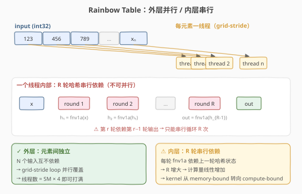
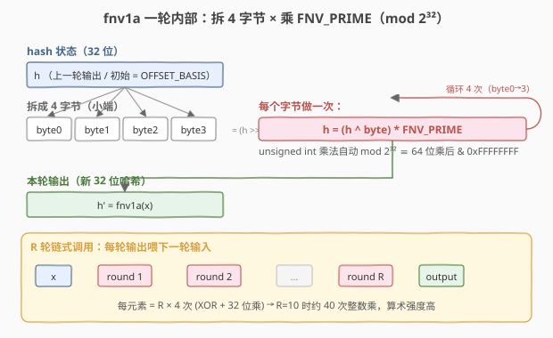

# LeetGPU Rainbow Table 题解

## 1. 题目概述

- **标题 / 题号**：Rainbow Table（#24，easy）
- **链接**：https://leetgpu.com/challenges/rainbow-table
- **难度**：简单
- **标签**：CUDA、elementwise kernel、grid-stride、serial loop、FNV-1a 哈希、整数回绕、memory/compute-bound

**题意**：给定长度为 `N` 的 `int32` 数组 `input`，对每个元素独立地施加 `R` 轮 FNV-1a 哈希，结果以 `uint32` 写入 `output`。每个元素的哈希过程**完全独立**，但单元素的 `R` 轮哈希**串行依赖**（第 `r` 轮以第 `r-1` 轮输出为输入）。

**FNV-1a 一轮**（对 32 位状态 `x`）：

$$
h_0 = \text{OFFSET\_BASIS} = 2166136261,\quad h_{k+1} = \big((h_k \oplus \text{byte}_k(x)) \times \text{FNV\_PRIME}\big) \bmod 2^{32}
$$

其中 $\text{byte}_k(x) = (x \gg 8k) \,\&\, \text{0xFF}$（$k=0,1,2,3$，小端取 4 字节），$\text{FNV\_PRIME} = 16777619$。一轮做 4 次该运算，`R` 轮共 `4R` 次。

**示例**（`N=3, R=2`）：

```text
input  = [123, 456, 789]                 (int32)
output = [1636807824, 1273011621, 2193987222]   (uint32)
```

**约束**：

- `1 ≤ N ≤ 5,000,000`，`1 ≤ R ≤ 50`
- 性能测试取 `N = 5,000,000, R = 10`
- `solve` 签名不可改，外部库禁用，结果必须写入 `output`

> 💡 这道题的考点不在"哈希"，而在**并行结构**：元素间完全独立（外层可并行），但单元素的 `R` 轮哈希是一条串行依赖链（内层不可并行）。这是 GPU 编程里"**外层并行 / 内层串行**"的经典模板——与 ReLU/Sigmoid 的"一元素一算式"不同，每个元素要跑一段无法向量化的串行循环。`R` 越大，算术强度越高，kernel 从 memory-bound 滑向 compute-bound。



## 2. CPU 基线 / 朴素 GPU 方法

### 2.1 CPU 串行基线

```cpp
// cpu_baseline.cpp —— CPU 串行 R 轮 FNV-1a
#include <cstdint>
uint32_t fnv1a_cpu(uint32_t x) {
    uint32_t hash = 2166136261u;            // OFFSET_BASIS
    for (int b = 0; b < 4; ++b) {
        uint32_t byte = (x >> (8 * b)) & 0xFFu;
        hash = (hash ^ byte) * 16777619u;   // 32 位乘法自动 mod 2^32
    }
    return hash;
}
void rainbow_cpu(const int32_t* in, uint32_t* out, int N, int R) {
    for (int i = 0; i < N; ++i) {
        uint32_t x = (uint32_t)in[i];
        for (int r = 0; r < R; ++r) x = fnv1a_cpu(x);
        out[i] = x;
    }
}
```

`N = 5,000,000, R = 10` 时单核要跑 `5e6 × 40 = 2e8` 次 32 位乘，瓶颈：**纯串行 + 单核**。

### 2.2 朴素 GPU：一元素一线程，无 grid-stride

```cuda
__global__ void rainbow_naive(const int* input, unsigned int* output, int N, int R) {
    int i = blockIdx.x * blockDim.x + threadIdx.x;
    if (i < N) {                 // 仅覆盖 N ≤ grid 容量，且每线程只处理 1 个元素
        unsigned int x = (unsigned int)input[i];
        for (int r = 0; r < R; ++r) x = fnv1a_hash(x);
        output[i] = x;
    }
}
```

**瓶颈**：① 当 `N > gridDim.x * blockDim.x` 时**无法一次覆盖**（需多次 launch 或更大 grid，朴素版直接漏数据）；② 每线程只做 1 个元素，**线程总量不足**时难以掩盖 `R` 轮串行依赖的延迟。

## 3. GPU 设计

### 3.1 并行化策略：grid-stride 外层 + 串行内层

核心策略：**外层 grid-stride loop 覆盖所有 `N` 个元素**（元素间独立），**内层 `for (r=0; r<R; r++)` 串行跑 `R` 轮哈希**（轮间依赖，不可并行）。两者正交——并行度来自元素数 `N`，而非轮数 `R`。

> 💡 **为什么内层不能并行？** 第 `r` 轮的输入是第 `r-1` 轮的哈希状态，存在真数据依赖（read-after-write）。这与 reduction 的树形归约不同——归约可以把"加法"组织成树来并行，而哈希链是一条**不可重组的串行链**。能做的只有：让成千上万个元素的串行链**同时**跑在不同线程里。

### 3.2 存储层次使用

| 层次 | 是否使用 | 说明 |
|------|----------|------|
| **global memory** | ✓ | `input` 读、`output` 写，都在显存 |
| **shared memory** | ✗ | 每元素只读一次、写一次，无跨线程复用 |
| **register** | ✓（隐式） | 哈希状态 `x`、`hash`、`byte` 等中间值全程在寄存器，`R` 轮不落显存 |

访存量：读 `N×4B` + 写 `N×4B` = `8N` 字节。但计算量随 `R` 线性增长：每元素约 `R × 4 × (XOR + 移位 + 32 位乘)` ≈ `12R` 条整数指令。`R=10` 时算术强度约 `120 指令 / 8B ≈ 15 op/B`，**显著高于** ReLU/Sigmoid，已逼近 compute-bound。

### 3.3 关键技巧

#### ① 32 位乘法自然回绕 = `& 0xFFFFFFFF`

参考实现用 `int64` 乘法后 `& 0xFFFFFFFF` 取低 32 位，是因为 PyTorch 没有原生"回绕 uint32 乘法"。但 CUDA 的 `unsigned int` 乘法**本身就是 mod $2^{32}$**——低 32 位只取决于两个操作数的低 32 位，与 64 位乘后取低 32 位**完全等价**。因此 device 端无需 64 位中间类型：

```cuda
hash = (hash ^ byte) * FNV_PRIME;   // unsigned int，自动回绕，等价于 (uint64)乘 & 0xFFFFFFFF
```

> ⚠️ **类型陷阱**：若误把 `hash` 声明为 `int`（有符号），`*` 仍按 32 位回绕，但 `>>` 在负数上是算术右移、`^` 结果的符号位也会干扰后续语义。务必用 `unsigned int` / `uint32_t`。

#### ② `int32` 输入按位重解释为 `uint32`

输入是 `int32`（可能为负）。参考实现 `x.to(int64)` 会**符号扩展**，但随后只取低 4 字节 `(x_int >> 8k) & 0xFF`——符号扩展只影响 int64 的第 4–7 字节，低 4 字节正是原 int32 的位模式。所以 device 端直接 `(unsigned int)input[i]` 按位重解释即可，4 个字节完全一致。

#### ③ `#pragma unroll` + `__forceinline__`

单轮的 4 字节循环是固定次数，`#pragma unroll` 展开消除循环开销；`fnv1a_round` 用 `__forceinline__` 内联进 `R` 轮循环体，避免函数调用开销，让编译器跨轮做指令调度（用 ILP 掩盖串行依赖的延迟）。



## 4. Kernel 实现

完整可编译的 grid-stride + `R` 轮串行哈希版本，含 host 端分配、计时、CPU 验证与带宽/算术强度估算：

```cuda
// rainbow_table.cu —— grid-stride loop + R 轮 FNV-1a 串行哈希
// 编译命令: nvcc -O3 -arch=sm_120 rainbow_table.cu -o rainbow_table
// 运行:     ./rainbow_table 5000000 10

#include <cstdio>
#include <cstdlib>
#include <cstdint>
#include <cuda_runtime.h>

#define CHECK_CUDA(call)                                                                                       \
    do {                                                                                                       \
        cudaError_t e = (call);                                                                                \
        if (e != cudaSuccess) {                                                                                \
            fprintf(stderr, "CUDA error %s:%d: %s\n", __FILE__, __LINE__, cudaGetErrorString(e));              \
            exit(EXIT_FAILURE);                                                                                \
        }                                                                                                      \
    } while (0)

// FNV-1a 一轮：unsigned int 乘法自动 mod 2^32，等价于 64 位乘后 & 0xFFFFFFFF
__device__ __forceinline__ unsigned int fnv1a_round(unsigned int x) {
    const unsigned int FNV_PRIME = 16777619u;
    const unsigned int OFFSET_BASIS = 2166136261u;
    unsigned int hash = OFFSET_BASIS;
    #pragma unroll
    for (int b = 0; b < 4; ++b) {
        unsigned int byte = (x >> (8 * b)) & 0xFFu;
        hash = (hash ^ byte) * FNV_PRIME;   // 32 位乘法自然回绕 = 低 32 位
    }
    return hash;
}

__global__ void rainbow_kernel(const int* input, unsigned int* output, int N, int R) {
    int tid = blockIdx.x * blockDim.x + threadIdx.x;
    int stride = gridDim.x * blockDim.x;
    for (int i = tid; i < N; i += stride) {       // 外层 grid-stride：元素间并行
        unsigned int x = (unsigned int)input[i];   // int32 按位重解释为 uint32
        for (int r = 0; r < R; ++r) {              // 内层串行：R 轮哈希依赖链
            x = fnv1a_round(x);
        }
        output[i] = x;
    }
}

// ---- CPU 参考实现（用 uint64 乘 + 掩码，与平台 reference_impl 等价）----
uint32_t fnv1a_cpu(uint32_t x) {
    uint32_t hash = 2166136261u;
    for (int b = 0; b < 4; ++b) {
        uint32_t byte = (x >> (8 * b)) & 0xFFu;
        hash = (uint32_t)((uint64_t)(hash ^ byte) * 16777619ull & 0xFFFFFFFFull);
    }
    return hash;
}

int main(int argc, char** argv) {
    int N = (argc > 1) ? atoi(argv[1]) : 5000000;
    int R = (argc > 2) ? atoi(argv[2]) : 10;
    size_t bytes_in = (size_t)N * sizeof(int);
    size_t bytes_out = (size_t)N * sizeof(unsigned int);
    printf("N = %d  R = %d  (%.1f MB in + %.1f MB out)\n", N, R, bytes_in / 1e6, bytes_out / 1e6);

    // ---- host 端分配与初始化 ----
    int* hIn = (int*)malloc(bytes_in);
    unsigned int* hOut = (unsigned int*)malloc(bytes_out);
    srand(42);
    for (int i = 0; i < N; ++i) hIn[i] = (int)((rand() << 16) ^ rand());   // 含负数

    // ---- device 端分配与拷贝 ----
    int* dIn;
    unsigned int* dOut;
    CHECK_CUDA(cudaMalloc(&dIn, bytes_in));
    CHECK_CUDA(cudaMalloc(&dOut, bytes_out));
    CHECK_CUDA(cudaMemcpy(dIn, hIn, bytes_in, cudaMemcpyHostToDevice));

    // ---- grid 规模：SM 数 × 4 ----
    int threads = 256;
    int num_sm;
    CHECK_CUDA(cudaDeviceGetAttribute(&num_sm, cudaDevAttrMultiProcessorCount, 0));
    int blocks = num_sm * 4;
    printf("launch: blocks=%d  threads=%d  (SM=%d)\n", blocks, threads, num_sm);

    // ---- 计时 ----
    cudaEvent_t t0, t1;
    cudaEventCreate(&t0);
    cudaEventCreate(&t1);
    cudaEventRecord(t0);
    rainbow_kernel<<<blocks, threads>>>(dIn, dOut, N, R);
    cudaEventRecord(t1);
    CHECK_CUDA(cudaDeviceSynchronize());
    float ms = 0.0f;
    cudaEventElapsedTime(&ms, t0, t1);
    printf("kernel time: %.3f ms\n", ms);

    // ---- 回拷并验证 ----
    CHECK_CUDA(cudaMemcpy(hOut, dOut, bytes_out, cudaMemcpyDeviceToHost));
    int err = 0;
    for (int i = 0; i < N; ++i) {
        unsigned int x = (unsigned int)hIn[i];
        for (int r = 0; r < R; ++r) x = fnv1a_cpu(x);
        if (hOut[i] != x) {
            if (++err <= 5) printf("MISMATCH @%d: got %u, expect %u\n", i, hOut[i], x);
        }
    }
    printf("verify: %s  (%d / %d mismatch)\n", err ? "FAIL" : "PASS", err, N);

    // ---- 带宽与算术强度估算 ----
    size_t rw = bytes_in + bytes_out;                 // 读 input + 写 output
    float bw_gbs = (rw / 1e9) / (ms / 1e3);
    float ops = (float)N * R * 4 * 3.0f;              // 每轮 4 字节 × (XOR+移位+乘) ≈ 3 op
    printf("effective bandwidth: %.1f GB/s   (~%.1f Gop/s integer)\n", bw_gbs, ops / (ms / 1e3) / 1e9);

    CHECK_CUDA(cudaFree(dIn));
    CHECK_CUDA(cudaFree(dOut));
    free(hIn);
    free(hOut);
    return 0;
}
```

> 💡 提交给 LeetGPU 平台时，把 `rainbow_kernel`（及 `fnv1a_round`）填进 starter 的空壳即可。带 `main()` 的完整文件用于本地自测与 profiling。

### 4.1 LeetGPU 提交版本

下面给出适配 LeetGPU 官方 starter 签名的提交版本（保留 starter 提供的 `fnv1a_hash` device 函数，补全 kernel 与 `solve`）：

```cuda
#include <cuda_runtime.h>

__device__ unsigned int fnv1a_hash(unsigned int input) {
    const unsigned int FNV_PRIME = 16777619;
    const unsigned int OFFSET_BASIS = 2166136261;

    unsigned int hash = OFFSET_BASIS;

    for (int byte_pos = 0; byte_pos < 4; byte_pos++) {
        unsigned char byte = (input >> (byte_pos * 8)) & 0xFFu;
        hash = (hash ^ byte) * FNV_PRIME;
    }

    return hash;
}

__global__ void fnv1a_hash_kernel(const int* input, unsigned int* output, int N, int R) {
    int tid = blockIdx.x * blockDim.x + threadIdx.x;
    int stride = gridDim.x * blockDim.x;
    for (int i = tid; i < N; i += stride) {
        unsigned int x = (unsigned int)input[i];   // int32 按位重解释为 uint32
        for (int r = 0; r < R; ++r) {
            x = fnv1a_hash(x);
        }
        output[i] = x;
    }
}

// input, output are device pointers (i.e. pointers to memory on the GPU)
extern "C" void solve(const int* input, unsigned int* output, int N, int R) {
    int threadsPerBlock = 256;
    int num_sm;
    cudaDeviceGetAttribute(&num_sm, cudaDevAttrMultiProcessorCount, 0);
    int blocksPerGrid = num_sm * 4;
    if (blocksPerGrid < 1) blocksPerGrid = (N + threadsPerBlock - 1) / threadsPerBlock;

    fnv1a_hash_kernel<<<blocksPerGrid, threadsPerBlock>>>(input, output, N, R);
    cudaDeviceSynchronize();
}
```

### 4.2 代码详解

`rainbow_kernel` 是「外层 grid-stride + 内层串行循环」的典型 elementwise kernel，结构与 ReLU/Sigmoid 同构，差异在循环体——内层多了一条 `R` 轮的串行哈希链。共 7 行，无 shared memory、无同步。

**Kernel 结构概览**：grid-stride 骨架 + `R` 轮 `fnv1a_round` 串行调用，计算全在寄存器。

| # | 代码块 | 作用 | 说明 |
|---|--------|------|------|
| ① | `int tid = blockIdx.x * blockDim.x + threadIdx.x;` | 全局线程 ID | warp 内连续 → 合并访存 |
| ② | `int stride = gridDim.x * blockDim.x;` | 跨步 | 总线程数，循环步长 |
| ③ | `for (int i = tid; i < N; i += stride)` | grid-stride 主循环 | 任意 `N` 一次覆盖，外层并行 |
| ④ | `unsigned int x = (unsigned int)input[i];` | 读入 + 按位重解释 | `int32` → `uint32`，4 字节不变 |
| ⑤ | `for (int r = 0; r < R; ++r) x = fnv1a_round(x);` | **内层串行哈希链** | 第 `r` 轮依赖第 `r-1` 轮，不可并行 |
| ⑥ | `output[i] = x;` | 写回 | 仅一次写，合并访存 |

**关键索引关系**：

- `tid` = `blockIdx.x * blockDim.x + threadIdx.x` — thread 到全局元素索引的映射
- `stride` = `gridDim.x * blockDim.x` — grid-stride 步长，保证线程 `tid` 处理 `tid, tid+stride, tid+2·stride, ...`
- `x`（寄存器）— 哈希状态，`R` 轮全程不落显存；每轮被 `fnv1a_round` 原地更新

**fnv1a_round 详解**（单轮，4 次字节迭代）：

| 步骤 | 代码 | 说明 |
|------|------|------|
| 初始化 | `hash = OFFSET_BASIS` | `2166136261u`，每轮重置 |
| 取字节 | `byte = (x >> 8b) & 0xFF` | 小端第 `b` 字节 |
| 异或 | `hash = hash ^ byte` | 混入字节 |
| 乘法回绕 | `hash = hash * FNV_PRIME` | `unsigned int` 乘自动 mod $2^{32}$，等价 `& 0xFFFFFFFF` |

> 💡 **worked example**：设 `x = 123`（`0x0000007B`），`R = 1`。`fnv1a_round(123)` 逐步演算（`hash` 初值 `0x811C9DC5`）：
>
> | `b` | `byte` | `hash ^ byte` | `hash = (·) × FNV_PRIME mod 2³²` |
> |-----|--------|---------------|-----------------------------------|
> | 0 | `0x7B` (123) | `0x811C9DBE` | `0xFE0C521A` |
> | 1 | `0x00` | `0xFE0C521A` | `0x07653EEE` |
> | 2 | `0x00` | `0x07653EEE` | `0x926210AA` |
> | 3 | `0x00` | `0x926210AA` | `0x1A603B9E` |
>
> 单轮结果 `442514334`（`0x1A603B9E`）。再跑一轮（`R=2`）得 `1636807824`（`0x618FB490`），与示例 `output[0]` 完全一致。CPU 用 `uint64` 乘 + `& 0xFFFFFFFF` 验证结果相同——证明 32 位回绕与参考实现等价。

> 💡 **关键洞察**：这道题的本质是"**能并行的并行掉，不能并行的老实串行**"。外层 `N` 个元素独立 → grid-stride 拿满并行度；内层 `R` 轮哈希是真依赖链 → 只能串行循环。性能瓶颈随 `R` 增大从访存转向计算：`R=1` 时和 ReLU 一样 memory-bound，`R=10` 时算术强度约 `15 op/B`，已接近 compute-bound——此时优化重心从"少访存"转向"压指令数"（unroll / inline / 让编译器跨轮调度 ILP）。

## 5. 性能分析与优化

### 5.1 编译与运行

```bash
nvcc -O3 -arch=sm_120 rainbow_table.cu -o rainbow_table
./rainbow_table 5000000 10
```

预期输出（参考量级，实际依 GPU 而异）：

```text
N = 5000000  R = 10  (20.0 MB in + 20.0 MB out)
launch: blocks=432  threads=256  (SM=108)
kernel time: ~1.5-3 ms
verify: PASS  (0 / 5000000 mismatch)
effective bandwidth: ~13-27 GB/s   (~60-120 Gop/s integer)
```

> ⚠️ 上面为**预期量级**（本机无 GPU 实测）。关键观察：有效带宽（十几 GB/s）**远低于**显存峰值（~1000 GB/s 量级），说明 kernel **不是 memory-bound**——`R=10` 的串行计算吃掉了大部分时间。对比 `R=1` 会看到带宽利用率显著上升。

### 5.2 用 ncu 定位瓶颈

```bash
# 算术强度 vs 带宽利用率：对比 R=1 与 R=10
ncu --set roofline ./rainbow_table 5000000 1
ncu --set roofline ./rainbow_table 5000000 10
```

| 指标 | 含义 | `R=1` 预期 | `R=10` 预期 |
|------|------|-----------|------------|
| `dram__throughput.avg.pct_of_peak_sustained_elapsed` | HBM 带宽占比 | 较高（memory-bound） | 低（算不动来不及吃带宽） |
| `smsp__inst_executed.avg.per_cycle_active` | 每周期指令数 | 低 | 较高（整数乘密集） |
| `sm__warps_active.avg.pct_of_peak_sustained_active` | 活跃 warp 占比 | 高 | 受串行依赖拖累略降 |
| Roofline 位置 | 落点 | 偏左（低算术强度，贴带宽线） | 偏右（高算术强度，离带宽线远） |

> 💡 **预期结论**：`R=1` 时点落在 roofline 左侧带宽区，`R=10` 时右移到计算区。同一 kernel、同一访存量，仅 `R` 变化就让瓶颈类型翻转——这是观察"算术强度决定瓶颈"最干净的实验之一。

### 5.3 优化方向

1. **`#pragma unroll` + `__forceinline__`**（已采用）：固定 4 次的字节循环展开，round 函数内联进 `R` 轮循环，让编译器跨轮做指令调度，用 ILP 掩盖串行依赖延迟。
2. **grid 规模调优**：compute-bound 时每线程工作量重，可尝试 `SM × 1 ~ SM × 2`（少 block、每 block 多线程），减少调度开销；memory-bound 时 `SM × 4 ~ SM × 8` 拿满带宽。用 ncu 对比 `sm__warps_active` 选最优。
3. **每线程多元素（ITEMS_PER_THREAD）**：让一个线程连续处理若干元素，循环间无依赖，编译器可交错调度不同元素的哈希链，提升 ILP——本质是用"元素间并行"填补"单元素串行"的空泡。
4. **`--use_fast_math` 无收益**：本题全是整数运算，不涉及 `expf`/`sqrt` 等超越函数，fast math 不影响。这与 Sigmoid 的优化方向正相反。
5. **`R` 不可并行化**：真数据依赖决定 `R` 轮只能串行。任何想"把 `R` 轮并行"的尝试都无效——这是题目的刻意考点。

## 6. 复杂度分析

| 维度 | 分析 |
|------|------|
| **时间复杂度** | `O(N · R)`，每元素 `R` 轮、每轮 4 次 `(XOR + 移位 + 32 位乘)` |
| **空间复杂度** | `O(N)`，输入 `int32[N]` + 输出 `uint32[N]`，无额外显存 |
| **访存量** | `8N` 字节（读 `N×4B` + 写 `N×4B`），与 `R` 无关 |
| **算术强度** | `≈ 12R op / 8B`：`R=1` 约 `1.5 op/B`（memory-bound），`R=10` 约 `15 op/B`（接近 compute-bound） |
| **瓶颈类型** | **随 `R` 漂移**：小 `R` → memory-bound；大 `R` → compute-bound |
| **并行度来源** | 元素数 `N`（外层），**非**轮数 `R`（内层串行） |

> 💡 **一句话总结**：Rainbow Table = grid-stride 骨架 + 一条 `R` 轮串行哈希链。考点是"**外层并行、内层串行**"——把能并行的 `N` 个元素扔给 grid-stride，把不可并行的 `R` 轮依赖老实写成串行循环。`R` 越大算术强度越高，瓶颈从带宽滑向计算，是观察 roofline 漂移的绝佳案例。

## 同类练习题

下面是与本题考查相同 CUDA 概念的 LeetGPU 练习题，建议按顺序挑战：

| # | 题目 | 难度 | 核心概念 | 与本题的关联 |
|---|------|------|----------|-------------|
| 1 | [Vector Addition](https://leetgpu.com/challenges/vector-addition) | 简单 | — | grid-stride + coalesced 基础，rainbow-table 外层并行的最简形态 |
| 35 | [Monte Carlo Integration](https://leetgpu.com/challenges/monte-carlo-integration) | 中等 | — | 每线程串行采样累加后归约，同为「外层并行、内层串行循环」结构 |
| 34 | [Logistic Regression](https://leetgpu.com/challenges/logistic-regression) | 中等 | — | 迭代训练 + sigmoid，串行迭代与逐元素计算的组合 |
| 9 | [1D Convolution](https://leetgpu.com/challenges/1d-convolution) | 简单 | — | 每个输出元素串行累加卷积核，跨领域的「逐元素 + 串行内层循环」模板 |

> 💡 **选题思路**：逐元素 grid-stride + 串行内层循环（哈希迭代），练习「外层并行、内层串行依赖」的 kernel 模板与 32 位整数回绕运算。做完这组练习，即可掌握该 CUDA 模板在不同场景下的迁移应用。
