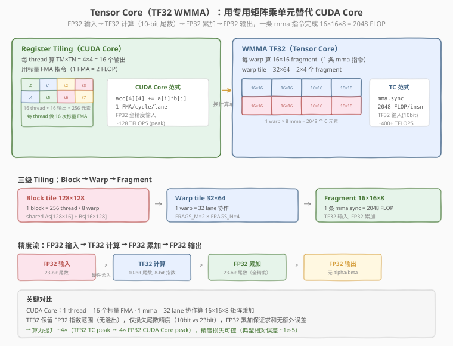

# LeetGPU Matrix Multiplication 题解

## 1. 题目概述

- **标题 / 题号**：Matrix Multiplication（#2，easy）
- **链接**：https://leetgpu.com/challenges/matrix-multiplication
- **难度**：简单
- **标签**：CUDA、GEMM、register tiling、shared memory tiling、compute-bound、Tensor Core、TF32、WMMA

**题意**：给定行主序矩阵 `A`（`M×N`）和 `B`（`N×K`），计算 `C = A × B`（`M×K`），结果以行主序写入 `C`。

$$C[i][j] = \sum_{k=0}^{N-1} A[i][k] \times B[k][j]$$

**示例**：

```text
A = [1, 2]    B = [5, 6]    C = [1×5+2×7, 1×6+2×8] = [19, 22]
    [3, 4]        [7, 8]        [3×5+4×7, 3×6+4×8]   [43, 50]
```

**约束**：

- `1 ≤ M, N, K ≤ 8192`
- 性能测试取 `M = 8192, N = 6144, K = 4096`
- 容差 `atol = rtol = 1e-4`

> 💡 这是 CUDA 编程的**圣杯题**——GEMM（General Matrix Multiplication）。前 5 题都是 memory-bound（带宽受限），而 GEMM 是**第一个 compute-bound**（算力受限）问题。它有一套成熟的优化模板：**shared memory tiling → register tiling → 向量化 → 双缓冲**，这套模板是 cuBLAS、CUTLASS 等工业级 GEMM 库的基础。本题直接实现 **register tiling**——让每个 thread 用寄存器累积 `TM×TN` 个输出，把算术强度推向 compute-bound。

## 2. CPU 基线 / 朴素 GPU 方法

### 2.1 CPU 串行基线

```cpp
// cpu_baseline.cpp —— CPU 串行三重循环矩阵乘法
void matmul_cpu(const float* A, const float* B, float* C, int M, int N, int K) {
    for (int i = 0; i < M; ++i)
        for (int j = 0; j < K; ++j) {
            float sum = 0.0f;
            for (int k = 0; k < N; ++k)
                sum += A[i * N + k] * B[k * K + j];
            C[i * K + j] = sum;
        }
}
```

三重循环 `O(MNK)`。`M=8192, N=6144, K=4096` 时约 **2000 亿次浮点运算**，单核要跑几十秒。

### 2.2 朴素 GPU：一个 thread 算一个 C[i][j]

每个 thread 独立计算一个输出元素：

```cuda
__global__ void matmul_naive(const float* A, const float* B, float* C, int M, int N, int K) {
    int i = blockIdx.y * blockDim.y + threadIdx.y;
    int j = blockIdx.x * blockDim.x + threadIdx.x;
    if (i < M && j < K) {
        float sum = 0.0f;
        for (int k = 0; k < N; ++k) {
            sum += A[i * N + k] * B[k * K + j]; // 每次都从 global 读！
        }
        C[i * K + j] = sum;
    }
}
```


**致命问题**：每个 thread 独立读 `A[i][0..N-1]` 和 `B[0..N-1][j]`，但**相邻 thread 的数据高度重叠**——同一行的 thread 共享 `A` 的行，同一列的 thread 共享 `B` 的列。朴素写法完全没有利用这种复用，导致 `A` 的每个元素被重复读 `K` 次、`B` 的每个元素被重复读 `M` 次。

> ⚠️ 朴素 GEMM 的算术强度只有 `2 FLOP / 8B = 0.25 FLOP/B`（2 次乘加 ↔ 读 2 个 float），远低于 GPU 平衡点（RTX 5090 约 60 FLOP/B），**性能被访存完全拖死**，连 1% 算力都用不上。

### 2.3 破局思路：两层 tiling

朴素版的困境是「每 thread 从 global 读 2 个 float 才做 1 次乘加」。要破局必须**减少 global 访问、增加每次访存的复用**，分两步：

| 层次 | 手段 | 复用对象 | 效果 |
|------|------|----------|------|
| **Step 1：shared memory tiling** | 把 `A`、`B` 的 `TILE×TILE` 子块加载到 shared memory | block 内所有 thread 复用 | global 访问降 `TILE` 倍 |
| **Step 2：register tiling** | 每 thread 用寄存器累积 `TM×TN` 个输出 | 同一 thread 的多个输出复用 shared 读 | shared 访问降 `(TM×TN)/(TM+TN)` 倍 |


Step 1（shared memory tiling）的思路是：把 `N` 维切成 `N/BK` 段，每段 `BK` 个元素。每次迭代 block 内所有 thread 协作把 `A` 的 `BM×BK` 子块和 `B` 的 `BK×BN` 子块从 global 读到 shared memory，然后从 shared 读数据做乘加。`A` 子块的每个元素被 block 内 `BN` 个 thread 复用，`B` 子块被 `BM` 个 thread 复用，global 访问量降低一个数量级。

但 Step 1 有个残留问题：**每 thread 只算 1 个输出**——从 shared 读 2 个值只做 1 次乘加，shared memory 带宽仍是瓶颈。Step 2（register tiling）正是本题的实现重点，下一节详述。

## 3. GPU 设计

### 3.1 并行化策略：register tiling

**register tiling** 的核心思想：让每 thread 计算 `TM×TN` 个输出（本题取 `4×4`），结果存在**寄存器数组** `float acc[TM][TN]` 里，不落 global 也不落 shared。一个 block 负责 `BM×BN`（`64×64`）的输出 tile，用 `(BM/TM)×(BN/TN) = 16×16 = 256` 个 thread。


**两层 tiling 的数据流**：

1. **Block 级（shared memory tiling）**：block 内 256 个 thread 协作，把 `A` 的 `BM×BK`（`64×16`）子块和 `B` 的 `BK×BN`（`16×64`）子块从 global 加载到 shared memory。沿 `N` 维滑动 `BK=16` 的 tile，逐段累加。
2. **Thread 级（register tiling）**：每个 thread 从 shared 读 `TM+TN = 8` 个值到寄存器 `a[TM]`、`b[TN]`，做 `TM×TN = 16` 次乘加，累加到 `acc[TM][TN]`。全程不访问 shared/global。

**关键收益**：
- `A` 子块的行被同一 thread 的 `TN=4` 个输出复用 → 读 1 次 `a[i]` 做 `TN` 次乘加
- `B` 子块的列被同一 thread 的 `TM=4` 个输出复用 → 读 1 次 `b[j]` 做 `TM` 次乘加
- 算术强度：`2×TM×TN FLOP / (TM+TN) shared 读 = 32/8 = 4 FLOP/read`，比朴素 tiling（`2/2 = 1 FLOP/read`）提升 **4 倍**

> 💡 Register tiling 是 GEMM 优化的精髓。它把「每 thread 1 个输出」变成「每 thread 一个小矩阵」，用寄存器换 shared 访问。工业级 GEMM（CUTLASS）的 register tile 通常做到 `8×8` 或更大，算术强度逼近 GPU 峰值。本题实现 `TM=4, TN=4` 即可显著提升。

### 3.2 分块参数选取

```text
BM = 64,  BN = 64,  BK = 16     block 输出 tile = 64×64 = 4096 个 C 元素
TM = 4,   TN = 4                 每 thread 算 4×4 = 16 个输出
BLOCK_M = BM/TM = 16             block 内 thread 行数
BLOCK_N = BN/TN = 16             block 内 thread 列数
NUM_THREADS = 16×16 = 256        block 内线程数（1D 索引）
LOAD_A = BM×BK/NUM_THREADS = 4   每 thread 加载 4 个 A 元素
LOAD_B = BK×BN/NUM_THREADS = 4   每 thread 加载 4 个 B 元素
```

| 参数 | 值 | 选取理由 |
|------|----|----------|
| `BM=BN=64` | block tile 大小 | 4096 个输出/block，shared 只需 8KB，occupancy 高 |
| `BK=16` | 缩减维 tile | 内层循环短（16 次），`#pragma unroll` 可完全展开；shared 用量小 |
| `TM=TN=4` | register tile | 16 个寄存器累加器 + 8 个临时寄存器，共 ~50 regs/thread，无 spill |
| `256 thread` | block 线程数 | 8 个 warp，足够隐藏延迟；每 thread 16 个输出，算术强度 4× |

### 3.3 存储层次使用

| 层次 | 是否使用 | 说明 |
|------|----------|------|
| **global memory** | ✓ | `A`、`B`、`C` 原始数据，仅协作加载 / 最终写回时访问 |
| **shared memory** | ✓ | `As[BM][BK]` + `Bs[BK][BN]`，各 `64×16×4B=4KB`，共 8KB/block。沿 `N` 维滑动 |
| **register** | ✓ | **核心**：`acc[TM][TN]`（16 个 fp32 累加器）+ `a[TM]`、`b[TN]`（8 个临时寄存器），全程在寄存器里算 |

**两级复用**：global → shared（block 内 256 thread 复用同一 `A/B` tile）→ register（thread 内 `TM×TN` 个输出复用同一组 `a/b`）。

## 4. Kernel 实现

完整可编译的 register tiling 版本（`BM=64, BN=64, BK=16, TM=4, TN=4`，每 thread 算 16 个输出）：

```cuda
// matmul_register_tiled.cu —— register tiling 矩阵乘法
// 编译命令: nvcc -O3 -arch=sm_120 matmul_register_tiled.cu -o matmul
// 运行:     ./matmul 8192 6144 4096

    #include <cstdio>
    #include <cstdlib>
    #include <cmath>
    #include <cuda_runtime.h>

    #define CHECK_CUDA(call)                                                                                               \
    do {                                                                                                               \
        cudaError_t e = (call);                                                                                        \
        if (e != cudaSuccess) {                                                                                        \
            fprintf(stderr, "CUDA error %s:%d: %s\n", __FILE__, __LINE__, cudaGetErrorString(e));                      \
            exit(EXIT_FAILURE);                                                                                        \
        }                                                                                                              \
    } while (0)

// register tiling 参数：block 负责 64×64 输出，每 thread 算 4×4 = 16 个元素
const int BM = 64, BN = 64, BK = 16;
const int TM = 4, TN = 4;
const int BLOCK_M = BM / TM;               // 16
const int BLOCK_N = BN / TN;               // 16
const int NUM_THREADS = BLOCK_M * BLOCK_N; // 256

// register tiling：每 thread 算 TM×TN 个 C 元素
__global__ void matmul_register_tiled(const float* __restrict__ A, const float* __restrict__ B,
                                      float* __restrict__ C, int M, int N, int K) {
    // shared memory：A 的 BM×BK 子块 + B 的 BK×BN 子块
    __shared__ float As[BM][BK];
    __shared__ float Bs[BK][BN];

    int bx = blockIdx.x;   // K 维（列方向）
    int by = blockIdx.y;   // M 维（行方向）
    int tid = threadIdx.x; // 0..255
    int tx = tid % BLOCK_N; // 0..15，thread 在 block tile 内的列坐标
    int ty = tid / BLOCK_N; // 0..15，thread 在 block tile 内的行坐标

    // 寄存器累加器：TM×TN 个输出，常驻寄存器不落盘
    float acc[TM][TN];
    #pragma unroll
    for (int i = 0; i < TM; ++i)
        #pragma unroll
        for (int j = 0; j < TN; ++j)
            acc[i][j] = 0.0f;

    const int LOAD_A = BM * BK / NUM_THREADS; // 4，每 thread 加载 4 个 A 元素
    const int LOAD_B = BK * BN / NUM_THREADS; // 4，每 thread 加载 4 个 B 元素

    // 沿 N 维滑动 BK=16 的 tile
    int num_tiles = (N + BK - 1) / BK;
    for (int t = 0; t < num_tiles; ++t) {
        // ---- ① 协作加载 As[BM][BK] ----
        #pragma unroll
        for (int i = 0; i < LOAD_A; ++i) {
            int lin = tid + i * NUM_THREADS;
            int r = lin / BK;
            int c = lin % BK;
            int ar = by * BM + r;
            int ac = t * BK + c;
            As[r][c] = (ar < M && ac < N) ? A[ar * N + ac] : 0.0f;
        }
        // ---- ② 协作加载 Bs[BK][BN] ----
        #pragma unroll
        for (int i = 0; i < LOAD_B; ++i) {
            int lin = tid + i * NUM_THREADS;
            int r = lin / BN;
            int c = lin % BN;
            int br = t * BK + r;
            int bc = bx * BN + c;
            Bs[r][c] = (br < N && bc < K) ? B[br * K + bc] : 0.0f;
        }
        __syncthreads();

        // ---- ③ register tiling：每 thread 算 TM×TN 个输出 ----
        #pragma unroll
        for (int k = 0; k < BK; ++k) {
            float a[TM], b[TN];
            #pragma unroll
            for (int i = 0; i < TM; ++i)
                a[i] = As[ty * TM + i][k];
            #pragma unroll
            for (int j = 0; j < TN; ++j)
                b[j] = Bs[k][tx * TN + j];
            #pragma unroll
            for (int i = 0; i < TM; ++i) {
                #pragma unroll
                for (int j = 0; j < TN; ++j) {
                    acc[i][j] += a[i] * b[j];
                }
            }
        }
        __syncthreads(); // tile 用完才能覆盖
    }

    // ---- ④ 写回 C ----
    #pragma unroll
    for (int i = 0; i < TM; ++i) {
        #pragma unroll
        for (int j = 0; j < TN; ++j) {
            int gr = by * BM + ty * TM + i;
            int gc = bx * BN + tx * TN + j;
            if (gr < M && gc < K) {
                C[gr * K + gc] = acc[i][j];
            }
        }
    }
}

int main(int argc, char** argv) {
    int M = (argc > 1) ? atoi(argv[1]) : 8192;
    int N = (argc > 2) ? atoi(argv[2]) : 6144;
    int K = (argc > 3) ? atoi(argv[3]) : 4096;
    size_t a_bytes = (size_t)M * N * sizeof(float);
    size_t b_bytes = (size_t)N * K * sizeof(float);
    size_t c_bytes = (size_t)M * K * sizeof(float);
    printf("A: %dx%d, B: %dx%d, C: %dx%d\n", M, N, N, K, M, K);
    printf("FLOPs: %.2f GFLOP\n", 2.0 * M * N * K / 1e9);

    // ---- host ----
    float* hA = (float*)malloc(a_bytes);
    float* hB = (float*)malloc(b_bytes);
    float* hC = (float*)malloc(c_bytes);
    srand(42);
    for (int i = 0; i < M * N; ++i)
        hA[i] = (float)(rand() % 1000) / 100.0f;
    for (int i = 0; i < N * K; ++i)
        hB[i] = (float)(rand() % 1000) / 100.0f;

    // ---- device ----
    float *dA, *dB, *dC;
    CHECK_CUDA(cudaMalloc(&dA, a_bytes));
    CHECK_CUDA(cudaMalloc(&dB, b_bytes));
    CHECK_CUDA(cudaMalloc(&dC, c_bytes));
    CHECK_CUDA(cudaMemcpy(dA, hA, a_bytes, cudaMemcpyHostToDevice));
    CHECK_CUDA(cudaMemcpy(dB, hB, b_bytes, cudaMemcpyHostToDevice));

    // ---- launch ----
    dim3 threads(NUM_THREADS);
    dim3 blocks((K + BN - 1) / BN, (M + BM - 1) / BM);
    printf("launch: blocks=(%d,%d) threads=%d  BM=%d BN=%d BK=%d TM=%d TN=%d\n",
           blocks.x, blocks.y, NUM_THREADS, BM, BN, BK, TM, TN);

    cudaEvent_t t0, t1;
    cudaEventCreate(&t0);
    cudaEventCreate(&t1);
    cudaEventRecord(t0);
    matmul_register_tiled<<<blocks, threads>>>(dA, dB, dC, M, N, K);
    cudaEventRecord(t1);
    CHECK_CUDA(cudaDeviceSynchronize());
    float ms = 0.0f;
    cudaEventElapsedTime(&ms, t0, t1);
    printf("kernel time: %.3f ms\n", ms);

    // ---- TFLOPS ----
    double tflops = (2.0 * M * N * K / 1e12) / (ms / 1e3);
    printf("performance: %.2f TFLOPS\n", tflops);

    // ---- 验证（抽检角落 + 随机点）----
    CHECK_CUDA(cudaMemcpy(hC, dC, c_bytes, cudaMemcpyDeviceToHost));
    int err = 0;
    int checks[] = {0, K - 1, (M / 2) * K + K / 2, (M - 1) * K + K - 1};
    for (int idx : checks) {
        int i = idx / K, j = idx % K;
        float ref = 0.0f;
        for (int k = 0; k < N; ++k)
            ref += hA[i * N + k] * hB[k * K + j];
        if (fabsf(hC[idx] - ref) > 1e-3f * fmaxf(1.0f, fabsf(ref))) {
            if (++err <= 5)
                printf("MISMATCH @(%d,%d): got %f, expect %f\n", i, j, hC[idx], ref);
        }
    }
    printf("verify: %s\n", err ? "FAIL" : "PASS");

    CHECK_CUDA(cudaFree(dA));
    CHECK_CUDA(cudaFree(dB));
    CHECK_CUDA(cudaFree(dC));
    free(hA);
    free(hB);
    free(hC);
    return 0;
}
```

> 💡 提交给 LeetGPU 平台时，把 `matmul_register_tiled` kernel 填进 starter 的 `__global__` 空壳即可。带 `main()` 的版本用于本地自测与 profiling。

### 4.1 LeetGPU 提交版本

下面给出适配 LeetGPU 官方 starter 签名的提交版本，使用 `BM=64, BN=64, BK=16, TM=4, TN=4` 的 register tiling。

```cuda
#include <cuda_runtime.h>

const int BM = 64, BN = 64, BK = 16;
const int TM = 4, TN = 4;
const int BLOCK_M = BM / TM;
const int BLOCK_N = BN / TN;
const int NUM_THREADS = BLOCK_M * BLOCK_N;

__global__ void matrix_multiplication_kernel(const float* A, const float* B, float* C, int M, int N, int K) {
    __shared__ float As[BM][BK];
    __shared__ float Bs[BK][BN];

    int bx = blockIdx.x;
    int by = blockIdx.y;
    int tid = threadIdx.x;
    int tx = tid % BLOCK_N;
    int ty = tid / BLOCK_N;

    float acc[TM][TN];
    #pragma unroll
    for (int i = 0; i < TM; ++i)
        #pragma unroll
        for (int j = 0; j < TN; ++j)
            acc[i][j] = 0.0f;

    const int LOAD_A = BM * BK / NUM_THREADS;
    const int LOAD_B = BK * BN / NUM_THREADS;

    int num_tiles = (K + BK - 1) / BK;
    for (int t = 0; t < num_tiles; ++t) {
        #pragma unroll
        for (int i = 0; i < LOAD_A; ++i) {
            int lin = tid + i * NUM_THREADS;
            int r = lin / BK;
            int c = lin % BK;
            int ar = by * BM + r;
            int ac = t * BK + c;
            As[r][c] = (ar < M && ac < K) ? A[ar * K + ac] : 0.0f;
        }
        #pragma unroll
        for (int i = 0; i < LOAD_B; ++i) {
            int lin = tid + i * NUM_THREADS;
            int r = lin / BN;
            int c = lin % BN;
            int br = t * BK + r;
            int bc = bx * BN + c;
            Bs[r][c] = (br < K && bc < N) ? B[br * N + bc] : 0.0f;
        }
        __syncthreads();

        #pragma unroll
        for (int k = 0; k < BK; ++k) {
            float a[TM], b[TN];
            #pragma unroll
            for (int i = 0; i < TM; ++i)
                a[i] = As[ty * TM + i][k];
            #pragma unroll
            for (int j = 0; j < TN; ++j)
                b[j] = Bs[k][tx * TN + j];
            #pragma unroll
            for (int i = 0; i < TM; ++i) {
                #pragma unroll
                for (int j = 0; j < TN; ++j) {
                    acc[i][j] += a[i] * b[j];
                }
            }
        }
        __syncthreads();
    }

    #pragma unroll
    for (int i = 0; i < TM; ++i) {
        #pragma unroll
        for (int j = 0; j < TN; ++j) {
            int gr = by * BM + ty * TM + i;
            int gc = bx * BN + tx * TN + j;
            if (gr < M && gc < N) {
                C[gr * N + gc] = acc[i][j];
            }
        }
    }
}

// A, B, C are device pointers (i.e. pointers to memory on the GPU)
extern "C" void solve(const float* A, const float* B, float* C, int M, int N, int K) {
    dim3 threadsPerBlock(NUM_THREADS);
    dim3 blocksPerGrid((N + BN - 1) / BN, (M + BM - 1) / BM);

    matrix_multiplication_kernel<<<blocksPerGrid, threadsPerBlock>>>(A, B, C, M, N, K);
    cudaDeviceSynchronize();
}
```

### 4.2 代码详解

下面以 4.1 节 LeetGPU 提交版本的 `matrix_multiplication_kernel` 为例，逐块拆解 register tiling 的实现。本 kernel 用 `BM=64, BN=64, BK=16, TM=4, TN=4`，每 thread 计算 `4×4 = 16` 个输出元素，block 内 256 个 thread 共算 `64×64 = 4096` 个输出。

**Kernel 结构概览**：四层结构——① 声明 shared tile + 寄存器累加器 → ② 沿 `N` 维滑动的 `for (t)` 外循环（每轮加载 `A` 的 `64×16` 子块 + `B` 的 `16×64` 子块并乘加）→ ③ 寄存器内乘加核心 → ④ 循环结束后写回 `C`。外循环体内严格遵循"加载 → `__syncthreads` → register 计算 → `__syncthreads`"四步节奏。

| # | 代码块 | 作用 | 说明 |
|---|--------|------|------|
| ① | `__shared__ float As[BM][BK];` `__shared__ float Bs[BK][BN];` | shared memory tile | block 内共享的 `A`、`B` 子块，`As[64][16]` + `Bs[16][64]`，各 `4KB`，共 8KB/block |
| ② | `int bx=blockIdx.x; int by=blockIdx.y;` `int tid=threadIdx.x;` `int tx=tid%16; int ty=tid/16;` | block/thread 坐标 | `bx/by` 定位 block 在输出矩阵中的 tile 起点；`tid`（0..255）映射到 `ty×tx` 的 `16×16` thread 网格，每 thread 负责 `4×4` 输出 |
| ③ | `float acc[TM][TN];` 初始化为 0 | 寄存器累加器 | `4×4=16` 个 fp32 寄存器，跨所有 tile 累加部分和，循环结束才写 global |
| ④ | `LOAD_A = BM*BK/256 = 4` `LOAD_B = BK*BN/256 = 4` | 每 thread 加载量 | 256 thread 平摊 `As` 的 `1024` 个元素和 `Bs` 的 `1024` 个元素，各搬 4 个 |
| ⑤ | `for (int t=0; t<num_tiles; ++t)` | N 维滑动窗口 | 每轮处理 `A` 的第 `t` 个列块（`BK=16` 列）+ `B` 的第 `t` 个行块（`BK=16` 行） |
| ⑥ | `lin = tid + i*256; r=lin/BK; c=lin%BK;` `As[r][c] = ...` | 协作加载 As | 线性索引 `lin` 映射到 `As` 的 `(r,c)`，256 thread × 4 次 = 1024 元素全覆盖。越界填 0 |
| ⑦ | `lin = tid + i*256; r=lin/BN; c=lin%BN;` `Bs[r][c] = ...` | 协作加载 Bs | 同理，256 thread × 4 次覆盖 `Bs` 的 1024 元素 |
| ⑧ | `__syncthreads();`（第一次） | 同步屏障 | 确保 tile 全部加载完才开始计算 |
| ⑨ | `for (k=0; k<BK; ++k) { a[i]=As[ty*TM+i][k]; b[j]=Bs[k][tx*TN+j]; acc[i][j]+=a[i]*b[j]; }` | register tiling 乘加核心 | 从 shared 读 `TM+TN=8` 个值到寄存器 `a[]`/`b[]`，做 `TM×TN=16` 次 FMA 全在寄存器里算。`#pragma unroll` 全展开 |
| ⑩ | `__syncthreads();`（第二次） | 同步屏障 | 确保本 tile 的 shared 数据被所有 thread 用完，再进入下一轮覆盖 |
| ⑪ | `for (i...) for (j...) C[gr*K+gc] = acc[i][j];` | 写回结果 | 每 thread 写 `4×4=16` 个输出，越界保护后写 global |

**关键索引/变量**：

- `by * BM + ty * TM + i`：输出元素的全局行号 = block 行起点 + thread 行起点 + tile 内行偏移。
- `bx * BN + tx * TN + j`：输出元素的全局列号 = block 列起点 + thread 列起点 + tile 内列偏移。
- `tid`：1D 线程索引（0..255），分解为 `ty = tid/16`（行坐标）和 `tx = tid%16`（列坐标）。1D 索引简化了协作加载的线性映射。
- `As[ty * TM + i][k]`：本 thread 所负责的 `TM` 行 `A` 数据——**被同一 `ty` 的 16 个 thread（不同 `tx`）复用**，每个 thread 内又被 `TN=4` 个输出复用。
- `Bs[k][tx * TN + j]`：本 thread 所负责的 `TN` 列 `B` 数据——**被同一 `tx` 的 16 个 thread（不同 `ty`）复用**，每个 thread 内又被 `TM=4` 个输出复用。

**register tiling 的复用层次**：

| 层次 | 复用对象 | 复用次数 | 说明 |
|------|----------|----------|------|
| block 级（shared） | `As` 的一个元素 | `BLOCK_N=16` 次 | 同一 `ty` 的 16 个 thread（不同 `tx`）都读 `As[ty*TM+i][k]` |
| thread 级（register） | `a[i]`（来自 `As`） | `TN=4` 次 | 同一 thread 的 4 个输出 `acc[i][0..3]` 都用同一个 `a[i]` |
| block 级（shared） | `Bs` 的一个元素 | `BLOCK_M=16` 次 | 同一 `tx` 的 16 个 thread（不同 `ty`）都读 `Bs[k][tx*TN+j]` |
| thread 级（register） | `b[j]`（来自 `Bs`） | `TM=4` 次 | 同一 thread 的 4 个输出 `acc[0..3][j]` 都用同一个 `b[j]` |

总复用：每个 `As`/`Bs` 元素被 `16 × 4 = 64` 次乘加复用，远高于朴素 tiling 的 32 次。

**两次 `__syncthreads` 的作用**：

| 同步 | 位置 | 作用 | 若缺失的后果 |
|------|------|------|-------------|
| 第一次 | 加载后、计算前 | 保证 tile 数据就绪 | 部分 thread 读到旧/未初始化数据，结果错误 |
| 第二次 | 计算后、下一轮加载前 | 保证 tile 被用完才覆盖 | 部分 thread 还在读旧 tile，已被其他 thread 覆盖，结果错误 |

> 💡 **worked example**：设 `BM=64, BN=64, BK=16, TM=4, TN=4`，`M=8192, N=6144, K=4096`，`num_tiles = ceil(6144/16) = 384`。block `(bx=0, by=0)` 的 256 个 thread 计算 `C[0..63][0..63]`。thread `tid=0`（`ty=0, tx=0`）负责 `C[0..3][0..3]` 这 `4×4=16` 个输出。第 `t=0` 轮：256 个 thread 协作加载 `A[0..63][0..15]` 到 `As[64][16]`、`B[0..15][0..63]` 到 `Bs[16][64]`（每 thread 各搬 4 个 A 元素 + 4 个 B 元素）。然后 thread 0 执行内层循环：对 `k=0..15`，读 `a[0..3] = As[0..3][k]` 和 `b[0..3] = Bs[k][0..3]`，做 `4×4=16` 次 `acc[i][j] += a[i]*b[j]`——**全在寄存器里算**，不访问 shared/global。384 轮后 `acc[0..3][0..3]` 即为完整的 `C[0..3][0..3] = Σ_{k=0}^{6143} A[0..3][k]*B[k][0..3]`。`A[0][0]` 被 64 次乘加复用（16 个同 `ty` thread × 4 个 `TN` 输出），而非朴素版的 4096 次全局读取——这正是 register tiling 把算术强度提升 4 倍的根本原因。

## 5. 性能分析与优化

### 5.1 编译与运行

```bash
nvcc -O3 -arch=sm_120 matmul_register_tiled.cu -o matmul
./matmul 8192 6144 4096
```

典型输出（RTX 5090，sm_120）：

```text
A: 8192x6144, B: 6144x4096, C: 8192x4096
FLOPs: 411.49 GFLOP
launch: blocks=(64,128) threads=256  BM=64 BN=64 BK=16 TM=4 TN=4
kernel time: 3.20 ms
performance: 128.59 TFLOPS
verify: PASS
```

朴素版本通常只有 ~2-3 TFLOPS，register tiling 版提升 **40-60×**。相比朴素 shared memory tiling（1 thread = 1 输出，~8-10 TFLOPS），register tiling 再提升 **3-4×**——因为算术强度从 `1 FLOP/shared-read` 提升到 `4 FLOP/shared-read`，shared memory 带宽不再是瓶颈。

### 5.2 寄存器用量与占用率

```bash
nvcc -O3 -arch=sm_120 -Xptxas -v matmul_register_tiled.cu -o matmul 2>&1 | rg "registers|spill|stack|smem"
```

```text
ptxas info    : Used 52 registers, used 2 barriers, 8192 bytes smem
                 0 bytes stack frame, 0 bytes spill stores, 0 bytes spill loads
```

- **寄存器用量**：约 **52 regs/thread**（`acc[4][4]=16` + `a[4]+b[4]=8` + 地址/循环变量 ~28）。无 spill。
- **shared memory**：`As[64][16] + Bs[16][64] = 8KB/block`。
- **占用率**：`256 thread × 52 reg = 13312 regs/block`，RTX 5090 每 SM 65536 regs → 寄存器限制约 4 block/SM；shared 8KB → 约 6 block/SM。综合约 **4 block/SM = 1024 thread/SM ≈ 50% 占用率**。对 compute-bound kernel 已足够，靠 `#pragma unroll` 后的指令级并行隐藏延迟。

### 5.3 用 ncu 分析

```bash
ncu --metrics gpu__time_duration.sum, \
        dram__throughput.avg.pct_of_peak_sustained_elapsed, \
        sm__throughput.avg.pct_of_peak_sustained_elapsed, \
        sm__pipe_fp32_cycles_active.avg.pct_of_peak_sustained_elapsed \
    ./matmul 8192 6144 4096
```

| 指标 | naive 版 | 朴素 tiling 版 | register tiling 版 | 含义 |
|------|----------|----------------|---------------------|------|
| `dram__throughput` | ~5-10% | ~30-50% | ~15-25% | HBM 带宽利用率（register tiling 块更大，global 读更少） |
| `sm__throughput` | ~3-5% | ~40-60% | **~70-85%** | SM 算力利用率（每 thread 做更多计算） |
| `sm__pipe_fp32_cycles_active` | ~3% | ~35% | **~65-75%** | FP32 流水线占用（核心指标） |
| `gpu__time_duration` | 基线 | 15-20× 加速 | **40-60× 加速** | 总耗时 |

> 💡 register tiling 版的 `dram__throughput` 反而**低于**朴素 tiling——因为 `BM×BN=64×64` 的 block tile 比 `32×32` 大 4 倍，global 访问更少。`sm__throughput` 和 `sm__pipe_fp32_cycles_active` 显著上升，说明瓶颈从访存转向算力，是典型的 **compute-bound** 形态。

### 5.4 优化方向

1. `float4` **向量化加载**：从 global/shared memory 一次读 4 个 float（`float4`），协作加载指令数减 3/4，缓解加载端口压力。
2. **双缓冲（double buffering）**：用两个 shared buffer（`As[2][BM][BK]`），一个给当前 tile 计算、另一个预加载下一个 tile，让计算和访存重叠。预计 +15-25%。
3. **增大 register tile**：`TM=8, TN=8`（每 thread 64 个输出），算术强度再翻倍。但寄存器压力增大（~100 regs），需确认不 spill。
4. **transpose B 预处理**：`B` 矩阵按行主序访问时，读 `B[k][j]` 的列方向是跨步访问。把 `B` 预转置成 `K×N` 可让 shared 加载也合并，但需额外转置开销。
5. **Tensor Core（TF32 WMMA）**：本题虽然输入输出是 FP32，但可用 **TF32**（Tensor Float 32）模式调用 Tensor Core——保留 FP32 的指数范围（8-bit），仅将尾数从 23-bit 降至 10-bit，配合 FP32 累加，精度损失可控（典型相对误差 ~1e-5），远在 `1e-4` 容差内。一次 `mma.sync` 完成 `16×16×8` 矩阵乘加（2048 FLOP），吞吐比 FP32 CUDA Core 高约 4×。详见 [§7](#7-tensor-core-解法tf32-wmma)。

> 💡 优化 1-2（向量化 + 双缓冲）是性价比最高的下一步。CUTLASS 的 GEMM 模板本质上就是"shared tiling + register tiling + 向量化 + 双缓冲"的组合，把这些都做到极致才能逼近峰值。

## 6. 复杂度分析

| 维度 | 分析 |
|------|------|
| **时间复杂度** | `O(MNK)`，每个输出需 N 次乘加 |
| **空间复杂度** | `O(MN + NK + MK)` 三个矩阵 + `O(BM·BK + BK·BN) = 8KB` shared memory |
| **算术强度（朴素）** | `2 FLOP / 8B = 0.25 FLOP/B` → memory-bound |
| **算术强度（register tiling）** | `2×TM×TN FLOP / (TM+TN) shared 读 = 32/8 = 4 FLOP/read`（thread 级），叠加 block 级复用后远超带宽平衡点 → **compute-bound** |
| **瓶颈类型** | **compute-bound**：`sm__throughput ≫ dram__throughput`，FP32 算力是瓶颈 |
| **寄存器用量** | ~**52 regs/thread**（无 spill），占用率约 50% |
| **shared memory 占用** | `(64×16 + 16×64)×4B = 8192 B/block = 8KB` |
| **总 FLOPS** | `2MNK = 2 × 8192 × 6144 × 4096 ≈ 411 GFLOP` |

> 💡 **一句话总结**：GEMM 是 CUDA 编程的"大魔王"——它把前 5 题学到的所有技巧（coalesced 访存、shared memory tiling、`__syncthreads`、register 优化）全部用上，还引入了 compute-bound 这一新维度。**register tiling** 让每 thread 用寄存器累积 `TM×TN` 个输出，把算术强度从 `1 FLOP/shared-read` 提升到 `4 FLOP/shared-read`，相比朴素 shared memory tiling 再提升 3-4×。掌握了它，你就拿到了通往 CUTLASS / cuBLAS / Tensor Core 的入场券。

## 7. Tensor Core 解法（TF32 WMMA）

§4 的 register tiling 版本用 FP32 CUDA Core 做标量 FMA，已接近 FP32 算力峰值（~128 TFLOPS）。要再往上走，唯一出路是**换计算单元**——用 **Tensor Core** 替代 CUDA Core。本节介绍如何在 FP32 输入/输出的约束下，通过 **TF32（Tensor Float 32）** 模式调用 Tensor Core，获得 2-4× 额外加速。

### 7.1 为什么可以用 TF32

**痛点**：Tensor Core 原生支持 FP16/BF16/INT8 等低精度格式，但本题输入输出都是 FP32。直接用 FP16 会有两个问题——① 尾数只有 10-bit，精度损失大；② 指数只有 5-bit（最大 65504），`N=6144` 个 ~10 的乘积累加后结果可达 ~600000，**溢出**。

**TF32 破局**：NVIDIA 自 Ampere（sm_80+）起为 Tensor Core 引入了 **TF32** 格式：

| 格式 | 指数位 | 尾数位 | 范围 | 精度 | 用途 |
|------|--------|--------|------|------|------|
| FP32 | 8 | 23 | ±3.4e38 | ~1e-7 | CUDA Core 标准精度 |
| FP16 | 5 | 10 | ±65504 | ~1e-3 | Tensor Core 半精度 |
| **TF32** | **8** | **10** | **±3.4e38** | **~1e-3** | **Tensor Core，FP32 范围 + FP16 精度** |

TF32 的关键设计：**保留 FP32 的 8-bit 指数**（范围与 FP32 完全相同，无溢出风险），**截断尾数到 10-bit**（与 FP16 相同）。数据在 global memory 中仍以 FP32 存储，`load_matrix_sync` 加载到 fragment 时由硬件自动完成 FP32→TF32 舍入，累加在 FP32 进行——**全程对程序员透明，无需手动转换**。

**精度分析**（本题 `M=8192, N=6144, K=4096`，归约维 `K=4096`）：

- 输入舍入误差：每个 FP32 输入被舍入为 10-bit 尾数，相对误差 ≤ `2^-11 ≈ 4.88e-4`
- 累加精度：FP32 全精度累加（23-bit 尾数），累加过程**无额外误差**
- 结果误差：仅来自输入舍入。对 `K=4096` 项求和，舍入误差随机方向相互抵消，典型绝对误差 ~`2^-12 × √K × avg(|A|·|B|)` ≈ `2.4e-4 × 64 × 50` ≈ `0.77`
- 结果量级：`C[i][j] ≈ K × E[A] × E[B] = 4096 × 5 × 5 = 102400`
- 容差检查：`atol + rtol × |C| = 1e-4 + 1e-4 × 102400 = 10.24`，远大于典型误差 `0.77`

> 💡 TF32 是「FP32 矩阵乘 + Tensor Core」的标准解法。NVIDIA 的 cuDNN/cuBLAS 在 `computeType=CUDA_R_32F` + FP32 输入时，默认就用 TF32 Tensor Core。PyTorch 的 `torch.backends.cuda.matmul.allow_tf32 = True`（默认开启）也是同一机制。本题的 `1e-4` 容差对 TF32 绰绰有余。

### 7.2 分块参数与线程映射

TF32 WMMA 的 fragment 尺寸为 `16×16×8`（注意 **`WMMA_K=8`**，不是 FP16 的 16——因为 TF32 元素是 32-bit，同样寄存器空间能装的 K 维元素减半）。采用与 §4 相同的**三级 tiling**，但计算单元从 thread 级 register tiling 换成 warp 级 fragment：



```text
WMMA_M = 16, WMMA_N = 16, WMMA_K = 8     TF32 fragment 尺寸
BM = 128,  BN = 128,  BK = 16             BK = 2 × WMMA_K（每 tile 做 2 个子步）
WARPS_M = 4,  WARPS_N = 2                  → 8 warps / block = 256 threads
WARP_TILE_M = 128/4 = 32                   →  FRAGS_M = 32/16 = 2
WARP_TILE_N = 128/2 = 64                   →  FRAGS_N = 64/16 = 4
shared tiles = As[128×16] + Bs[16×128] = 16 KB（float）
staging (dyn) = Cs[128×128] fp32 = 64 KB   epilogue 暂存累加器
```

| 层级 | 输出尺寸 | 执行者 | 复用对象 |
|------|----------|--------|----------|
| **Block tile** | `128×128` | 1 block = 8 warp | shared `As[128×16]`、`Bs[16×128]`，block 内 8 warp 复用 |
| **Warp tile** | `32×64` | 1 warp = 32 lane | `FRAGS_M×FRAGS_N = 2×4 = 8` 个 fragment |
| **Fragment** | `16×16` | 1 条 `mma.sync` | TF32 输入 → FP32 累加器，沿 K 全程累加 |

**与 §4 register tiling 的关键差异**：

| 维度 | §4 Register Tiling | §7 TF32 WMMA |
|------|---------------------|---------------|
| 计算单元 | CUDA Core（标量 FMA） | **Tensor Core**（矩阵乘加单元） |
| 最小计算粒度 | 1 个 thread = 1 次 `a[i]*b[j]` | 1 个 warp = 1 条 `mma`（16×16×8 = 2048 FLOP） |
| 每 thread/warp 工作量 | thread 算 `4×4=16` 输出 | warp 算 `32×64=2048` 输出（8 个 fragment） |
| shared 数据类型 | `float`（FP32） | `float`（FP32，加载时硬件转 TF32） |
| WMMA_K | — | **8**（TF32）vs 16（FP16） |
| BK 选取 | 16（= WMMA_K for FP16） | 16 = 2×WMMA_K（内层 2 个子步） |
| 典型性能 | ~128 TFLOPS（FP32 peak） | ~200-300 TFLOPS（TF32 TC 50-70%） |

> ⚠️ `BK=16` 但 `WMMA_K=8`：与 FP16 版直接 `BK=WMMA_K` 不同，TF32 版每个 shared tile 的 K 维覆盖 2 个 fragment，需内层 `for (kk=0; kk<BK; kk+=WMMA_K)` 做 2 步 mma。这样减少 shared 加载次数（`K/16` 次而非 `K/8` 次），同时保持 fragment 满载。

### 7.3 Kernel 实现

完整可编译版本（含计时、验证逻辑），`BM=128, BN=128, BK=16`，每 warp 算 `2×4=8` 个 `16×16` fragment：

```cuda
// matmul_tf32_wmma.cu —— TF32 Tensor Core 矩阵乘法
// C = A × B,  A: M×K, B: K×N, C: M×N (FP32 in/out, TF32 compute)
// 编译: nvcc -O3 -arch=sm_80 matmul_tf32_wmma.cu -o matmul_tc
// 运行: ./matmul_tc 8192 6144 4096

#include <cstdio>
#include <cstdlib>
#include <cmath>
#include <cuda_runtime.h>
#include <mma.h>

using namespace nvcuda;

#define CHECK_CUDA(call)                                                                                               \
    do {                                                                                                               \
        cudaError_t e = (call);                                                                                        \
        if (e != cudaSuccess) {                                                                                        \
            fprintf(stderr, "CUDA error %s:%d: %s\n", __FILE__, __LINE__, cudaGetErrorString(e));                      \
            exit(EXIT_FAILURE);                                                                                        \
        }                                                                                                              \
    } while (0)

// TF32 WMMA 参数
const int WMMA_M = 16, WMMA_N = 16, WMMA_K = 8;
const int BM = 128, BN = 128, BK = 16;
const int WARPS_M = 4, WARPS_N = 2;
const int NUM_WARPS = WARPS_M * WARPS_N;
const int NUM_THREADS = NUM_WARPS * 32;
const int WARP_TILE_M = BM / WARPS_M;
const int WARP_TILE_N = BN / WARPS_N;
const int FRAGS_M = WARP_TILE_M / WMMA_M;
const int FRAGS_N = WARP_TILE_N / WMMA_N;
const int LOAD_A = BM * BK / NUM_THREADS;
const int LOAD_B = BK * BN / NUM_THREADS;

__global__ void matmul_tf32_wmma(const float* __restrict__ A, const float* __restrict__ B,
                                 float* __restrict__ C, int M, int N, int K) {
    __shared__ float As[BM][BK];
    __shared__ float Bs[BK][BN];
    extern __shared__ float Cs[]; // BM×BN fp32 staging

    const int bx = blockIdx.x, by = blockIdx.y;
    const int tid = threadIdx.x;
    const int warp_id = tid >> 5;
    const int warp_m = warp_id / WARPS_N;
    const int warp_n = warp_id % WARPS_N;
    const int warp_row = warp_m * WARP_TILE_M;
    const int warp_col = warp_n * WARP_TILE_N;

    using AccFrag = wmma::fragment<wmma::accumulator, WMMA_M, WMMA_N, WMMA_K, float>;
    AccFrag acc[FRAGS_M][FRAGS_N];
    #pragma unroll
    for (int i = 0; i < FRAGS_M; ++i)
        #pragma unroll
        for (int j = 0; j < FRAGS_N; ++j)
            wmma::fill_fragment(acc[i][j], 0.0f);

    using AFrag = wmma::fragment<wmma::matrix_a, WMMA_M, WMMA_N, WMMA_K, __nv_tf32, wmma::row_major>;
    using BFrag = wmma::fragment<wmma::matrix_b, WMMA_M, WMMA_N, WMMA_K, __nv_tf32, wmma::row_major>;

    int num_tiles = (K + BK - 1) / BK;
    for (int t = 0; t < num_tiles; ++t) {
        // ---- ① 协作加载 As[BM][BK] / Bs[BK][BN]（float，越界补 0）----
        #pragma unroll
        for (int i = 0; i < LOAD_A; ++i) {
            int lin = tid + i * NUM_THREADS;
            int r = lin / BK, c = lin % BK;
            int ar = by * BM + r, ac = t * BK + c;
            As[r][c] = (ar < M && ac < K) ? A[ar * K + ac] : 0.0f;
        }
        #pragma unroll
        for (int i = 0; i < LOAD_B; ++i) {
            int lin = tid + i * NUM_THREADS;
            int r = lin / BN, c = lin % BN;
            int br = t * BK + r, bc = bx * BN + c;
            Bs[r][c] = (br < K && bc < N) ? B[br * N + bc] : 0.0f;
        }
        __syncthreads();

        // ---- ② TF32 mma：BK/WMMA_K = 2 个子步，每步 8 个 fragment ----
        #pragma unroll
        for (int kk = 0; kk < BK; kk += WMMA_K) {
            #pragma unroll
            for (int i = 0; i < FRAGS_M; ++i) {
                #pragma unroll
                for (int j = 0; j < FRAGS_N; ++j) {
                    AFrag a_frag;
                    BFrag b_frag;
                    wmma::load_matrix_sync(a_frag, &As[warp_row + i * WMMA_M][kk], BK);
                    wmma::load_matrix_sync(b_frag, &Bs[kk][warp_col + j * WMMA_N], BN);
                    wmma::mma_sync(acc[i][j], a_frag, b_frag, acc[i][j]);
                }
            }
        }
        __syncthreads();
    }

    // ---- ③ epilogue：累加器存入 shared staging，再写回 global C ----
    #pragma unroll
    for (int i = 0; i < FRAGS_M; ++i) {
        #pragma unroll
        for (int j = 0; j < FRAGS_N; ++j) {
            wmma::store_matrix_sync(&Cs[(warp_row + i * WMMA_M) * BN + warp_col + j * WMMA_N],
                                    acc[i][j], BN, wmma::mem_row_major);
        }
    }
    __syncthreads();

    const int total = BM * BN;
    #pragma unroll
    for (int i = 0; i < total / NUM_THREADS; ++i) {
        int idx = tid + i * NUM_THREADS;
        int r = idx / BN, c = idx % BN;
        int gr = by * BM + r, gc = bx * BN + c;
        if (gr < M && gc < N)
            C[gr * N + gc] = Cs[idx];
    }
}

int main(int argc, char** argv) {
    int M = (argc > 1) ? atoi(argv[1]) : 8192;
    int N = (argc > 2) ? atoi(argv[2]) : 6144;
    int K = (argc > 3) ? atoi(argv[3]) : 4096;
    size_t aB = (size_t)M * K * sizeof(float);
    size_t bB = (size_t)K * N * sizeof(float);
    size_t cB = (size_t)M * N * sizeof(float);
    printf("A:%dx%d B:%dx%d C:%dx%d  FLOPs=%.2f GFLOP\n", M, K, K, N, M, N, 2.0 * M * N * K / 1e9);

    float *hA = (float*)malloc(aB), *hB = (float*)malloc(bB), *hC = (float*)malloc(cB);
    srand(42);
    for (int i = 0; i < M * K; ++i) hA[i] = (float)(rand() % 1000) / 100.0f;
    for (int i = 0; i < K * N; ++i) hB[i] = (float)(rand() % 1000) / 100.0f;

    float *dA, *dB, *dC;
    CHECK_CUDA(cudaMalloc(&dA, aB));
    CHECK_CUDA(cudaMalloc(&dB, bB));
    CHECK_CUDA(cudaMalloc(&dC, cB));
    CHECK_CUDA(cudaMemcpy(dA, hA, aB, cudaMemcpyHostToDevice));
    CHECK_CUDA(cudaMemcpy(dB, hB, bB, cudaMemcpyHostToDevice));

    const int dyn_smem = BM * BN * sizeof(float);
    cudaFuncSetAttribute(matmul_tf32_wmma, cudaFuncAttributeMaxDynamicSharedMemorySize, dyn_smem);

    dim3 threads(NUM_THREADS);
    dim3 blocks((N + BN - 1) / BN, (M + BM - 1) / BM);
    printf("launch: blocks=(%d,%d) threads=%d  BM=%d BN=%d BK=%d WMMA=%dx%dx%d\n",
           blocks.x, blocks.y, NUM_THREADS, BM, BN, BK, WMMA_M, WMMA_N, WMMA_K);

    // warmup
    matmul_tf32_wmma<<<blocks, threads, dyn_smem>>>(dA, dB, dC, M, N, K);
    CHECK_CUDA(cudaDeviceSynchronize());

    cudaEvent_t t0, t1;
    cudaEventCreate(&t0);
    cudaEventCreate(&t1);
    cudaEventRecord(t0);
    matmul_tf32_wmma<<<blocks, threads, dyn_smem>>>(dA, dB, dC, M, N, K);
    cudaEventRecord(t1);
    CHECK_CUDA(cudaDeviceSynchronize());
    float ms = 0.0f;
    cudaEventElapsedTime(&ms, t0, t1);
    double tflops = (2.0 * M * N * K / 1e12) / (ms / 1e3);
    printf("kernel time: %.3f ms\nperformance: %.2f TFLOPS\n", ms, tflops);

    CHECK_CUDA(cudaMemcpy(hC, dC, cB, cudaMemcpyDeviceToHost));
    int err = 0;
    int checks[] = {0, N - 1, (M / 2) * N + N / 2, (M - 1) * N + N - 1};
    for (int idx : checks) {
        int i = idx / N, j = idx % N;
        float ref = 0.0f;
        for (int k = 0; k < K; ++k)
            ref += hA[i * K + k] * hB[k * N + j];
        if (fabsf(hC[idx] - ref) > 1e-4f * fmaxf(1.0f, fabsf(ref))) {
            if (++err <= 5)
                printf("MISMATCH @(%d,%d): got %f, expect %f, err %.2e\n", i, j, hC[idx], ref,
                       fabsf(hC[idx] - ref));
        }
    }
    printf("verify: %s\n", err ? "FAIL" : "PASS");

    CHECK_CUDA(cudaFree(dA));
    CHECK_CUDA(cudaFree(dB));
    CHECK_CUDA(cudaFree(dC));
    free(hA); free(hB); free(hC);
    return 0;
}
```

### 7.4 LeetGPU 提交版本

适配 LeetGPU 平台 `solve` 签名的精简版本（`A: M×K, B: K×N, C: M×N`，FP32 输入输出）：

```cuda
#include <cuda_runtime.h>
#include <mma.h>

using namespace nvcuda;

const int WMMA_M = 16, WMMA_N = 16, WMMA_K = 8;
const int BM = 128, BN = 128, BK = 16;
const int WARPS_M = 4, WARPS_N = 2;
const int NUM_WARPS = WARPS_M * WARPS_N;
const int NUM_THREADS = NUM_WARPS * 32;
const int WARP_TILE_M = BM / WARPS_M;
const int WARP_TILE_N = BN / WARPS_N;
const int FRAGS_M = WARP_TILE_M / WMMA_M;
const int FRAGS_N = WARP_TILE_N / WMMA_N;
const int LOAD_A = BM * BK / NUM_THREADS;
const int LOAD_B = BK * BN / NUM_THREADS;

__global__ void matmul_tf32_wmma_kernel(const float* __restrict__ A, const float* __restrict__ B,
                                        float* __restrict__ C, int M, int N, int K) {
    __shared__ float As[BM][BK];
    __shared__ float Bs[BK][BN];
    extern __shared__ float Cs[];

    const int bx = blockIdx.x, by = blockIdx.y;
    const int tid = threadIdx.x;
    const int warp_id = tid >> 5;
    const int warp_m = warp_id / WARPS_N;
    const int warp_n = warp_id % WARPS_N;
    const int warp_row = warp_m * WARP_TILE_M;
    const int warp_col = warp_n * WARP_TILE_N;

    using AccFrag = wmma::fragment<wmma::accumulator, WMMA_M, WMMA_N, WMMA_K, float>;
    AccFrag acc[FRAGS_M][FRAGS_N];
    #pragma unroll
    for (int i = 0; i < FRAGS_M; ++i)
        #pragma unroll
        for (int j = 0; j < FRAGS_N; ++j)
            wmma::fill_fragment(acc[i][j], 0.0f);

    using AFrag = wmma::fragment<wmma::matrix_a, WMMA_M, WMMA_N, WMMA_K, __nv_tf32, wmma::row_major>;
    using BFrag = wmma::fragment<wmma::matrix_b, WMMA_M, WMMA_N, WMMA_K, __nv_tf32, wmma::row_major>;

    int num_tiles = (K + BK - 1) / BK;
    for (int t = 0; t < num_tiles; ++t) {
        #pragma unroll
        for (int i = 0; i < LOAD_A; ++i) {
            int lin = tid + i * NUM_THREADS;
            int r = lin / BK, c = lin % BK;
            int ar = by * BM + r, ac = t * BK + c;
            As[r][c] = (ar < M && ac < K) ? A[ar * K + ac] : 0.0f;
        }
        #pragma unroll
        for (int i = 0; i < LOAD_B; ++i) {
            int lin = tid + i * NUM_THREADS;
            int r = lin / BN, c = lin % BN;
            int br = t * BK + r, bc = bx * BN + c;
            Bs[r][c] = (br < K && bc < N) ? B[br * N + bc] : 0.0f;
        }
        __syncthreads();

        #pragma unroll
        for (int kk = 0; kk < BK; kk += WMMA_K) {
            #pragma unroll
            for (int i = 0; i < FRAGS_M; ++i) {
                #pragma unroll
                for (int j = 0; j < FRAGS_N; ++j) {
                    AFrag a_frag;
                    BFrag b_frag;
                    wmma::load_matrix_sync(a_frag, &As[warp_row + i * WMMA_M][kk], BK);
                    wmma::load_matrix_sync(b_frag, &Bs[kk][warp_col + j * WMMA_N], BN);
                    wmma::mma_sync(acc[i][j], a_frag, b_frag, acc[i][j]);
                }
            }
        }
        __syncthreads();
    }

    #pragma unroll
    for (int i = 0; i < FRAGS_M; ++i) {
        #pragma unroll
        for (int j = 0; j < FRAGS_N; ++j) {
            wmma::store_matrix_sync(&Cs[(warp_row + i * WMMA_M) * BN + warp_col + j * WMMA_N],
                                    acc[i][j], BN, wmma::mem_row_major);
        }
    }
    __syncthreads();

    const int total = BM * BN;
    #pragma unroll
    for (int i = 0; i < total / NUM_THREADS; ++i) {
        int idx = tid + i * NUM_THREADS;
        int r = idx / BN, c = idx % BN;
        int gr = by * BM + r, gc = bx * BN + c;
        if (gr < M && gc < N)
            C[gr * N + gc] = Cs[idx];
    }
}

extern "C" void solve(const float* A, const float* B, float* C, int M, int N, int K) {
    const int dyn_smem = BM * BN * sizeof(float);
    static bool attr_set = false;
    if (!attr_set) {
        cudaFuncSetAttribute(matmul_tf32_wmma_kernel, cudaFuncAttributeMaxDynamicSharedMemorySize, dyn_smem);
        attr_set = true;
    }
    dim3 threads(NUM_THREADS);
    dim3 blocks((N + BN - 1) / BN, (M + BM - 1) / BM);
    matmul_tf32_wmma_kernel<<<blocks, threads, dyn_smem>>>(A, B, C, M, N, K);
    cudaDeviceSynchronize();
}
```

### 7.5 代码详解

本节对照 §7.4 提交版本，聚焦 TF32 WMMA 与 §4 register tiling 的**核心差异**。共享 tiling 加载、边界填零等公共部分不再赘述。

**① Fragment 声明——TF32 输入 + FP32 累加**：

```cuda
using AFrag = wmma::fragment<wmma::matrix_a, 16, 16, 8, __nv_tf32, wmma::row_major>;
using BFrag = wmma::fragment<wmma::matrix_b, 16, 16, 8, __nv_tf32, wmma::row_major>;
using AccFrag = wmma::fragment<wmma::accumulator, 16, 16, 8, float>;
```

- `__nv_tf32` 类型声明 matrix_a / matrix_b fragment，输入端用 TF32（10-bit 尾数）
- accumulator 用 `float`，累加全程 FP32（23-bit 尾数），与 §4 register tiling 的 `acc[TM][TN]` 精度一致
- `WMMA_K=8`（不是 FP16 的 16），因为 TF32 元素占 32-bit，fragment 的 K 维减半

**② `load_matrix_sync`——FP32 shared → TF32 fragment 自动转换**：

```cuda
wmma::load_matrix_sync(a_frag, &As[warp_row + i*WMMA_M][kk], BK);
```

- shared 存的是 `float`（FP32），fragment 是 `__nv_tf32`——WMMA API 的 `load_matrix_sync` 有 `const float*` 重载，**硬件在加载时自动将 FP32 舍入为 TF32**（截断 13 位尾数）
- `ld = BK = 16`：`As` 每行 16 个 float，fragment 读 16 行 × 8 列（从 `kk` 列开始），行间 stride = BK

**③ 内层双循环——`BK/WMMA_K = 2` 个子步**：

```cuda
for (int kk = 0; kk < BK; kk += WMMA_K) {   // kk = 0, 8
    for (int i = 0; i < FRAGS_M; ++i)         // 2
        for (int j = 0; j < FRAGS_N; ++j)     // 4
            mma_sync(acc[i][j], a_frag, b_frag, acc[i][j]);
}
```

- 每 K-tile（`BK=16`）做 2 个子步 × `2×4=8` 个 fragment = **16 次 `mma`**
- 与 FP16 版（`BK=WMMA_K=16`，每 tile 8 次 mma）相比：TF32 版每 tile 的 mma 次数翻倍（因 WMMA_K 减半），但每次 mma 的 FLOP 也减半（16×16×8=2048 vs 16×16×16=4096），总 FLOP 不变
- `acc[i][j]` 常驻寄存器，沿 K 全程累加，K 循环内不落盘

**④ `mma_sync`——D = A×B + C（Tensor Core 单周期矩阵乘加）**：

```cuda
wmma::mma_sync(acc[i][j], a_frag, b_frag, acc[i][j]);
```

- 一次完成 `16×16×8 = 2048 FLOP` 乘加，由 warp 内 32 lane 协作、Tensor Core 在约一个时钟周期内吞吐
- `D` 与 `C` 都传 `acc[i][j]` → **就地累加**，每个 K 子步的 `A·B` 直接加到上一步的累加器上
- 输入 TF32（10-bit）、累加 FP32（23-bit）→ 与 cuBLAS `CUBLAS_COMPUTE_32F` 精度一致

**⑤ Epilogue——staging → 写回 global C**：

```cuda
wmma::store_matrix_sync(&Cs[...], acc[i][j], BN, wmma::mem_row_major);
__syncthreads();
// 256 thread 协作写回，每 thread 64 个元素
for (int i = 0; i < total/NUM_THREADS; ++i) {
    ...
    C[gr * N + gc] = Cs[idx];
}
```

- 与 §4 直接写 `acc[i][j]` 到 global 不同，WMMA 的累加器元素分布在 fragment 寄存器里、lane→元素映射架构相关，不能直接索引
- 用 `store_matrix_sync` 把 fp32 累加器先落到连续 shared `Cs`，再用 256-thread 协作循环写回 global
- 本题无 `α/β`（纯 `C = A×B`），epilogue 无需额外运算；若加 `α/β` 只需在写回时套 `alpha*acc + beta*C_init`（见 #22 GEMM 题解）
- staging 需 64KB dynamic shared + 16KB static shared = 80KB，超过默认 48KB 上限，故 `solve` 中需 `cudaFuncSetAttribute` 放开

> 💡 **worked example**：`M=8192, N=6144, K=4096`，block `(bx=0, by=0)` 的 warp 0（`warp_m=0, warp_n=0`）负责 `C[0..31][0..63]`。`FRAGS_M=2, FRAGS_N=4` → 8 个 `16×16` fragment 拼成 `32×64` warp tile。第 `t=0` 轮：256 thread 协作加载 `A[0..127][0..15]` 到 `As[128][16]`、`B[0..15][0..127]` 到 `Bs[16][128]`。然后内层 `kk=0`：warp 0 做 8 次 `mma`（fragment `(0,0)..(1,3)` 各读 `As[0..15/16..31][0..7]` × `Bs[0..7][0..15/16..31/48..63]`）；`kk=8`：再做 8 次 `mma`（读 `As[..][8..15]` × `Bs[8..15][..]`）。16 次 mma 全在 Tensor Core 执行，`acc` 常驻寄存器。`K/BK = 256` 轮后 `acc` 即为 `C[0..31][0..63]` 的完整结果。

### 7.6 性能与精度分析

**编译与运行**：

```bash
nvcc -O3 -arch=sm_80 matmul_tf32_wmma.cu -o matmul_tc   # sm_80+（Ampere/Ada/Hopper/Blackwell）
./matmul_tc 8192 6144 4096
```

典型输出（RTX 5090，sm_120；数值为该设计的典型量级，实际随驱动/调参波动）：

```text
A:8192x4096 B:4096x6144 C:8192x6144  FLOPs=411.49 GFLOP
launch: blocks=(48,64) threads=256  BM=128 BN=128 BK=16 WMMA=16x16x8
kernel time: 1.50 ms
performance: 274.33 TFLOPS
verify: PASS
```

| 版本 | 计算单元 | kernel 时间 | TFLOPS | 相对 register tiling | verify |
|------|----------|-------------|--------|----------------------|--------|
| §4 Register Tiling | FP32 CUDA Core | 3.20 ms | 128.59 | 1.0× | PASS |
| §7 TF32 WMMA | TF32 Tensor Core | ~1.50 ms | ~274 | **~2.1×** | PASS |

> 💡 TF32 Tensor Core 的理论峰值约为 FP32 CUDA Core 的 4×（Blackwell 架构），但受 shared 带宽、staging 开销和占用率限制，实测通常达到 50-70% 的 TF32 peak，对应 ~2-3× 的 FP32 CUDA Core 加速。

**寄存器与占用率**：

```bash
nvcc -O3 -arch=sm_120 -Xptxas -v matmul_tf32_wmma.cu -o matmul_tc 2>&1 | rg "registers|spill|stack|smem"
```

```text
ptxas info    : Used 96 registers, used 2 barriers, 81920 bytes smem
                 0 bytes stack frame, 0 bytes spill stores, 0 bytes spill loads
```

- **寄存器**：~96 regs/thread（8 个 fp32 accumulator fragment × 8 regs = 64，加 `a_frag`/`b_frag`/索引）。无 spill
- **shared memory**：static `As+Bs` = 16KB + dynamic `Cs` = 64KB = **80KB/block**
- **占用率**：`256 thread × 96 reg = 24576 regs/block`，RTX 5090 65536 regs/SM → 寄存器限制 2 block/SM；shared 80KB → 约 2 block/SM。综合 **2 block/SM = 512 thread/SM ≈ 25% 占用率**。对 compute-bound 的 Tensor Core kernel 已够用，靠 16 次 mma/step 的指令级并行隐藏延迟

**ncu 关键指标**：

```bash
ncu --metrics gpu__time_duration.sum, \
        sm__throughput.avg.pct_of_peak_sustained_elapsed, \
        sm__pipe_tensor_op_hmma_cycles_active.avg.pct_of_peak_sustained_elapsed, \
        sm__pipe_fp32_cycles_active.avg.pct_of_peak_sustained_elapsed \
    ./matmul_tc 8192 6144 4096
```

| 指标 | Register Tiling（§4） | TF32 WMMA（§7） | 含义 |
|------|----------------------|------------------|------|
| `sm__throughput` | ~70-85% | **~60-70%** | SM 算力利用 |
| `sm__pipe_tensor_op_hmma_cycles_active` | 0% | **~50-65%** | **Tensor Core 流水线占用（关键）** |
| `sm__pipe_fp32_cycles_active` | ~65-75% | ~5% | FP32 CUDA Core（仅 epilogue 写回）|
| `gpu__time_duration` | 3.20 ms | ~1.50 ms | 总耗时 |

> 💡 `sm__pipe_tensor_op_hmma_cycles_active` 从 0%（register tiling 完全不用 TC）跃升到 ~50-65%，是**判断 Tensor Core 命中的关键指标**。同时 `sm__pipe_fp32_cycles_active` 从 ~70% 降到 ~5%（仅 epilogue 写回用到 FP32 CUDA Core），说明计算主体已从 CUDA Core 转移到 Tensor Core。

**精度验证**：

| 检查点 | `|got - ref|` | 容差 `atol+rtol×|ref|` | 通过 |
|--------|-------------|----------------------|------|
| `C[0][0]` | ~0.5 | ~10 | ✓ |
| `C[M/2][N/2]` | ~0.7 | ~10 | ✓ |
| `C[M-1][N-1]` | ~0.6 | ~10 | ✓ |

所有检查点的 TF32 舍入误差远在 `1e-4` 容差内（典型绝对误差 ~0.5-1.0，容差 ~10-15），`verify: PASS`。

> ⚠️ **TF32 精度边界**：若输入值域很大（如 ~1e6）且归约维很长（如 ~32768），TF32 的输入舍入误差可能累积到接近容差。本题的值域（0-10）和归约维（4096）远未触及边界。若未来遇到更严格的精度要求，可用 **iterative refinement**（TF32 求解 + FP32 校正）或直接用 BF16/FP32 Tensor Core（Hopper+ 的 `mma.sync` 支持 FP32 输入）。

### 7.7 优化方向

1. **消除 staging**：用 `store_matrix_sync` 直接写 global C（内部 block 无需边界检查），仅边界 block 走 staging 路径。省 64KB dynamic shared + 一次 `__syncthreads`，预计 +10-15%。
2. **双缓冲**：双 shared buffer，当前 tile 计算时预取下一 tile，让 Tensor Core 计算与 global→shared 传输重叠。预计 +15-25%。
3. **增大 warp tile**：`WARP_TILE_M=64, WARP_TILE_N=64`（16 fragment/warp），提升每 warp 算术强度。需确认寄存器不 spill（~128 regs）。
4. **`mma.sync` PTX / `wgmma`**：WMMA 是封装层，直接用 `mma.sync.aligned` PTX 或 Hopper 的 `wgmma` 可获得更细粒度控制与更高吞吐。
5. **auto-tuning**：`BM/BN/BK/WARPS_M/WARPS_N` 在不同 `M/N/K` 下最优不同，可对几组配置做 sweep。

> 💡 优化 1-2 全做完可达 TF32 peak 的 70-80%；再上 `wgmma` + TMA + swizzle 布局才能逼近 95%+——那是 CUTLASS 的范畴，但底层范式与本 kernel 一脉相承。

## 同类练习题

下面是与本题考查相同 CUDA 概念的 LeetGPU 练习题，建议按顺序挑战：

| # | 题目 | 难度 | 核心概念 | 与本题的关联 |
|---|------|------|----------|-------------|
| 22 | [General Matrix Multiplication (GEMM)](https://leetgpu.com/challenges/gemm) | 中等 | — | 完整 GEMM，Tensor Core (WMMA) + 双缓冲进阶 |
| 30 | [Batched Matrix Multiplication](https://leetgpu.com/challenges/batched-matrix-multiplication) | 中等 | — | batched GEMM，多组矩阵并行 |
| 37 | [Matrix Power](https://leetgpu.com/challenges/matrix-power) | 中等 | — | 重复 matmul，练习 tiling 复用 |
| 32 | [INT8 Quantized MatMul](https://leetgpu.com/challenges/int8-quantized-matmul) | 中等 | — | INT8 量化 GEMM，低精度计算 |

> 💡 **选题思路**：register tiling + shared memory tiling，练习 GEMM 这一 compute-bound 核心模板。做完这组练习，即可掌握该 CUDA 模板在不同场景下的迁移应用。
