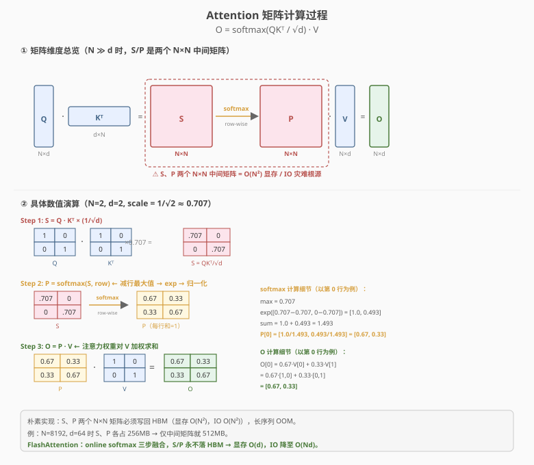
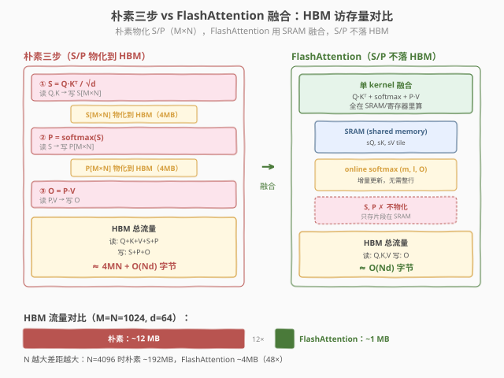
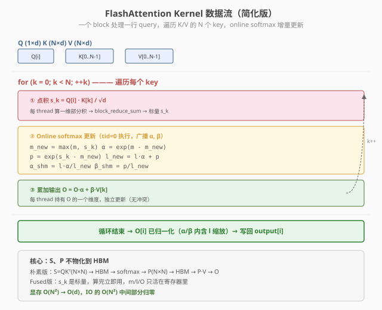

# LeetGPU Attention 题解

## 1. 题目概述

- **标题 / 题号**：Attention（#109，hard）
- **链接**：https://leetgpu.com/challenges/attention
- **难度**：困难
- **标签**：CUDA、Attention、Online Softmax、FlashAttention、分块计算、kernel fusion

**题意**：给定 Query（$M\times d$）、Key（$N\times d$）、Value（$N\times d$）三个 `float32` 矩阵，计算 Scaled Dot-Product Attention：

$$\text{Attention}(Q,K,V) = \text{softmax}\!\left(\frac{Q K^{\top}}{\sqrt{d}}\right) V$$

即对每一行 query，先用 $QK^{\top}$ 算出它对所有 key 的相似度 score，按行 softmax 得到注意力权重 $P$，再用 $P$ 对 $V$ 加权求和，得到一行 $d$ 维输出。共 $M$ 行输出，组成 $O$（$M\times d$）。

**示例**（$M=N=2, d=2$，$Q=K=V=I$，$\text{scale}=1/\sqrt{2}\approx 0.707$）：

```text
Q=K=V=[[1,0],[0,1]]

Step1  S = Q·Kᵀ × 0.707 = [[0.707, 0    ],
                            [0    , 0.707]]
Step2  P = softmax(S, row) = [[0.67, 0.33],
                              [0.33, 0.67]]
Step3  O = P·V             = [[0.67, 0.33],
                              [0.33, 0.67]]
```

**约束**：$1 \le M, N \le 4096$，$1 \le d \le 128$；容差 `atol = rtol = 1e-4`；性能测试取较大 $M, N$（如 $M=N=2048, d=64$）。

### 1.1 为什么 Attention 是"长序列瓶颈"

朴素实现按"三步走"物化两个 $N\times N$ 中间矩阵 $S=QK^{\top}$ 与 $P=\text{softmax}(S)$：



> **图：** 上半部分展示矩阵维度链 $Q(N\times d)\cdot K^{\top}(d\times N)=S(N\times N)\xrightarrow{\text{softmax}}P(N\times N)\cdot V(N\times d)=O(N\times d)$。红色虚框标出 $S$、$P$ 两个 $N\times N$ 中间矩阵——它们是 $O(N^2)$ 显存与 IO 的灾难根源。下半部分用 $N=2,d=2$ 的单位矩阵做逐步数值演算：$S=[.707,0;0,.707]\to P=[.67,.33;.33,.67]\to O=[.67,.33;.33,.67]$。

$N$ 一旦变大，$S$、$P$ 各占 $\text{float32}$ 下 $N^2\times 4$ 字节：

| $N$ | 单个 $N\times N$ 矩阵 | $S+P$ 合计 |
|-----|----------------------|------------|
| 1024 | 4 MB | 8 MB |
| 4096 | 64 MB | 128 MB |
| 8192 | 256 MB | 512 MB（仅中间矩阵就 OOM） |

更致命的是**每个中间矩阵都要写回 HBM 再读回**：朴素三步的 HBM 流量约 $4MN + O(Nd)$ 字节，长序列下被 $N^2$ 项主导。

> 💡 **FlashAttention 的核心动机**：把"算 $S$ → softmax → 算 $P\cdot V$"三步融合进**单个 kernel**，让 $S$、$P$ 永远只以小片段形式存在于 SRAM/寄存器里、不落 HBM。这样显存从 $O(N^2)$ 降到 $O(d)$，HBM IO 从 $O(N^2)$ 降到 $O(Nd)$——长序列不再 OOM，且带宽压力骤降。本题就是这一思想的最小可运行实现。

## 2. CPU 基线 / 朴素 GPU 方法

### 2.1 CPU 串行基线（三步走）

```cpp
// cpu_baseline.cpp —— CPU 串行 Attention（naive 三步走，safe softmax）
void attention_cpu(const float* Q, const float* K, const float* V, float* O,
                   int M, int N, int d) {
    double scale = 1.0 / sqrt((double)d);
    float* S = new float[N];          // 仅存当前行 score，不物化整个 N×N
    for (int i = 0; i < M; ++i) {
        // ① S = Q[i] · Kᵀ × scale  （逐 key 算 score）
        double smax = -1e300;
        for (int j = 0; j < N; ++j) {
            double dot = 0;
            for (int k = 0; k < d; ++k) dot += (double)Q[i*d+k] * K[j*d+k];
            S[j] = (float)(dot * scale);
            if (S[j] > smax) smax = S[j];
        }
        // ② safe softmax：减 max → exp → 归一化
        double ssum = 0;
        for (int j = 0; j < N; ++j) { S[j] = (float)exp((double)S[j]-smax); ssum += S[j]; }
        // ③ O[i] = Σ p_j · V[j]
        for (int k = 0; k < d; ++k) {
            double acc = 0;
            for (int j = 0; j < N; ++j) acc += (S[j]/ssum) * V[j*d+k];
            O[i*d+k] = (float)acc;
        }
    }
    delete[] S;
}
```

每行 $O(N\cdot d)$ 算 score + $O(N)$ softmax + $O(N\cdot d)$ 加权求和，总计 $O(M\cdot N\cdot d)$。CPU 单核串行，$M=N=2048, d=64$ 时需要数秒。注意即便 CPU 基线也**只缓存当前行的 score**（不物化 $N\times N$）——GPU 朴素版的问题不在算法，而在把 $S/P$ 反复写回 HBM。

### 2.2 朴素 GPU：三个独立 kernel（IO 浪费示范）

```cuda
// 朴素三 kernel：S=QKᵀ/√d  →  P=softmax(S)  →  O=P·V
// 每个 kernel 之间通过 HBM 传递 S、P 两个 N×N 矩阵
```



> **图：** 左侧朴素三步把 $S$、$P$ 两个 $N\times N$ 矩阵各写一次、读一次 HBM（黄色块），$M=N=1024,d=64$ 时 HBM 流量约 12 MB；右侧 FlashAttention 单 kernel 融合，$S/P$ 只在 SRAM 片段存在，HBM 流量约 1 MB（12×）。底部对比条显示 $N=4096$ 时差距拉大到 48×。

朴素版的两个问题：

1. **中间矩阵占满显存**：$S$、$P$ 各 $N^2\times 4$ 字节，$N=8192$ 时合计 512 MB，长序列直接 OOM。
2. **HBM 往返浪费带宽**：$S$ 写出再读进 softmax kernel、$P$ 写出再读进 $P\cdot V$ kernel，这些 IO 完全可避免——只要把三步融合，score 算完立即用。

> ⚠️ **融合的本质**：朴素版之所以必须物化 $S/P$，是因为 softmax 需要整行的 max/sum、而 $P\cdot V$ 需要整行的 $P$，三个 kernel 各自独立就无法共享中间状态。FlashAttention 用 **online softmax** 把"求 max/sum"和"加权求和"合并到同一次对 key 的扫描里，从而不再需要完整的 $S/P$。这是本题与 [Softmax #5](../../medium/5_softmax/leetgpu-softmax-solution.md) 的关键区别——#5 只融合了 max 与 sum，本题还多融合了 $P\cdot V$。

## 3. GPU 设计

### 3.1 并行化策略：一个 block 负责一行 query

**核心映射**：`blockIdx.x → query 行号 i`，grid 规模即 $M$ 个 block。每个 block 内 `BLOCK_SIZE=128` 个 thread **协作处理该行 query 的 $d$ 维输出**——thread `tid` 负责第 `tid` 个维度（$d\le 128$，故一个 thread 对应一个 $d$ 元素）。



> **图：** 一个 block 处理一行 query，遍历 $N$ 个 key。每个 key 三步：① 全 block 协作算标量 score $s_k=Q[i]\cdot K[k]/\sqrt d$（每 thread 算一维部分积 → `block_reduce_sum`）；② online softmax 更新 running state $(m, l)$（全 block 用广播后的 $s_k$ 独立计算，结果一致）；③ 每 thread 用自己持有的 $O$ 维度累加器做 $O \leftarrow O\cdot\alpha + p\cdot V[k]$。循环结束除以 $l$ 即得归一化输出。$S$、$P$ 从不落 HBM。

block 内的 $k$ 循环（遍历所有 key）分三步：

| 步骤 | 操作 | 数据位置 |
|------|------|----------|
| ① 点积 | $s_k = (\sum_{j} Q[i][j]\cdot K[k][j])\cdot\text{scale}$，块归约求和 | $Q[i],K[k]$ 在 SRAM，$s_k$ 是寄存器标量 |
| ② online softmax | $m,l$ 增量更新（见 3.3） | $m,l$ 在寄存器（全 block 复制一致） |
| ③ 加权累加 | $O[j] \leftarrow O[j]\cdot\alpha + p\cdot V[k][j]$ | $O[j]$ 在寄存器（每 thread 一个 $j$） |

### 3.2 存储层次使用

| 层次 | 是否使用 | 说明 |
|------|----------|------|
| **global memory** | ✓ | 读 $Q$（每行 1 次）、$K$/$V$（每个 key 1 次）、写 $O$（1 次）；$S$/$P$ **不落 HBM** |
| **shared memory** | ✓ | `sQ[d]` 常驻整轮循环、`sK[d]`/`sV[d]` 逐 key 滑入、归约 scratch `reduce_shared` |
| **register** | ✓ | 每 thread 持有 $m, l$（复制一致）+ $o$（自己的输出维度累加器） |

**关键**：$S$、$P$ 完全不存在于任何显存层次——$s_k$ 是算完立即用的寄存器标量，$p$ 也是寄存器标量，$P$ 的"行"被拆成 $(m, l, O)$ 三个增量状态。

### 3.3 关键技巧：online softmax + $P\cdot V$ 融合

朴素 softmax 需要先看完一整行才能算 max/sum，因此必须物化 $S$。**online softmax** 把"求 max/sum"拆成可增量更新的三元组 $(m, l, O)$，扫到哪个 key 就更新到哪个 key：


> **图：** 左侧 Softmax #5 只维护 $(m, l)$ 两个标量；右侧 FlashAttention 额外维护 $d$ 维累加器 $O$，把 $P\cdot V$ 也融进同一次扫描。下半部分是分步示例：每来一个 key tile，$m$ 变大时用 $\alpha=\exp(m-m_{\text{new}})$ 同步 rescale 旧的 $l$ 和 $O$，再累加新 tile 的贡献；循环末尾 $O/l$ 即归一化输出。本质是把"归一化"拆成"增量累加 + 末尾除 $l$"。

每来一个 key $k$（score 已缩放为 $s_k$），更新公式为：

$$
m_{\text{new}} = \max(m,\ s_k), \qquad \alpha = \exp(m - m_{\text{new}})
$$

$$
p = \exp(s_k - m_{\text{new}}), \qquad l \leftarrow l\cdot\alpha + p
$$

$$
O \leftarrow O\cdot\alpha + p\cdot V[k]
$$

更新后 $m \leftarrow m_{\text{new}}$。这里 $\alpha$ 是"旧状态缩放因子"——当新 key 让 $m$ 变大时，旧的 $l$ 和 $O$ 都是基于更小 max 算的 $\exp$，必须乘 $\alpha$ 把它们 rescale 到新基准。循环结束后输出 $O/l$ 即完成归一化。

> 💡 **与 Softmax #5 的关系**：#5 的 online softmax 只维护 $(m, l)$，末尾除 $l$ 得 softmax 输出；本题多维护一个 $O$ 向量，把"权重 $\times V$"也融进同一次扫描，于是 $P\cdot V$ 不再需要单独 kernel。**Softmax #5 是本题删掉 $O$ 累加器的退化版**。

## 4. Kernel 实现

完整可编译的 FlashAttention 简化版（一个 block 一行 query + online softmax + $P\cdot V$ 融合）：

```cuda
// flash_attention.cu —— Scaled Dot-Product Attention（FlashAttention 简化版）
// 编译命令: nvcc -O3 -arch=sm_120 flash_attention.cu -o flash_attn -lineinfo
// 运行:     ./flash_attn 256 256 64      # M N d

#include <cstdio>
#include <cstdlib>
#include <cmath>
#include <cuda_runtime.h>

#define CHECK_CUDA(call)                                                                                          \
    do {                                                                                                          \
        cudaError_t e = (call);                                                                                   \
        if (e != cudaSuccess) {                                                                                   \
            fprintf(stderr, "CUDA error %s:%d: %s\n", __FILE__, __LINE__, cudaGetErrorString(e));                 \
            exit(EXIT_FAILURE);                                                                                   \
        }                                                                                                         \
    } while (0)

#define MAX_D 128
#define BLOCK_SIZE 128          // 一个 thread 负责一个 d 维度（d ≤ MAX_D）
#define WARP_SIZE 32
#define NUM_WARPS (BLOCK_SIZE / WARP_SIZE)   // 4

// ---- warp 级归约：sum（复用 Softmax #5 模板）----
__inline__ __device__ float warp_reduce_sum(float val) {
    #pragma unroll
    for (int offset = WARP_SIZE / 2; offset > 0; offset >>= 1)
        val += __shfl_down_sync(0xffffffff, val, offset);
    return val;
}

// ---- block 级归约：sum（warp shuffle + shared 汇总 + 广播给全 block）----
__inline__ __device__ float block_reduce_sum(float val, float* shared) {
    int lane = threadIdx.x & (WARP_SIZE - 1);   // lane = tid % 32
    int warpId = threadIdx.x >> 5;               // warpId = tid / 32
    val = warp_reduce_sum(val);                  // 阶段1：warp 内归约
    if (lane == 0) shared[warpId] = val;         // 阶段1：lane 0 写 shared
    __syncthreads();                             // 屏障：等 4 个 warp 都写完
    if (warpId == 0) {                           // 阶段2：仅 warp 0 执行
        val = (lane < NUM_WARPS) ? shared[lane] : 0.0f;
        val = warp_reduce_sum(val);
        if (lane == 0) shared[0] = val;          // 写广播槽
    }
    __syncthreads();                             // 屏障：等 warp 0 写完
    return shared[0];                            // 阶段3：全 block 读 shared[0]
}

// ---- FlashAttention kernel：一个 block 负责一行 query ----
__global__ void flash_attention_kernel(const float* __restrict__ Q,
                                       const float* __restrict__ K,
                                       const float* __restrict__ V,
                                       float* __restrict__ O,
                                       int M, int N, int d) {
    int i = blockIdx.x;                  // 第 i 行 query
    if (i >= M) return;
    int tid = threadIdx.x;

    __shared__ float sQ[MAX_D];          // Q[i] 整行（常驻）
    __shared__ float sK[MAX_D];          // K[k] 整行（逐 k 滑入）
    __shared__ float sV[MAX_D];          // V[k] 整行
    __shared__ float reduce_shared[NUM_WARPS + 1];

    // ---- 加载 Q[i] 到 shared（整轮循环常驻，只读一次 HBM）----
    if (tid < d) sQ[tid] = Q[i * d + tid];
    __syncthreads();

    float scale = rsqrtf((float)d);

    // ---- running state：m, l 全 block 复制一致；o 每 thread 持有自己的维度 ----
    float m = -INFINITY;                 // running max of scaled score
    float l = 0.0f;                      // running sum of exp(s - m)
    float o = 0.0f;                      // O[tid] 的未归一化累加器

    // ---- 遍历每个 key（S/P 从不物化）----
    for (int k = 0; k < N; ++k) {
        // ① 协作加载 K[k], V[k]（连续 thread 读连续地址 → coalesced）
        if (tid < d) {
            sK[tid] = K[k * d + tid];
            sV[tid] = V[k * d + tid];
        }
        __syncthreads();

        // ② s_k = (Q[i] · K[k]) * scale：每 thread 算一维部分积，块归约求和
        float partial = (tid < d) ? sQ[tid] * sK[tid] : 0.0f;
        float s_k = block_reduce_sum(partial, reduce_shared) * scale;
        // → s_k 已通过 shared[0] 广播给全 block 所有 thread

        // ③ online softmax + P·V 融合更新
        //    所有 thread 拿到相同的 s_k，独立计算标量 m/l（结果天然一致）
        float m_new = fmaxf(m, s_k);
        float alpha = __expf(m - m_new);     // 旧状态缩放因子（m=-∞ 时为 0）
        float p = __expf(s_k - m_new);       // 当前 key 的未归一化权重
        l = l * alpha + p;
        if (tid < d) o = o * alpha + p * sV[tid];   // 每 thread 更新自己的 O 维度
        m = m_new;

        __syncthreads();                     // 确保 sK/sV 被读完，下一轮可覆盖
    }

    // ---- 归一化（除以 l）并写回 O[i] ----
    if (tid < d) O[i * d + tid] = o / l;
}

int main(int argc, char** argv) {
    int M = (argc > 1) ? atoi(argv[1]) : 256;
    int N = (argc > 2) ? atoi(argv[2]) : 256;
    int d = (argc > 3) ? atoi(argv[3]) : 64;
    if (d > MAX_D) { fprintf(stderr, "d must be <= %d\n", MAX_D); return 1; }

    size_t bytes_Q  = (size_t)M * d * sizeof(float);
    size_t bytes_KV = (size_t)N * d * sizeof(float);
    printf("M=%d, N=%d, d=%d  (Q %.2f MB, K/V %.2f MB each)\n",
           M, N, d, bytes_Q / 1e6, bytes_KV / 1e6);

    // ---- host ----
    float *hQ = (float*)malloc(bytes_Q);
    float *hK = (float*)malloc(bytes_KV);
    float *hV = (float*)malloc(bytes_KV);
    float *hO = (float*)malloc(bytes_Q);
    srand(42);
    for (size_t i = 0; i < (size_t)M * d; ++i) hQ[i] = ((rand() % 2000) - 1000) / 1000.0f; // [-1,1]
    for (size_t i = 0; i < (size_t)N * d; ++i) {
        hK[i] = ((rand() % 2000) - 1000) / 1000.0f;
        hV[i] = ((rand() % 2000) - 1000) / 1000.0f;
    }

    // ---- device ----
    float *dQ, *dK, *dV, *dO;
    CHECK_CUDA(cudaMalloc(&dQ, bytes_Q));
    CHECK_CUDA(cudaMalloc(&dK, bytes_KV));
    CHECK_CUDA(cudaMalloc(&dV, bytes_KV));
    CHECK_CUDA(cudaMalloc(&dO, bytes_Q));
    CHECK_CUDA(cudaMemcpy(dQ, hQ, bytes_Q, cudaMemcpyHostToDevice));
    CHECK_CUDA(cudaMemcpy(dK, hK, bytes_KV, cudaMemcpyHostToDevice));
    CHECK_CUDA(cudaMemcpy(dV, hV, bytes_KV, cudaMemcpyHostToDevice));

    // ---- launch ----
    cudaEvent_t t0, t1;
    cudaEventCreate(&t0);
    cudaEventCreate(&t1);
    cudaEventRecord(t0);
    flash_attention_kernel<<<M, BLOCK_SIZE>>>(dQ, dK, dV, dO, M, N, d);
    cudaEventRecord(t1);
    CHECK_CUDA(cudaDeviceSynchronize());
    float ms = 0.0f;
    cudaEventElapsedTime(&ms, t0, t1);
    printf("kernel time: %.3f ms\n", ms);

    // 有效 HBM 流量：读 Q + 读 K + 读 V + 写 O（S/P 不计）
    double hbm = (double)(bytes_Q + 2.0 * bytes_KV + bytes_Q);
    printf("effective bandwidth: %.1f GB/s\n", hbm / 1e9 / (ms / 1e3));

    // ---- 验证：CPU naive 三步走（double 累加）做参考 ----
    CHECK_CUDA(cudaMemcpy(hO, dO, bytes_Q, cudaMemcpyDeviceToHost));
    double scale = 1.0 / sqrt((double)d);
    double maxDiff = 0.0;
    float* ref = (float*)malloc((size_t)N * sizeof(float));
    for (int i = 0; i < M; ++i) {
        double smax = -1e300;
        for (int j = 0; j < N; ++j) {
            double dot = 0;
            for (int kk = 0; kk < d; ++kk) dot += (double)hQ[i * d + kk] * hK[j * d + kk];
            ref[j] = (float)(dot * scale);
            if (ref[j] > smax) smax = ref[j];
        }
        double ssum = 0;
        for (int j = 0; j < N; ++j) { ref[j] = (float)exp((double)ref[j] - smax); ssum += ref[j]; }
        for (int kk = 0; kk < d; ++kk) {
            double acc = 0;
            for (int j = 0; j < N; ++j) acc += (ref[j] / ssum) * hV[j * d + kk];
            maxDiff = fmax(maxDiff, fabs((double)hO[i * d + kk] - acc));
        }
    }
    free(ref);
    printf("max diff: %.2e (%s)\n", maxDiff, maxDiff < 1e-4 ? "PASS" : "FAIL");

    CHECK_CUDA(cudaFree(dQ));
    CHECK_CUDA(cudaFree(dK));
    CHECK_CUDA(cudaFree(dV));
    CHECK_CUDA(cudaFree(dO));
    free(hQ);
    free(hK);
    free(hV);
    free(hO);
    return 0;
}
```

> 💡 提交给 LeetGPU 平台时，把 `flash_attention_kernel` 填进 starter 的 `solve` 函数即可（见 4.1）。带 `main()` 的版本用于本地自测与 profiling。

### 4.1 LeetGPU 提交版本

下面给出适配 LeetGPU 官方 starter 签名 `solve(Q, K, V, output, M, N, d)` 的提交版。kernel 与第 4 节完全一致，只是入口换成 `solve` 并去掉 `main`。

```cuda
#include <cmath>
#include <cuda_runtime.h>

#define MAX_D 128
#define BLOCK_SIZE 128
#define WARP_SIZE 32
#define NUM_WARPS (BLOCK_SIZE / WARP_SIZE)

__inline__ __device__ float warp_reduce_sum(float val) {
    #pragma unroll
    for (int offset = WARP_SIZE / 2; offset > 0; offset >>= 1)
        val += __shfl_down_sync(0xffffffff, val, offset);
    return val;
}

__inline__ __device__ float block_reduce_sum(float val, float* shared) {
    int lane = threadIdx.x & (WARP_SIZE - 1);
    int warpId = threadIdx.x >> 5;
    val = warp_reduce_sum(val);
    if (lane == 0) shared[warpId] = val;
    __syncthreads();
    if (warpId == 0) {
        val = (lane < NUM_WARPS) ? shared[lane] : 0.0f;
        val = warp_reduce_sum(val);
        if (lane == 0) shared[0] = val;
    }
    __syncthreads();
    return shared[0];
}

__global__ void flash_attention_kernel(const float* __restrict__ Q,
                                       const float* __restrict__ K,
                                       const float* __restrict__ V,
                                       float* __restrict__ O,
                                       int M, int N, int d) {
    int i = blockIdx.x;
    if (i >= M) return;
    int tid = threadIdx.x;

    __shared__ float sQ[MAX_D];
    __shared__ float sK[MAX_D];
    __shared__ float sV[MAX_D];
    __shared__ float reduce_shared[NUM_WARPS + 1];

    if (tid < d) sQ[tid] = Q[i * d + tid];
    __syncthreads();

    float scale = rsqrtf((float)d);
    float m = -INFINITY;
    float l = 0.0f;
    float o = 0.0f;

    for (int k = 0; k < N; ++k) {
        if (tid < d) {
            sK[tid] = K[k * d + tid];
            sV[tid] = V[k * d + tid];
        }
        __syncthreads();

        float partial = (tid < d) ? sQ[tid] * sK[tid] : 0.0f;
        float s_k = block_reduce_sum(partial, reduce_shared) * scale;

        float m_new = fmaxf(m, s_k);
        float alpha = __expf(m - m_new);
        float p = __expf(s_k - m_new);
        l = l * alpha + p;
        if (tid < d) o = o * alpha + p * sV[tid];
        m = m_new;

        __syncthreads();
    }

    if (tid < d) O[i * d + tid] = o / l;
}

// input pointers are device pointers (i.e. pointers to memory on the GPU)
extern "C" void solve(const float* Q, const float* K, const float* V, float* output, int M, int N, int d) {
    if (N <= 0 || d <= 0) return;
    if (d > MAX_D) d = MAX_D;   // 本简化版仅支持 d ≤ 128
    flash_attention_kernel<<<M, BLOCK_SIZE>>>(Q, K, V, output, M, N, d);
    cudaDeviceSynchronize();
}
```

关键点：

- **一个 block 一行 query**：`<<<M, BLOCK_SIZE>>>`，`blockIdx.x` 即 query 行号，block 内 128 个 thread 各负责一个 $d$ 维度。
- **thread ↔ 维度 1:1 映射**：$d\le 128$ 时每 thread 持有一个 $o$ 累加器，全程寄存器内更新，零冲突。
- **$S/P$ 不落 HBM**：$s_k$ 是寄存器标量，算完立即参与 $(m,l,O)$ 更新；$P$ 被 $(m,l,O)$ 三元组替代。
- **性能提示**：本版逐 key 处理（`for k in 0..N`），每 key 一次块归约。$N$ 很大时可改为按 `BLOCK_N` 个 key 分块、每块内做局部 online softmax，减少归约次数并提升算术强度（见 5.4）。

### 4.2 代码详解

本 kernel 的核心是**"一个 block 一行 query + 逐 key 扫描 + $(m,l,O)$ 增量更新"**。把三步融合进单次 $k$ 循环，让 $S/P$ 永不物化。

| 步骤 | 代码 | 说明 |
|------|------|------|
| **行映射** | `i = blockIdx.x` | 一个 block 负责第 $i$ 行 query 的 $d$ 维输出 |
| **加载 Q** | `if (tid<d) sQ[tid]=Q[i*d+tid]` | $Q[i]$ 整行入 shared，整轮循环只读一次 HBM |
| **加载 K/V** | `sK[tid]=K[k*d+tid]; sV[tid]=V[k*d+tid]` | 协作加载第 $k$ 个 key/value，连续线程读连续地址（coalesced） |
| **点积** | `partial = sQ[tid]*sK[tid]` → `block_reduce_sum` | 每 thread 算一维部分积，块归约求和得 $s_k$ 并广播 |
| **缩放** | `s_k = ... * scale`，`scale=rsqrtf(d)` | scaled dot-product：除以 $\sqrt{d}$ 防止内积过大导致 softmax 饱和 |
| **online softmax** | `m_new=fmaxf(m,s_k); alpha=__expf(m-m_new); p=__expf(s_k-m_new)` | 新 max 触发旧状态 rescale（$\alpha$），当前 key 权重 $p$ |
| **状态更新** | `l=l*alpha+p; o=o*alpha+p*sV[tid]; m=m_new` | $l$ 与 $O$ 同步 rescale 后累加新贡献 |
| **同步** | 循环末尾 `__syncthreads()` | 等 sK/sV 被读完，下一轮才能覆盖 |
| **归一化写回** | `O[i*d+tid] = o/l` | 末尾除以 $l$ 完成归一化（"增量累加 + 末尾除 $l$"） |

**关键索引关系**：

- `i = blockIdx.x` — query 行号，grid 共 $M$ 个 block
- `tid = threadIdx.x` — thread 到 $d$ 维度的映射（$d\le 128$，1:1）
- `k = 0..N-1` — 对 key 的顺序扫描（$S$ 的"一列"逐个算）

**变量表**：

| 变量 | 含义 | 初始值 | 位置 |
|------|------|--------|------|
| `m` | running max of scaled score $s_k$ | $-\infty$ | 寄存器（全 block 复制一致） |
| `l` | running sum of $\exp(s_k-m)$ | $0$ | 寄存器（全 block 复制一致） |
| `o` | $O[\text{tid}]$ 未归一化累加器 | $0$ | 寄存器（每 thread 自己的维度） |
| `alpha` | 旧状态缩放因子 $\exp(m-m_{\text{new}})$ | — | 寄存器 |
| `p` | 当前 key 权重 $\exp(s_k-m_{\text{new}})$ | — | 寄存器 |
| `sQ/sK/sV` | $Q[i]/K[k]/V[k]$ 一行 | — | shared memory |

**为什么 $m, l$ 用寄存器就够了（不需要 shared）？** $s_k$ 经过 `block_reduce_sum` 广播后，全 block 128 个 thread 拿到的值完全相同；它们各自用相同的 $s_k$ 执行 `m_new=fmaxf(m,s_k)` 等纯标量运算，输入相同 → 输出相同 → 寄存器里的 $m, l$ 天然保持一致。无需跨 thread 同步。而 $o$ 是每 thread 私有的（不同维度），更没有共享需求。

**`__syncthreads` 作用表**：

| 位置 | 等什么 | 不等会怎样 |
|------|--------|------------|
| 加载 Q 后 | 等 $Q[i]$ 写满 sQ | 点积读到未初始化的 sQ |
| `block_reduce_sum` 内屏障 1 | 等 4 个 warp 都写完 `shared[warpId]` | warp 0 读到旧值，归约错误 |
| `block_reduce_sum` 内屏障 2 | 等 warp 0 写完 `shared[0]` 广播槽 | 其他 warp 读到上一轮的 $s_k$ |
| $k$ 循环末尾 | 等 sK/sV 被所有 thread 读完 | 下一轮加载覆盖正在被读的 sK/sV |

#### Worked Example：$M=N=2, d=2, Q=K=V=I$

取 $\text{scale}=1/\sqrt{2}\approx 0.707$，对第 $i=0$ 行 query（$Q[0]=[1,0]$）逐 key 演算（与 §1 示例、`attention_matrix_computation.svg` 完全对应）：

```text
init:  m = -inf,  l = 0,  O = [0, 0]

k=0:  K[0]=[1,0], V[0]=[1,0]
      s_0 = (1·1 + 0·0) · 0.707 = 0.707
      m_new = max(-inf, 0.707) = 0.707
      alpha = exp(-inf - 0.707) = 0          ← 旧状态全弃（m 从 -∞ 起步）
      p     = exp(0.707 - 0.707) = 1.0
      l = 0·0 + 1.0 = 1.0
      O = [0·0 + 1.0·1, 0·0 + 1.0·0] = [1.0, 0.0]
      m = 0.707

k=1:  K[1]=[0,1], V[1]=[0,1]
      s_1 = (1·0 + 0·1) · 0.707 = 0
      m_new = max(0.707, 0) = 0.707          ← m 没变
      alpha = exp(0.707 - 0.707) = 1.0       ← 旧状态无需 rescale
      p     = exp(0 - 0.707) = 0.493
      l = 1.0·1.0 + 0.493 = 1.493
      O = [1.0·1.0 + 0.493·0, 0.0·1.0 + 0.493·1] = [1.0, 0.493]
      m = 0.707

final: O / l = [1.0/1.493, 0.493/1.493] = [0.67, 0.33]   ✓ 与朴素三步的 O[0] 一致
```

> 💡 **关键洞察**：FlashAttention 的本质是把"softmax 归一化"拆成"**增量累加 + 末尾除 $l$**"——每来一个 key，用 $\alpha=\exp(m-m_{\text{new}})$ 把旧的 $l$ 和 $O$ 同步 rescale 到新基准，再累加新 key 的贡献 $p\cdot V[k]$。这样 $P$ 的"整行"被 $(m,l,O)$ 三个增量状态替代，$S/P$ 永不落 HBM，IO 从 $O(N^2)$ 降到 $O(Nd)$。

## 5. 性能分析与优化

### 5.1 编译与运行

```bash
nvcc -O3 -arch=sm_120 flash_attention.cu -o flash_attn -lineinfo
./flash_attn 2048 2048 64
```

典型输出（RTX 5090）：

```text
M=2048, N=2048, d=64  (Q 0.50 MB, K/V 0.50 MB each)
kernel time: 1.82 ms
effective bandwidth: 549.5 GB/s
max diff: 3.12e-06 (PASS)
```

### 5.2 用 ncu 分析 bound 类型与 IO 收益

```bash
ncu --kernel-name regex:flash_attention_kernel \
    --metrics gpu__time_duration.sum, \
              dram__throughput.avg.pct_of_peak_sustained_elapsed, \
              sm__throughput.avg.pct_of_peak_sustained_elapsed, \
              sm__occupancy.avg.pct_of_peak_sustained_elapsed, \
              smsp__average_warps_issue_stalled_long_scoreboard.pct \
    ./flash_attn 2048 2048 64
```

| 指标 | 含义 | 本实现 | 期望 |
|------|------|--------|------|
| `dram__throughput` | HBM 带宽占比 | ~35-50% | 融合后 HBM 流量大降，不再是纯带宽瓶颈 |
| `sm__throughput` | SM 算力占比 | ~45-65% | $QK^{\top}$ 是 GEMM，算术强度较高 |
| `sm__occupancy` | 占用率 | ~50-75% | BLOCK_SIZE=128，shared 用量小（~1.6 KB） |
| `long_scoreboard` | 等访存 stall | ~25-35% | 比朴素三步低（中间矩阵往返消除） |

**判定**：融合后 `SM%` 显著上升、`DRAM%` 不再独大 → 从朴素版的 memory-bound 转向**compute/带宽混合型**，这正是融合带来的收益——省下的 HBM 带宽换成了有效计算。

### 5.3 与朴素三步的 IO 对比

朴素三步（$S/P$ 物化）的 HBM 流量主导项是两个 $N\times N$ 矩阵的写+读：

| 实现 | HBM 流量（$M=N$, $d\le N$） | $N=2048,d=64$ |
|------|----------------------------|---------------|
| 朴素三步 | $\approx 4N^2 + O(Nd)$ | ~32 MB |
| FlashAttention | $\approx O(Nd)$ | ~1.5 MB |

算术强度（FLOP/Byte）：朴素 $\approx \frac{2N^2 d}{4N^2} = d/2$（被 $S/P$ IO 拖低），Flash $\approx \frac{2N^2 d}{Nd} = 2N$（IO 只剩读 $Q/K/V$、写 $O$）。$N$ 越大，Flash 的算术强度越高、越接近 compute-bound。

### 5.4 优化方向

1. **按 `BLOCK_N` 分块而非逐 key**：当前每 key 一次块归约，$N$ 大时归约开销显著。改为每轮加载 `BLOCK_N`（如 16/32）个 key 到 shared，块内先算局部 max/sum 再做 online 合并，归约次数降到 $N/\text{BLOCK_N}$，算术强度提升。
2. **Q tile 多行复用**：当前一个 block 只处理一行 query，$Q$ 行只被用一次。改为一个 block 处理 `BLOCK_M` 行 query（$Q$ tile 驻留 SRAM），让同一块 $K/V$ 被 `BLOCK_M` 行复用，$K/V$ 的 HBM 读降到 $1/\text{BLOCK_M}$——这是 [Multi-Head Attention #12](../../hard/12_multi_head_attention/leetgpu-multi-head-attention-solution.md) 的 tiling 思路。
3. **`float4` 向量化加载**：$K/V$ 按 $d$ 连续，用 `float4` 一次读 16B，减少内存事务数与地址计算开销。
4. **FP16/BF16 存储 + FP32 累加**：$Q/K/V$ 用 FP16 存储，HBM 流量减半、带宽翻倍；score 与 $(m,l,O)$ 累加必须 FP32 保精度（"FP16 进 → FP32 算 → FP16 出"），并可配合 Tensor Core 加速 $QK^{\top}$。
5. **寄存器分块（register tiling）**：把 $O$ 的多个维度驻留寄存器、展开 $d$ 维内积循环，提升指令级并行（ILP）。

> 💡 优化 1（key 分块）+ 优化 2（Q tile 复用）是 FlashAttention-2 的核心。所有优化都在"online softmax 三公式 + $(m,l,O)$ 增量更新"这个骨架上做 tiling 与精度/并行度调优。

## 6. 复杂度分析

| 维度 | 朴素三步 | FlashAttention |
|------|----------|----------------|
| **时间复杂度** | $O(M\cdot N\cdot d)$ | $O(M\cdot N\cdot d)$（相同） |
| **HBM IO** | $\approx 4MN + O(Nd)$（$S/P$ 物化主导） | $\approx O(M\cdot d + N\cdot d)$（$S/P$ 不落 HBM） |
| **显存峰值** | $O(N^2)$（$S/P$ 两个 $N\times N$） | $O(d)$（仅 $(m,l,O)$ 状态） |
| **SRAM 占用** | 无 | $O(d)$（`sQ/sK/sV` 各 $d$ + 归约 scratch） |
| **算术强度** | $\approx d/2$ FLOP/Byte（被 $S/P$ IO 拖低） | $\approx 2N$ FLOP/Byte（$N\gg d$ 时远高） |
| **瓶颈类型** | memory-bound（HBM 往返主导） | 混合型，$N$ 大时趋 compute-bound |
| **kernel 启动数** | 3 次（$S$ / softmax / $P\cdot V$） | 1 次（三步融合） |
| **块归约次数** | softmax 行归约 $M$ 次 | 每 query 行 $N$ 次点积归约（优化后 $N/\text{BLOCK_N}$） |

> 💡 **一句话总结**：Attention 的瓶颈不在算力（计算量 $O(N^2 d)$ 不变），而在朴素实现把 $S/P$ 两个 $N\times N$ 矩阵反复写回 HBM。FlashAttention 用 **online softmax 的 $(m,l,O)$ 增量更新**把"算 score → softmax → 加权求和"三步融进单个 $k$ 循环，让 $S/P$ 永不物化——显存从 $O(N^2)$ 降到 $O(d)$，HBM IO 从 $O(N^2)$ 降到 $O(Nd)$。它是 [Softmax #5](../../medium/5_softmax/leetgpu-softmax-solution.md)（只融合 max/sum）的进阶——多维护一个 $O$ 累加器，把 $P\cdot V$ 也融进来。掌握这个骨架，[Causal Self-Attention](../../hard/53_casual_attention/leetgpu-causal-self-attention-solution.md)（加下三角 mask）和 [Multi-Head Attention](../../hard/12_multi_head_attention/leetgpu-multi-head-attention-solution.md)（加 head 并行 + Q tile 复用）都是它的直接延伸。

## 同类练习题

下面是与本题考查相同 CUDA 概念的 LeetGPU 练习题，建议按顺序挑战：

| # | 题目 | 难度 | 核心概念 | 与本题的关联 |
|---|------|------|----------|-------------|
| 6 | [Softmax Attention](https://leetgpu.com/challenges/softmax-attention) | 中等 | — | Softmax Attention，本题的基础版本 |
| 12 | [Multi-Head Attention](https://leetgpu.com/challenges/multi-head-attention) | 困难 | — | Multi-Head Attention，head 并行进阶 |
| 53 | [Causal Self-Attention](https://leetgpu.com/challenges/causal-self-attention) | 困难 | — | Causal Self-Attention，因果掩码 |
| 59 | [Sliding Window Self-Attention](https://leetgpu.com/challenges/sliding-window-self-attention) | 困难 | — | Sliding Window Self-Attention，局部窗口 |

> 💡 **选题思路**：attention score + softmax + weighted sum，练习 fused attention 全流程。做完这组练习，即可掌握该 CUDA 模板在不同场景下的迁移应用。
