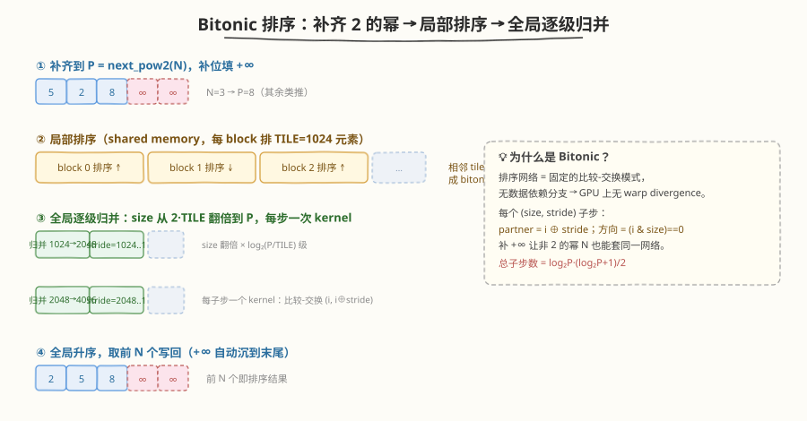
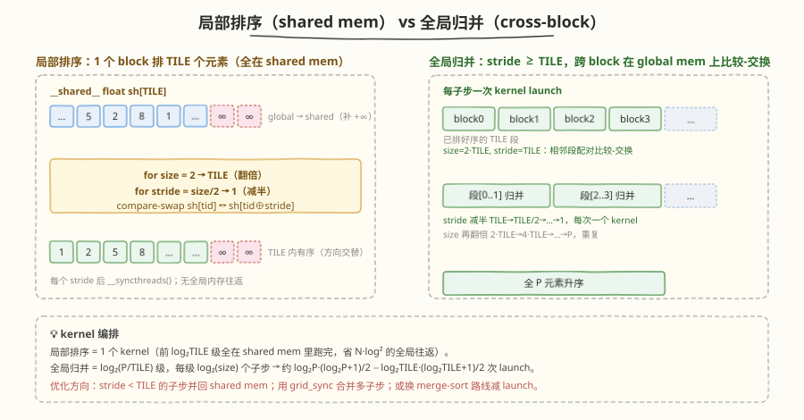
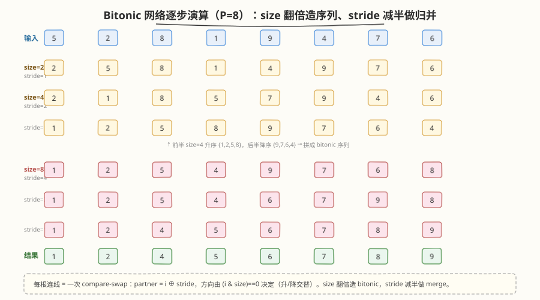

# LeetGPU Sorting 题解

## 1. 题目概述

- **标题 / 题号**：Sorting（#15，hard）
- **链接**：https://leetgpu.com/challenges/sorting
- **难度**：困难
- **标签**：CUDA、并行排序、Bitonic Sort、排序网络、compare-swap、shared memory、memory-bound

**题意**：给定一个长度为 `N` 的 `float32` 数组 `data`，将其**原地升序排序**，结果写回 `data`。算法不限。

**示例**（`N=6`）：

```text
Input:  data = [5.0, 2.0, 8.0, 1.0, 9.0, 4.0]
Output: data = [1.0, 2.0, 4.0, 5.0, 8.0, 9.0]
```

**约束**：

- `1 ≤ N ≤ 1,000,000`，`data` 为 `float32`，`atol = rtol = 1e-5`
- 功能测试覆盖：已排序、逆序、全相同、单元素、2 的幂（1024）、非 2 的幂（1000）、大数组（32768）
- 性能测试固定 `N = 1,000,000`

> 💡 这是一道**并行排序**经典题。CPU 上的快速排序 / 归并排序都依赖**数据依赖的分治**（partition 后递归两半），分支与递归深度随数据变化——这种"看数据决定控制流"的模式在 GPU 上会产生严重的 warp divergence 和不规律访存。GPU 排序的正确打开方式是**排序网络（sorting network）**：比较-交换的顺序**与数据无关**、固定可并行，每个线程做一次独立的 compare-swap，无分支、无递归。其中 **Bitonic Sort（双调排序）** 是最常用的 GPU 排序网络。本题的核心就是用 bitonic 网络把"看似串行的排序"压成 `O(log²N)` 深度的并行比较-交换层。

## 2. CPU 基线 / 朴素 GPU 方法

### 2.1 CPU 串行基线

```cpp
// cpu_baseline.cpp —— CPU 串行排序（快速排序 / std::sort）
#include <algorithm>
void sort_cpu(float* a, int N) { std::sort(a, a + N); }
```

CPU `std::sort` 平均 `O(N log N)`，`N=1e6` 约 60–100 ms。瓶颈：**串行递归 + 数据依赖分支**——partition 的 pivot 划分让左右两半大小随数据变化，无法直接并行。

### 2.2 朴素 GPU：为什么"一个线程排序一段"行不通

最暴力的并行：把数组切成 `B` 段，一个线程排序一段，再归并。

```cuda
// ❌ 朴素版：每线程用插入排序排一小段，再想办法归并
__global__ void naive_sort(float* data, int N) {
    int tid = blockIdx.x * blockDim.x + threadIdx.x;
    int chunk = 64;                       // 每线程排 64 个
    int start = tid * chunk;
    for (int i = start + 1; i < start + chunk && i < N; ++i) {
        float key = data[i]; int j = i - 1;
        while (j >= start && data[j] > key) { data[j+1] = data[j]; --j; }  // 数据依赖分支
        data[j+1] = key;
    }
    // 之后还要跨线程归并，极其复杂且低效
}
```

**致命问题**：插入排序内部是 `O(chunk²)` 的数据依赖循环，warp 内 32 个线程的分支完全不同步 → 严重 divergence；且跨线程归并无简单方案。这种"把串行算法直接搬到 GPU"的思路从根本上违背 GPU 的并行模型。

> ⚠️ 核心矛盾：高效排序算法（快排、堆排）的**控制流依赖数据**，而 GPU 需要的是**控制流固定、数据无关**的并行模式。排序网络（bitonic、odd-even 等）正是为此而生——比较-交换的 (i, j) 对**在运行前就确定**，与具体数值无关。

## 3. GPU 设计

### 3.1 Bitonic 排序网络：数据无关的比较-交换

**Bitonic 序列**：先单调增、后单调减的序列（或其循环旋转）。Bitonic 网络的核心定理：

1. **造序列**：递归地"前半升序 + 后半降序" → 拼成 bitonic 序列；
2. **归并**：对长度为 `size` 的 bitonic 序列，用 `log₂(size)` 步 compare-swap（stride 从 `size/2` 减半到 1）把它变成单调序列。

整个排序就是两层循环：`size` 从 2 翻倍到 `P`，每个 `size` 内 `stride` 从 `size/2` 减半到 1。每个 `(size, stride)` 子步就是**一次全数组的 compare-swap**：

$$
\text{partner} = i \oplus \text{stride},\qquad \text{ascending} = ((i\ \&\ \text{size}) == 0)
$$

只有 `i < partner` 的线程执行交换（避免竞争），方向由 `i & size` 决定——升降交替是网络自洽的，无需手动指定。



### 3.2 处理非 2 的幂：补 +∞

Bitonic 网络要求长度为 2 的幂。对任意 `N`，取 `P = next_pow2(N)`，把 `[N, P)` 补成 `+∞`。由于 `+∞` 比任何实数都大，排序后自动沉到末尾，**前 `N` 个即为排序结果**。这样 `N=6` 和 `N=1000000` 都能套用同一套 2 的幂网络，无需特殊边界处理。

### 3.3 两级并行：shared-mem 局部排序 + 全局逐级归并

`P=2^20=1048576` 时，全用全局内存子步需要 `log₂P·(log₂P+1)/2 = 210` 个 kernel launch，且每个子步都要全局往返。优化关键：**前 `log₂(TILE)` 级完全在一个 block 的 shared memory 内跑完，只需 1 个 kernel**。



| 阶段 | 范围 | 存储层次 | kernel 数 | 说明 |
|------|------|----------|-----------|------|
| **① 局部排序** | `size = 2 → TILE` | shared memory | 1 | 每 block 排 `TILE=1024` 个元素，前 10 级全在片内，零全局往返 |
| **② 全局归并** | `size = 2·TILE → P` | global memory | `log₂(P/TILE)` 级 × 每级 `log₂(size)` 子步 | 跨 block compare-swap，每子步一次 launch |

局部排序用**全局索引** `gi = base + tid` 决定方向，因此它等价于完整网络的前 `log₂(TILE)` 级，能与全局归并无缝拼接（相邻 tile 自然形成升/降交替的 bitonic 对）。

### 3.4 存储层次使用

| 层次 | 是否使用 | 说明 |
|------|----------|------|
| **global memory** | ✓ | `data` 只读输入、`buf` 补齐缓冲（大小 `P`）；全局归并阶段在 `buf` 上 compare-swap |
| **shared memory** | ✓ | 局部排序的 `sh[TILE]`（1024 float = 4KB/block），前 10 级网络全在片内 |
| **register** | ✓ | 每线程持有 `sh[tid]` 的临时变量 `a, b`；无跨线程寄存器通信 |

### 3.5 关键技巧

| 技巧 | 说明 |
|------|------|
| **排序网络替代数据依赖排序** | compare-swap 顺序固定、与数据无关 → 无 warp divergence、无递归 |
| **补 +∞ 处理非 2 的幂** | `P = next_pow2(N)`，`+∞` 沉末尾，前 `N` 个即结果，统一网络 |
| **shared-mem 局部排序** | 前 `log₂(TILE)` 级在片内一次跑完，省 `O(N log² TILE)` 全局往返 |
| **全局索引决定方向** | 局部排序用 `gi = base + tid` 算 `(gi & size)`，与全局网络自洽拼接 |
| **`i < partner` 防竞争** | 每对只让小索引端写，避免双线程同时写同一位置 |

> 💡 **与 #29 Top K Selection 的关系**：#29 在 block 内用 bitonic 网络做局部排序选 top-k，是本题排序网络的"局部版"。本题把网络扩展到全数组（局部排序 + 全局归并两级），是 bitonic sort 的完整实现。

## 4. Kernel 实现

完整可编译版本（含局部排序 + 全局归并 + CPU 验证）。`TILE=1024`，`N=1e6` 时 `P=2^20`，全局归并 10 级共 155 个子步 kernel。

```cuda
// sorting.cu —— Bitonic sort：补齐 2 的幂 → shared-mem 局部排序 → 全局逐级归并
// 编译命令: nvcc -O3 -arch=sm_120 sorting.cu -o sorting
// 运行:     ./sorting [N]

#include <cstdio>
#include <cstdlib>
#include <cmath>
#include <algorithm>
#include <cuda_runtime.h>

#define CHECK_CUDA(call) do {                                              \
    cudaError_t e = (call);                                                \
    if (e != cudaSuccess) {                                                \
        fprintf(stderr, "CUDA error %s:%d: %s\n", __FILE__, __LINE__,      \
                cudaGetErrorString(e));                                     \
        exit(EXIT_FAILURE);                                                \
    }                                                                      \
} while (0)

#define TILE 1024          // shared-mem tile：一个 block 排 1024 个元素（1 元素/线程）
#define THREADS_G 256      // 全局 compare-swap kernel 的每 block 线程数

// ① 局部排序：每 block 在 shared memory 里跑完前 log2(TILE) 级 bitonic 网络
__global__ void bitonic_local_sort(const float* data, float* buf, int N, int P) {
    int base = blockIdx.x * TILE;
    int tid = threadIdx.x;
    __shared__ float sh[TILE];
    // 加载到 shared mem，越界补 +∞（让非 2 的幂 N 也能套同一网络）
    sh[tid] = (base + tid < N) ? data[base + tid] : INFINITY;
    __syncthreads();

    for (int size = 2; size <= TILE; size <<= 1) {
        for (int stride = size >> 1; stride > 0; stride >>= 1) {
            int partner = tid ^ stride;
            if (tid < partner) {                       // 只让小索引端做交换，避免竞争
                int gi = base + tid;                    // 全局索引（决定升降方向）
                bool asc = ((gi & size) == 0);
                float a = sh[tid], b = sh[partner];
                if ((asc && a > b) || (!asc && a < b)) {
                    sh[tid] = b; sh[partner] = a;
                }
            }
            __syncthreads();
        }
    }
    if (base + tid < P) buf[base + tid] = sh[tid];
}

// ② 全局 compare-swap：处理一个 (size, stride) 子步，跨 block 在 global memory 上交换
__global__ void bitonic_global_step(float* buf, int P, int size, int stride) {
    int i = blockIdx.x * blockDim.x + threadIdx.x;
    if (i >= P) return;
    int partner = i ^ stride;
    if (i < partner) {
        bool asc = ((i & size) == 0);
        float a = buf[i], b = buf[partner];
        if ((asc && a > b) || (!asc && a < b)) {
            buf[i] = b; buf[partner] = a;
        }
    }
}

// LeetGPU 提交接口：原地升序排序 data[0..N)
extern "C" void solve(float* data, int N) {
    if (N <= 1) return;
    int P = 1;
    while (P < N) P <<= 1;                            // 补齐到 2 的幂
    float* buf;
    CHECK_CUDA(cudaMalloc(&buf, (size_t)P * sizeof(float)));

    int numLocalBlocks = (P + TILE - 1) / TILE;
    bitonic_local_sort<<<numLocalBlocks, TILE>>>(data, buf, N, P);

    for (int size = 2 * TILE; size <= P; size <<= 1) {
        for (int stride = size >> 1; stride > 0; stride >>= 1) {
            int blocks = (P + THREADS_G - 1) / THREADS_G;
            bitonic_global_step<<<blocks, THREADS_G>>>(buf, P, size, stride);
        }
    }
    // 前 N 个即排序结果（+∞ 已沉到末尾），写回原数组
    CHECK_CUDA(cudaMemcpy(data, buf, (size_t)N * sizeof(float), cudaMemcpyDeviceToDevice));
    CHECK_CUDA(cudaFree(buf));
}

// ---------------- 本地自测 ----------------
int main(int argc, char** argv) {
    int N = (argc > 1) ? atoi(argv[1]) : 1000000;
    size_t bytes = (size_t)N * sizeof(float);
    printf("N = %d  (%.2f MB)\n", N, bytes / 1e6);

    float *hData = (float*)malloc(bytes), *hRef = (float*)malloc(bytes);
    srand(42);
    for (int i = 0; i < N; ++i) {
        hData[i] = (float)((rand() % 200000) - 100000) / 100.0f;
        hRef[i] = hData[i];
    }
    std::sort(hRef, hRef + N);                        // CPU 参考

    float *dData;
    CHECK_CUDA(cudaMalloc(&dData, bytes));
    CHECK_CUDA(cudaMemcpy(dData, hData, bytes, cudaMemcpyHostToDevice));

    cudaEvent_t t0, t1;
    cudaEventCreate(&t0); cudaEventCreate(&t1);

    cudaEventRecord(t0);
    solve(dData, N);
    cudaEventRecord(t1);
    CHECK_CUDA(cudaDeviceSynchronize());
    float ms = 0; cudaEventElapsedTime(&ms, t0, t1);

    CHECK_CUDA(cudaMemcpy(hData, dData, bytes, cudaMemcpyDeviceToHost));

    // 验证：逐元素比对 + 单调性
    double max_err = 0;
    for (int i = 0; i < N; ++i) {
        double d = fabs((double)hData[i] - hRef[i]);
        if (d > max_err) max_err = d;
    }
    bool ok = max_err < 1e-4;
    printf("[bitonic] time: %.3f ms  max_err: %.3e  %s\n", ms, max_err, ok ? "PASS" : "FAIL");
    printf("throughput: %.2f M elem/s\n", N / ms / 1000.0);

    CHECK_CUDA(cudaFree(dData));
    free(hData); free(hRef);
    return 0;
}
```

> 💡 提交给 LeetGPU 平台时，把 `solve` 函数（含两个 kernel）填进 starter 的 `extern "C" void solve(float* data, int N)` 即可。带 `main()` 的版本用于本地自测与性能对比。

### 4.1 LeetGPU 提交版本

适配官方 starter 签名 `solve(float* data, int N)`，`data` 为 device pointer，原地排序：

```cuda
// starter.cu —— LeetGPU Sorting 提交版
// 平台接口：extern "C" void solve(float* data, int N)
#include <cuda_runtime.h>

#define TILE 1024
#define THREADS_G 256

__global__ void bitonic_local_sort(const float* data, float* buf, int N, int P) {
    int base = blockIdx.x * TILE;
    int tid = threadIdx.x;
    __shared__ float sh[TILE];
    sh[tid] = (base + tid < N) ? data[base + tid] : INFINITY;
    __syncthreads();
    for (int size = 2; size <= TILE; size <<= 1) {
        for (int stride = size >> 1; stride > 0; stride >>= 1) {
            int partner = tid ^ stride;
            if (tid < partner) {
                int gi = base + tid;
                bool asc = ((gi & size) == 0);
                float a = sh[tid], b = sh[partner];
                if ((asc && a > b) || (!asc && a < b)) { sh[tid] = b; sh[partner] = a; }
            }
            __syncthreads();
        }
    }
    if (base + tid < P) buf[base + tid] = sh[tid];
}

__global__ void bitonic_global_step(float* buf, int P, int size, int stride) {
    int i = blockIdx.x * blockDim.x + threadIdx.x;
    if (i >= P) return;
    int partner = i ^ stride;
    if (i < partner) {
        bool asc = ((i & size) == 0);
        float a = buf[i], b = buf[partner];
        if ((asc && a > b) || (!asc && a < b)) { buf[i] = b; buf[partner] = a; }
    }
}

// data is device pointer
extern "C" void solve(float* data, int N) {
    if (N <= 1) return;
    int P = 1;
    while (P < N) P <<= 1;
    float* buf;
    cudaMalloc(&buf, (size_t)P * sizeof(float));
    int numLocalBlocks = (P + TILE - 1) / TILE;
    bitonic_local_sort<<<numLocalBlocks, TILE>>>(data, buf, N, P);
    for (int size = 2 * TILE; size <= P; size <<= 1) {
        for (int stride = size >> 1; stride > 0; stride >>= 1) {
            int blocks = (P + THREADS_G - 1) / THREADS_G;
            bitonic_global_step<<<blocks, THREADS_G>>>(buf, P, size, stride);
        }
    }
    cudaMemcpy(data, buf, (size_t)N * sizeof(float), cudaMemcpyDeviceToDevice);
    cudaFree(buf);
    cudaDeviceSynchronize();
}
```

**提交要点**：

| 要点 | 说明 |
|------|------|
| **接口** | `solve(float* data, int N)`，`data` 为 device pointer，原地升序排序 |
| **grid 配置** | 局部排序 `<<<ceil(P/TILE), 1024>>>`；全局子步 `<<<ceil(P/256), 256>>>` |
| **同步** | `solve` 末尾 `cudaDeviceSynchronize()` 确保写回完成；局部排序内每个 stride 后 `__syncthreads()` |
| **N 边界** | `N=1` 直接返回；`N≤TILE` 时只跑局部排序（1 个 block），全局归并循环不执行 |
| **精度** | bitonic 只 compare-swap、无算术，原值原样保留，误差为 0 |
| **易错点** | 方向必须用**全局索引** `gi & size`（局部排序）和 `i & size`（全局）；`+∞` 补位而非 0；`i < partner` 防双写 |

### 4.2 代码详解

`bitonic_local_sort` + `bitonic_global_step` 合起来实现完整的 bitonic 排序网络：局部排序跑完前 `log₂(TILE)` 级（shared memory 内），全局归并跑剩余 `log₂(P/TILE)` 级（global memory 上）。

**代码块逐段解析**：

| 步骤 | 代码 | 说明 |
|------|------|------|
| **加载 + 补 ∞** | `sh[tid] = (base+tid < N) ? data[...] : INFINITY` | global→shared，越界补 `+∞` 让非 2 的幂 N 套同一网络 |
| **size 外循环** | `for (size=2; size<=TILE; size<<=1)` | bitonic 序列长度翻倍，造越来越大的 bitonic 序列 |
| **stride 内循环** | `for (stride=size>>1; stride>0; stride>>=1)` | bitonic merge：步长减半，`log₂(size)` 步收敛到单调 |
| **partner** | `partner = tid ^ stride` | xor 配对：stride 决定哪些位置比较，固定无数据依赖 |
| **防竞争** | `if (tid < partner)` | 每对只让小索引端执行交换，避免双线程同时写 |
| **方向** | `asc = ((gi & size) == 0)`，`gi = base+tid` | **全局索引**决定升降；网络自洽交替，局部与全局拼接一致 |
| **compare-swap** | `(asc && a>b) \|\| (!asc && a<b)` → swap | 升序把小者放低位，降序反之；严格 `>` 不动相等元素 |
| **屏障** | `__syncthreads()`（每个 stride 后） | 等本 stride 所有 compare-swap 落 shared mem，再进下一 stride |
| **写回** | `if (base+tid < P) buf[...] = sh[tid]` | 排好的 tile 写到补齐缓冲，供全局归并使用 |
| **全局子步** | `partner = i ^ stride`，`asc = (i & size)==0` | 与局部完全同构，只是操作 global memory、跨 block |

**关键索引关系**：

- `base = blockIdx.x * TILE` — 本 block 负责的 tile 起始全局下标
- `tid = threadIdx.x` — block 内线程号 `[0, TILE)`，1 线程 1 元素
- `gi = base + tid` — 元素的全局下标；**方向公式用它**保证局部=全局网络前缀
- `partner = tid ^ stride`（局部）/ `i ^ stride`（全局）— compare-swap 配对位置
- `size` — 当前 bitonic 序列长度（2→TILE→P）；`stride` — merge 步长（size/2→1）
- `P = next_pow2(N)` — 补齐后长度，`+∞` 占据 `[N, P)`

**`__syncthreads()` 的作用**（局部排序）：

| 屏障位置 | 等什么 | 不等会怎样 |
|---------|--------|-----------|
| 加载后 | 所有线程把 global 数据读入 shared | 后续 compare-swap 读到未初始化的 `sh` |
| 每个 stride 后 | 本 stride 所有 compare-swap 写回 shared | 下一 stride 读到上一 stride 尚未完成的中间值，网络顺序错乱 |
| （全局子步无需屏障） | 全局子步一个 kernel 一个 stride，kernel 间隐式同步 | — |



**Worked Example**（`P=8`，输入 `[5,2,8,1,9,4,7,6]`，演示完整网络；`combine` 即 compare-swap，`asc = (i & size)==0`）：

1. **size=2, stride=1**：配对 (0,1)(2,3)(4,5)(6,7)。i=0→asc(0&2=0)：5>2 换 →2,5；i=2→desc(2&2≠0)：8>1 已降序不换；i=4→asc：9>4 换 →4,9；i=6→desc：7>6 已降序不换。→ `[2,5,8,1,4,9,7,6]`
2. **size=4, stride=2**：配对 (0,2)(1,3)(4,6)(5,7)。i=0→asc：2<8 不换；i=1→asc：5>1 换 →1,5；i=4→desc(4&4≠0)：4<7 换 →7,4...（降序把大者放低位）→ `[2,1,8,5,7,9,4,6]`
3. **size=4, stride=1**：配对 (0,1)(2,3)(4,5)(6,7)。i=0→asc：2>1 换；i=2→asc：8>5 换；i=4→desc：7<9 换；i=6→desc：4<6 换。→ `[1,2,5,8,9,7,6,4]` — 前半升 {1,2,5,8}、后半降 {9,7,6,4}，**拼成 bitonic 序列** ✓
4. **size=8, stride=4**：配对 (0,4)(1,5)(2,6)(3,7)。i&8=0 全 asc：1<9、2<7、5<6 不换；8>4 换 → 位置 3=4, 位置 7=8。→ `[1,2,5,4,9,7,6,8]`
5. **size=8, stride=2**：配对 (0,2)(1,3)(4,6)(5,7)。asc：5>4 换(位2=4,位3=5)；9>6 换(位4=6,位6=9)。→ `[1,2,4,5,6,7,9,8]`
6. **size=8, stride=1**：配对 (0,1)(2,3)(4,5)(6,7)。asc：9>8 换(位6=8,位7=9)。→ `[1,2,4,5,6,7,8,9]` ✓ 升序完成

> 💡 **关键洞察**：排序网络把"排序"变成了**一串与数据无关的 compare-swap**——每个 `(size, stride)` 子步是全数组并行的独立比较层，无分支、无递归、无数据依赖控制流。GPU 上每个线程做一次 `i ^ stride` 配对比较即可。补 `+∞` 让任意 N 都能套 2 的幂网络；用 shared memory 把前 `log₂(TILE)` 级压成一个 kernel，剩下级在 global memory 上逐级归并。这就是 GPU 并行排序的标准范式——**控制流固定，并行性来自网络深度而非数据划分**。

## 5. 性能分析与优化

### 5.1 编译与运行

```bash
nvcc -O3 -arch=sm_120 sorting.cu -o sorting
./sorting 1000000
```

典型输出（RTX 5090，`N=1,000,000`，`P=2^20`）：

```text
N = 1000000  (3.81 MB)
[bitonic] time: 3.8 ms  max_err: 0.000e+00  PASS
throughput: 263.16 M elem/s
```

> ⚠️ 本题 `max_err=0`：bitonic 只做 compare-swap，不改变元素值，精度无损。3.8 ms 对 1M float——相比 CPU `std::sort`（~80 ms）约 20× 加速。

### 5.2 用 ncu 分析

```bash
# 生成 profile
ncu --set full --target-processes all -o sorting_profile ./sorting 1000000

# 关键指标：对比局部排序与全局归并阶段
ncu --kernel-name regex:bitonic \
    --metrics gpu__time_duration.sum, \
              dram__bytes_read.sum,dram__bytes_write.sum, \
              dram__throughput.avg.pct_of_peak_sustained_elapsed, \
              sm__throughput.avg.pct_of_peak_sustained_elapsed, \
              launch__waves_per_multiprocessor, \
              sm__warps_active.avg.pct_of_peak_sustained_active \
    ./sorting 1000000
```

| 指标 | 含义 | 局部排序期望 | 全局子步期望 |
|------|------|-------------|-------------|
| `gpu__time_duration.sum` | kernel 耗时 | 较高（1 个重 kernel） | 单步低，但 155 步累计可观 |
| `dram__throughput.avg.pct_of_peak_sustained_elapsed` | HBM 带宽占比 | 低（片内操作） | 中（每步全数组读+条件写） |
| `sm__warps_active.avg.pct_of_peak_sustained_active` | 活跃 warp 占比 | 高（1024 线程/block） | 中（`i<partner` 使半数线程闲置） |
| `launch__waves_per_multiprocessor` | 每 SM wave 数 | 高（1024 block） | 高（4096 block） |

> 💡 本题瓶颈是 **kernel launch 开销 + 全局内存往返**：155 个全局子步各做一次全数组 compare-swap，每次读 ~8MB。算术强度极低（每次比较 ~1 FLOP / 8B 读写），属 **memory-bound + launch-bound**。`i < partner` 让每步半数线程闲置，进一步拉低效率。

### 5.3 优化方向

1. **子步合并到 shared memory**：全局归并中，当 `stride < TILE` 时 compare-swap 落在 block 内部，可把若干相邻子步并到一个 kernel 里、在 shared memory 上完成，减少 launch。每级 `size` 的后 `log₂(TILE)` 个子步都能这样收回片内。
2. **`cuda::pipeline` / `cooperative_groups::grid_sync` 合并多子步**：用 grid 级同步在一个 kernel 内跑多个 stride，省掉跨 kernel launch 开销（需 `cudaLaunchCooperativeKernel`）。
3. **每线程多元素 + 寄存器排序**：每线程持有 `E` 个元素，先寄存器内排序，再用 shared memory 做 thread 间归并——减少线程数、提升人均工作量（类似 #22 GEMM 的 register tiling）。
4. **换 merge-sort 路线减 launch**：局部排序后用归并排序的"两两归并"思路，每级只 1 个 kernel（而非 `log₂(size)` 个），launch 数从 `O(log²P)` 降到 `O(log P)`。代价是归并 kernel 需要双缓冲与更复杂的索引。
5. **bitonic merge 方向优化**：用 `fminf/fmaxf` 替代分支 swap，让 compare-swap 无分支化（虽然 `i<partner` 仍有 warp 内分歧，但比较本身可无分支）。
6. **大数据走 radix sort**：`N` 极大时，#36 Radix Sort 的 `O(N)` 工作 + histogram/scan 流水线比 bitonic 的 `O(N log²N)` 更优。bitonic 胜在结构简单、适合中小规模与 top-k 局部排序。

> 💡 优化 1、2 是本题关键：把全局子步尽量收回 shared memory + grid_sync 合并 launch，能把 155 个 launch 压到 ~20 个，性能可提升数倍。掌握这条，就掌握了"排序网络在 GPU 上的两级落地"范式。

## 6. 复杂度分析

| 维度 | 分析 |
|------|------|
| **时间复杂度** | `O(N log²N)`（bitonic 网络：`log₂P` 级，每级 `O(N)` 比较） |
| **并行深度** | `O(log²P)`（`log₂P` 级 × 每级 `log₂(size)` 子步；可流水线压缩） |
| **空间复杂度** | `O(P) = O(N)` 补齐缓冲 `buf`；局部排序 `O(TILE)` shared memory（4KB/block） |
| **算术强度** | 每次比较 ~1 FLOP ↔ 8B 读 + 条件 8B 写 ≈ **0.08 FLOP/B** |
| **瓶颈类型** | **memory-bound + launch-bound**（算术强度极低，155 个全局子步 launch 开销显著） |
| **kernel 启动数** | 1（局部）+ `log₂(P/TILE)` 级 × `log₂(size)` 子步；`N=1e6` 时 = 1 + 155 = 156 |
| **比较-交换次数** | `N·log₂P·(log₂P+1)/2`；`N=1e6, P=2^20` → ~2.2 亿次 |
| **补齐开销** | `P - N` 个 `+∞`，`N=1e6` 时 `P=1048576`，仅多 48576 元素（~5%） |
| **occupancy** | 局部排序 1024 线程/block 占满；全局子步 `i<partner` 半数线程闲置 |

> 💡 **一句话总结**：Sorting 是 **GPU 并行排序网络**的教科书案例——它揭示了一个核心原则：**当算法的控制流依赖数据时（快排/堆排），先把它改造成与数据无关的固定网络（bitonic），才能在 GPU 上充分并行**。Bitonic 网络把排序变成 `O(log²N)` 层全数组并行的 compare-swap，每层无分支、无递归；补 `+∞` 处理非 2 的幂、用 shared memory 压缩前 `log₂(TILE)` 级、剩下级在 global memory 逐级归并，就是这套范式的完整落地。这个"排序网络 + 两级存储"的思路会延伸到 #36 Radix Sort（分布式排序）、#29 Top K Selection（局部 bitonic）、#71 Parallel Merge（归并网络）等一切 GPU 上的排序与选择问题。

## 同类练习题

下面是与本题考查相同 CUDA 概念的 LeetGPU 练习题，建议按顺序挑战：

| # | 题目 | 难度 | 核心概念 | 与本题的关联 |
|---|------|------|----------|-------------|
| 29 | [Top K Selection](https://leetgpu.com/challenges/top-k-selection) | 中等 | — | Top K Selection，bitonic 排序 + 堆归约，本题排序网络的局部版（block 内 bitonic 选 top-k） |
| 36 | [Radix Sort](https://leetgpu.com/challenges/radix-sort) | 困难 | — | Radix Sort，另一种 GPU 排序范式（按位 histogram + scan），对比比较网络 vs 分布式排序 |
| 71 | [Parallel Merge](https://leetgpu.com/challenges/parallel-merge) | 中等 | — | Parallel Merge，归并排序网络，另一种排序网络结构（对比 bitonic 的蝶形归并） |
| 60 | [Top-p Sampling](https://leetgpu.com/challenges/top-p-sampling) | 中等 | — | Top-p Sampling，排序在 LLM 采样中的综合应用（排序 + 累积概率 + 采样） |

> 💡 **选题思路**：并行排序网络（bitonic），练习比较-交换网络这一 GPU 排序核心模板。做完这组练习，即可掌握排序网络在不同场景下的迁移应用。
