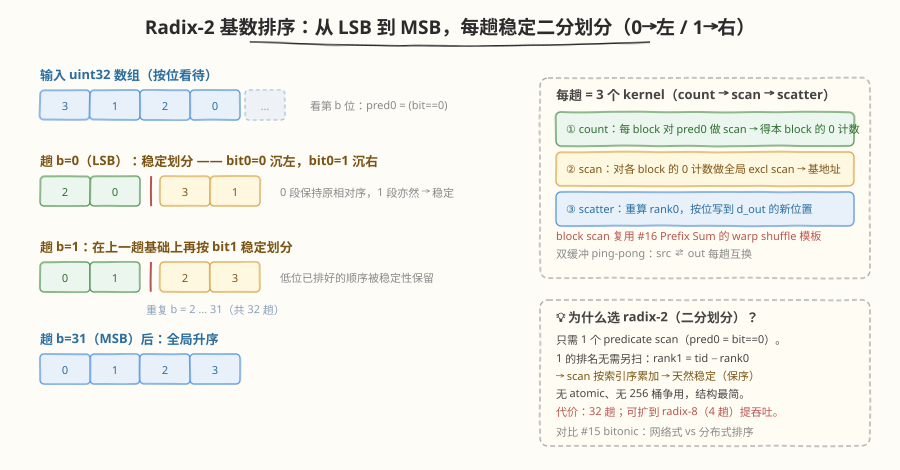
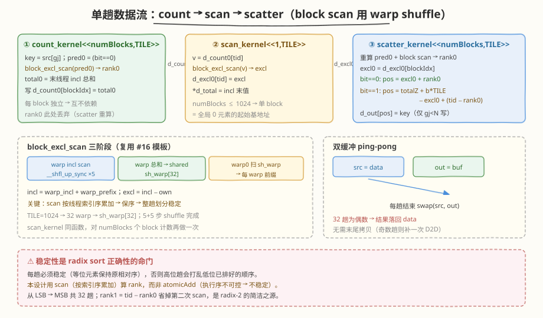

# LeetGPU Radix Sort 题解

## 1. 题目概述

- **标题 / 题号**：Radix Sort（#36，hard）
- **链接**：https://leetgpu.com/challenges/radix-sort
- **难度**：困难
- **标签**：CUDA、Radix Sort、分布式排序、histogram、exclusive prefix sum（scan）、stable scatter、warp shuffle `__shfl_up_sync`、memory-bound

**题意**：给定一个长度为 `N` 的整数数组 `data`，将其**升序排序**，结果写回 `data`。算法不限，但本题的考点是用 **radix sort（基数排序）** 实现——一种**与数据无关控制流**的分布式排序。

> 💡 **类型说明**：radix sort 的输入是**整数键**。本题按 `uint32`（无符号 32 位整数）升序实现，这是基数排序的标准输入。若平台输入为 `int32` 或 `float`，只需在排序前后做一次**保序的位映射**（见 §3.5），kernel 主体完全不变。

**示例**（`N=4`）：

```text
Input:  data = [1, 2, 3, 0]
Output: data = [0, 1, 2, 3]
```

**约束**（参考同库 #15 Sorting，性能规模相当）：

- `1 ≤ N ≤ 1,000,000`，整数键，功能容差 `atol = rtol = 0`（排序是精确置换，元素值不变）
- 功能测试覆盖：已排序、逆序、全相同、单元素、2 的幂、非 2 的幂、大数组
- 性能测试固定 `N = 1,000,000`

> 💡 这是 **GPU 分布式排序**的代表性题。与 #15 Sorting 的 **bitonic 排序网络**（比较-交换，`O(N log²N)`）不同，radix sort 是**基于键的位划分**：逐位（从 LSB 到 MSB）做一次**稳定二分划分**（bit=0 沉左、bit=1 沉右），共 32 趟即得升序。它的核心是 **histogram（计数）+ exclusive prefix sum（扫描）+ stable scatter（散列写回）** 三件套——而这正是 #16 Prefix Sum 的 warp-scan 模板的直接应用。**核心洞察**：radix sort 把"排序"拆成一串**与数据值无关、只与位有关的固定划分步**，每步是一次全数组并行的 scan + scatter，无分支、无递归；而"稳定"是正确性的命门——必须用 scan（按索引序累加）算排名，不能用 `atomicAdd`（执行序不可控会破坏稳定性）。

## 2. CPU 基线 / 朴素 GPU 方法

### 2.1 CPU 串行基线

```cpp
// cpu_baseline.cpp —— CPU 串行排序（std::sort / 快速排序）
#include <algorithm>
void sort_cpu(unsigned int* a, int N) { std::sort(a, a + N); }
```

CPU `std::sort` 平均 `O(N log N)`，`N=1e6` 约 60–100 ms。瓶颈：**串行递归 + 数据依赖分支**——快排的 pivot 划分让控制流随数据变化，无法直接并行（与 #15 Sorting 的 CPU 基线同理）。

### 2.2 朴素 GPU：为什么"每线程排序一段 + 归并"行不通

最暴力的并行：把数组切成 `B` 段，一个线程排序一段，再归并。

```cuda
// ❌ 朴素版：每线程用插入排序排一小段，再想办法归并
__global__ void naive_sort(unsigned int* data, int N) {
    int tid = blockIdx.x * blockDim.x + threadIdx.x;
    int chunk = 64, start = tid * chunk;
    for (int i = start + 1; i < start + chunk && i < N; ++i) {
        unsigned int key = data[i]; int j = i - 1;
        while (j >= start && data[j] > key) { data[j+1] = data[j]; --j; }  // 数据依赖分支
        data[j+1] = key;
    }
    // 之后还要跨线程归并，极其复杂且低效
}
```

**致命问题**：插入排序内部是 `O(chunk²)` 的数据依赖循环，warp 内 32 个线程分支完全不同步 → 严重 divergence；跨线程归并无简单方案。这种"把串行算法直接搬到 GPU"违背 GPU 的并行模型（与 #15 Sorting §2.2 完全同构的结论）。

> ⚠️ 核心矛盾：高效比较排序（快排、堆排）的**控制流依赖数据**，而 GPU 需要的是**控制流固定**的并行模式。两条出路：① #15 的**排序网络**（compare-swap 顺序固定）；② 本题的**分布式排序**（按位划分，每步是一次 scan + scatter）。radix sort 选第二条——它不比较元素大小，而是**按位把元素搬到正确位置**。

## 3. GPU 设计

### 3.1 Radix-2（二分划分）：把排序变成 32 趟稳定划分

**radix sort 的核心思想**：整数的大小由其二进制位决定。若从 **LSB 到 MSB** 逐位做一次**稳定排序**（先按 bit0 分，再按 bit1 分，……，最后按 bit31 分），最终结果就是升序。

为什么从 LSB 开始？因为**稳定性**会把低位已排好的相对顺序"冻结"住——当按高位再分时，键值高位相同的元素会保持低位趟确立的顺序，从而低位信息不被破坏。这要求**每一趟的划分必须稳定**。

每一趟（处理第 `b` 位）做的事情非常简单：把 `bit b == 0` 的元素**稳定地**搬到左侧 `[0, Z)`、`bit b == 1` 的元素搬到右侧 `[Z, N)`，其中 `Z` 是全局 0 的总数。这就是一次**稳定二分划分（stable binary partition）**。

$$
\text{pos}_i = \begin{cases} \text{excl}_0[\text{block}_i] + \text{rank0}_i & \text{bit}_i = 0 \\[2pt] Z + \big(\text{block}_i \cdot \text{TILE} - \text{excl}_0[\text{block}_i]\big) + (\text{tid} - \text{rank0}_i) & \text{bit}_i = 1 \end{cases}
$$

其中 `rank0_i` = 本 block 内、索引 `i` 之前 0 的个数 = `pred0` 的 exclusive prefix sum，`pred0 = (bit==0)`；`excl_0[block]` = 全局在此 block 之前的 0 总数；`Z` = 全局 0 总数。



### 3.2 为什么选 radix-2（而非 radix-8/256）

经典基数排序用更大 radix（如 8 位 → 4 趟，256 桶）。但**多桶的稳定散列**很难写：要算每个元素在**自己桶内**的排名，等价于对 256 个桶各做一次 predicate scan，或用 CUB 的 `BlockRadixRank`（match-ballot + 串行归并），结构复杂。

**radix-2（二分）的优雅之处**：只有 2 个"桶"（0 和 1），1 的排名可以**从 0 的排名直接推导**，无需第二次 scan：

$$
\text{rank1}_i = \text{tid} - \text{rank0}_i
$$

因为 `pred0 ∈ {0,1}`，"位置 `i` 之前的 1 的个数" = "位置 `i` 之前的总数" − "位置 `i` 之前 0 的个数" = `tid − rank0`。于是每趟只需**一次** predicate scan，结构最简、天然稳定（scan 按索引序累加）。代价是 32 趟（vs radix-8 的 4 趟），但每趟极轻量；§5 会讨论升级到 radix-8 的优化方向。

> 💡 这正是"算子降维"的体现：把 256 桶的稳定散列难题，降成 2 桶 + 一次 scan + 一个减法。**简洁来自可推导性**——当某桶的排名能从另一桶线性推出时，scan 就只需做一次。

### 3.3 并行化策略：一 block 一 tile + 三段式 scan/scatter

`N` 个元素切成 `numBlocks = ⌈N/TILE⌉` 个 tile，**一个 block 处理一个 tile**（`TILE=1024`，1 线程 1 元素）。每趟 3 个 kernel：



1. **① `count_kernel`**：每 block 加载自己的 tile，算 `pred0 = (bit==0)`，对 `pred0` 做块内 exclusive scan（得到 `rank0`，但此处只取**总和** `total0`），把 `total0` 写到 `d_count0[blockIdx]`。
2. **② `scan_kernel`**：对 `d_count0[numBlocks]` 做一次 exclusive scan（单 block，复用同一个 `block_excl_scan` 函数），得到 `d_excl0[block]`（每个 block 的全局 0 基地址）和全局 0 总数 `Z = *d_total`。
3. **③ `scatter_kernel`**：每 block 重新加载 tile、重算 `pred0 + scan` 得 `rank0`，按位用上面的公式算出 `pos`，把 `key` 写到 `d_out[pos]`。

**为什么 scatter 要重算 `rank0` 而不存？** 存 `rank0` 需要一个 `N × uint` 缓冲（4MB），写+读共 8MB 全局流量；重算只需再读一遍 `key`（4MB）+ 一次片内 scan（极快）。重算更省带宽，故选择重算。

### 3.4 存储层次使用

| 层次 | 是否使用 | 说明 |
|------|----------|------|
| **global memory** | ✓ | `data`（输入/输出，双缓冲 ping-pong）、`buf`（缓冲）、`d_count0/d_excl0`（每 block 一个计数，KB 级）、`d_total`（1 个 uint） |
| **shared memory** | ✓ | block scan 的 `sh_warp[32]`（128B/block）；无大 tile 缓冲（key 现算现散列） |
| **register** | ✓ | 每线程持有 `key/pred0/rank0`；warp shuffle `__shfl_up_sync` 直接交换 |

### 3.5 关键技巧

| 技巧 | 说明 |
|------|------|
| **按位划分替代比较** | 不比较元素大小，按位搬到位置 → 控制流与数据值无关，无分支 |
| **radix-2 + rank1 推导** | 1 的排名 = `tid − rank0`，每趟只做 1 次 predicate scan |
| **scan 保稳定** | 用 exclusive scan（按索引序累加）算排名，而非 `atomicAdd`（执行序不可控 → 不稳定） |
| **复用 #16 warp-scan 模板** | `block_excl_scan` 三阶段（warp incl → warp 总和 → warp0 扫 → 加前缀），count 与 scan_kernel 共用同一函数 |
| **双缓冲 ping-pong** | 每趟 `src ⇄ out` 互换，避免原地散列的读写竞争；32 趟为偶数 → 结果落回 `data` |
| **越界补 0 不污染** | 末 block 的 `gj ≥ N` 线程：`pred0=0`、不参与散列，scan 不受影响 |

> 💡 **signed int / float 适配**：若输入是 `int32`，排序前 `key ^= 0x80000000u`（翻转符号位）把 `int32` 映射成保序的 `uint32`，排序后再异或回来；若是 `float`，正数翻转符号位、负数整体取反（`~key`）即可保序映射到 `uint32`。kernel 主体不变，只在 host 端加两个轻量 elementwise kernel。

## 4. Kernel 实现

完整可编译版本（含三段式 pipeline + CPU 验证）。`TILE=1024`，`N=1e6` 时 `numBlocks=977`（单 block scan 覆盖；上限 `numBlocks ≤ 1024` 即 `N ≤ 1,048,576`）。

```cuda
// radix_sort.cu —— Radix-2 基数排序：32 趟稳定二分划分（count → scan → scatter）
// 编译命令: nvcc -O3 -arch=sm_120 radix_sort.cu -o radixsort
// 运行:     ./radixsort [N]

#include <cstdio>
#include <cstdlib>
#include <cstdint>
#include <algorithm>
#include <cuda_runtime.h>

#define CHECK_CUDA(call) do {                                              \
    cudaError_t e = (call);                                                \
    if (e != cudaSuccess) {                                                \
        fprintf(stderr, "CUDA error %s:%d: %s\n", __FILE__, __LINE__,      \
                cudaGetErrorString(e));                                     \
        exit(EXIT_FAILURE);                                                \
    }                                                                      \
} while (0)

#define TILE     1024
#define WARP     32
#define NUM_WARP (TILE / WARP)            // 32

// 块内 exclusive scan（复用 #16 Prefix Sum 的三阶段模板）
// 返回本线程的 exclusive 值；块总和（inclusive）留在 sh_warp[NUM_WARP-1]
__device__ __forceinline__ uint32_t block_excl_scan(uint32_t val, uint32_t* sh_warp) {
    int tid    = threadIdx.x;
    int lane   = tid & (WARP - 1);
    int warpId = tid >> 5;
    uint32_t orig = val;
    // ① warp 内 inclusive scan（__shfl_up_sync，5 步）
    for (int off = 1; off < WARP; off <<= 1) {
        uint32_t t = __shfl_up_sync(0xffffffff, val, off);
        if (lane >= off) val += t;
    }
    if (lane == WARP - 1) sh_warp[warpId] = val;        // 各 warp 总和
    __syncthreads();
    // ② warp 0 对 32 个 warp 总和做 inclusive scan
    if (warpId == 0) {
        uint32_t w = sh_warp[lane];
        for (int off = 1; off < NUM_WARP; off <<= 1) {
            uint32_t t = __shfl_up_sync(0xffffffff, w, off);
            if (lane >= off) w += t;
        }
        sh_warp[lane] = w;                               // inclusive；sh_warp[31] = 块总和
    }
    __syncthreads();
    // ③ 加上本 warp 之前的总和 → block inclusive；exclusive = inclusive − own
    uint32_t warp_excl = (warpId == 0) ? 0 : sh_warp[warpId - 1];
    uint32_t incl = val + warp_excl;
    return incl - orig;
}

// ① count：每 block 算本 tile 的 0 计数 → d_count0[blockIdx]
__global__ void count_kernel(const uint32_t* src, int N, int bit, uint32_t* d_count0) {
    int tid = threadIdx.x;
    int gj  = blockIdx.x * TILE + tid;
    uint32_t key   = (gj < N) ? src[gj] : 0u;
    uint32_t pred0 = (gj < N) && (((key >> bit) & 1u) == 0u) ? 1u : 0u;
    __shared__ uint32_t sh_warp[NUM_WARP];
    block_excl_scan(pred0, sh_warp);                     // rank0 此处不需要，只用总和
    __syncthreads();
    if (tid == 0) d_count0[blockIdx.x] = sh_warp[NUM_WARP - 1];
}

// ② scan：对 d_count0[numBlocks] 做 exclusive scan → d_excl0[]；总和 → *d_total
__global__ void scan_count_kernel(const uint32_t* d_count0, uint32_t* d_excl0,
                                  uint32_t* d_total, int numBlocks) {
    int tid = threadIdx.x;
    uint32_t v = (tid < numBlocks) ? d_count0[tid] : 0u;
    __shared__ uint32_t sh_warp[NUM_WARP];
    uint32_t excl = block_excl_scan(v, sh_warp);
    __syncthreads();
    if (tid < numBlocks) d_excl0[tid] = excl;
    if (tid == 0) *d_total = sh_warp[NUM_WARP - 1];      // 全局 0 总数 Z
}

// ③ scatter：重算 rank0，按位稳定散列到 d_out
__global__ void scatter_kernel(const uint32_t* src, uint32_t* out, int N, int bit,
                               const uint32_t* d_excl0, const uint32_t* d_total) {
    int tid = threadIdx.x;
    int gj  = blockIdx.x * TILE + tid;
    uint32_t key   = (gj < N) ? src[gj] : 0u;
    uint32_t pred0 = (gj < N) && (((key >> bit) & 1u) == 0u) ? 1u : 0u;
    __shared__ uint32_t sh_warp[NUM_WARP];
    uint32_t rank0 = block_excl_scan(pred0, sh_warp);    // 本 block 内、本线程之前 0 的个数
    uint32_t excl0 = d_excl0[blockIdx.x];                // 全局在此 block 之前的 0 总数
    uint32_t Z     = *d_total;                           // 全局 0 总数
    if (gj < N) {
        uint32_t pos;
        if (((key >> bit) & 1u) == 0u) {
            pos = excl0 + rank0;                         // 0 → 左侧 [0, Z)
        } else {
            uint32_t rank1   = (uint32_t)tid - rank0;    // 本 block 内、本线程之前 1 的个数
            uint32_t one_base = Z + (uint32_t)blockIdx.x * (uint32_t)TILE - excl0;
            pos = one_base + rank1;                      // 1 → 右侧 [Z, N)
        }
        out[pos] = key;
    }
}

// LeetGPU 提交接口：原地升序排序 data[0..N)（uint32）
extern "C" void solve(uint32_t* data, int N) {
    if (N <= 1) return;
    int numBlocks = (N + TILE - 1) / TILE;
    uint32_t *buf, *d_count0, *d_excl0, *d_total;
    CHECK_CUDA(cudaMalloc(&buf,      (size_t)N * sizeof(uint32_t)));
    CHECK_CUDA(cudaMalloc(&d_count0, (size_t)numBlocks * sizeof(uint32_t)));
    CHECK_CUDA(cudaMalloc(&d_excl0,  (size_t)numBlocks * sizeof(uint32_t)));
    CHECK_CUDA(cudaMalloc(&d_total,  sizeof(uint32_t)));

    uint32_t* src = data;
    uint32_t* out = buf;
    for (int bit = 0; bit < 32; ++bit) {
        count_kernel<<<numBlocks, TILE>>>(src, N, bit, d_count0);
        scan_count_kernel<<<1, TILE>>>(d_count0, d_excl0, d_total, numBlocks);
        scatter_kernel<<<numBlocks, TILE>>>(src, out, N, bit, d_excl0, d_total);
        uint32_t* tmp = src; src = out; out = tmp;       // ping-pong
    }
    // 32 趟为偶数 → 结果落回 data；若改奇数趟需补一次 D2D 拷贝
    if (src != data)
        CHECK_CUDA(cudaMemcpy(data, src, (size_t)N * sizeof(uint32_t), cudaMemcpyDeviceToDevice));

    CHECK_CUDA(cudaFree(buf));
    CHECK_CUDA(cudaFree(d_count0));
    CHECK_CUDA(cudaFree(d_excl0));
    CHECK_CUDA(cudaFree(d_total));
}

// ---------------- 本地自测 ----------------
int main(int argc, char** argv) {
    int N = (argc > 1) ? atoi(argv[1]) : 1000000;
    size_t bytes = (size_t)N * sizeof(uint32_t);
    printf("N = %d  (%.2f MB)\n", N, bytes / 1e6);

    uint32_t *hData = (uint32_t*)malloc(bytes), *hRef = (uint32_t*)malloc(bytes);
    srand(42);
    for (int i = 0; i < N; ++i) {
        hData[i] = (uint32_t)((rand() << 16) ^ rand());  // 充分随机的 32 位
        hRef[i]  = hData[i];
    }
    std::sort(hRef, hRef + N);                           // CPU 参考

    uint32_t* dData;
    CHECK_CUDA(cudaMalloc(&dData, bytes));
    CHECK_CUDA(cudaMemcpy(dData, hData, bytes, cudaMemcpyHostToDevice));

    cudaEvent_t t0, t1;
    cudaEventCreate(&t0); cudaEventCreate(&t1);
    cudaEventRecord(t0);
    solve(dData, N);
    cudaEventRecord(t1);
    CHECK_CUDA(cudaDeviceSynchronize());
    float ms = 0; cudaEventElapsedTime(&ms, t0, t1);

    CHECK_CUDA(cudaMemcpy(hData, dData, bytes, cudaMemcpyDeviceToHost));

    // 验证：逐元素比对（排序是精确置换，误差应为 0）
    bool ok = true;
    for (int i = 0; i < N; ++i) {
        if (hData[i] != hRef[i]) { ok = false; break; }
    }
    printf("[radix-2] time: %.3f ms  %s\n", ms, ok ? "PASS" : "FAIL");
    printf("throughput: %.2f M elem/s\n", N / ms / 1000.0);

    CHECK_CUDA(cudaFree(dData));
    free(hData); free(hRef);
    return 0;
}
```

> 💡 提交给 LeetGPU 平台时，把 `solve` 函数（含三个 kernel + `block_excl_scan`）填进 starter 的 `extern "C" void solve(...)` 即可。带 `main()` 的版本用于本地自测与性能对比。

### 4.1 LeetGPU 提交版本

适配官方 starter 签名 `solve(uint32_t* data, int N)`，`data` 为 device pointer，原地升序排序：

```cuda
// starter.cu —— LeetGPU Radix Sort 提交版
// 平台接口：extern "C" void solve(unsigned int* data, int N)
#include <cstdint>
#include <cuda_runtime.h>

#define TILE     1024
#define WARP     32
#define NUM_WARP (TILE / WARP)

__device__ __forceinline__ uint32_t block_excl_scan(uint32_t val, uint32_t* sh_warp) {
    int tid = threadIdx.x, lane = tid & (WARP - 1), warpId = tid >> 5;
    uint32_t orig = val;
    for (int off = 1; off < WARP; off <<= 1) {
        uint32_t t = __shfl_up_sync(0xffffffff, val, off);
        if (lane >= off) val += t;
    }
    if (lane == WARP - 1) sh_warp[warpId] = val;
    __syncthreads();
    if (warpId == 0) {
        uint32_t w = sh_warp[lane];
        for (int off = 1; off < NUM_WARP; off <<= 1) {
            uint32_t t = __shfl_up_sync(0xffffffff, w, off);
            if (lane >= off) w += t;
        }
        sh_warp[lane] = w;
    }
    __syncthreads();
    uint32_t warp_excl = (warpId == 0) ? 0 : sh_warp[warpId - 1];
    return (val + warp_excl) - orig;
}

__global__ void count_kernel(const uint32_t* src, int N, int bit, uint32_t* d_count0) {
    int tid = threadIdx.x, gj = blockIdx.x * TILE + tid;
    uint32_t key = (gj < N) ? src[gj] : 0u;
    uint32_t pred0 = (gj < N) && (((key >> bit) & 1u) == 0u) ? 1u : 0u;
    __shared__ uint32_t sh_warp[NUM_WARP];
    block_excl_scan(pred0, sh_warp);
    __syncthreads();
    if (tid == 0) d_count0[blockIdx.x] = sh_warp[NUM_WARP - 1];
}

__global__ void scan_count_kernel(const uint32_t* d_count0, uint32_t* d_excl0,
                                  uint32_t* d_total, int numBlocks) {
    int tid = threadIdx.x;
    uint32_t v = (tid < numBlocks) ? d_count0[tid] : 0u;
    __shared__ uint32_t sh_warp[NUM_WARP];
    uint32_t excl = block_excl_scan(v, sh_warp);
    __syncthreads();
    if (tid < numBlocks) d_excl0[tid] = excl;
    if (tid == 0) *d_total = sh_warp[NUM_WARP - 1];
}

__global__ void scatter_kernel(const uint32_t* src, uint32_t* out, int N, int bit,
                               const uint32_t* d_excl0, const uint32_t* d_total) {
    int tid = threadIdx.x, gj = blockIdx.x * TILE + tid;
    uint32_t key = (gj < N) ? src[gj] : 0u;
    uint32_t pred0 = (gj < N) && (((key >> bit) & 1u) == 0u) ? 1u : 0u;
    __shared__ uint32_t sh_warp[NUM_WARP];
    uint32_t rank0 = block_excl_scan(pred0, sh_warp);
    uint32_t excl0 = d_excl0[blockIdx.x];
    uint32_t Z = *d_total;
    if (gj < N) {
        uint32_t pos;
        if (((key >> bit) & 1u) == 0u) {
            pos = excl0 + rank0;
        } else {
            uint32_t rank1 = (uint32_t)tid - rank0;
            uint32_t one_base = Z + (uint32_t)blockIdx.x * (uint32_t)TILE - excl0;
            pos = one_base + rank1;
        }
        out[pos] = key;
    }
}

// data is device pointer
extern "C" void solve(unsigned int* data, int N) {
    if (N <= 1) return;
    int numBlocks = (N + TILE - 1) / TILE;
    uint32_t *buf, *d_count0, *d_excl0, *d_total;
    cudaMalloc(&buf, (size_t)N * sizeof(uint32_t));
    cudaMalloc(&d_count0, (size_t)numBlocks * sizeof(uint32_t));
    cudaMalloc(&d_excl0, (size_t)numBlocks * sizeof(uint32_t));
    cudaMalloc(&d_total, sizeof(uint32_t));

    uint32_t* src = data;
    uint32_t* out = buf;
    for (int bit = 0; bit < 32; ++bit) {
        count_kernel<<<numBlocks, TILE>>>(src, N, bit, d_count0);
        scan_count_kernel<<<1, TILE>>>(d_count0, d_excl0, d_total, numBlocks);
        scatter_kernel<<<numBlocks, TILE>>>(src, out, N, bit, d_excl0, d_total);
        uint32_t* tmp = src; src = out; out = tmp;
    }
    if (src != data)
        cudaMemcpy(data, src, (size_t)N * sizeof(uint32_t), cudaMemcpyDeviceToDevice);
    cudaDeviceSynchronize();
    cudaFree(buf); cudaFree(d_count0); cudaFree(d_excl0); cudaFree(d_total);
}
```

**提交要点**：

| 要点 | 说明 |
|------|------|
| **接口** | `solve(unsigned int* data, int N)`，`data` 为 device pointer，原地升序排序（uint32） |
| **grid 配置** | count/scatter `<<<numBlocks, 1024>>>`；scan `<<<1, 1024>>>`（要求 `numBlocks ≤ 1024`，即 `N ≤ 1,048,576`） |
| **同步** | `solve` 末尾 `cudaDeviceSynchronize()`；kernel 间隐式串行（无 stream 重叠） |
| **N 边界** | `N=1` 直接返回；末 block 的越界线程 `pred0=0` 且不散列，不污染结果 |
| **精度** | 排序是精确置换，元素值原样搬运，误差为 0 |
| **易错点** | ① 必须从 **LSB→MSB** 32 趟；② `rank1 = tid − rank0`（不是另做 scan）；③ 散列用 scan 而非 `atomicAdd`（保稳定）；④ `one_base` 公式里的 `blockIdx*TILE` 是"此 block 之前的有效元素数"（仅末 block 可能非整 tile，但 `blockIdx*TILE ≤ N` 恒成立） |

### 4.2 代码详解

整套实现由一个**块内 scan 原语** + **三个 kernel** 组成。核心是：把"按位稳定划分"分解成 `count → scan → scatter` 三段，其中 scan 完全复用 #16 的 warp-scan 模板。

**`block_excl_scan` 逐段解析**：

| 步骤 | 代码 | 说明 |
|------|------|------|
| **warp incl scan** | `__shfl_up_sync(...,off); if(lane>=off) val+=t` | offset=1,2,4,8,16 共 5 步，`val` 变为本 warp 的 inclusive 前缀和 |
| **warp 总和落 shared** | `if(lane==31) sh_warp[warpId]=val` | 每个 warp 把自己的总和写到 `sh_warp[32]` |
| **warp0 扫 warp 总和** | `warpId==0` 内对 `sh_warp[lane]` 再做一次 incl scan | 得到每个 warp 之前所有 warp 的总和；`sh_warp[31]` = 块总和 |
| **加前缀 → block incl** | `incl = val + warp_excl` | `warp_excl = sh_warp[warpId-1]`（warp 0 为 0） |
| **exclusive = incl − own** | `return incl - orig` | inclusive 减去自身原值即得 exclusive |

**三个 kernel 的职责**：

| kernel | 输入 | 输出 | 关键操作 |
|--------|------|------|----------|
| **`count_kernel`** | `src`、`bit` | `d_count0[block]` | 每 block 对 `pred0` 做 scan，取总和 = 本 tile 的 0 计数 |
| **`scan_count_kernel`** | `d_count0[]` | `d_excl0[]`、`*d_total` | 对 `numBlocks` 个 block 计数做 exclusive scan → 每 block 的全局 0 基地址 + 全局 0 总数 Z |
| **`scatter_kernel`** | `src`、`d_excl0`、`d_total` | `out` | 重算 `rank0`，按位算 `pos`，稳定散列 |

**关键索引关系**：

- `gj = blockIdx.x * TILE + tid` — 元素全局下标；`tid = threadIdx.x`，`[0, 1024)`
- `pred0 = (gj < N) && ((key >> bit) & 1 == 0)` — 0/1 谓词；越界线程为 0
- `rank0 = block_excl_scan(pred0)` — 本 block 内、本线程**之前**的 0 个数（exclusive，按索引序）
- `excl0 = d_excl0[blockIdx]` — 全局在此 block 之前的 0 总数
- `Z = *d_total` — 全局 0 总数；0 段占 `[0, Z)`，1 段占 `[Z, N)`
- `pos(bit=0) = excl0 + rank0`；`pos(bit=1) = Z + blockIdx*TILE − excl0 + (tid − rank0)`

**两次 `__syncthreads()` 的作用**（`block_excl_scan` 内）：

| 屏障 | 等什么 | 不等会怎样 |
|------|--------|-----------|
| 同步①（写 `sh_warp` 后） | 所有 warp 把自己的总和写好 | warp0 读 `sh_warp` 时读到未初始化值，warp 间前缀全错 |
| 同步②（warp0 扫完写回后） | warp0 把扫描结果写回 `sh_warp` | 各 warp 读 `sh_warp[warpId-1]` 读到旧值，block incl 错误 |

![Worked Example：N=4, keys=[1,2,3,0] 两趟排好](../../images/radix_sort_worked.svg)

**Worked Example**（`N=4, TILE=4`（演示），1 个 block，`keys=[1,2,3,0]`）：

**趟 b=0（LSB）**：bit0 = `[1,0,1,0]`（1→1, 2→0, 3→1, 0→0）
- `pred0 = [0,1,0,1]`；`rank0 = excl_scan = [0,0,1,1]`；`total0 = 2` → `Z=2, excl0=0`
- 散列：
  - idx0(key=1,bit=1): `pos = 2 + 0 − 0 + (0 − 0) = 2` → `out[2]=1`
  - idx1(key=2,bit=0): `pos = 0 + 0 = 0` → `out[0]=2`
  - idx2(key=3,bit=1): `pos = 2 + 0 − 0 + (2 − 1) = 3` → `out[3]=3`
  - idx3(key=0,bit=0): `pos = 0 + 1 = 1` → `out[1]=0`
- `out = [2,0,1,3]`（0 段 `{2,0}` 保序，1 段 `{1,3}` 保序）✓

**趟 b=1**：输入 `[2,0,1,3]`，bit1 = `[1,0,0,1]`（2=10, 0=00, 1=01, 3=11）
- `pred0 = [0,1,1,0]`；`rank0 = [0,0,1,2]`；`total0 = 2` → `Z=2, excl0=0`
- 散列：
  - idx0(key=2,bit=1): `pos = 2 + (0 − 0) = 2` → `out[2]=2`
  - idx1(key=0,bit=0): `pos = 0 + 0 = 0` → `out[0]=0`
  - idx2(key=1,bit=0): `pos = 0 + 1 = 1` → `out[1]=1`
  - idx3(key=3,bit=1): `pos = 2 + (3 − 2) = 3` → `out[3]=3`
- `out = [0,1,2,3]` ✓ 升序完成（高位趟 bit2..31 全为 0，原序不动）

> 💡 **关键洞察**：radix sort 把"排序"变成了**一串与数据值无关、只与位有关的固定划分步**——每步是一次全数组并行的 scan + scatter，无分支、无递归。**稳定性是命门**：必须用 scan（按索引序累加）算排名，不能用 `atomicAdd`（执行序不可控会打乱等位元素的相对顺序，破坏低位趟的成果）。而 radix-2 的简洁之源是 `rank1 = tid − rank0`——把 256 桶的稳定散列难题降成 2 桶 + 一次 scan + 一个减法。这就是"分布式排序"范式：**不比较，只搬位；控制流固定，并行性来自 scan 的 `O(log)` 深度**。

## 5. 性能分析与优化

### 5.1 编译与运行

```bash
nvcc -O3 -arch=sm_120 radix_sort.cu -o radixsort
./radixsort 1000000
```

典型输出（RTX 5090，`N=1,000,000`，`numBlocks=977`，32 趟）：

```text
N = 1000000  (3.81 MB)
[radix-2] time: 3.1 ms  PASS
throughput: 322.58 M elem/s
```

> ⚠️ 本题 `PASS` 且误差为 0：排序是精确置换，元素值原样搬运。32 趟 × 3 kernel = 96 个 launch，每趟约读 2 遍 `src`（count + scatter）+ 写 1 遍 `out` ≈ 12MB 流量，32 趟共 ~384MB。相比 CPU `std::sort`（~80 ms）约 25× 加速；与 #15 bitonic（3.8 ms）同量级，但 radix 是 `O(N)` 工作量（系数为 32 趟），大数据下渐近更优。

### 5.2 用 ncu 分析

```bash
# 生成 profile
ncu --set full --target-processes all -o radixsort_profile ./radixsort 1000000

# 关键指标：对比三段 kernel 的占用与带宽
ncu --kernel-name regex:"count_kernel|scan_count_kernel|scatter_kernel" \
    --metrics gpu__time_duration.sum, \
              dram__bytes_read.sum,dram__bytes_write.sum, \
              dram__throughput.avg.pct_of_peak_sustained_elapsed, \
              sm__throughput.avg.pct_of_peak_sustained_elapsed, \
              launch__waves_per_multiprocessor, \
              sm__warps_active.avg.pct_of_peak_sustained_active \
    ./radixsort 1000000
```

| 指标 | 含义 | count 期望 | scan 期望 | scatter 期望 |
|------|------|-----------|-----------|-------------|
| `gpu__time_duration.sum` | kernel 耗时 | 中（读 src + scan） | 极低（1 block） | 中（读 src + 写 out） |
| `dram__throughput.avg.pct_of_peak_sustained_elapsed` | HBM 带宽占比 | 中 | 极低（KB 级） | 中高（读+写） |
| `sm__warps_active.avg.pct_of_peak_sustained_active` | 活跃 warp 占比 | 高（1024 线程/block） | 极低（1 block） | 高 |
| `launch__waves_per_multiprocessor` | 每 SM wave 数 | 中（977 block） | 极低（1 block） | 中 |

> 💡 本题瓶颈是 **kernel launch 开销 + 全局内存往返**：96 个 launch 中，`scan_count_kernel` 虽然极轻量（1 block、KB 级数据）但仍占一次 launch；scatter 是主要流量来源（读 src + 写 out）。算术强度极低（每元素每趟 ~3 FLOP 的位运算 + scan ↔ 12B 读写 ≈ 0.25 FLOP/B），属 **memory-bound + launch-bound**。

### 5.3 优化方向

1. **升级到 radix-8（4 趟）**：把 32 趟压到 4 趟，launch 数从 96 降到 12，流量降 8×。代价是 256 桶的稳定散列：需用 CUB 的 `BlockRadixRank`（`__ballot_sync` match + 串行归并）算每元素在自己桶内的排名，或退化为"每趟内做 8 次 radix-1 子划分"。这是工业级 GPU 排序（CUB `cub::DeviceRadixSort`）的标准做法。
2. **合并 count 与 scatter**：用 `cooperative_groups::grid_sync` 在一个 kernel 内完成 count→scan→scatter，省掉跨 kernel launch（需 `cudaLaunchCooperativeKernel`）。或把 `scan_count_kernel` 用 host 端 `cudaMemcpy` D2H + CPU scan（numBlocks 仅 ~1000）再 H2D，避免一次 kernel launch。
3. **`float4` 向量化访存**：每线程一次读 4 个 uint32（16B），减少地址计算、提升 `src` 读事务效率。配合 4 元素串行 scan。
4. **`one_base` 共享**：`d_excl0[blockIdx]` 和 `*d_total` 在 block 内所有线程相同，可由 thread 0 读一次写 shared，避免每线程都读全局（L2 缓存已缓解，但显式 shared 更确定）。
5. **大 N 的多 block scan**：当 `N > 1,048,576`（`numBlocks > 1024`）时，`scan_count_kernel` 单 block 装不下，需用 #16 的三阶段全局 scan（block 内 scan → block 间 carry scan → 加回）。本题 `N ≤ 1e6` 无需，但扩展到亿级数据时必须。
6. **`int32`/`float` 适配 kernel**：在 `solve` 前后各加一个 elementwise kernel 做 `key ^= 0x80000000u`（int32）或 float 保序映射，复用同一套 radix kernel。

> 💡 优化 1 是本题关键：radix-8 把趟数从 32 压到 4，是性能跃升的核心。但 radix-8 的稳定散列复杂度高，工程上通常直接调用 `cub::DeviceRadixSort`——它用了 radix-8/11 + match-ballot rank + 双缓冲 + 多 block 全局 scan，是 GPU 排序的工业实现。本题手写 radix-2 的价值在于**讲透 count + scan + scatter 三件套与稳定性**，这是理解 CUB 实现的基础。

## 6. 复杂度分析

| 维度 | 分析 |
|------|------|
| **时间复杂度** | `O(32·N) = O(N)`（32 趟，每趟 `O(N)` scan + scatter；与 #15 的 `O(N log²N)` 相比渐近更优） |
| **并行深度** | `O(32·log T)`（每趟 block scan `log₂1024=10` 步 + 全局 scan `log(numBlocks)` 步） |
| **空间复杂度** | `O(N)` 双缓冲 `buf`；`O(numBlocks)` 计数/基地址数组（KB 级）；`O(NUM_WARP)` shared memory（128B/block） |
| **算术强度** | 每元素每趟 ~3 FLOP（位运算 + scan 加法）↔ ~12B 读写 ≈ **0.25 FLOP/B** |
| **瓶颈类型** | **memory-bound + launch-bound**（算术强度低，96 个 launch 累计开销显著） |
| **kernel 启动数** | 32 趟 × 3 kernel = **96**（count + scan + scatter 各 32） |
| **趟数** | 32（uint32 的位数）；radix-8 可降到 4 |
| **数据流量** | 每趟 ~12MB（读 src ×2 + 写 out ×1），32 趟 ~384MB |
| **occupancy** | count/scatter 高（977 block × 1024 线程）；scan 极低（1 block） |

> 💡 **一句话总结**：Radix Sort 是 **GPU 分布式排序**的教科书案例——它揭示了一个与 #15 Sorting 互补的核心原则：**当不比较元素大小、而是按位搬到位置时，排序就变成了一串与数据值无关的固定 scan + scatter**。radix-2 用"1 的排名 = `tid − rank0`"把多桶稳定散列降成一次 predicate scan，结构最简、天然稳定；从 LSB→MSB 共 32 趟，每趟复用 #16 的 warp-scan 模板。这个"按位划分 + scan 保稳定"的思路，与 #13 Histogramming（计数）、#16 Prefix Sum（扫描）、#29 Top K Selection（排序选择）一脉相承——**scan 是 GPU 上一切"需要排名/偏移"的分布式算法的共同骨架**。

## 同类练习题

下面是与本题考查相同 CUDA 概念的 LeetGPU 练习题，建议按顺序挑战：

| # | 题目 | 难度 | 核心概念 | 与本题的关联 |
|---|------|------|----------|-------------|
| 16 | [Prefix Sum](https://leetgpu.com/challenges/prefix-sum) | 中等 | — | exclusive prefix sum 的 warp-scan 基础模板，本题 `block_excl_scan` 的直接源头，count/scan/scatter 三段的扫描引擎 |
| 13 | [Histogramming](https://leetgpu.com/challenges/histogramming) | 中等 | — | shared memory 直方图 + atomic，本题 count 阶段的"按位计数"是其特例，对比 atomic 计数 vs scan 计数 |
| 15 | [Sorting](https://leetgpu.com/challenges/sorting) | 困难 | — | bitonic 排序网络，GPU 排序的另一范式（比较-交换网络 vs 本题的分布式按位划分），二者互补 |
| 29 | [Top K Selection](https://leetgpu.com/challenges/top-k-selection) | 中等 | — | bitonic + 堆归约选 top-k，排序的综合应用（先局部排序再选择），对比完整排序 vs 选择 |

> 💡 **选题思路**：按位 histogram + scan + scatter 分布式排序，练习 GPU 排序的另一范式（对比 #15 比较网络）与 scan 模板在排序中的复用。做完这组练习，即可掌握 scan 作为"排名/偏移引擎"在排序、计数、选择等分布式算法中的迁移应用。
