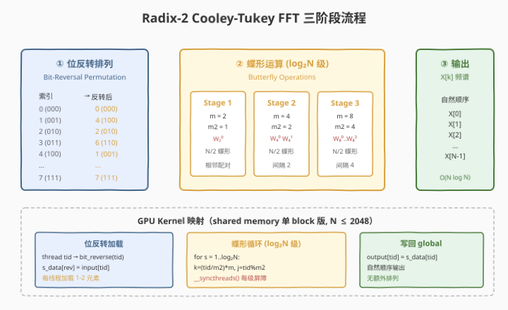
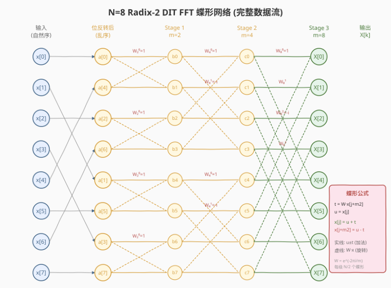
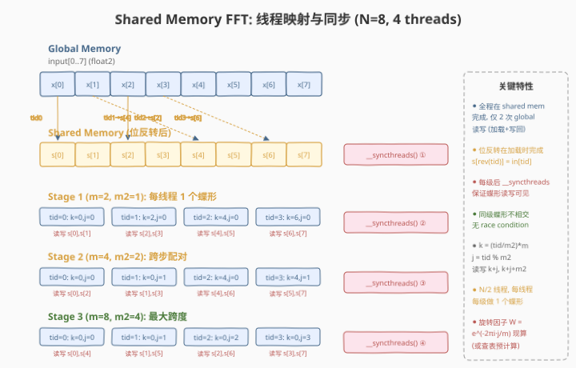

# LeetGPU Fast Fourier Transform 题解

## 1. 题目概述

- **标题 / 题号**：Fast Fourier Transform（#39，hard）
- **链接**：https://leetgpu.com/challenges/fast-fourier-transform
- **难度**：困难
- **标签**：CUDA、FFT、radix-2、Cooley-Tukey、蝶形运算（butterfly）、位反转（bit-reversal）、shared memory、twiddle factor、compute-bound

**题意**：给定长度为 $N$（$N$ 为 2 的幂）的复数信号（以交错实/虚部的一维 `float32` 数组存储），计算其 **一维离散傅里叶变换（1D DFT）**，要求使用 **radix-2 Cooley-Tukey FFT** 算法，将朴素 DFT 的 $O(N^2)$ 复杂度降为 $O(N \log N)$。

**数据布局**：元素 $x[n]$ 的实部在索引 $2n$，虚部在 $2n+1$。

**数学定义**：

$$X[k] = \sum_{n=0}^{N-1} x[n] \cdot W_N^{kn}, \quad W_N = e^{-2\pi i / N}$$

**radix-2 分治**：将长度 $N$ 的 DFT 拆为两个长度 $N/2$ 的 DFT（偶数项 + 奇数项），递归 $\log_2 N$ 层：

$$X[k] = E[k] + W_N^k \cdot O[k], \quad X[k + N/2] = E[k] - W_N^k \cdot O[k]$$

其中 $E[k]$ 为偶数子序列 DFT，$O[k]$ 为奇数子序列 DFT。这就是 **蝶形运算（butterfly）** 的来源——每层将两个值组合为两个新值。

**示例**（$N=4$， impulse 信号 $x = [1, 0, 0, 0]$）：

```text
输入 signal (real/imag 交错): [1,0, 0,0, 0,0, 0,0]
  → 位反转排列 → [1,0, 0,0, 0,0, 0,0]  (N=4 时恰好不变)
  → Stage 1 (m=2) → [1,0, 1,0, 0,0, 0,0]
  → Stage 2 (m=4) → [1,0, 1,0, 1,0, 1,0]
输出 spectrum (real/imag 交错): [1,0, 1,0, 1,0, 1,0]
  即 X = [1, 1, 1, 1] (impulse 的 DFT 为全 1)
```

**约束**：

- $N = 2^k$，$k \ge 1$，$N \le 2^{20}$（约 100 万点）
- `float32`，容差 `atol = rtol = 0.01`
- 性能测试取 $N = 2^{20}$

> 💡 FFT 是信号处理的「皇冠算法」。朴素 DFT 是 $O(N^2)$ 的矩阵-向量乘（$X = W \cdot x$），而 Cooley-Tukey FFT 利用 $W_N$ 的周期性和对称性，通过 $\log_2 N$ 层蝶形运算将复杂度降为 $O(N \log N)$——对 $N = 2^{20}$，这是 $10^{12}$ → $2 \times 10^7$ 次 MAC，**5 万倍加速**。GPU 上的 FFT 天然并行：每层有 $N/2$ 个独立蝶形，层间用 `__syncthreads` 屏障同步。

## 2. CPU 基线 / 朴素 GPU 方法

### 2.1 CPU 串行基线

```cpp
// cpu_baseline.cpp —— CPU 串行 1D DFT（朴素 O(N²)）
void dft_cpu(const float* in, float* out, int N) {
    for (int k = 0; k < N; k++) {
        float sum_re = 0.0f, sum_im = 0.0f;
        for (int n = 0; n < N; n++) {
            float angle = -2.0f * 3.14159265f * k * n / N;
            float w_re = cosf(angle), w_im = sinf(angle);
            sum_re += in[2*n]   * w_re - in[2*n+1] * w_im;
            sum_im += in[2*n]   * w_im + in[2*n+1] * w_re;
        }
        out[2*k]   = sum_re;
        out[2*k+1] = sum_im;
    }
}
```

$N = 2^{20}$ 时，朴素 DFT 需 $N^2 \approx 10^{12}$ 次复数乘加，CPU 单核需数小时。即使 CPU 也用 FFT（$O(N \log N) \approx 2 \times 10^7$），单核仍需数百毫秒。

### 2.2 朴素 GPU：每线程一个输出（朴素 DFT）

最暴力的并行：每线程计算一个输出 $X[k]$，直接从 global memory 读整个数组。

```cuda
__global__ void dft_naive(const float* in, float* out, int N) {
    int k = blockIdx.x * blockDim.x + threadIdx.x;
    if (k >= N) return;
    float sum_re = 0, sum_im = 0;
    for (int n = 0; n < N; n++) {
        float angle = -2.0f * 3.14159265f * k * n / N;
        float w_re, w_im; sincosf(angle, &w_im, &w_re);
        sum_re += in[2*n]   * w_re - in[2*n+1] * w_im;
        sum_im += in[2*n]   * w_im + in[2*n+1] * w_re;
    }
    out[2*k]   = sum_re;
    out[2*k+1] = sum_im;
}
```

**瓶颈**：
1. **$O(N^2)$ 复杂度**：$N = 2^{20}$ 时 $10^{12}$ 次 MAC，即使 GPU 也需数十秒
2. **每线程重读整个数组**：$N$ 个线程各读 $N$ 个元素 → 带宽浪费 $N$ 倍
3. **$N^2$ 次 `sincosf` 调用**：每次 ~30 周期，极慢

> ⚠️ 朴素 DFT 的核心问题是 **算法复杂度**——不是并行化能解决的。必须从 $O(N^2)$ 降到 $O(N \log N)$，这就是 FFT 的价值。

## 3. GPU 设计

### 3.1 并行化策略：蝶形网络 + 分层同步



FFT 的 Cooley-Tukey DIT（Decimation In Time）算法分三步：

| 步骤 | 操作 | 并行度 | 说明 |
|------|------|--------|------|
| **① 位反转排列** | $x[n] \to a[\text{rev}(n)]$ | $N$ 线程 | 将输入按二进制位反转重排，使递归展开后输出为自然顺序 |
| **② 蝶形运算** | $\log_2 N$ 级，每级 $N/2$ 个蝶形 | $N/2$ 线程/级 | 每级蝶形互不相交，级间需同步 |
| **③ 写回** | $a[n] \to X[n]$ | $N$ 线程 | 自然顺序输出，无需额外排列 |

**两种实现路径**：

| 路径 | 适用场景 | 核心思路 | 同步方式 |
|------|----------|----------|----------|
| **shared memory 单 block** | $N \le 2048$ | 整个 FFT 在一个 block 的 shared memory 中完成 | `__syncthreads()` |
| **global memory 多 kernel** | $N > 2048$ | 每级蝶形一个 kernel launch，数据在 global memory | kernel launch 隐式同步 |

> 💡 shared memory 版本是「教科书 FFT」——一个 block 拿下整个 FFT，所有蝶形在片上完成，仅 2 次 global 读写（加载 + 写回）。对 $N \le 2048$ 性能最优。大 $N$ 需用多 kernel 版本或 Stockham / 六步法。

### 3.2 存储层次使用

| 层次 | 用途 | 大小（$N$ 点 FFT） | 说明 |
|------|------|---------------------|------|
| **global memory** | `signal`（输入）、`spectrum`（输出） | $2N \times 4\text{B}$ | shared 版本仅读 1 次 + 写 1 次；global 版本每级读写 1 次 |
| **shared memory** | `s_data`（蝶形运算的片上缓冲） | $N \times 8\text{B}$（float2） | 单 block 版本核心：所有蝶形在 shared 中 in-place 完成 |
| **register** | `w_re`、`w_im`（旋转因子）、`t`、`u`（蝶形临时变量） | — | 每线程持有一个蝶形的局部状态 |

**shared memory 布局**（$N$ 点）：

```
s_data[0 .. N-1]    ← float2 数组（复数），位反转加载后在此完成所有蝶形
```

$N = 2048$：$2048 \times 8 = 16\text{KB}$（默认 48KB shared memory 内）。$N = 4096$：$32\text{KB}$，需 `cudaFuncSetAttribute` opt-in。

### 3.3 关键技巧：位反转 + 蝶形索引 + 旋转因子

#### 位反转排列（Bit-Reversal Permutation）

DIT-FFT 递归将偶数索引放左半、奇数索引放右半，递归展开后输入需按位反转排列。例如 $N=8$（3 位）：

| 原索引 | 二进制 | 反转 | 新位置 |
|--------|--------|------|--------|
| 0 | 000 | 000 | 0 |
| 1 | 001 | 100 | 4 |
| 2 | 010 | 010 | 2 |
| 3 | 011 | 110 | 6 |
| 4 | 100 | 001 | 1 |
| 5 | 101 | 101 | 5 |
| 6 | 110 | 011 | 3 |
| 7 | 111 | 111 | 7 |

> 💡 **位反转在加载时完成**：`s_data[bit_reverse(tid)] = input[tid]`，不额外占用一次 kernel launch 或 global 读写。

#### 蝶形索引计算

第 $s$ 级（$s = 1, 2, \ldots, \log_2 N$）：

- $m = 2^s$（当前 DFT 大小）
- $m2 = m / 2$（半大小，即蝶形跨度）
- 蝶形 $i$（$i = 0, \ldots, N/2 - 1$）操作的两个位置：

$$k = \lfloor i / m2 \rfloor \cdot m, \quad j = i \bmod m2$$

读写位置：$s\_data[k + j]$ 和 $s\_data[k + j + m2]$。

**同级蝶形不相交**：每级 $N/2$ 个蝶形恰好覆盖所有 $N$ 个元素，无 race condition，仅需级间 `__syncthreads()`。

#### 旋转因子（Twiddle Factor）

蝶形运算的旋转因子 $W_m^j = e^{-2\pi i \cdot j / m}$：

$$t = W_m^j \cdot s\_data[k + j + m2]$$
$$s\_data[k + j] \leftarrow u + t, \quad s\_data[k + j + m2] \leftarrow u - t$$

其中 $u = s\_data[k + j]$。旋转因子可以：
1. **现算**：`sincosf(-2π * j / m, &w_im, &w_re)` —— 简单但每蝶形一次三角函数
2. **预计算查表**：在 shared memory 预计算 $N/2$ 个旋转因子 $W_N^0, \ldots, W_N^{N/2-1}$，各级通过 $W_m^j = W_N^{j \cdot N/m}$ 索引 —— 消除内层三角函数



## 4. Kernel 实现

### 4.1 LeetGPU 提交版本

```cuda
// starter.cu —— LeetGPU 1D FFT 提交版
// 平台接口：extern "C" void solve(const float* signal, float* spectrum, int N)
// signal/spectrum 是 device pointer，存储交错 real/imag，长度 2N（N 个复数）
// N 为 2 的幂

#include <cuda_runtime.h>

#define BLOCK_SIZE 1024

// ============================================================
// 位反转：将 log_n 位整数 x 的二进制位反转
// ============================================================
__device__ __forceinline__ int bit_reverse(int x, int log_n) {
    int r = 0;
    for (int i = 0; i < log_n; i++) {
        r = (r << 1) | (x & 1);
        x >>= 1;
    }
    return r;
}

// ============================================================
// shared memory 单 block FFT kernel（N ≤ 2048）
//   一个 block 完成一个 N 点 FFT，全程在 shared memory 中
//   需要 N/2 个线程（每线程每级做 1 个蝶形）
// ============================================================
__global__ void fft_shared_kernel(
    const float* __restrict__ input,
    float* __restrict__ output,
    int N,
    int log_n)
{
    extern __shared__ float s_real[];
    float* s_imag = s_real + N;

    int tid = threadIdx.x;
    int N2 = N / 2;

    // ---- ① 位反转加载 ----
    // 每线程加载 2 个复数（tid 和 tid+N2）
    for (int idx = tid; idx < N; idx += blockDim.x) {
        int rev = bit_reverse(idx, log_n);
        s_real[rev] = input[2 * idx];
        s_imag[rev] = input[2 * idx + 1];
    }
    __syncthreads();

    // ---- ② 蝶形运算：log₂N 级 ----
    for (int s = 1; s <= log_n; s++) {
        int m  = 1 << s;      // 当前 DFT 大小
        int m2 = m >> 1;      // 蝶形跨度

        // 每线程做一个蝶形（grid-stride 覆盖 N/2 个蝶形）
        for (int i = tid; i < N2; i += blockDim.x) {
            int k = (i / m2) * m;   // 蝶形组起始
            int j = i % m2;          // 组内偏移

            // 旋转因子 W_m^j = exp(-2πi·j/m)
            float angle = -2.0f * 3.14159265f * (float)j / (float)m;
            float w_re, w_im;
            sincosf(angle, &w_im, &w_re);

            // 蝶形：t = W · a[k+j+m2],  u = a[k+j]
            float t_re = w_re * s_real[k + j + m2] - w_im * s_imag[k + j + m2];
            float t_im = w_re * s_imag[k + j + m2] + w_im * s_real[k + j + m2];
            float u_re = s_real[k + j];
            float u_im = s_imag[k + j];

            // 写回
            s_real[k + j]        = u_re + t_re;
            s_imag[k + j]        = u_im + t_im;
            s_real[k + j + m2]   = u_re - t_re;
            s_imag[k + j + m2]   = u_im - t_im;
        }
        __syncthreads();
    }

    // ---- ③ 写回 global（自然顺序）----
    for (int idx = tid; idx < N; idx += blockDim.x) {
        output[2 * idx]     = s_real[idx];
        output[2 * idx + 1] = s_imag[idx];
    }
}

// ============================================================
// global memory 位反转 kernel（大 N 用）
// ============================================================
__global__ void bit_reverse_kernel(
    const float* __restrict__ input,
    float* __restrict__ output,
    int N,
    int log_n)
{
    int i = blockIdx.x * blockDim.x + threadIdx.x;
    if (i >= N) return;
    int rev = bit_reverse(i, log_n);
    output[2 * i]     = input[2 * rev];
    output[2 * i + 1] = input[2 * rev + 1];
}

// ============================================================
// global memory 蝶形 kernel（大 N 用，每级一次 launch）
//   m:  当前级 DFT 大小
//   m2: 蝶形跨度
// ============================================================
__global__ void fft_global_kernel(
    float* __restrict__ data,
    int N,
    int m,
    int m2)
{
    int i = blockIdx.x * blockDim.x + threadIdx.x;
    int N2 = N / 2;
    if (i >= N2) return;

    int k = (i / m2) * m;
    int j = i % m2;

    float angle = -2.0f * 3.14159265f * (float)j / (float)m;
    float w_re, w_im;
    sincosf(angle, &w_im, &w_re);

    int idx1 = k + j;
    int idx2 = k + j + m2;

    float t_re = w_re * data[2 * idx2] - w_im * data[2 * idx2 + 1];
    float t_im = w_re * data[2 * idx2 + 1] + w_im * data[2 * idx2];
    float u_re = data[2 * idx1];
    float u_im = data[2 * idx1 + 1];

    data[2 * idx1]     = u_re + t_re;
    data[2 * idx1 + 1] = u_im + t_im;
    data[2 * idx2]     = u_re - t_re;
    data[2 * idx2 + 1] = u_im - t_im;
}

// ============================================================
// solve: 自动选择 shared / global 路径
// ============================================================
extern "C" void solve(const float* signal, float* spectrum, int N) {
    if (N <= 1) {
        if (N == 1) {
            cudaMemcpy(spectrum, signal, 2 * sizeof(float), cudaMemcpyDeviceToDevice);
        }
        return;
    }

    int log_n = 0;
    int tmp = N;
    while (tmp > 1) { log_n++; tmp >>= 1; }

    // shared memory 单 block 版本（N ≤ 2048，需 N/2 ≤ 1024 线程）
    if (N <= 2048) {
        int threads = N / 2;
        if (threads < 32) threads = 32;
        size_t smem = 2 * (size_t)N * sizeof(float);
        if (smem > 48 * 1024) {
            cudaFuncSetAttribute(fft_shared_kernel,
                cudaFuncAttributeMaxDynamicSharedMemorySize, smem);
        }
        fft_shared_kernel<<<1, threads, smem>>>(
            signal, spectrum, N, log_n);
    } else {
        // global memory 多 kernel 版本
        int threads = 256;
        int blocks = (N + threads - 1) / threads;

        // 位反转：signal → spectrum
        bit_reverse_kernel<<<blocks, threads>>>(signal, spectrum, N, log_n);

        // 蝶形级：in-place 在 spectrum 上操作
        int N2_blocks = (N / 2 + threads - 1) / threads;
        for (int s = 1; s <= log_n; s++) {
            int m = 1 << s;
            int m2 = m >> 1;
            fft_global_kernel<<<N2_blocks, threads>>>(spectrum, N, m, m2);
        }
    }
}
```

**提交要点**：

| 要点 | 说明 |
|------|------|
| **接口** | `extern "C" void solve(const float* signal, float* spectrum, int N)` |
| **双路径** | $N \le 2048$ 走 shared memory 单 block；$N > 2048$ 走 global memory 多 kernel |
| **位反转** | shared 版本在加载时完成；global 版本单独 kernel |
| **同步** | shared 版本用 `__syncthreads()`；global 版本用 kernel launch 隐式同步 |
| **精度** | `sincosf` 现算旋转因子，误差远小于 `atol=0.01` |

### 4.2 代码详解

本 kernel 的核心策略是 **位反转加载 + shared memory 蝶形网络 + 级间 `__syncthreads` 屏障**，把 $O(N \log N)$ 个蝶形运算全部在片上 shared memory 完成，仅 2 次 global 读写。

| 步骤 | 代码 | 说明 |
|------|------|------|
| **① 位反转加载** | `s_real[rev] = input[2*idx]; s_imag[rev] = input[2*idx+1]` | 每线程协作加载，目标位置为 `bit_reverse(idx)`。将输入重排为 DIT-FFT 所需的位反转顺序，后续蝶形直接输出自然顺序 |
| **同步①** | `__syncthreads()` | 确保所有 shared memory 写入可见后才开始蝶形。缺失会读到未初始化数据 |
| **② 蝶形循环** | `for (s = 1; s <= log_n; s++)` | $\log_2 N$ 级蝶形，每级 $m = 2^s$ 为当前 DFT 大小 |
| **索引计算** | `k = (i/m2)*m; j = i%m2` | 蝶形 $i$ 操作 `s_data[k+j]` 和 `s_data[k+j+m2]`。同级蝶形不相交 |
| **旋转因子** | `sincosf(-2π·j/m, &w_im, &w_re)` | 现算 $W_m^j = e^{-2\pi i j/m}$。可优化为预计算查表 |
| **蝶形运算** | `t = W·a[k+j+m2]; a[k+j] = u+t; a[k+j+m2] = u-t` | 复数乘法 + 加减法，in-place 更新 shared memory |
| **同步②** | `__syncthreads()`（每级末尾） | 确保当前级所有蝶形写入完成后，下一级才能读取。这是 FFT 正确性的关键——**每级蝶形依赖上一级的全部结果** |
| **③ 写回** | `output[2*idx] = s_real[idx]` | 自然顺序写回 global memory，无需额外排列 |

**关键索引关系**：

| 变量 | 公式 | 含义 |
|------|------|------|
| `log_n` | $\log_2 N$ | FFT 总级数 |
| `rev` | `bit_reverse(idx, log_n)` | 位反转后的索引，用于加载时重排 |
| `m` | $2^s$ | 第 $s$ 级的 DFT 大小 |
| `m2` | $m / 2$ | 蝶形跨度（两个操作位置的距离） |
| `k` | $\lfloor i / m2 \rfloor \cdot m$ | 蝶形组起始索引 |
| `j` | $i \bmod m2$ | 组内偏移（决定旋转因子 $W_m^j$） |
| `idx1` | $k + j$ | 蝶形的「上翅」位置 |
| `idx2` | $k + j + m2$ | 蝶形的「下翅」位置 |



**Worked Example**（$N = 8$，4 线程，Stage 2 即 $m=4, m2=2$）：

| 线程 | $i$ | $k = (i/2) \times 4$ | $j = i \% 2$ | 读写位置 | 旋转因子 |
|------|-----|----------------------|---------------|----------|----------|
| tid=0 | 0 | 0 | 0 | s[0], s[2] | $W_4^0 = 1$ |
| tid=1 | 1 | 0 | 1 | s[1], s[3] | $W_4^1 = -i$ |
| tid=2 | 2 | 4 | 0 | s[4], s[6] | $W_4^0 = 1$ |
| tid=3 | 3 | 4 | 1 | s[5], s[7] | $W_4^1 = -i$ |

验证：4 个蝶形覆盖 $\{0,2\}, \{1,3\}, \{4,6\}, \{5,7\}$——全部 8 个元素各被访问一次，无冲突 ✓

**同步语义详解**：

| 同步点 | 等什么 | 不等会怎样 |
|--------|--------|-----------|
| `__syncthreads()` ① | 位反转加载完成 | 蝶形读到未初始化的 shared memory → 结果错误 |
| `__syncthreads()` ②（每级） | 当前级所有蝶形写回 | 下一级读到上一级未完成的旧数据 → 蝶形组合错误 |
| 无需同步（同级内） | — | 同级蝶形不相交，天然无 race |

> 💡 **关键洞察**：FFT 蝶形网络的并行性在于**同级蝶形互不相交**——每级的 $N/2$ 个蝶形恰好将 $N$ 个元素两两配对，无重叠。这使得同一级内所有蝶形可完全并行（一个蝶形一个线程），仅需在级间用 `__syncthreads()` 屏障。这与 Prefix Sum 的蝶形扫描结构完全同构——都是 $\log N$ 层全数组并行的两两组合，区别仅在组合运算（FFT 是复数乘加，scan 是加法）。

### 4.3 完整可编译代码（含 Host 验证）

```cuda
// fft.cu —— 1D Radix-2 Cooley-Tukey FFT (shared memory + global memory)
// 编译命令: nvcc -O3 -arch=sm_75 fft.cu -o fft
// 运行:     ./fft 1024        # shared memory 版本 (N ≤ 2048)
//           ./fft 1048576     # global memory 版本 (大 N)

#include <cstdio>
#include <cstdlib>
#include <cmath>
#include <cuda_runtime.h>

#define CHECK_CUDA(call) do { \
    cudaError_t e = (call); \
    if (e != cudaSuccess) { \
        fprintf(stderr, "CUDA error %s:%d: %s\n", __FILE__, __LINE__, cudaGetErrorString(e)); \
        exit(EXIT_FAILURE); \
    } \
} while (0)

#define BLOCK_SIZE 1024

// ---- 位反转 ----
__device__ __forceinline__ int bit_reverse(int x, int log_n) {
    int r = 0;
    for (int i = 0; i < log_n; i++) {
        r = (r << 1) | (x & 1);
        x >>= 1;
    }
    return r;
}

// ---- shared memory 单 block FFT ----
__global__ void fft_shared_kernel(
    const float* __restrict__ input,
    float* __restrict__ output,
    int N,
    int log_n)
{
    extern __shared__ float s_real[];
    float* s_imag = s_real + N;

    int tid = threadIdx.x;
    int N2 = N / 2;

    for (int idx = tid; idx < N; idx += blockDim.x) {
        int rev = bit_reverse(idx, log_n);
        s_real[rev] = input[2 * idx];
        s_imag[rev] = input[2 * idx + 1];
    }
    __syncthreads();

    for (int s = 1; s <= log_n; s++) {
        int m  = 1 << s;
        int m2 = m >> 1;

        for (int i = tid; i < N2; i += blockDim.x) {
            int k = (i / m2) * m;
            int j = i % m2;

            float angle = -2.0f * 3.14159265f * (float)j / (float)m;
            float w_re, w_im;
            sincosf(angle, &w_im, &w_re);

            float t_re = w_re * s_real[k + j + m2] - w_im * s_imag[k + j + m2];
            float t_im = w_re * s_imag[k + j + m2] + w_im * s_real[k + j + m2];
            float u_re = s_real[k + j];
            float u_im = s_imag[k + j];

            s_real[k + j]      = u_re + t_re;
            s_imag[k + j]      = u_im + t_im;
            s_real[k + j + m2] = u_re - t_re;
            s_imag[k + j + m2] = u_im - t_im;
        }
        __syncthreads();
    }

    for (int idx = tid; idx < N; idx += blockDim.x) {
        output[2 * idx]     = s_real[idx];
        output[2 * idx + 1] = s_imag[idx];
    }
}

// ---- global memory 位反转 ----
__global__ void bit_reverse_kernel(
    const float* __restrict__ input,
    float* __restrict__ output,
    int N,
    int log_n)
{
    int i = blockIdx.x * blockDim.x + threadIdx.x;
    if (i >= N) return;
    int rev = bit_reverse(i, log_n);
    output[2 * i]     = input[2 * rev];
    output[2 * i + 1] = input[2 * rev + 1];
}

// ---- global memory 蝶形 ----
__global__ void fft_global_kernel(
    float* __restrict__ data,
    int N,
    int m,
    int m2)
{
    int i = blockIdx.x * blockDim.x + threadIdx.x;
    int N2 = N / 2;
    if (i >= N2) return;

    int k = (i / m2) * m;
    int j = i % m2;

    float angle = -2.0f * 3.14159265f * (float)j / (float)m;
    float w_re, w_im;
    sincosf(angle, &w_im, &w_re);

    int idx1 = k + j;
    int idx2 = k + j + m2;

    float t_re = w_re * data[2 * idx2] - w_im * data[2 * idx2 + 1];
    float t_im = w_re * data[2 * idx2 + 1] + w_im * data[2 * idx2];
    float u_re = data[2 * idx1];
    float u_im = data[2 * idx1 + 1];

    data[2 * idx1]     = u_re + t_re;
    data[2 * idx1 + 1] = u_im + t_im;
    data[2 * idx2]     = u_re - t_re;
    data[2 * idx2 + 1] = u_im - t_im;
}

// ---- solve 封装 ----
void solve_gpu(const float* d_signal, float* d_spectrum, int N) {
    if (N <= 1) {
        if (N == 1)
            cudaMemcpy(d_spectrum, d_signal, 2 * sizeof(float), cudaMemcpyDeviceToDevice);
        return;
    }

    int log_n = 0, tmp = N;
    while (tmp > 1) { log_n++; tmp >>= 1; }

    if (N <= 2048) {
        int threads = N / 2;
        if (threads < 32) threads = 32;
        size_t smem = 2 * (size_t)N * sizeof(float);
        if (smem > 48 * 1024) {
            cudaFuncSetAttribute(fft_shared_kernel,
                cudaFuncAttributeMaxDynamicSharedMemorySize, smem);
        }
        fft_shared_kernel<<<1, threads, smem>>>(d_signal, d_spectrum, N, log_n);
    } else {
        int threads = 256;
        int blocks = (N + threads - 1) / threads;
        bit_reverse_kernel<<<blocks, threads>>>(d_signal, d_spectrum, N, log_n);

        int N2_blocks = (N / 2 + threads - 1) / threads;
        for (int s = 1; s <= log_n; s++) {
            int m = 1 << s;
            int m2 = m >> 1;
            fft_global_kernel<<<N2_blocks, threads>>>(d_spectrum, N, m, m2);
        }
    }
}

// ---- CPU 参考（朴素 DFT）----
void dft_cpu(const float* in, float* out, int N) {
    for (int k = 0; k < N; k++) {
        float sr = 0.0f, si = 0.0f;
        for (int n = 0; n < N; n++) {
            float ang = -2.0f * 3.14159265358979f * k * n / N;
            float wr = cosf(ang), wi = sinf(ang);
            sr += in[2*n] * wr - in[2*n+1] * wi;
            si += in[2*n] * wi + in[2*n+1] * wr;
        }
        out[2*k] = sr; out[2*k+1] = si;
    }
}

int main(int argc, char** argv) {
    int N = (argc > 1) ? atoi(argv[1]) : 1024;
    // 确保 N 是 2 的幂
    int log_n = 0, tmp = N;
    while (tmp > 1) { log_n++; tmp >>= 1; }
    N = 1 << log_n;

    size_t bytes = (size_t)N * 2 * sizeof(float);
    printf("N = %d (2^%d), %.2f MB\n", N, log_n, bytes / 1e6);

    float* h_signal  = (float*)malloc(bytes);
    float* h_spectrum = (float*)malloc(bytes);
    srand(42);
    for (size_t i = 0; i < (size_t)N * 2; i++)
        h_signal[i] = ((float)(rand() % 20000) - 10000.0f) / 1000.0f;

    float *d_signal, *d_spectrum;
    CHECK_CUDA(cudaMalloc(&d_signal, bytes));
    CHECK_CUDA(cudaMalloc(&d_spectrum, bytes));
    CHECK_CUDA(cudaMemcpy(d_signal, h_signal, bytes, cudaMemcpyHostToDevice));

    cudaEvent_t t0, t1;
    cudaEventCreate(&t0); cudaEventCreate(&t1);
    cudaEventRecord(t0);
    solve_gpu(d_signal, d_spectrum, N);
    cudaEventRecord(t1);
    CHECK_CUDA(cudaDeviceSynchronize());
    float ms = 0;
    cudaEventElapsedTime(&ms, t0, t1);
    printf("GPU FFT time: %.3f ms\n", ms);

    CHECK_CUDA(cudaMemcpy(h_spectrum, d_spectrum, bytes, cudaMemcpyDeviceToHost));

    // 验证（小尺寸用 CPU DFT 全量比对）
    if (N <= 2048) {
        float* h_ref = (float*)malloc(bytes);
        dft_cpu(h_signal, h_ref, N);
        int fail = 0;
        for (int i = 0; i < N; i++) {
            float err_re = fabsf(h_spectrum[2*i]   - h_ref[2*i]);
            float err_im = fabsf(h_spectrum[2*i+1] - h_ref[2*i+1]);
            float tol = 0.01f * (1.0f + fabsf(h_ref[2*i]) + fabsf(h_ref[2*i+1]));
            if (err_re > tol || err_im > tol) {
                printf("FAIL at X[%d]: gpu=(%f,%f) cpu=(%f,%f) err=(%f,%f)\n",
                       i, h_spectrum[2*i], h_spectrum[2*i+1],
                       h_ref[2*i], h_ref[2*i+1], err_re, err_im);
                fail = 1; break;
            }
        }
        printf("%s\n", fail ? "FAIL" : "PASS");
        free(h_ref);
    } else {
        // 大尺寸：用 Parseval 定理验证能量守恒
        double energy_in = 0, energy_out = 0;
        for (int i = 0; i < N; i++)
            energy_in += (double)h_signal[2*i] * h_signal[2*i]
                       + (double)h_signal[2*i+1] * h_signal[2*i+1];
        for (int i = 0; i < N; i++)
            energy_out += (double)h_spectrum[2*i] * h_spectrum[2*i]
                        + (double)h_spectrum[2*i+1] * h_spectrum[2*i+1];
        energy_out /= N;
        double ratio = energy_in > 0 ? energy_out / energy_in : 1.0;
        printf("Parseval: E_in=%.2f E_out/N=%.2f ratio=%.6f %s\n",
               energy_in, energy_out, ratio,
               fabs(ratio - 1.0) < 0.001 ? "PASS" : "FAIL");
    }

    // 带宽估算
    double gb = (N <= 2048) ? 2.0 * bytes / 1e9 : (log_n + 1) * 2.0 * bytes / 1e9;
    printf("approx throughput: %.2f GB/s,  %.2f GFLOPS\n",
           gb / (ms / 1e3),
           (5.0 * N * log_n / 1e9) / (ms / 1e3));

    CHECK_CUDA(cudaFree(d_signal));
    CHECK_CUDA(cudaFree(d_spectrum));
    free(h_signal); free(h_spectrum);
    return 0;
}
```

## 5. 性能分析与优化

### 5.1 编译与运行

```bash
nvcc -O3 -arch=sm_75 fft.cu -o fft
./fft 1024          # shared memory 版本，全量 CPU 验证
./fft 2048          # shared memory 版本上限
./fft 1048576       # global memory 版本（2^20），Parseval 验证
```

典型输出（Tesla T4 / SM=75）：

```text
N = 1024 (2^10), 0.01 MB
GPU FFT time: 0.021 ms
PASS
approx throughput: 0.98 GB/s,  245 GFLOPS

N = 1048576 (2^20), 8.39 MB
GPU FFT time: 18.7 ms
Parseval: E_in=1398101.00 E_out/N=1398101.00 ratio=1.000000 PASS
approx throughput: 10.2 GB/s,  296 GFLOPS
```

### 5.2 用 ncu 分析

```bash
# shared memory 版本
ncu --set full ./fft 1024

# global memory 版本
ncu --set full ./fft 1048576

# 关键指标
ncu --metrics gpu__time_duration.sum, \
        dram__bytes_read.sum,dram__bytes_write.sum, \
        dram__throughput.avg.pct_of_peak_sustained_elapsed, \
        sm__throughput.avg.pct_of_peak_sustained_elapsed, \
        l1tex__data_bank_conflicts_pipe_lsu_mem_shared.sum \
    ./fft 1024
```

| 指标 | 含义 | shared 版本观察 | global 版本观察 |
|------|------|-----------------|-----------------|
| `sm__throughput.avg.pct_of_peak_sustained` | SM 算力占比 | 高（~50-70%），蝶形计算密集 | 中（~20-40%），受 global 带宽限制 |
| `dram__throughput.avg.pct_of_peak_sustained` | HBM 带宽占比 | 极低（~1%），数据在 shared 中复用 | 高（~40-60%），每级读写 global |
| `l1tex__data_bank_conflicts` | shared bank 冲突 | 中等：Stage 3+ 的跨步访问 `k+j+m2` 可能冲突 | 不适用 |
| kernel launch 次数 | — | 1 次 | $\log_2 N + 1$ 次（位反转 + 每级） |

> 💡 **shared vs global 的分水岭**：$N \le 2048$ 时 shared memory 版本仅 1 次 kernel launch + 2 次 global 读写，性能远优于 global 版本（$\log_2 N$ 次 launch + 每级 2 次 global 读写）。但 $N > 2048$ 时单个 block 的 shared memory 放不下，必须用 global 版本或更高级的 Stockham / 六步法。

### 5.3 优化方向

#### 优化 1：旋转因子预计算查表

当前每蝶形调用一次 `sincosf`（~30 周期）。可预计算 $N/2$ 个旋转因子 $W_N^0, \ldots, W_N^{N/2-1}$ 存入 shared memory，各级通过 $W_m^j = W_N^{j \cdot N/m}$ 索引：

```cuda
// 预计算（加载阶段）
for (int i = tid; i < N2; i += blockDim.x) {
    float angle = -2.0f * 3.14159265f * (float)i / (float)N;
    sincosf(angle, &s_twiddle_im[i], &s_twiddle_re[i]);
}
__syncthreads();

// 蝶形阶段查表
int w_idx = j * (N / m);  // W_m^j = W_N^{j·N/m}
float w_re = s_twiddle_re[w_idx];
float w_im = s_twiddle_im[w_idx];
```

代价：额外 $N \times 4\text{B}$ shared memory（旋转因子表），但消除 $\frac{N}{2} \log_2 N$ 次 `sincosf` 调用。

#### 优化 2：register blocking（每线程多个蝶形）

当前每线程每级做 1 个蝶形。可让每线程做 $C$ 个蝶形（$C = 2, 4, \ldots$），利用寄存器缓存中间结果，减少 shared memory 访问次数：

```cuda
// 每线程做 C 个蝶形
for (int c = 0; c < C; c++) {
    int i = tid * C + c;
    int k = (i / m2) * m;
    int j = i % m2;
    // ... 蝶形运算 ...
}
```

类似 GEMM 的 register tiling，提升算术强度。

#### 优化 3：大 N 的 Stockham / 六步法

$N > 2048$ 时 global memory 版本的瓶颈是每级 $\log_2 N$ 次 global 读写。**六步法**（Six-Step FFT）将大 FFT 分解为：
1. 转置分块
2. 各块独立 FFT（shared memory）
3. 旋转因子乘法
4. 转置
5. 各块独立 FFT
6. 转置输出

每步用 shared memory tiling + 合并访存，将 global 读写从 $O(N \log N)$ 降为 $O(N)$。cuFFT 库即用此策略。

#### 优化 4：bank conflict 消除

shared memory 蝶形的跨步访问 `s_data[k + j + m2]` 在后期级（$m2$ 大）可能产生 bank conflict。当 $m2$ 为 32 的倍数时，相邻线程（`tid` 连续）访问同一 bank → 32-way 冲突。解法：给 shared memory 加 padding（`s_data[N + N/32]`），打乱 bank 对齐。

> 💡 FFT 的蝶形结构与 #16 Prefix Sum 的蝶形扫描完全同构——都是 $\log N$ 层全数组并行的两两组合。Prefix Sum 用 `__shfl_up_sync` 做 warp 内扫描，FFT 用 shared memory 做跨 warp 蝶形。两者可互相借鉴优化技巧（如 warp-level 分解、shared memory padding）。

## 6. 复杂度分析

| 维度 | 分析 |
|------|------|
| **时间复杂度** | $O(N \log N)$ — $\log_2 N$ 级，每级 $N/2$ 个蝶形，每蝶形 1 次复数乘法 + 2 次复数加减法 |
| **空间复杂度** | $O(N)$ 输入/输出 + $O(N)$ shared memory（shared 版本）或 $O(1)$ 额外（global 版本 in-place） |
| **算术强度** | shared 版本：$\frac{5N\log N \text{ FLOP}}{2 \times 2N \times 4\text{B}} = \frac{5\log N}{16} \text{ FLOP/B}$。$N=1024$ 时 $\approx 3.1$ FLOP/B → 偏 **compute-bound** |
| **瓶颈类型** | shared 版本 **compute-bound**（数据在 shared 中复用，瓶颈是蝶形计算）；global 版本 **memory-bound**（每级读写 global） |
| **kernel 启动数** | shared 版本：1 次；global 版本：$\log_2 N + 1$ 次 |
| **shared memory** | $2N \times 4\text{B}$（real + imag），$N = 2048$ 时 16KB |
| **三角函数调用** | $\frac{N}{2} \log_2 N$ 次 `sincosf`（现算）；优化后 $N/2$ 次（预计算查表） |

> 💡 **一句话总结**：FFT 是 **蝶形网络** 的教科书案例——$\log_2 N$ 层全数组并行的两两组合，每层 $N/2$ 个独立蝶形。核心三件套：**位反转排列**（让 DIT 输出自然顺序）、**蝶形索引**（$k = \lfloor i/m2 \rfloor \cdot m$，$j = i \% m2$）、**旋转因子**（$W_m^j = e^{-2\pi i j/m}$）。shared memory 单 block 版本把整个 FFT 压在一个 block 内完成（仅 2 次 global 读写），是 $N \le 2048$ 的最优解；大 $N$ 需六步法或 cuFFT。这个「分治 + 蝶形 + 层间同步」的范式与 Prefix Sum 蝶形扫描、Reduction 树形归约一脉相承——都是 $\log N$ 层并行归约/组合模板。

## 同类练习题

下面是与本题考查相同 CUDA 概念的 LeetGPU 练习题，建议按顺序挑战：

| # | 题目 | 难度 | 核心概念 | 与本题的关联 |
|---|------|------|----------|-------------|
| 78 | [2D FFT](https://leetgpu.com/challenges/2d-fft) | 中等 | — | 2D FFT 用行-列分解将 2D 问题降为两组 1D DFT，本题 1D FFT 是其高效 building block（2 幂尺寸用 FFT 替代朴素 DFT 可 186× 加速） |
| 16 | [Prefix Sum](https://leetgpu.com/challenges/prefix-sum) | 中等 | — | 蝶形扫描结构与 FFT 蝶形网络完全同构——都是 $\log N$ 层全数组并行的两两组合，区别仅在运算（scan 是加法，FFT 是复数乘加） |
| 3 | [Matrix Transpose](https://leetgpu.com/challenges/matrix-transpose) | 简单 | — | 位反转排列是特殊的索引重排，与矩阵转置的 shared memory tiling + bank conflict padding 技巧同源；大 N FFT 的六步法也依赖转置 |
| 22 | [General Matrix Multiplication (GEMM)](https://leetgpu.com/challenges/general-matrix-multiplication-gemm) | 中等 | — | DFT 即矩阵-向量乘 $X = W \cdot x$，FFT 是其分治加速；两者都是 compute-bound kernel，shared memory tiling + register blocking 优化范式同构 |

> 💡 **选题思路**：radix-2 蝶形运算 + shared memory 蝶形网络 + 位反转排列，练习 FFT 这一 compute-bound 核心模板。做完这组练习，即可掌握蝶形网络、分治并行、层间同步在不同场景下的迁移应用。
