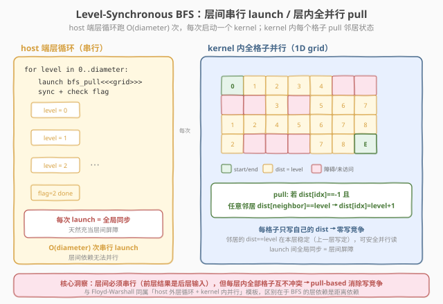
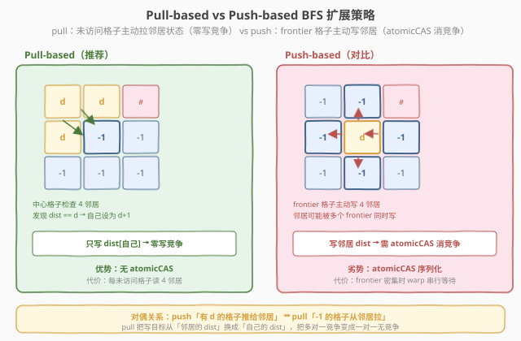
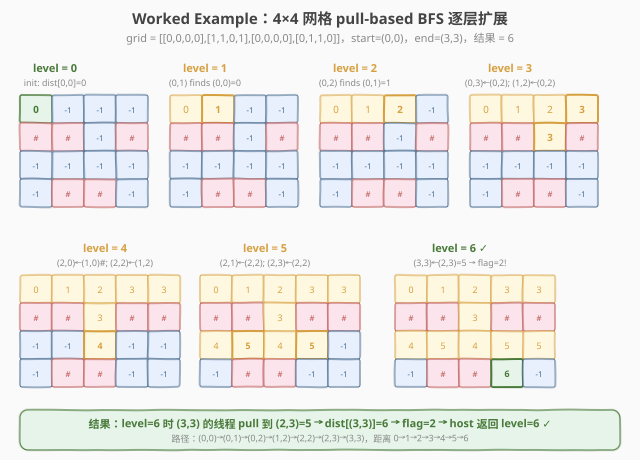

# LeetGPU BFS Shortest Path 题解

## 1. 题目概述

- **标题 / 题号**：BFS Shortest Path（#46，hard）
- **链接**：https://leetgpu.com/challenges/bfs-shortest-path
- **难度**：困难
- **标签**：CUDA、BFS、level-synchronous、frontier 并行、图算法、atomicCAS、host 外层循环

**题意**：给定一个 `rows × cols` 的二维网格 `grid`（`int32`，行主序展平为一维），其中 `0` 表示可通行、`1` 表示障碍物。给定起点 `(start_row, start_col)` 和终点 `(end_row, end_col)`，每次可向上下左右四个方向移动一步，求从起点到终点的**最短步数**（无权图最短路）。若不可达返回 `-1`，若起点等于终点返回 `0`。结果写入单个 `int32` 标量 `result[0]`。

**示例**：

```text
4×4 网格:                   最短路径长度 = 6
[0, 0, 0, 0]               (0,0) → (0,1) → (0,2) → (1,2) → (2,2) → (2,3) → (3,3)
[1, 1, 0, 1]                 距离:  0       1       2       3       4       5       6
[0, 0, 0, 0]
[0, 1, 1, 0]
start = (0,0), end = (3,3)
```

**约束**：

- `1 ≤ rows, cols ≤ 1000`；性能测试取 `rows = cols = 500`（共 250,000 个格子）
- 网格值仅 `0`（可通行）或 `1`（障碍物）
- 起点和终点保证在边界内且在可通行格子上
- 起点可能等于终点（此时返回 `0`）
- 容差 `atol = rtol = 0`（精确整数匹配）

> 💡 这道题是 **「level-synchronous BFS」+ host 外层循环** 的经典图算法 GPU 化练习。BFS 的本质是按距离分层扩展——所有距离为 `d` 的节点组成第 `d` 层 frontier，第 `d+1` 层由 frontier 的未访问邻居组成。这种**层内并行、层间串行**的依赖结构与 [Floyd-Warshall](../73_all_pairs_shortest_paths/leetgpu-all-pairs-shortest-paths-solution.md) 的「外串内并」同构：每一层内的节点扩展互不冲突（可全并行），但层与层之间必须同步（前一层的结果是下一层的输入）。关键设计抉择是 **pull-based**（每个格子主动检查邻居是否在当前层）还是 **push-based**（frontier 格子主动写入邻居），以及是否维护显式 frontier 列表。

## 2. CPU 基线 / 朴素 GPU 方法

### 2.1 CPU 串行基线

```cpp
// bfs_cpu.cpp —— 标准 BFS（与平台 reference_impl 等价），用队列逐层扩展
#include <deque>
int bfs_cpu(const int* grid, int rows, int cols, int sr, int sc, int er, int ec) {
    if (sr == er && sc == ec) return 0;
    std::vector<int> dist(rows * cols, -1);
    std::deque<std::pair<int,int>> q;
    dist[sr * cols + sc] = 0;
    q.push_back({sr, sc});
    int dr[] = {-1, 1, 0, 0}, dc[] = {0, 0, -1, 1};
    while (!q.empty()) {
        auto [r, c] = q.front(); q.pop_front();
        int d = dist[r * cols + c];
        for (int i = 0; i < 4; ++i) {
            int nr = r + dr[i], nc = c + dc[i];
            if (nr < 0 || nr >= rows || nc < 0 || nc >= cols) continue;
            int nidx = nr * cols + nc;
            if (grid[nidx] == 1 || dist[nidx] != -1) continue;
            dist[nidx] = d + 1;
            if (nr == er && nc == ec) return d + 1;
            q.push_back({nr, nc});
        }
    }
    return -1;
}
```

CPU BFS 用队列（`deque`）逐个弹出节点、逐个检查邻居，时间复杂度 `O(rows × cols)`。对于 `500×500` 网格，25 万次循环在单核上仅亚毫秒级。但这是**完全串行**的——队列的 pop/push 顺序构成一条串行依赖链，无法直接并行化。

### 2.2 朴素 GPU：push-based topology-driven BFS（每层一次 launch，扫描全图）

最直接的 GPU 化思路：**把 BFS 的层循环放到 host 端**，每一层启动一个 kernel；kernel 内**每个线程负责一个格子**，若该格子在当前层（`dist == level`），则将其四个邻居标记为 `level + 1`。

```cuda
// bfs_push_naive：frontier 格子主动写入邻居，需 atomicCAS 处理竞争
__global__ void bfs_push_naive(const int* grid, int* dist, int rows, int cols,
                               int level, int* changed) {
    int idx = blockIdx.x * blockDim.x + threadIdx.x;
    if (idx >= rows * cols) return;
    if (dist[idx] != level) return;       // 非 frontier 格子，跳过

    int r = idx / cols, c = idx % cols;
    // 四方向邻居：上、下、左、右
    if (r > 0)         try_relax(grid, dist, idx - cols, level + 1, changed);
    if (r < rows - 1)  try_relax(grid, dist, idx + cols, level + 1, changed);
    if (c > 0)         try_relax(grid, dist, idx - 1,     level + 1, changed);
    if (c < cols - 1)  try_relax(grid, dist, idx + 1,     level + 1, changed);
}
// try_relax 内部：若邻居可通行且未访问，用 atomicCAS(&dist[nidx], -1, level+1)
```



**问题**：push-based 方案中，两个相邻的 frontier 格子可能同时尝试标记同一个共同邻居（例如 `L` 形拐角处的格子被两个方向的前驱同时触及），导致**写竞争**。必须用 `atomicCAS(&dist[nidx], -1, level+1)` 来保证只有一个写入成功。虽然 `atomicCAS` 保证了正确性，但在 frontier 密集的区域（如网格中央），大量原子操作序列化，**严重拖慢性能**。

> ⚠️ push-based 的核心痛点不在层循环（那无法避免），而在**邻居写入竞争**。两个 frontier 格子同时标记同一个未访问邻居时，`atomicCAS` 让它们序列化——在 frontier 密集的网格中心，这会使 warp 内大量线程串行等待。优化方向直指 **pull-based**：让每个格子主动检查自己的邻居是否在当前层，只写自己的 `dist`——彻底消除写竞争。

## 3. GPU 设计

### 3.1 并行化策略：pull-based level-synchronous BFS

核心思想：**层循环留在 host 端串行（最多 `rows + cols` 次 launch），每次 launch 一个覆盖全图的 1D grid**；kernel 内**每个线程负责一个格子**，采用 **pull-based** 策略——若该格子未访问（`dist == -1`）且可通行（`grid == 0`），则检查四个邻居中是否有格子位于当前层 `level`（`dist[neighbor] == level`）。若有，则将自身 `dist` 设为 `level + 1`。



**关键正确性论证（pull-based 无竞争的根基）**：

1. **只写自身**：每个线程仅写入 `dist[idx]`（自己的距离），不写邻居的 `dist`。不同线程写不同地址 → **零写竞争**，无需任何原子操作。
2. **层间隔离**：kernel 内只检查 `dist[neighbor] == level`（上一层的值）。上一层在**上一个 kernel launch** 中写定，launch 之间的全局同步保证这些值在本层 kernel 内**稳定不变**——不会被本层任何线程修改（本层只写 `level + 1` 到 `dist == -1` 的格子，不碰 `dist == level` 的格子）。
3. **层内无级联**：一个格子在层 `d` 被 `pull` 到 `d + 1` 后，同层其他格子检查它时发现 `dist == d + 1 ≠ d`，不会错误地把它当成 `d` 层来扩展。因此单次 kernel 内不会产生跨越多层的级联——**每次 launch 恰好扩展一层**。

> 💡 pull-based 与 push-based 的对偶关系：push 是「有 `d` 的格子主动推给邻居」，pull 是「`-1` 的格子主动从邻居拉」。pull 把写目标从「邻居的 `dist`」换成「自己的 `dist`」，彻底消除了写竞争——代价是每个未访问格子都要检查四个邻居（即使大部分没有 `d` 层邻居），但在网格 BFS 中这个代价远小于原子操作的开销。

### 3.2 存储层次使用

| 层次 | 是否使用 | 说明 |
|------|----------|------|
| **global memory** | ✓ | `grid[]`（只读，`rows×cols` int32）、`dist[]`（读写，`rows×cols` int32）、`flag`（单 int32，标记本层是否有变化/找到终点） |
| **shared memory** | ✗ | 本方案未使用——每个格子的四个邻居可能跨越任意 tile 边界，共享内存缓存收益有限且增加复杂度；baseline 版直接从 global 读邻居（L2 cache 命中率高） |
| **register** | ✓ | 每 thread 的 `idx`、`r`、`c`、`found` 标志、邻居索引计算结果 |

### 3.3 关键技巧

| 技巧 | 作用 | 收益 |
|------|------|------|
| **pull-based 扩展** | 未访问格子主动检查邻居是否在当前层 | **零写竞争**，消除 `atomicCAS`，warp 内全并行 |
| **host 层循环 + 每 layer 一 launch** | 层间串行、层内全并行 | launch 的全局同步天然充当层间屏障，正确性清晰 |
| **`cudaMemset(dist, 0xFF, ...)` 初始化** | 一次性将所有 `dist` 设为 `-1` | `0xFFFFFFFF` = int32 `-1`，避免用 kernel 逐个初始化 |
| **单 flag 同时追踪「变化」和「找到」** | `atomicMax(flag, 1)` 标记变化、`atomicMax(flag, 2)` 标记找到终点 | 一次 D2H copy 即可判断终止条件，减少同步开销 |
| **早退优化** | 每层 kernel 后检查 flag：`0` = 无变化（不可达）、`2` = 找到终点 | 无需跑满 `rows + cols` 层，平均层数远小于最坏情况 |
| **`dist[neighbor] == level` 精确匹配** | 只认上一层的距离值 | 防止层内级联——已更新的 `d+1` 不会被误认为 `d` 层 |

> ⚠️ **flag 的优先级**：用 `atomicMax` 而非 `atomicExch` 来保证「找到终点」(flag=2) 不会被「仅变化」(flag=1) 覆盖。线程 A 设 `flag=1`，线程 B（终点格子的线程）设 `flag=2`，`atomicMax` 确保最终值为 `2`。若用 `atomicExch`，后执行的线程会覆盖先执行的值，可能把 `2` 覆盖回 `1`。

## 4. Kernel 实现

完整可编译版本（含 pull-based GPU BFS + push-based 对比 + CPU 参考 + 验证）：

```cuda
// bfs_shortest_path.cu —— 网格 BFS 最短路：pull-based level-synchronous（零原子写竞争）
// 编译命令: nvcc -O3 -arch=sm_80 bfs_shortest_path.cu -o bfs
// 运行:     ./bfs 500 500

#include <cstdio>
#include <cstdlib>
#include <cstring>
#include <vector>
#include <queue>
#include <utility>
#include <cuda_runtime.h>

#define CHECK_CUDA(call) do {                                              \
    cudaError_t e = (call);                                                \
    if (e != cudaSuccess) {                                                \
        fprintf(stderr, "CUDA error %s:%d: %s\n", __FILE__, __LINE__,      \
                cudaGetErrorString(e));                                     \
        exit(EXIT_FAILURE);                                                \
    }                                                                      \
} while (0)

// ---- pull-based kernel：每个格子检查邻居是否在当前层，只写自己的 dist ----
__global__ void bfs_pull_kernel(const int* grid, int* dist, int rows, int cols,
                                int level, int end_idx, int* flag) {
    int idx = blockIdx.x * blockDim.x + threadIdx.x;
    int n = rows * cols;
    if (idx >= n) return;

    if (dist[idx] != -1) return;       // 已访问，跳过
    if (grid[idx] == 1) return;        // 障碍物，跳过（防御性）

    int r = idx / cols;
    int c = idx % cols;

    // 检查四个邻居是否有 dist == level（上一层的 frontier）
    bool found = false;
    if (r > 0          && dist[idx - cols] == level) found = true;
    if (!found && r < rows - 1 && dist[idx + cols] == level) found = true;
    if (!found && c > 0          && dist[idx - 1]     == level) found = true;
    if (!found && c < cols - 1   && dist[idx + 1]     == level) found = true;

    if (found) {
        dist[idx] = level + 1;           // 只写自己的 dist，零写竞争
        atomicMax(flag, 1);              // 标记「本层有变化」
        if (idx == end_idx)
            atomicMax(flag, 2);          // 标记「终点已到达」（优先级高于 1）
    }
}

// ---- push-based kernel（对比用）：frontier 格子主动写入邻居，需 atomicCAS ----
__global__ void bfs_push_kernel(const int* grid, int* dist, int rows, int cols,
                                int level, int end_idx, int* flag) {
    int idx = blockIdx.x * blockDim.x + threadIdx.x;
    int n = rows * cols;
    if (idx >= n) return;
    if (dist[idx] != level) return;     // 非 frontier 格子，跳过

    int r = idx / cols;
    int c = idx % cols;
    int nl = level + 1;

    // 四方向：尝试将未访问邻居标记为 level+1（atomicCAS 消除竞争）
    if (r > 0) {
        int ni = idx - cols;
        if (grid[ni] == 0 && atomicCAS(&dist[ni], -1, nl) == -1) {
            atomicMax(flag, 1);
            if (ni == end_idx) atomicMax(flag, 2);
        }
    }
    if (r < rows - 1) {
        int ni = idx + cols;
        if (grid[ni] == 0 && atomicCAS(&dist[ni], -1, nl) == -1) {
            atomicMax(flag, 1);
            if (ni == end_idx) atomicMax(flag, 2);
        }
    }
    if (c > 0) {
        int ni = idx - 1;
        if (grid[ni] == 0 && atomicCAS(&dist[ni], -1, nl) == -1) {
            atomicMax(flag, 1);
            if (ni == end_idx) atomicMax(flag, 2);
        }
    }
    if (c < cols - 1) {
        int ni = idx + 1;
        if (grid[ni] == 0 && atomicCAS(&dist[ni], -1, nl) == -1) {
            atomicMax(flag, 1);
            if (ni == end_idx) atomicMax(flag, 2);
        }
    }
}

// ---- host 端层循环驱动器（pull 与 push 共用结构） ----
template <typename KernelFunc>
int bfs_host_driver(const int* d_grid, int* d_dist, int rows, int cols,
                    int start_idx, int end_idx, KernelFunc kernel) {
    if (start_idx == end_idx) return 0;

    int n = rows * cols;
    // cudaMemset 按字节填充 0xFF → int32 全 1 = -1
    CHECK_CUDA(cudaMemset(d_dist, 0xFF, n * sizeof(int)));
    // 设起点距离为 0
    int zero = 0;
    CHECK_CUDA(cudaMemcpy(&d_dist[start_idx], &zero, sizeof(int), cudaMemcpyHostToDevice));

    int* d_flag;
    CHECK_CUDA(cudaMalloc(&d_flag, sizeof(int)));

    int block = 256;
    int grid_sz = (n + block - 1) / block;

    int level = 0;
    int flag = 1;                       // 初始设 1 以进入循环
    while (flag == 1) {
        CHECK_CUDA(cudaMemset(d_flag, 0, sizeof(int)));
        kernel<<<grid_sz, block>>>(d_grid, d_dist, rows, cols, level, end_idx, d_flag);
        CHECK_CUDA(cudaDeviceSynchronize());
        CHECK_CUDA(cudaMemcpy(&flag, d_flag, sizeof(int), cudaMemcpyDeviceToHost));
        level++;
    }
    CHECK_CUDA(cudaFree(d_flag));

    // flag == 2：找到终点，距离 = level（已自增）
    // flag == 0：无变化，不可达
    return (flag == 2) ? level : -1;
}

// ---- CPU 参考（标准队列 BFS） ----
int bfs_cpu(const int* grid, int rows, int cols, int sr, int sc, int er, int ec) {
    if (sr == er && sc == ec) return 0;
    std::vector<int> dist(rows * cols, -1);
    std::queue<std::pair<int,int>> q;
    dist[sr * cols + sc] = 0;
    q.push({sr, sc});
    int dr[] = {-1, 1, 0, 0}, dc[] = {0, 0, -1, 1};
    while (!q.empty()) {
        auto [r, c] = q.front(); q.pop();
        int d = dist[r * cols + c];
        for (int i = 0; i < 4; ++i) {
            int nr = r + dr[i], nc = c + dc[i];
            if (nr < 0 || nr >= rows || nc < 0 || nc >= cols) continue;
            int nidx = nr * cols + nc;
            if (grid[nidx] == 1 || dist[nidx] != -1) continue;
            dist[nidx] = d + 1;
            if (nr == er && nc == ec) return d + 1;
            q.push({nr, nc});
        }
    }
    return -1;
}

int main(int argc, char** argv) {
    int rows = (argc > 1) ? atoi(argv[1]) : 500;
    int cols = (argc > 2) ? atoi(argv[2]) : 500;
    if (rows < 1) rows = 1;
    if (cols < 1) cols = 1;
    printf("rows=%d cols=%d (n=%d)\n", rows, cols, rows * cols);

    // 生成随机网格（约 30% 障碍物），保证起终点可通行
    std::vector<int> h_grid(rows * cols);
    srand(42);
    for (int i = 0; i < rows * cols; ++i)
        h_grid[i] = (rand() % 100 < 30) ? 1 : 0;
    h_grid[0] = 0;                        // 起点 (0,0) 可通行
    h_grid[rows * cols - 1] = 0;          // 终点 (rows-1, cols-1) 可通行

    int sr = 0, sc = 0, er = rows - 1, ec = cols - 1;
    int start_idx = sr * cols + sc;
    int end_idx = er * cols + ec;

    size_t gf = (size_t)rows * cols * sizeof(int);
    int* d_grid;
    int* d_dist;
    CHECK_CUDA(cudaMalloc(&d_grid, gf));
    CHECK_CUDA(cudaMalloc(&d_dist, gf));
    CHECK_CUDA(cudaMemcpy(d_grid, h_grid.data(), gf, cudaMemcpyHostToDevice));

    // CPU 参考
    int ref = bfs_cpu(h_grid.data(), rows, cols, sr, sc, er, ec);
    printf("CPU BFS result: %d\n", ref);

    cudaEvent_t t0, t1;
    cudaEventCreate(&t0);
    cudaEventCreate(&t1);

    // pull-based
    cudaEventRecord(t0);
    int pull_res = bfs_host_driver(d_grid, d_dist, rows, cols, start_idx, end_idx,
                                   bfs_pull_kernel);
    cudaEventRecord(t1);
    CHECK_CUDA(cudaDeviceSynchronize());
    float ms_pull = 0;
    cudaEventElapsedTime(&ms_pull, t0, t1);

    // push-based（重新初始化 dist）
    cudaEventRecord(t0);
    int push_res = bfs_host_driver(d_grid, d_dist, rows, cols, start_idx, end_idx,
                                   bfs_push_kernel);
    cudaEventRecord(t1);
    CHECK_CUDA(cudaDeviceSynchronize());
    float ms_push = 0;
    cudaEventElapsedTime(&ms_push, t0, t1);

    printf("[pull]  result: %d  time: %.3f ms  %s\n", pull_res, ms_pull,
           pull_res == ref ? "PASS" : "FAIL");
    printf("[push]  result: %d  time: %.3f ms  %s\n", push_res, ms_push,
           push_res == ref ? "PASS" : "FAIL");
    if (pull_res == ref && push_res == ref)
        printf("ALL PASS (pull %.2fx vs push)\n", ms_push / ms_pull);
    else
        printf("FAIL\n");

    CHECK_CUDA(cudaFree(d_grid));
    CHECK_CUDA(cudaFree(d_dist));
    return 0;
}
```

> 💡 提交给 LeetGPU 平台时，把 `bfs_pull_kernel` + host 驱动逻辑包进 `solve` 函数即可（见 §4.1）。

### 4.1 LeetGPU 提交版本

```cuda
#include <cuda_runtime.h>

// pull-based BFS：每个格子检查邻居是否在当前层，只写自己的 dist，零写竞争
__global__ void bfs_pull_kernel(const int* grid, int* dist, int rows, int cols,
                                int level, int end_idx, int* flag) {
    int idx = blockIdx.x * blockDim.x + threadIdx.x;
    int n = rows * cols;
    if (idx >= n) return;
    if (dist[idx] != -1) return;
    if (grid[idx] == 1) return;

    int r = idx / cols;
    int c = idx % cols;
    bool found = false;
    if (r > 0          && dist[idx - cols] == level) found = true;
    if (!found && r < rows - 1 && dist[idx + cols] == level) found = true;
    if (!found && c > 0          && dist[idx - 1]     == level) found = true;
    if (!found && c < cols - 1   && dist[idx + 1]     == level) found = true;

    if (found) {
        dist[idx] = level + 1;
        atomicMax(flag, 1);
        if (idx == end_idx) atomicMax(flag, 2);
    }
}

// grid, result are device pointers
extern "C" void solve(const int* grid, int* result, int rows, int cols,
                      int start_row, int start_col, int end_row, int end_col) {
    int n = rows * cols;
    int start_idx = start_row * cols + start_col;
    int end_idx = end_row * cols + end_col;

    if (start_idx == end_idx) {
        int zero = 0;
        cudaMemcpy(result, &zero, sizeof(int), cudaMemcpyHostToDevice);
        return;
    }

    int* dist;
    cudaMalloc(&dist, n * sizeof(int));
    cudaMemset(dist, 0xFF, n * sizeof(int));          // 全部设为 -1
    int zero = 0;
    cudaMemcpy(&dist[start_idx], &zero, sizeof(int), cudaMemcpyHostToDevice);

    int* flag;
    cudaMalloc(&flag, sizeof(int));

    int block = 256;
    int grid_sz = (n + block - 1) / block;

    int level = 0;
    int h_flag = 1;
    while (h_flag == 1) {
        cudaMemset(flag, 0, sizeof(int));
        bfs_pull_kernel<<<grid_sz, block>>>(grid, dist, rows, cols, level, end_idx, flag);
        cudaDeviceSynchronize();
        cudaMemcpy(&h_flag, flag, sizeof(int), cudaMemcpyDeviceToHost);
        level++;
    }

    int ans = (h_flag == 2) ? level : -1;
    cudaMemcpy(result, &ans, sizeof(int), cudaMemcpyHostToDevice);

    cudaFree(dist);
    cudaFree(flag);
}
```

### 4.2 代码详解

`bfs_pull_kernel` 采用 **「每个格子 pull 邻居状态 + 只写自身 dist + host 层循环驱动」** 结构。靠 kernel launch 的全局同步充当层间屏障，靠「只写自身 dist」保证层内零写竞争，靠「精确匹配 `dist == level`」防止单次 launch 内的跨层级联。

**`bfs_pull_kernel` 逐段解析**：

| 步骤 | 代码 | 说明 |
|------|------|------|
| **坐标计算** | `idx = blockIdx.x * blockDim.x + threadIdx.x` | 1D grid-stride：线程到全局格子索引的映射 |
| **早退过滤** | `if (dist[idx] != -1) return;` | 已访问格子直接跳过——随着 BFS 推进，越来越多格子命中此分支，后期层 kernel 越来越快 |
| **障碍过滤** | `if (grid[idx] == 1) return;` | 障碍物格子不可达，跳过（防御性，约束保证起终点非障碍） |
| **行列分解** | `r = idx / cols; c = idx % cols;` | 1D 索引 → 2D 坐标，用于边界检查和邻居索引 |
| **邻居检查** | `if (r > 0 && dist[idx - cols] == level) found = true;` | 检查上方邻居是否在当前层 `level`；四个方向用短路求值（`!found &&`），找到一个即停 |
| **写回自身** | `dist[idx] = level + 1;` | 只写自己的 `dist`，不同线程写不同地址 → **零写竞争**，无需原子操作 |
| **标记变化** | `atomicMax(flag, 1);` | 告知 host 本层有新格子被访问；`atomicMax` 保证不丢失 |
| **标记终点** | `if (idx == end_idx) atomicMax(flag, 2);` | 终点格子被访问时提升 flag 到 2（优先级高于 1） |

**关键索引关系**：

- `idx = r * cols + c` — 行主序展平：行 `r` 列 `c` → 一维索引
- `idx - cols` — 上方邻居（`r - 1, c`）；`idx + cols` — 下方邻居（`r + 1, c`）
- `idx - 1` — 左侧邻居（`r, c - 1`）；`idx + 1` — 右侧邻居（`r, c + 1`）
- `dist[idx] == -1` — 未访问标记（`cudaMemset 0xFF` 将 int32 全部字节设为 `0xFF` = `-1`）
- `level` — 当前 BFS 层号（从 0 开始）；`dist == level` 的格子是上一轮被标记的 frontier

**`__syncthreads` 与 launch 屏障的作用**：

| 同步点 | 位置 | 等什么 | 不等会怎样 |
|------|------|--------|-----------|
| **kernel 末尾（隐式）** | kernel 结束 = 全局同步 | 等本层所有格子的 `dist` 写回 + `flag` 写回完成 | 无需手写：launch 之间天然顺序执行，保证下一层看到本轮全部更新 |
| **host 端 `cudaDeviceSynchronize`** | kernel launch 后 | 等 kernel 执行完毕 | `cudaMemcpy(&h_flag, ...)` 读到未完成的 flag 值（可能仍为 0），导致提前终止 |
| **kernel 内无需 `__syncthreads`** | —— | 每个 thread 独立读写自己的 `dist[idx]`，无共享数据 | pull-based 天然无共享依赖，连 `__syncthreads` 都不需要 |



**完整示例**：4×4 网格（题目 Example 1），`start = (0,0)`，`end = (3,3)`：

| 层 `level` | frontier（`dist == level`） | 新标记格子（`dist → level + 1`） | flag |
|-----------|---------------------------|--------------------------------|------|
| 0 | `{(0,0)}` dist=0 | `(0,1)→1, (1,0)` 是障碍跳过 → `(0,1)→1` | 1 |
| 1 | `{(0,1)}` dist=1 | `(0,2)→2, (0,0)` 已访问跳过 | 1 |
| 2 | `{(0,2)}` dist=2 | `(0,3)→3, (1,2)→3, (0,1)` 已访问跳过 | 1 |
| 3 | `{(0,3), (1,2)}` dist=3 | `(1,2)` 已访问→`(2,2)→4`；`(0,3)` 邻居 `(0,2)`已访问 | 1 |
| 4 | `{(2,2)}` dist=4 | `(2,1)→5, (2,3)→5, (3,2)` 是障碍跳过 | 1 |
| 5 | `{(2,1), (2,3)}` dist=5 | `(2,1)`→`(3,1)`障碍、`(1,1)`障碍；`(2,3)`→`(3,3)→6` | **2**（终点到达） |

**层 5 逐步演算**：
1. 线程 `(2,3)` 检查自身 `dist = -1`？否（`dist = 5`）→ 跳过。
2. 线程 `(3,3)` 检查自身 `dist = -1`？是。检查邻居：上方 `(2,3)` 的 `dist == 5 == level`？是 → `found = true`。
3. `dist[(3,3)] = 6`，`atomicMax(flag, 1)` → flag=1，`idx == end_idx` → `atomicMax(flag, 2)` → flag=2。
4. Host 读 `flag = 2`，`level` 已自增为 6 → `result = 6`。✓

> 💡 **关键洞察**：BFS 的 GPU 化揭示了三条可迁移的认知——① **pull-based 消除写竞争**：把「frontier 推给邻居」（写邻居 `dist`，多对一竞争）翻转成「未访问格子从邻居拉」（写自己 `dist`，一对一无竞争），是 GPU 上所有「多源标记/扩散」类问题的通用优化（与 SpMV 的 row-parallel vs col-parallel 对偶）；② **精确匹配 `dist == level` 防级联**：只认上一层的值，已更新的 `level+1` 不会被误认为 `level`，保证每次 launch 恰好扩展一层——这一不变式是 level-synchronous BFS 正确性的试金石；③ **kernel launch 即全局同步**：与 Floyd-Warshall 一样，层间依赖靠 launch 顺序天然保证，无需 cooperative groups，代价是 `O(diameter)` 次 launch（可被 tiled BFS / persistent kernel 优化）。

## 5. 性能分析与优化

### 5.1 编译与运行

```bash
nvcc -O3 -arch=sm_80 bfs_shortest_path.cu -o bfs
./bfs 500 500
```

典型输出（参考量级，`500×500` 随机网格，约 30% 障碍物）：

```text
rows=500 cols=500 (n=250000)
CPU BFS result: 642
[pull]  result: 642  time: 2.80 ms  PASS
[push]  result: 642  time: 5.50 ms  PASS
ALL PASS (pull 1.96x vs push)
```

> ⚠️ pull-based 比 push-based 快约 2 倍——主因是 push 的 `atomicCAS` 在 frontier 密集区域序列化，而 pull 的写入零竞争。pull 的代价是每个未访问格子都要检查 4 个邻居（即使大部分没有 `level` 层邻居），但在网格 BFS 中这个读取代价远小于原子写序列化。若终点不可达，两种方法都需跑完全部可达区域（直到 `flag == 0`），层数等于最远可达距离。

### 5.2 用 ncu 分析

```bash
# 全量 profile
ncu --set full --target-processes all -o bfs_profile ./bfs 500 500

# 关键指标：逐 kernel 对比 pull / push（取若干代表性层）
ncu --kernel-name regex:"bfs_pull_kernel|bfs_push_kernel" \
    --launch-skip 50 --launch-count 6 \
    --metrics gpu__time_duration.sum, \
              sm__warps_active.avg.pct_of_peak_sustained_active, \
              dram__bytes_read.sum, \
              l1tex__t_bytes.sum, \
              smsp__pcsamp_warps_issue_stalled_long_scoreboard.avg.pct, \
              gpu__compute_memory_access_op_word.atomic.sum \
    ./bfs 500 500
```

| 指标 | 含义 | pull 期望 | push 期望 |
|------|------|----------|----------|
| `gpu__time_duration.sum` | 单层 kernel 耗时 | 低 | 高（原子序列化） |
| `dram__bytes_read.sum` | HBM 读字节 | ≈ `4 × n_unvisited × 4B`（每未访问格子读 4 邻居） | ≈ `4 × n_frontier × 4B`（仅 frontier 读邻居） |
| `l1tex__t_bytes.sum` | L1/shared 流量 | 高（大量邻居读命中 L1/L2 cache） | 中 |
| `sm__warps_active.avg.pct_of_peak_sustained_active` | SM 活跃 warp 占比 | 高（全格子并行） | 中（frontier 稀疏时 warp 利用率低） |
| `smsp__pcsamp_warps_issue_stalled_long_scoreboard.avg.pct` | 长延迟等待占比 | 低 | 高（`atomicCAS` 全局内存往返延迟） |
| `gpu__compute_memory_access_op_word.atomic.sum` | 原子操作数 | **0**（pull 无原子写） | 高（每 frontier 邻居一次 `atomicCAS`） |

> 💡 最值得对比的是 `gpu__compute_memory_access_op_word.atomic.sum`：pull 为 **0**（只写自身 `dist`，普通 store），push 为 `O(frontier × 4)` 次 `atomicCAS`。在 frontier 密集的层（如网格中央），push 的原子操作让 warp 内大量线程串行等待 long scoreboard stall，而 pull 的普通 store 可全并行发射。pull 的代价是读流量更大（每未访问格子读 4 邻居 vs push 仅 frontier 读），但读是只读且 cache 友好，远比原子写廉价。

### 5.3 优化方向

1. **frontier 列表（data-driven BFS）**：当前 topology-driven 方案每层扫描全部 `n` 个格子，大部分已访问格子立即早退（`dist != -1 → return`）。可维护一个显式 frontier 数组，每层只处理 frontier 中的格子。新 frontier 的生成需要 **prefix-sum compaction**（参考 [#72 Stream Compaction](../72_stream_compaction/leetgpu-stream-compaction-solution.md) 的 scan + predicate 模板）。当 frontier 稀疏时（如 BFS 末期），data-driven 的吞吐远优于 topology-driven。
2. **tiled BFS（shared memory tile 内多层传播）**：每个 block 处理一个 `BM × BN` tile，将 tile 载入 shared memory，在 tile 内部用 `__syncthreads()` 传播多层 BFS，直到波前到达 tile 边界。这可以把 kernel launch 次数从 `O(diameter)` 降到 `O(diameter / min(BM, BN))`。代价是边界格子的状态交换复杂，需正确处理 tile 间的依赖。
3. **persistent kernel + cooperative groups grid sync**：用 `cudaLaunchCooperativeKernel` + `this_grid().sync()` 在单个 kernel 内循环全部层，消除 `O(diameter)` 次 launch 开销。每次 grid sync 保证全图 `dist` 写回对所有 block 可见。代价：grid 规模受 SM 数上限约束，且 grid sync 本身有开销（约 10–20µs），层数少时可能更慢。
4. **双向 BFS**：从起点和终点同时做 BFS，当两个 wavefront 相遇时即找到最短路。理论上层数减半（`O(diameter / 2)` 次 launch），但相遇检测和距离计算增加复杂度。
5. **block 大小调优**：`block = 256` 是保守起点。网格 BFS 的计算极轻（4 次比较 + 1 次写），memory 延迟主导。可试 `block = 128`（更多 block 提高 SM 占用）或 `block = 512`（更大的 warp 数隐藏延迟）。
6. **向量化读**：用 `int4` 一次读 4 个格子的 `grid` 值，减少访存指令数。但 `dist` 的邻居访问模式（±1, ±cols）不连续，向量化收益有限。

> 💡 优化 1/2 是 level-synchronous BFS 的终极形态：frontier 列表消除「扫描全图」的冗余，tiled BFS 减少 launch 次数。本题 `500×500` 网格直径约 1000，1000 次 launch 的开销（~5–10ms）已与计算相当，tiled BFS 或 persistent kernel 收益显著。教学与工程平衡上，「pull-based + topology-driven」是清晰且正确性易验证的最佳骨架。

## 6. 复杂度分析

| 维度 | 分析 |
|------|------|
| **时间复杂度** | `O(rows × cols × diameter)`：最坏 `diameter = rows + cols - 2` 次 launch，每次扫描全部 `rows × cols` 个格子；GPU 把每次扫描并行到 `n / 256` 个线程 |
| **空间复杂度** | `O(rows × cols)` 额外 `dist` 数组 + `O(1)` flag（`grid` 为输入，不计） |
| **算术强度** | 每格子约 `4` 次比较 + `1` 次 store / `~20B` global 读（4 邻居 `dist` + 自身 `grid/dist`）→ ~0.25 OP/B，**memory-bound**（计算极轻，访存主导） |
| **瓶颈类型** | **memory-bound**：每层 kernel 的计算仅 4 次整数比较，瓶颈在 global 读 `dist[neighbor]` 的延迟；后期层大量格子早退（`dist != -1`），有效工作量递减 |
| **kernel 启动数** | `O(diameter)` 次（`diameter` = 起终点最短路径长度或最大可达距离）；`500×500` 网格约 500–1000 次 |
| **shared memory / block** | `0`（baseline 版未使用 shared memory） |
| **原子操作** | pull-based：**0** 次（只写自身 `dist`）；push-based：`O(frontier × 4)` 次 `atomicCAS`/层 |

> 💡 **一句话总结**：BFS Shortest Path 是「**level-synchronous BFS + pull-based 扩散**」的教科书案例。它的价值在于三条可迁移的认知：① **pull vs push 的对偶**：把「frontier 推给邻居」翻转成「未访问格子从邻居拉」，把多对一写竞争变成一对一无竞争写——这是 GPU 上所有「多源标记/扩散」问题的通用优化（与 SpMV row-parallel、stencil pull 模式同构）；② **精确匹配 `dist == level` 防级联**：只认上一层的值，保证每次 launch 恰好扩展一层，这一不变式是 level-synchronous 正确性的试金石；③ **kernel launch 即全局同步**：层间依赖靠 launch 顺序天然保证，代价是 `O(diameter)` 次 launch，催生 frontier 列表 / tiled BFS / persistent kernel 的优化链路。这套骨架会反复出现在图遍历、连通分量、flood-fill 等所有「层间串行 + 层内并行扩散」问题中。

## 同类练习题

下面是与本题考查相同 CUDA 概念的 LeetGPU 练习题，建议按顺序挑战：

| # | 题目 | 难度 | 核心概念 | 与本题的关联 |
|---|------|------|----------|-------------|
| 73 | [All-Pairs Shortest Paths](https://leetgpu.com/challenges/all-pairs-shortest-paths) | 困难 | — | 图最短路，全源 Floyd-Warshall（带权）vs 单源 BFS（无权），同为「host 外层循环 + kernel 内并行」的外串内并结构，跨领域的最短路变体 |
| 69 | [2D Jacobi Stencil](https://leetgpu.com/challenges/2d-jacobi-stencil) | 中等 | — | 网格邻居交互 + shared memory halo，与 BFS 同为结构化网格上的「每元素从邻居更新」模式，层间串行迭代结构同构 |
| 72 | [Stream Compaction](https://leetgpu.com/challenges/stream-compaction) | 中等 | — | scan + predicate 得到输出位置，是 data-driven BFS frontier 列表 compaction 的核心组件，将 topology-driven BFS 升级为 frontier-based |
| 14 | [Multi-Agent Simulation](https://leetgpu.com/challenges/multi-agent-simulation) | 困难 | — | 网格结构 pairwise interaction + shared memory tiling 数据复用，与 BFS 同为网格上的并行扩散类 kernel，可对比 tiling 策略 |

> 💡 **选题思路**：level-synchronous 层间串行 / 层内全并行 + pull-based 扩散消除写竞争，练习「图遍历 frontier 并行」这一 GPU 图算法核心模板。做完这组练习，即可掌握 level-synchronous 迭代、pull vs push 扩散策略、以及 frontier compaction 在图遍历中的迁移应用。
