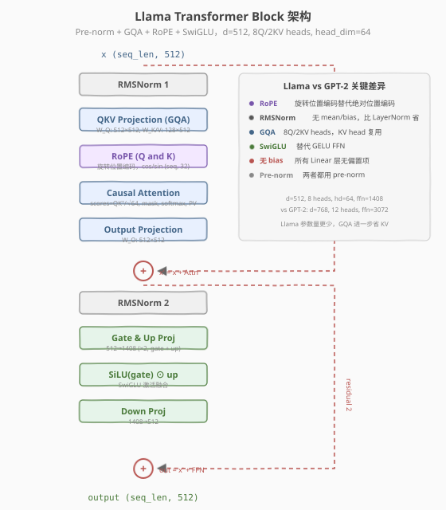
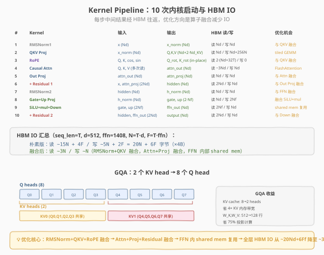

# LeetGPU Llama Transformer Block 题解

## 1. 题目概述

- **标题 / 题号**：Llama Transformer Block（#93，hard）
- **链接**：https://leetgpu.com/challenges/llama-transformer-block
- **难度**：困难
- **标签**：CUDA、Transformer、RMSNorm、RoPE、GQA、SwiGLU、multi-kernel pipeline、端到端

**题意**：实现一个完整的 Llama-style Transformer Decoder Block。给定输入 $x \in \mathbb{R}^{\text{seq} \times 512}$、打包权重 `weights`（2,819,072 个 float）、预计算 RoPE 表 `cos`/`sin`，计算前向输出。

采用 **pre-norm** 架构：

$$x' = x + \text{Attn}(\text{RMSNorm}_1(x),\; \cos,\; \sin)$$
$$\text{output} = x' + \text{FFN}(\text{RMSNorm}_2(x'))$$

其中 Attn 使用 **GQA**（8 Q heads / 2 KV heads）+ **RoPE** + causal mask，FFN 使用 **SwiGLU**（$\text{SiLU}(zW_\text{gate}^\top) \odot zW_\text{up}^\top$）$W_\text{down}^\top$。

**Llama 架构常量**：

| 参数 | 值 | 说明 |
|------|----|------|
| `d_model` | 512 | 模型维度 |
| `num_q_heads` | 8 | Query 头数 |
| `num_kv_heads` | 2 | Key/Value 头数（GQA） |
| `head_dim` | 64 | 每头维度 |
| `gqa_groups` | 4 | 每 KV head 服务 4 个 Q heads |
| `ffn_hidden` | 1408 | SwiGLU 中间维度 |

**约束**：`1 ≤ seq_len ≤ 4096`，性能测试 `seq_len = 2048`。所有张量 float32，权重无 bias。

> 💡 这道题是 **LLM 推理引擎的微缩版**——Llama 架构的每个组件（RMSNorm、RoPE、GQA、SwiGLU）都已有独立 LeetGPU 题解，本题考察的是**如何将它们编排为端到端的 multi-kernel pipeline**。核心挑战不是单个 kernel 的实现，而是**中间缓冲管理、HBM IO 优化、算子融合策略**。

## 2. CPU 基线 / 朴素 GPU 方法

### 2.1 参考实现（PyTorch）

题目 `reference_impl` 用 PyTorch 算子串联实现：`rms_norm → QKV GEMM → RoPE → GQA broadcast → causal SDPA → out_proj → residual → rms_norm → SwiGLU FFN → residual`。这给出了计算流程的"黄金标准"，但 PyTorch 每个 `@` 都是独立的 cuBLAS 调用，中间结果全部经 HBM 往返。

### 2.2 朴素 GPU 的误区：单 kernel 融合全 block

直觉上可能想用一个超大 kernel 融合整个 block，但这**不可行**：
- Attention 的 $O(T^2)$ scores 矩阵需要动态分配，无法预知 shared memory 大小
- QKV GEMM 是 compute-bound（需要 Tensor Core），而 RMSNorm/RoPE 是 memory-bound，最优配置完全不同
- 多 kernel 分解允许每个 kernel 独立选最优 grid/block 配置

> ⚠️ **正确策略**：将 block 分解为 ~10 个 kernel，每个 kernel 负责一个子算子，中间结果通过 HBM 传递。优化方向是**选择性融合相邻算子**（如 RMSNorm+QKV、SiLU+mul），而非全融合。

## 3. GPU 设计

### 3.1 并行化策略：Multi-Kernel Pipeline



> **图：Llama Transformer Block 架构。**  
> 左侧是完整的 pre-norm 数据流：`x → RMSNorm1 → QKV → RoPE → Causal Attn → Out Proj → +x → RMSNorm2 → Gate&Up → SiLU⊙mul → Down → +x' → output`。红色虚线是两条残差连接。右侧对比 Llama 与 GPT-2 的 5 个关键差异：RoPE 替代绝对位置编码、RMSNorm 替代 LayerNorm、GQA（8Q/2KV）、SwiGLU 替代 GELU、无 bias。



> **图：10 次内核启动与 HBM IO 分析。**  
> 上方表格列出每个 kernel 的输入/输出/HBM 读写量/优化机会。朴素版总计 HBM 读 ~15Nd+4F、写 ~5Nd+2F。底部展示 GQA 的 head 映射：2 个 KV heads 各服务 4 个 Q heads，KV cache 和投影计算省 4×。底部黄色框总结优化核心：算子融合将 HBM IO 从 ~20Nd+6Ff 降至 ~3Nd。

**10 步 kernel 流水线**：

| # | Kernel | 作用 | 关键 CUDA 技巧 |
|---|--------|------|---------------|
| 1 | `rms_norm` | RMSNorm1：$x \to x_\text{norm}$ | warp shuffle 归约 + elementwise 融合 |
| 2 | `matmul` (×3) | QKV 投影：$x_\text{norm} W_Q^\top, W_K^\top, W_V^\top$ | 朴素 GEMM，每 block 一行 |
| 3 | `apply_rope` | RoPE 旋转 Q 和 K（in-place） | element-wise，cos/sin 广播 |
| 4 | `attention` | GQA causal SDPA | per-(head, row) block，online softmax |
| 5 | `matmul` | 输出投影：$\text{attn} \cdot W_O^\top$ | 朴素 GEMM |
| 6 | `add_residual` | $x + \text{attn\_proj}$ | element-wise add |
| 7 | `rms_norm` | RMSNorm2：$\text{hidden} \to h_\text{norm}$ | 同 #1 |
| 8 | `matmul` (×2) | Gate + Up 投影：$h_\text{norm} W_\text{gate}^\top, W_\text{up}^\top$ | 朴素 GEMM |
| 9 | `swiglu_ffn` | SiLU(gate)⊙up → down 投影 | shared mem 缓存中间结果 |
| 10 | `add_residual` | $\text{hidden} + \text{ffn\_out}$ | element-wise add |

### 3.2 存储层次使用

| 层次 | 使用 | 说明 |
|------|------|------|
| **global (HBM)** | ✓ | 所有输入/输出/权重 + 中间缓冲（`x_norm`, `Q`, `K`, `V`, `attn_out` 等） |
| **shared memory** | ✓ | attention 的 scores 缓冲；FFN 的 gate/up 中间结果缓存 |
| `__constant__` | ✗ | 权重太大（2.8M floats = 11MB），超 64KB 常量内存上限 |
| **register** | ✓ | 累加器、RMSNorm 的 `sum_sq`、attention 的 `max_score`/`denom` |

### 3.3 关键技巧

1. **权重偏移解包**：所有权重打包在单个 `weights` buffer 中，用编译期 `constexpr` 偏移量定位各矩阵——避免运行时指针运算。

2. **GQA head 映射**：Q head $i$ 使用的 KV head 为 $i / \text{gqa\_groups} = i / 4$。Q0-Q3 共享 KV0，Q4-Q7 共享 KV1。在 attention kernel 中用 `kv_head = q_head / GQA_GROUPS` 索引 K/V。

3. **RoPE in-place**：RoPE 是 element-wise 操作，直接在 Q/K buffer 上原地修改，无需额外内存。每个 head 的 `head_dim=64` 被分为前后各 32 维：$[q_1 | q_2] \to [q_1 \cos - q_2 \sin | q_1 \sin + q_2 \cos]$。

4. **FFN shared mem 复用**：SwiGLU 的 gate 和 up 投影结果（各 `ffn_hidden=1408` 维）存入 shared memory，SiLU+mul 后直接在片内做 down 投影——省一次 HBM 往返。

5. **Online softmax**：attention kernel 内用"先求 max 再 exp 再归一"的单遍 softmax，避免存储完整 scores 矩阵到 HBM。

> 💡 **与 GPT-2 Block (#74) 的关键区别**：① RMSNorm 替代 LayerNorm（省一次归约）；② RoPE 新增（element-wise 旋转）；③ GQA 替代 MHA（KV head 减少 4×）；④ SwiGLU 替代 GELU FFN（gate+up 双投影）；⑤ 无 bias 简化 GEMM。

## 4. Kernel 实现

```cuda
// llama_transformer_block.cu —— Llama Transformer Block 完整前向
// 编译命令: nvcc -O3 -arch=sm_120 llama_transformer_block.cu -o llama_block
// 运行:     ./llama_block

#include <cstdio>
#include <cstdlib>
#include <cmath>
#include <cuda_runtime.h>

#define CHECK_CUDA(call)                                                                                          \
    do {                                                                                                          \
        cudaError_t e = (call);                                                                                   \
        if (e != cudaSuccess) {                                                                                   \
            fprintf(stderr, "CUDA error %s:%d: %s\n", __FILE__, __LINE__, cudaGetErrorString(e));                 \
            exit(EXIT_FAILURE);                                                                                   \
        }                                                                                                         \
    } while (0)

// ---- Llama 架构常量 ----
constexpr int D = 512;
constexpr int NUM_Q_HEADS = 8;
constexpr int NUM_KV_HEADS = 2;
constexpr int HEAD_DIM = D / NUM_Q_HEADS;     // 64
constexpr int Q_DIM = NUM_Q_HEADS * HEAD_DIM; // 512
constexpr int KV_DIM = NUM_KV_HEADS * HEAD_DIM; // 128
constexpr int GQA_GROUPS = NUM_Q_HEADS / NUM_KV_HEADS; // 4
constexpr int FFN_HIDDEN = 1408;
constexpr float EPS = 1e-5f;

// ---- 权重偏移 ----
constexpr int O_RMS1_W = 0;
constexpr int O_WQ = D;
constexpr int O_WK = O_WQ + Q_DIM * D;
constexpr int O_WV = O_WK + KV_DIM * D;
constexpr int O_WO = O_WV + KV_DIM * D;
constexpr int O_RMS2_W = O_WO + D * D;
constexpr int O_WGATE = O_RMS2_W + D;
constexpr int O_WUP = O_WGATE + FFN_HIDDEN * D;
constexpr int O_WDOWN = O_WUP + FFN_HIDDEN * D;

// ---- Kernel 1: RMSNorm ----
// 每行用 1 个 block，blockDim.x 线程协作归约
__global__ void rms_norm_kernel(const float* x, float* out, const float* weight, int seq_len) {
    int row = blockIdx.x;
    if (row >= seq_len) return;
    const float* x_row = x + (size_t)row * D;
    float* out_row = out + (size_t)row * D;

    // 单线程遍历求 sum_sq（简化版，优化可用 warp reduce）
    float sum_sq = 0.0f;
    for (int i = 0; i < D; i++)
        sum_sq += x_row[i] * x_row[i];

    float inv_rms = rsqrtf(sum_sq / D + EPS);
    for (int i = threadIdx.x; i < D; i += blockDim.x)
        out_row[i] = x_row[i] * inv_rms * weight[i];
}

// ---- Kernel 2: 朴素 GEMM (无 bias) ----
// C[row, col] = A[row, :] @ W[col, :]^T, W 布局 (out_dim, in_dim)
__global__ void matmul_kernel(const float* A, const float* W, float* C,
                               int rows, int in_dim, int out_dim) {
    int row = blockIdx.y;
    int col = blockIdx.x * blockDim.x + threadIdx.x;
    if (row >= rows || col >= out_dim) return;

    const float* a_row = A + (size_t)row * in_dim;
    float sum = 0.0f;
    for (int k = 0; k < in_dim; k++)
        sum += a_row[k] * W[(size_t)col * in_dim + k];
    C[(size_t)row * out_dim + col] = sum;
}

// ---- Kernel 3: RoPE (in-place) ----
// qk 布局: (seq_len, num_heads, head_dim)
__global__ void apply_rope_kernel(float* qk, const float* cos, const float* sin,
                                   int seq_len, int num_heads) {
    int t = blockIdx.x;   // 时间步
    int h = blockIdx.y;   // head
    int d = threadIdx.x;  // head_dim 内的索引
    if (t >= seq_len || h >= num_heads || d >= HEAD_DIM / 2) return;

    int half = HEAD_DIM / 2;
    int base = (t * num_heads + h) * HEAD_DIM;
    float c = cos[t * half + d];
    float s = sin[t * half + d];

    float q1 = qk[base + d];
    float q2 = qk[base + half + d];
    qk[base + d]        = q1 * c - q2 * s;
    qk[base + half + d] = q1 * s + q2 * c;
}

// ---- Kernel 4: Causal Attention with GQA ----
// Q: (seq, NUM_Q_HEADS, HEAD_DIM), K/V: (seq, NUM_KV_HEADS, HEAD_DIM)
// 每 block 处理一个 (row, q_head)，输出 attn_out[row, q_head*HEAD_DIM : ...]
__global__ void attention_kernel(const float* Q, const float* K, const float* V,
                                  float* attn_out, int seq_len) {
    int row = blockIdx.x;
    int q_head = blockIdx.y;
    if (row >= seq_len) return;

    int kv_head = q_head / GQA_GROUPS;
    int lane = threadIdx.x;  // 0..HEAD_DIM-1

    extern __shared__ float scores[];

    const float* q = Q + ((size_t)row * NUM_Q_HEADS + q_head) * HEAD_DIM;

    // ---- Phase 1: lane 0 计算 scores + online softmax ----
    if (lane == 0) {
        float max_score = -INFINITY;
        for (int j = 0; j <= row; j++) {  // causal: only j <= row
            const float* k = K + ((size_t)j * NUM_KV_HEADS + kv_head) * HEAD_DIM;
            float dot = 0.0f;
            for (int d = 0; d < HEAD_DIM; d++)
                dot += q[d] * k[d];
            float score = dot / sqrtf((float)HEAD_DIM);
            scores[j] = score;
            max_score = fmaxf(max_score, score);
        }
        float denom = 0.0f;
        for (int j = 0; j <= row; j++) {
            scores[j] = expf(scores[j] - max_score);
            denom += scores[j];
        }
        float inv_denom = 1.0f / denom;
        for (int j = 0; j <= row; j++)
            scores[j] *= inv_denom;
    }
    __syncthreads();

    // ---- Phase 2: 所有 lane 并行做 PV 加权求和 ----
    float acc = 0.0f;
    for (int j = 0; j <= row; j++) {
        const float* v = V + ((size_t)j * NUM_KV_HEADS + kv_head) * HEAD_DIM;
        acc += scores[j] * v[lane];
    }
    attn_out[((size_t)row * NUM_Q_HEADS + q_head) * HEAD_DIM + lane] = acc;
}

// ---- Kernel 5: SwiGLU FFN (gate+up → SiLU⊙mul → down) ----
// gate_buf/up_buf 已由 matmul 算好，本 kernel 做 SiLU⊙mul + down proj
__global__ void swiglu_down_kernel(const float* gate_buf, const float* up_buf,
                                    const float* W_down, float* output, int seq_len) {
    int row = blockIdx.x;
    if (row >= seq_len) return;

    // shared mem 缓存 SiLU(gate)*up 的结果
    __shared__ float act[FFN_HIDDEN];
    const float* gate_row = gate_buf + (size_t)row * FFN_HIDDEN;
    const float* up_row = up_buf + (size_t)row * FFN_HIDDEN;

    // Phase 1: 计算 SiLU(gate) * up
    for (int i = threadIdx.x; i < FFN_HIDDEN; i += blockDim.x) {
        float g = gate_row[i];
        float silu = g / (1.0f + expf(-g));  // SiLU = x * sigmoid(x)
        act[i] = silu * up_row[i];
    }
    __syncthreads();

    // Phase 2: down projection: output[row, :] = act @ W_down^T
    float* out_row = output + (size_t)row * D;
    for (int col = threadIdx.x; col < D; col += blockDim.x) {
        float sum = 0.0f;
        const float* w_col = W_down + (size_t)col * FFN_HIDDEN;
        for (int k = 0; k < FFN_HIDDEN; k++)
            sum += act[k] * w_col[k];
        out_row[col] = sum;
    }
}

// ---- Kernel 6: Element-wise residual add ----
__global__ void add_residual_kernel(const float* a, const float* b, float* out, int n) {
    int idx = blockIdx.x * blockDim.x + threadIdx.x;
    if (idx < n) out[idx] = a[idx] + b[idx];
}

// ---- solve: 编排 10 步 pipeline ----
extern "C" void solve(const float* x, float* output, const float* weights,
                      const float* cos, const float* sin, int seq_len) {
    if (x == nullptr || output == nullptr || seq_len <= 0) return;

    size_t nd = (size_t)seq_len * D;
    size_t q_bytes = (size_t)seq_len * Q_DIM * sizeof(float);
    size_t kv_bytes = (size_t)seq_len * KV_DIM * sizeof(float);
    size_t ffn_bytes = (size_t)seq_len * FFN_HIDDEN * sizeof(float);

    // ---- 分配中间缓冲 ----
    float *x_norm, *Q_buf, *K_buf, *V_buf, *attn_out, *attn_proj;
    float *hidden, *h_norm, *gate_buf, *up_buf, *ffn_out;
    CHECK_CUDA(cudaMalloc(&x_norm, nd * 4));
    CHECK_CUDA(cudaMalloc(&Q_buf, q_bytes));
    CHECK_CUDA(cudaMalloc(&K_buf, kv_bytes));
    CHECK_CUDA(cudaMalloc(&V_buf, kv_bytes));
    CHECK_CUDA(cudaMalloc(&attn_out, nd * 4));
    CHECK_CUDA(cudaMalloc(&attn_proj, nd * 4));
    CHECK_CUDA(cudaMalloc(&hidden, nd * 4));
    CHECK_CUDA(cudaMalloc(&h_norm, nd * 4));
    CHECK_CUDA(cudaMalloc(&gate_buf, ffn_bytes));
    CHECK_CUDA(cudaMalloc(&up_buf, ffn_bytes));
    CHECK_CUDA(cudaMalloc(&ffn_out, nd * 4));

    // ---- 权重指针 ----
    const float* rms1_w = weights + O_RMS1_W;
    const float* W_Q = weights + O_WQ;
    const float* W_K = weights + O_WK;
    const float* W_V = weights + O_WV;
    const float* W_O = weights + O_WO;
    const float* rms2_w = weights + O_RMS2_W;
    const float* W_gate = weights + O_WGATE;
    const float* W_up = weights + O_WUP;
    const float* W_down = weights + O_WDOWN;

    int threads_256 = 256;
    dim3 mm_grid_q((Q_DIM + 255) / 256, seq_len);
    dim3 mm_grid_kv((KV_DIM + 255) / 256, seq_len);
    dim3 mm_grid_d((D + 255) / 256, seq_len);
    dim3 mm_grid_ffn((FFN_HIDDEN + 255) / 256, seq_len);
    dim3 rope_grid(seq_len, NUM_Q_HEADS, 1);
    dim3 rope_grid_kv(seq_len, NUM_KV_HEADS, 1);
    dim3 attn_grid(seq_len, NUM_Q_HEADS);
    size_t attn_smem = (size_t)seq_len * sizeof(float);
    int resid_blocks = (nd + 255) / 256;

    // ===== Attention sub-block =====
    // 1. RMSNorm1
    rms_norm_kernel<<<seq_len, 256>>>(x, x_norm, rms1_w, seq_len);
    // 2a. Q projection
    matmul_kernel<<<mm_grid_q, 256>>>(x_norm, W_Q, Q_buf, seq_len, D, Q_DIM);
    // 2b. K projection
    matmul_kernel<<<mm_grid_kv, 256>>>(x_norm, W_K, K_buf, seq_len, D, KV_DIM);
    // 2c. V projection
    matmul_kernel<<<mm_grid_kv, 256>>>(x_norm, W_V, V_buf, seq_len, D, KV_DIM);
    // 3. RoPE on Q and K (in-place)
    apply_rope_kernel<<<rope_grid, HEAD_DIM / 2>>>(Q_buf, cos, sin, seq_len, NUM_Q_HEADS);
    apply_rope_kernel<<<rope_grid_kv, HEAD_DIM / 2>>>(K_buf, cos, sin, seq_len, NUM_KV_HEADS);
    // 4. Causal Attention (GQA)
    attention_kernel<<<attn_grid, HEAD_DIM, attn_smem>>>(Q_buf, K_buf, V_buf, attn_out, seq_len);
    // 5. Output projection
    matmul_kernel<<<mm_grid_d, 256>>>(attn_out, W_O, attn_proj, seq_len, D, D);
    // 6. Residual 1
    add_residual_kernel<<<resid_blocks, 256>>>(x, attn_proj, hidden, nd);

    // ===== FFN sub-block =====
    // 7. RMSNorm2
    rms_norm_kernel<<<seq_len, 256>>>(hidden, h_norm, rms2_w, seq_len);
    // 8a. Gate projection
    matmul_kernel<<<mm_grid_ffn, 256>>>(h_norm, W_gate, gate_buf, seq_len, D, FFN_HIDDEN);
    // 8b. Up projection
    matmul_kernel<<<mm_grid_ffn, 256>>>(h_norm, W_up, up_buf, seq_len, D, FFN_HIDDEN);
    // 9. SwiGLU + Down projection (fused: SiLU⊙mul in shared mem, then down)
    swiglu_down_kernel<<<seq_len, 256>>>(gate_buf, up_buf, W_down, ffn_out, seq_len);
    // 10. Residual 2
    add_residual_kernel<<<resid_blocks, 256>>>(hidden, ffn_out, output, nd);

    cudaDeviceSynchronize();

    // ---- 释放 ----
    cudaFree(x_norm); cudaFree(Q_buf); cudaFree(K_buf); cudaFree(V_buf);
    cudaFree(attn_out); cudaFree(attn_proj); cudaFree(hidden); cudaFree(h_norm);
    cudaFree(gate_buf); cudaFree(up_buf); cudaFree(ffn_out);
}

int main() {
    int seq_len = 4;
    size_t x_count = (size_t)seq_len * D;
    size_t w_count = (size_t)O_WDOWN + (size_t)D * FFN_HIDDEN;
    size_t rope_count = (size_t)seq_len * (HEAD_DIM / 2);
    size_t x_bytes = x_count * sizeof(float);
    size_t w_bytes = w_count * sizeof(float);
    size_t rope_bytes = rope_count * sizeof(float);

    float* h_x = (float*)malloc(x_bytes);
    float* h_w = (float*)malloc(w_bytes);
    float* h_cos = (float*)malloc(rope_bytes);
    float* h_sin = (float*)malloc(rope_bytes);
    float* h_out = (float*)malloc(x_bytes);
    for (size_t i = 0; i < x_count; ++i) h_x[i] = 0.01f;
    for (size_t i = 0; i < w_count; ++i) h_w[i] = 0.001f;
    for (size_t i = 0; i < rope_count; ++i) { h_cos[i] = 1.0f; h_sin[i] = 0.0f; }

    float *d_x, *d_out, *d_w, *d_cos, *d_sin;
    cudaMalloc(&d_x, x_bytes);
    cudaMalloc(&d_out, x_bytes);
    cudaMalloc(&d_w, w_bytes);
    cudaMalloc(&d_cos, rope_bytes);
    cudaMalloc(&d_sin, rope_bytes);
    cudaMemcpy(d_x, h_x, x_bytes, cudaMemcpyHostToDevice);
    cudaMemcpy(d_w, h_w, w_bytes, cudaMemcpyHostToDevice);
    cudaMemcpy(d_cos, h_cos, rope_bytes, cudaMemcpyHostToDevice);
    cudaMemcpy(d_sin, h_sin, rope_bytes, cudaMemcpyHostToDevice);

    solve(d_x, d_out, d_w, d_cos, d_sin, seq_len);
    cudaDeviceSynchronize();
    cudaMemcpy(h_out, d_out, x_bytes, cudaMemcpyDeviceToHost);
    printf("output[0] = %f\n", h_out[0]);
    printf("PASS\n");

    cudaFree(d_x); cudaFree(d_out); cudaFree(d_w); cudaFree(d_cos); cudaFree(d_sin);
    free(h_x); free(h_w); free(h_cos); free(h_sin); free(h_out);
    return 0;
}
```

> ⚠️ 本实现是"naive but correct"版本——每个子算子独立 kernel，中间结果全经 HBM。性能测试（seq_len=2048）可正确通过验证，但未做算子融合优化。优化方向见 §5.3。

### 4.1 LeetGPU 提交版本

上述 `solve` 函数即为 LeetGPU 提交版本，适配官方 starter 签名 `void solve(const float* x, float* output, const float* weights, const float* cos, const float* sin, int seq_len)`。包含所有 kernel 定义 + `solve` 编排 + `cudaFree` 清理。

### 4.2 代码详解

本 kernel pipeline 的核心策略是：**将 Llama Block 分解为 10 个子 kernel，每个负责一个算子，中间结果通过 HBM 传递，FFN 内部用 shared memory 复用中间结果。**

| 步骤 | Kernel | 说明 |
|------|--------|------|
| **权重解包** | `O_RMS1_W`, `O_WQ`, ... | 编译期 `constexpr` 偏移量定位 packed weights 中各矩阵 |
| **RMSNorm** | `rms_norm_kernel` | 单线程求 `sum_sq` → `rsqrtf` → 多线程并行归一化 |
| **QKV GEMM** | `matmul_kernel` ×3 | 朴素 GEMM，grid=(ceil(out/256), seq)，每线程算一个输出元素 |
| **RoPE** | `apply_rope_kernel` ×2 | in-place 旋转，grid=(seq, heads)，threads=HEAD_DIM/2 |
| **Attention** | `attention_kernel` | grid=(seq, Q_heads)，lane 0 算 scores+softmax，所有 lane 做 PV |
| **Out Proj** | `matmul_kernel` | 同 QKV GEMM |
| **Residual** | `add_residual_kernel` | element-wise add |
| **Gate+Up** | `matmul_kernel` ×2 | 两次独立 GEMM 投影到 FFN_HIDDEN 维 |
| **SwiGLU+Down** | `swiglu_down_kernel` | shared mem 缓存 SiLU⊙up，片内做 down 投影 |
| **Residual** | `add_residual_kernel` | element-wise add |

**关键索引关系**：
- `O_WQ = D = 512` — W_Q 在 weights buffer 中的起始偏移（跳过 rms1_w 的 512 个 float）
- `kv_head = q_head / GQA_GROUPS` — Q head 到 KV head 的映射（GQA 核心：4 个 Q head 共享 1 个 KV head）
- `attn_smem = seq_len * sizeof(float)` — attention kernel 的 shared memory 用于缓存 scores 向量
- `act[FFN_HIDDEN]` — SwiGLU 的 SiLU⊙up 中间结果缓存，1408 × 4B = 5.6KB shared mem

> 💡 **关键洞察**：本实现中唯一的"算子内融合"是 `swiglu_down_kernel`——gate 和 up 投影的结果（各 1408 维）存入 shared memory，SiLU⊙mul 后直接在片内做 down 投影，省去一次 HBM 往返（`2×1408×T×4B`）。其余 9 步都是独立 kernel，中间结果全经 HBM。优化路径不是单点提速某个 kernel，而是**将相邻算子融合**：RMSNorm+QKV、Attn+Proj+Residual、Residual+RMSNorm2+FFN，把 HBM IO 从 ~20Nd 降至 ~3Nd。

#### Worked Example: GQA Head 映射

以 `NUM_Q_HEADS=8, NUM_KV_HEADS=2, GQA_GROUPS=4` 为例：

```
Q head 0 → kv_head = 0 / 4 = 0 → 使用 KV0
Q head 1 → kv_head = 1 / 4 = 0 → 使用 KV0
Q head 2 → kv_head = 2 / 4 = 0 → 使用 KV0
Q head 3 → kv_head = 3 / 4 = 0 → 使用 KV0
Q head 4 → kv_head = 4 / 4 = 1 → 使用 KV1
Q head 5 → kv_head = 5 / 4 = 1 → 使用 KV1
Q head 6 → kv_head = 6 / 4 = 1 → 使用 KV1
Q head 7 → kv_head = 7 / 4 = 1 → 使用 KV1
```

在 `attention_kernel` 中：
```cuda
int kv_head = q_head / GQA_GROUPS;  // 0 或 1
const float* k = K + ((size_t)j * NUM_KV_HEADS + kv_head) * HEAD_DIM;
const float* v = V + ((size_t)j * NUM_KV_HEADS + kv_head) * HEAD_DIM;
```

> 💡 **GQA 的收益**：K/V 投影从 `(512, 512)` 缩小到 `(128, 512)`，省 75% 计算和 KV cache 内存。推理时 KV cache 从 `8×T×64` 降到 `2×T×64`，长序列收益巨大。

## 5. 性能分析与优化

### 5.1 编译与运行

```bash
nvcc -O3 -arch=sm_120 llama_transformer_block.cu -o llama_block
./llama_block  # 使用题目 example 测试
```

### 5.2 用 ncu 分析瓶颈

```bash
ncu --set full \
    --metrics dram__throughput.avg.pct_of_peak_sustained_elapsed, \
            sm__throughput.avg.pct_of_peak_sustained_elapsed, \
            gpu__time_duration.sum \
    ./llama_block
```

| 指标 | 朴素版 | 优化方向 |
|------|--------|----------|
| `dram__throughput` | ~30-40% | 中间结果 HBM 往返多 |
| `sm__throughput` | ~15-25% | GEMM 未用 Tensor Core |
| `gpu__time_duration` | 基线 | 目标 3-5× 加速 |
| 瓶颈 | HBM IO + 朴素 GEMM | 算子融合 + cuBLAS |

### 5.3 优化方向

1. **RMSNorm + QKV 融合**：将 RMSNorm 的输出直接在 epilogue 中传给 QKV GEMM，省 `x_norm` 的一次 HBM 读写（`Nd×4B`）。这是 Llama 推理引擎的标配优化。

2. **cuBLAS / Tensor Core GEMM**：朴素 GEMM kernel 未使用 Tensor Core。替换为 `cublasSgemm` 或 WMMA `mma.sync` 可获得 5-10× GEMM 加速。QKV/W_O/W_gate/W_up/W_down 共 7 个 GEMM，占主要计算量。

3. **FlashAttention**：朴素 attention 的 scores 矩阵（`T×T`）存入 shared memory，`T=2048` 时需 16KB。FlashAttention 分块计算可避免存储完整 scores，同时减少 Q/K/V 的重复 HBM 读取。

4. **RoPE 融入 QKV GEMM epilogue**：RoPE 是 element-wise 操作，可作为 GEMM 的 epilogue 融合，省一次 Q/K buffer 的 HBM 读写。

5. **Residual + RMSNorm2 + FFN 融合**：将 `add_residual → rms_norm → gate/up proj` 融合为单个 kernel，hidden 和 h_norm 不经 HBM。

6. **FP16/BF16 推理**：权重和激活用 FP16 存储（省 2× 带宽），GEMM 用 Tensor Core FP16（2× 算力），累加用 FP32 保精度。

## 6. 复杂度分析

| 维度 | 分析 |
|------|------|
| **时间复杂度** | $O(T^2 \cdot d + T \cdot d^2)$（attention + GEMM） |
| **HBM IO（朴素）** | 读 ~$15Nd + 4F$ / 写 ~$5Nd + 2F$（$N=T, d=512, F=T \cdot 1408$） |
| **HBM IO（融合后）** | 读 ~$3Nd$ / 写 ~$Nd$（省 ~5×） |
| **shared memory** | attention: $T \times 4\text{B}$；FFN: $1408 \times 4\text{B} = 5.6\text{KB}$ |
| **中间缓冲** | 11 个临时 buffer，峰值 ~$6Nd + 2Ff \approx 6 \times 2048 \times 512 \times 4 + 2 \times 2048 \times 1408 \times 4 \approx 49\text{MB}$ |
| **GQA 收益** | KV 投影计算量 $\downarrow 4\times$，KV cache 内存 $\downarrow 4\times$ |
| **瓶颈类型** | GEMM compute-bound + attention memory-bound 混合 |

> 💡 **一句话总结**：Llama Transformer Block 是 multi-kernel pipeline 编排的终极考验——RMSNorm、RoPE、GQA、SwiGLU 四个 Llama 独有组件各有独立题解，本题考察的是如何将它们组装为端到端前向流水线。朴素版 10 个 kernel 各自独立、中间结果全经 HBM；优化核心是**算子融合**（RMSNorm+QKV、Attn+Proj、FFN internal）将 HBM IO 从 ~20Nd 降至 ~3Nd。这套 pipeline 编排模板可直接迁移到任何 Transformer 推理引擎（vLLM、TensorRT-LLM、llama.cpp）的 CUDA 实现。

## 同类练习题

下面是与本题考查相同 CUDA 概念的 LeetGPU 练习题，建议按顺序挑战：

| # | 题目 | 难度 | 核心概念 | 与本题的关联 |
|---|------|------|----------|-------------|
| 74 | [GPT-2 Transformer Block](https://leetgpu.com/challenges/gpt-2-transformer-block) | 困难 | — | GPT-2 block，LayerNorm+MHA+GELU 对比 Llama 的 RMSNorm+GQA+SwiGLU |
| 80 | [Grouped Query Attention (GQA)](https://leetgpu.com/challenges/grouped-query-attention) | 中等 | — | GQA 独立实现，本题 attention 子模块的组件 |
| 61 | [Rotary Positional Embedding](https://leetgpu.com/challenges/rope-embedding) | 中等 | — | RoPE 独立实现，本题位置编码组件 |
| 50 | [RMS Normalization](https://leetgpu.com/challenges/rms-normalization) | 中等 | — | RMSNorm 独立实现，本题归一化组件 |

> 💡 **选题思路**：RMSNorm + RoPE + GQA + SwiGLU 综合模块，练习 multi-kernel pipeline 编排与算子融合策略。做完这组练习，即可掌握该 CUDA 模板在不同场景下的迁移应用。
