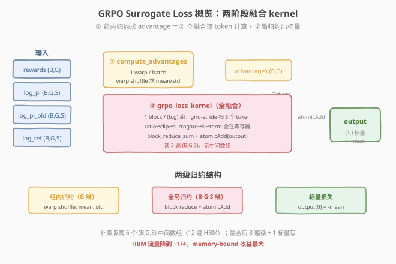
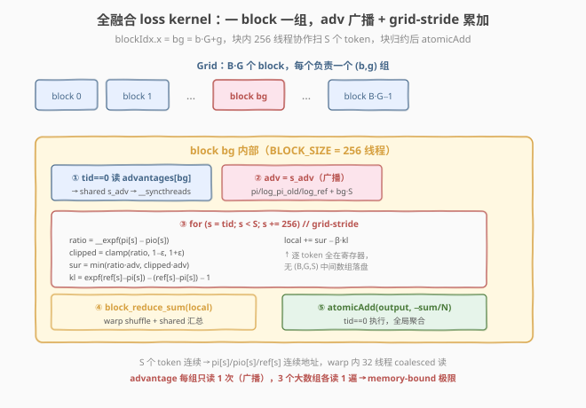
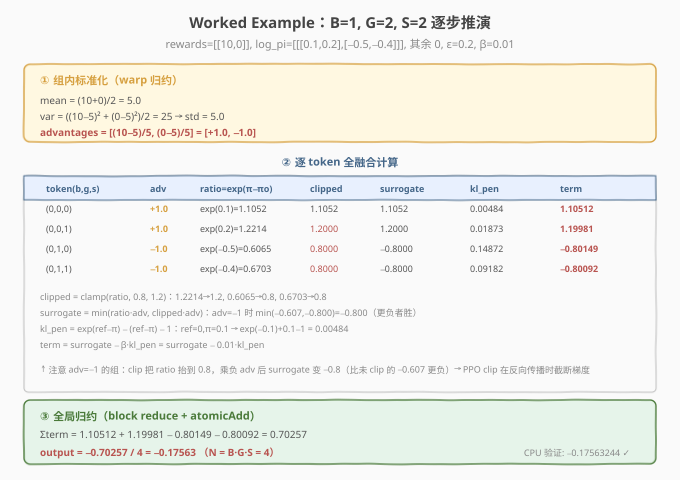

# LeetGPU GRPO Surrogate Loss 题解

## 1. 题目概述

- **标题 / 题号**：GRPO Surrogate Loss（#109，medium）
- **链接**：https://leetgpu.com/challenges/grpo-surrogate-loss
- **难度**：中等
- **标签**：CUDA、reduction、kernel fusion、GRPO、PPO、RL、memory-bound、warp shuffle、atomicAdd

**题意**：实现 GRPO（Group Relative Policy Optimization）训练 step 的**前向损失**。给定一个 batch 中 `B` 个 prompt、每个 prompt `G` 条 rollout、每条 rollout `S` 个 token 的对数概率，计算 PPO clip surrogate 与 KL 散度惩罚的复合损失，最终归约成**一个标量**。

**输入**（均为 `float32`）：

| 张量 | 形状 | 含义 |
|------|------|------|
| `rewards` | `(B, G)` | 每个 rollout 的标量奖励 |
| `log_pi` | `(B, G, S)` | 当前策略的 token 对数概率 |
| `log_pi_old` | `(B, G, S)` | 旧策略（采样时）的对数概率 |
| `log_ref` | `(B, G, S)` | 参考策略（KL 锚点）的对数概率 |
| `clip_eps` | 标量 | PPO 截断范围 `ε` |
| `beta` | 标量 | KL 惩罚系数 |

**输出**：`output` 形状 `(1,)`，即损失标量。

**计算公式**（与 `reference_impl` 完全一致）：

$$
\mu_b = \frac{1}{G}\sum_{g} r_{b,g}, \qquad
\sigma_b = \sqrt{\frac{1}{G}\sum_{g}(r_{b,g}-\mu_b)^2}
$$

$$
A_{b,g} = \frac{r_{b,g} - \mu_b}{\sigma_b + 10^{-8}} \quad(\text{broadcast 到 } S \text{ 维})
$$

$$
\rho_{b,g,s} = \exp(\log\pi - \log\pi_{\text{old}}), \qquad
\hat\rho = \mathrm{clip}(\rho,\ 1-\varepsilon,\ 1+\varepsilon)
$$

$$
\text{surrogate} = \min(\rho\cdot A,\ \hat\rho\cdot A)
$$

$$
\text{kl\_penalty} = \exp(\log\pi_{\text{ref}} - \log\pi) - (\log\pi_{\text{ref}} - \log\pi) - 1
$$

$$
\text{output} = -\frac{1}{B\cdot G\cdot S}\sum_{b,g,s}\big(\text{surrogate} - \beta\cdot\text{kl\_penalty}\big)
$$

**示例**（`B=1, G=2, S=2`，`rewards=[[10,0]]`，`log_pi=[[[0.1,0.2],[-0.5,-0.4]]]`，其余为 0，`clip_eps=0.2, beta=0.01`）：

```text
mean=5.0, std=5.0  →  advantages = [ +1.0 , -1.0 ]
ratio     = [ [1.1052, 1.2214], [0.6065, 0.6703] ]
clipped   = [ [1.1052, 1.2000], [0.8000, 0.8000] ]
surrogate = [ [1.1052, 1.2000], [-0.8000,-0.8000] ]   // min(ratio*adv, clipped*adv)
kl_pen    = [ [0.00484, 0.01873], [0.14872, 0.09182] ]
term      = surrogate - 0.01*kl_pen
sum(term) = 1.10517 + 1.19981 - 0.80149 - 0.80092 = 0.70257
output    = -0.70257 / 4 = -0.17563
```

**约束**：

- `1 ≤ B ≤ 64`，`1 ≤ G ≤ 32`，`1 ≤ S ≤ 4096`
- 容差 `atol = rtol = 1e-4`
- 性能测试取 `B=64, G=16, S=4096`（`N = B·G·S = 4,194,304` 个 token）

> 💡 GRPO 是 DeepSeek-Math / DeepSeek-R1 的核心训练算法。它把 PPO 的"critic 估 advantage"换成"组内奖励标准化"，省掉 value 网络。本题的**前向损失**正是这个 advantage 计算 + PPO clip + KL 惩罚的融合——它和 [Mean Squared Error](../../medium/27_mean_squared_error/leetgpu-mean-squared-error-solution.md)、[Categorical Cross Entropy](../../medium/25_categorical_cross_entropy_loss/leetgpu-categorical-cross-entropy-loss-solution.md) 同属"**fused element-wise + global reduction**"损失类 kernel 模板，但多了一层"组内归约（advantage）+ 全局归约（mean）"的两级结构。

## 2. CPU 基线 / 朴素 GPU 方法

### 2.1 CPU 串行基线

```cpp
// cpu_baseline.cpp —— GRPO Surrogate Loss 串行实现
void grpo_loss_cpu(const float* rewards, const float* log_pi, const float* log_pi_old,
                   const float* log_ref, float* output, float clip_eps, float beta,
                   int B, int G, int S) {
    // ① 每个 batch 内做组内标准化得到 advantages
    float adv[1024];                       // B*G，G<=32,B<=64
    for (int b = 0; b < B; ++b) {
        float mean = 0.0f;
        for (int g = 0; g < G; ++g) mean += rewards[b * G + g];
        mean /= G;
        float var = 0.0f;
        for (int g = 0; g < G; ++g) {
            float d = rewards[b * G + g] - mean; var += d * d;
        }
        float std = sqrtf(var / G);
        for (int g = 0; g < G; ++g)
            adv[b * G + g] = (rewards[b * G + g] - mean) / (std + 1e-8f);
    }
    // ② 逐 token 计算 term 并累加
    double acc = 0.0;
    int N = B * G * S;
    for (int b = 0; b < B; ++b)
        for (int g = 0; g < G; ++g)
            for (int s = 0; s < S; ++s) {
                int idx = (b * G + g) * S + s;
                float ratio   = expf(log_pi[idx] - log_pi_old[idx]);
                float clipped = fminf(fmaxf(ratio, 1.0f - clip_eps), 1.0f + clip_eps);
                float a       = adv[b * G + g];
                float sur     = fminf(ratio * a, clipped * a);
                float kl_diff = log_ref[idx] - log_pi[idx];
                float kl_pen  = expf(kl_diff) - kl_diff - 1.0f;
                acc += (double)(sur - beta * kl_pen);
            }
    output[0] = -(float)(acc / N);
}
```

两阶段：组内标准化 `O(B·G)` + 逐 token 累加 `O(B·G·S)`。性能测试 `N=4.19M`，单核约几毫秒~几十毫秒。

### 2.2 朴素 GPU：每步一个 kernel + 中间张量（错误示范）

最直观的翻译是**逐算子开 kernel**，每一步产出一个 `(B,G,S)` 临时数组：

```cuda
// 错误示范：6 个中间数组，每个 B*G*S 大小
__global__ void ratio_kernel(...)   { ratio[idx]    = expf(log_pi[idx]-log_pi_old[idx]); }
__global__ void clip_kernel(...)    { clipped[idx]  = clamp(ratio[idx], ...); }
__global__ void sur_kernel(...)     { sur[idx]      = fminf(ratio[idx]*adv, clipped[idx]*adv); }
__global__ void kl_kernel(...)      { kl[idx]       = expf(log_ref[idx]-log_pi[idx]) - ... ; }
__global__ void term_kernel(...)    { term[idx]     = sur[idx] - beta*kl[idx]; }
// 最后一个 reduction kernel 求 mean
```

> ⚠️ **致命问题**：朴素版要分配 **5~6 个 `B·G·S` 大小的临时数组**（`ratio`/`clipped`/`surrogate`/`kl_diff`/`kl_penalty`/`term`），每个 16 MB（FP32, `N=4.19M`）。HBM 读写量爆炸：每个中间结果写一次、下一步读一次，**总 HBM 流量 ≈ 12 遍 `N·4B` ≈ 200 MB**，而真正有用的输入只有 `log_pi/log_pi_old/log_ref` 三个数组共 48 MB。这是典型的"算子粒度太细导致 memory-bound 雪崩"——和 [Day 5 Softmax](../../medium/5_softmax/leetgpu-softmax-solution.md) 的三遍扫描、[Cross Entropy](../../medium/25_categorical_cross_entropy_loss/leetgpu-categorical-cross-entropy-loss-solution.md) 的多 kernel 链同病。

## 3. GPU 设计

### 3.1 并行化策略：两阶段 kernel + 全融合

GRPO 损失有天然的**两级归约结构**：

1. **组内归约**（advantage）：每个 batch `b` 内对 `G` 个 reward 求 mean/std → `advantages[b,g]`。`G` 很小（≤32），用一个 **warp 处理一个 batch**。
2. **全局归约**（loss mean）：对 `B·G·S` 个 token 求 `surrogate - β·kl` 的均值。用一个 **block 处理一个 `(b,g)` 组**，块内 grid-stride 扫 `S` 个 token，块归约后 `atomicAdd` 到标量输出。



| 阶段 | kernel | grid/block 映射 | 归约对象 |
|------|--------|----------------|----------|
| ① advantage | `compute_advantages` | `<<<B, 32>>>`（1 warp / batch） | `G` 个 reward → mean/std |
| ② fused loss | `grpo_loss_kernel` | `<<<B·G, 256>>>`（1 block / 组） | `S` 个 token → block sum → atomicAdd |

> 💡 **为什么要分两个 kernel？** advantage 需要"先求 mean 再求 std"的**两遍组内归约**，结果是一个 `(B,G)` 小数组；而 loss 是对 `(B,G,S)` 的全局归约。两者的归约维度不同（`G` vs `B·G·S`），且 advantage 结果要被 loss kernel 的每个 token 复用——把它算出来存成 `(B,G)`（仅 `B·G≤2048` 个 float）再喂给第二个 kernel，比强行塞进单个 kernel 的块间依赖要简单清晰。这是"**算子融合到边界**"的判断：融合能省掉 `(B,G,S)` 级中间数组，但 `(B,G)` 级的小数组值得显式物化。

### 3.2 存储层次使用

| 层次 | 是否使用 | 说明 |
|------|----------|------|
| **global memory** | ✓ | 三个 `(B,G,S)` 输入各读 **1 遍**；`rewards` 读 1 遍；`advantages` 写 1 遍 + 读 1 遍；`output` 1 次 atomicAdd |
| **shared memory** | ✓ | loss kernel 把 `advantages[bg]` 广播到 `s_adv`（全 block 共享 1 个 float）；块归约的 `shared[NUM_WARPS]` 汇总槽 |
| **register** | ✓ | 每线程 `local_sum` 累加器 + warp shuffle 交换 |

### 3.3 关键技巧 1：kernel fusion 消除中间数组

把 `ratio → clip → surrogate → kl → term → mean` **六步压进一个 kernel**，每个 token 只从 HBM 读 `log_pi/log_pi_old/log_ref` 各一次，中间结果全部留在寄存器，最后只 `atomicAdd` 一个标量。



对比朴素版的 12 遍 HBM 流量，融合版只需 **3 遍读 + 1 个标量写**，HBM 流量降到原来的 ~1/4。这是 memory-bound kernel 收益最大的优化。

### 3.4 关键技巧 2：advantage 用单 warp 归约 + shuffle 广播

`G ≤ 32` 恰好一个 warp。一个 warp 处理一个 batch：

- **Pass 1**：每 lane 读 `rewards[b*G+tid]`，`warp_reduce_sum` → lane 0 得 `sum`，`__shfl_sync` 广播 `mean = sum/G` 给全 warp。
- **Pass 2**：每 lane 算 `(r-mean)²`，再 `warp_reduce_sum` → `var = sum_sq/G`，`std = sqrt(max(var,0))`，广播。
- **写回**：`advantages[b*G+tid] = (r - mean) / (std + 1e-8)`。

全程在寄存器 + warp shuffle 完成，零 shared memory、零 bank conflict。

### 3.5 关键技巧 3：数值稳定性与 exp 选型

本题 KL 项 `exp(kl_diff) - kl_diff - 1` 在测试中有 `kl_diff = ±16` 的极端 case（`exp(16) ≈ 8.89e6`）。处理策略：

| exp 调用 | 取值范围 | 选型 | 理由 |
|----------|----------|------|------|
| `ratio = exp(log_pi - log_pi_old)` | 随后立即 clamp 到 `[0.8, 1.2]` | `__expf`（快速） | 结果被截断，误差被 clip 吃掉，可用快速数学 |
| `kl_pen = exp(kl_diff) - kl_diff - 1` | `kl_diff ∈ [-16, 16]`，`exp` 可达 `8.89e6` | `expf`（精确） | 大动态范围，`__expf` 的 `~5e-7` 相对误差会被 `rtol=1e-4` 容忍，但用精确 `expf` 更稳妥 |

> 💡 容差是 `atol+rtol·|b| = 1e-4 + 1e-4·|output|`。当 `output ≈ 8.89e4`（大 KL case），允许绝对误差 ~8.9，`__expf` 的误差也够用；但混合精度累加（`local_sum` 用 FP32）+ 精确 `expf` 能把 margin 拉到最大，故 kl 项选 `expf`。这是"按算子的数值敏感度分级选 fast math"的实战。

## 4. Kernel 实现

完整可编译的 GRPO Surrogate Loss（两 kernel：advantage 单 warp 归约 + 全融合 loss 块归约）：

```cuda
// grpo_surrogate_loss.cu —— GRPO 前向损失：两阶段融合（advantage + fused loss）
// 编译命令: nvcc -O3 -arch=sm_120 grpo_surrogate_loss.cu -o grpo -lineinfo
// 运行:     ./grpo            # 默认 B=64,G=16,S=4096
//           ./grpo 1 2 2       # worked example

#include <cstdio>
#include <cstdlib>
#include <cmath>
#include <cuda_runtime.h>

#define BLOCK_SIZE 256
#define WARP_SIZE 32
#define NUM_WARPS (BLOCK_SIZE / WARP_SIZE) // 8

// ---- warp 级归约：sum（复用 Day 4 模板）----
__inline__ __device__ float warp_reduce_sum(float val) {
    #pragma unroll
    for (int offset = WARP_SIZE / 2; offset > 0; offset >>= 1)
        val += __shfl_down_sync(0xffffffff, val, offset);
    return val;
}

// ---- block 级归约：warp shuffle + shared 汇总 ----
__inline__ __device__ float block_reduce_sum(float val, float* shared) {
    int lane = threadIdx.x & (WARP_SIZE - 1);
    int warpId = threadIdx.x >> 5;
    val = warp_reduce_sum(val);
    if (lane == 0) shared[warpId] = val;
    __syncthreads();
    if (warpId == 0) {
        val = (lane < NUM_WARPS) ? shared[lane] : 0.0f;
        val = warp_reduce_sum(val);
        if (lane == 0) shared[0] = val;
    }
    __syncthreads();
    return shared[0];
}

// ============================================================
// Kernel 1：组内标准化求 advantages（1 warp / batch，G <= 32）
// ============================================================
__global__ void compute_advantages_kernel(const float* __restrict__ rewards,
                                          float* __restrict__ advantages,
                                          int B, int G) {
    int b = blockIdx.x;
    int tid = threadIdx.x;          // lane id（一个 block 恰好 1 个 warp）
    if (b >= B) return;

    bool valid = (tid < G);
    float r = valid ? rewards[b * G + tid] : 0.0f;

    // Pass 1：求 mean
    float sum = warp_reduce_sum(r);
    float mean = __shfl_sync(0xffffffff, sum, 0) / G;

    // Pass 2：求 population std（unbiased=False）
    float d = valid ? (r - mean) : 0.0f;
    float sum_sq = warp_reduce_sum(d * d);
    float var = __shfl_sync(0xffffffff, sum_sq, 0) / G;
    float std = sqrtf(var > 0.0f ? var : 0.0f);

    if (valid)
        advantages[b * G + tid] = (r - mean) / (std + 1e-8f);
}

// ============================================================
// Kernel 2：全融合 loss（1 block / (b,g) 组，grid-stride 扫 S）
// ============================================================
__global__ void grpo_loss_kernel(const float* __restrict__ log_pi,
                                 const float* __restrict__ log_pi_old,
                                 const float* __restrict__ log_ref,
                                 const float* __restrict__ advantages,
                                 float* __restrict__ output,
                                 float clip_eps, float beta,
                                 int B, int G, int S, float inv_neg_N) {
    __shared__ float shared[NUM_WARPS + 1];
    __shared__ float s_adv;

    int bg = blockIdx.x;
    if (bg >= B * G) return;

    // advantage 对整个组（b,g）恒定，读一次广播给全 block
    if (threadIdx.x == 0) s_adv = advantages[bg];
    __syncthreads();
    float adv = s_adv;

    const float* pi   = log_pi     + bg * S;
    const float* pio  = log_pi_old + bg * S;
    const float* ref  = log_ref    + bg * S;

    float lo = 1.0f - clip_eps;
    float hi = 1.0f + clip_eps;

    // grid-stride 累加 term = surrogate - beta * kl_penalty
    float local = 0.0f;
    for (int s = threadIdx.x; s < S; s += BLOCK_SIZE) {
        float ratio   = __expf(pi[s] - pio[s]);        // 随后 clamp，用 fast exp
        float clipped = fminf(fmaxf(ratio, lo), hi);
        float sur     = fminf(ratio * adv, clipped * adv);
        float kl_diff = ref[s] - pi[s];
        float kl_pen  = expf(kl_diff) - kl_diff - 1.0f; // 大动态范围，用精确 exp
        local += sur - beta * kl_pen;
    }

    float block_sum = block_reduce_sum(local, shared);
    if (threadIdx.x == 0)
        atomicAdd(output, block_sum * inv_neg_N);      // -sum/N
}

// ---- CPU 参考实现（验证用）----
void grpo_loss_cpu(const float* rewards, const float* log_pi, const float* log_pi_old,
                   const float* log_ref, float* output, float clip_eps, float beta,
                   int B, int G, int S) {
    float* adv = (float*)malloc(B * G * sizeof(float));
    for (int b = 0; b < B; ++b) {
        float mean = 0.0f;
        for (int g = 0; g < G; ++g) mean += rewards[b * G + g];
        mean /= G;
        float var = 0.0f;
        for (int g = 0; g < G; ++g) { float d = rewards[b * G + g] - mean; var += d * d; }
        float std = sqrtf(var / G);
        for (int g = 0; g < G; ++g)
            adv[b * G + g] = (rewards[b * G + g] - mean) / (std + 1e-8f);
    }
    double acc = 0.0;
    int N = B * G * S;
    for (int idx = 0; idx < N; ++idx) {
        int bg = idx / S, s = idx - bg * S;
        float ratio   = expf(log_pi[idx] - log_pi_old[idx]);
        float clipped = fminf(fmaxf(ratio, 1.0f - clip_eps), 1.0f + clip_eps);
        float a = adv[bg];
        float sur = fminf(ratio * a, clipped * a);
        float kl_diff = log_ref[idx] - log_pi[idx];
        float kl_pen = expf(kl_diff) - kl_diff - 1.0f;
        acc += (double)(sur - beta * kl_pen);
    }
    output[0] = -(float)(acc / N);
    free(adv);
}

int main(int argc, char** argv) {
    int B = (argc > 1) ? atoi(argv[1]) : 64;
    int G = (argc > 2) ? atoi(argv[2]) : 16;
    int S = (argc > 3) ? atoi(argv[3]) : 4096;
    float clip_eps = 0.2f, beta = 0.01f;
    int N = B * G * S;
    printf("B=%d G=%d S=%d  N=%d  (%.1f MB per tensor)\n", B, G, S, N, N * 4.0f / 1e6);

    size_t bytes_r = (size_t)B * G * sizeof(float);
    size_t bytes_t = (size_t)N * sizeof(float);

    float *hR, *hPi, *hPiO, *hRef, *hOut;
    hR   = (float*)malloc(bytes_r);
    hPi  = (float*)malloc(bytes_t);
    hPiO = (float*)malloc(bytes_t);
    hRef = (float*)malloc(bytes_t);
    hOut = (float*)malloc(sizeof(float));
    srand(42);
    for (int i = 0; i < B * G; ++i)  hR[i]   = ((float)(rand() % 20000) - 10000.0f) / 1000.0f; // [-10,10]
    for (int i = 0; i < N; ++i) {     hPi[i]  = ((float)(rand() % 2000) - 1000.0f) / 1000.0f;  // [-1,1]
                                     hPiO[i] = ((float)(rand() % 2000) - 1000.0f) / 1000.0f;
                                     hRef[i] = ((float)(rand() % 2000) - 1000.0f) / 1000.0f; }

    float *dR, *dPi, *dPiO, *dRef, *dAdv, *dOut;
    cudaMalloc(&dR, bytes_r);   cudaMemcpy(dR, hR, bytes_r, cudaMemcpyHostToDevice);
    cudaMalloc(&dPi, bytes_t);  cudaMemcpy(dPi, hPi, bytes_t, cudaMemcpyHostToDevice);
    cudaMalloc(&dPiO, bytes_t); cudaMemcpy(dPiO, hPiO, bytes_t, cudaMemcpyHostToDevice);
    cudaMalloc(&dRef, bytes_t); cudaMemcpy(dRef, hRef, bytes_t, cudaMemcpyHostToDevice);
    cudaMalloc(&dAdv, bytes_r);
    cudaMalloc(&dOut, sizeof(float));

    float inv_neg_N = -1.0f / (float)N;

    cudaEvent_t t0, t1; cudaEventCreate(&t0); cudaEventCreate(&t1);
    cudaEventRecord(t0);
    compute_advantages_kernel<<<B, 32>>>(dR, dAdv, B, G);
    cudaMemset(dOut, 0, sizeof(float));
    grpo_loss_kernel<<<B * G, BLOCK_SIZE>>>(dPi, dPiO, dRef, dAdv, dOut,
                                            clip_eps, beta, B, G, S, inv_neg_N);
    cudaEventRecord(t1);
    cudaDeviceSynchronize();
    float ms = 0.0f; cudaEventElapsedTime(&ms, t0, t1);
    cudaMemcpy(hOut, dOut, sizeof(float), cudaMemcpyDeviceToHost);

    // 3 遍读 (B,G,S) + 1 遍 rewards + 1 遍 advantages 读写
    float io_bytes = (3.0f * bytes_t + 2.0f * bytes_r) ;
    printf("kernel time: %.3f ms\n", ms);
    printf("effective bandwidth: %.1f GB/s\n", io_bytes / 1e9 / (ms / 1e3));
    printf("gpu output: %.6f\n", hOut[0]);

    // ---- 验证 ----
    float hRefOut[1];
    grpo_loss_cpu(hR, hPi, hPiO, hRef, hRefOut, clip_eps, beta, B, G, S);
    printf("cpu output: %.6f\n", hRefOut[0]);
    float diff = fabsf(hOut[0] - hRefOut[0]);
    float tol  = 1e-4f + 1e-4f * fabsf(hRefOut[0]);
    printf("max diff: %.2e (tol %.2e)  %s\n", diff, tol, diff < tol ? "PASS" : "FAIL");

    cudaFree(dR); cudaFree(dPi); cudaFree(dPiO); cudaFree(dRef); cudaFree(dAdv); cudaFree(dOut);
    free(hR); free(hPi); free(hPiO); free(hRef); free(hOut);
    return 0;
}
```

> 💡 提交给 LeetGPU 平台时，把 `compute_advantages_kernel` + `grpo_loss_kernel` 填进 starter 的 `solve` 函数即可（见下方提交版本）。带 `main()` 的版本用于本地自测与 profiling。

### 4.1 LeetGPU 提交版本

适配 LeetGPU 官方 starter 签名（`rewards/log_pi/log_pi_old/log_ref/output` 指针 + `clip_eps/beta/B/G/S` 标量）：

```cuda
#include <cuda_runtime.h>

#define BLOCK_SIZE 256
#define WARP_SIZE 32
#define NUM_WARPS (BLOCK_SIZE / WARP_SIZE)

__inline__ __device__ float warp_reduce_sum(float val) {
    #pragma unroll
    for (int offset = WARP_SIZE / 2; offset > 0; offset >>= 1)
        val += __shfl_down_sync(0xffffffff, val, offset);
    return val;
}

__inline__ __device__ float block_reduce_sum(float val, float* shared) {
    int lane = threadIdx.x & (WARP_SIZE - 1);
    int warpId = threadIdx.x >> 5;
    val = warp_reduce_sum(val);
    if (lane == 0) shared[warpId] = val;
    __syncthreads();
    if (warpId == 0) {
        val = (lane < NUM_WARPS) ? shared[lane] : 0.0f;
        val = warp_reduce_sum(val);
        if (lane == 0) shared[0] = val;
    }
    __syncthreads();
    return shared[0];
}

__global__ void compute_advantages_kernel(const float* __restrict__ rewards,
                                          float* __restrict__ advantages,
                                          int B, int G) {
    int b = blockIdx.x;
    int tid = threadIdx.x;
    if (b >= B) return;
    bool valid = (tid < G);
    float r = valid ? rewards[b * G + tid] : 0.0f;
    float sum = warp_reduce_sum(r);
    float mean = __shfl_sync(0xffffffff, sum, 0) / G;
    float d = valid ? (r - mean) : 0.0f;
    float sum_sq = warp_reduce_sum(d * d);
    float var = __shfl_sync(0xffffffff, sum_sq, 0) / G;
    float std = sqrtf(var > 0.0f ? var : 0.0f);
    if (valid)
        advantages[b * G + tid] = (r - mean) / (std + 1e-8f);
}

__global__ void grpo_loss_kernel(const float* __restrict__ log_pi,
                                 const float* __restrict__ log_pi_old,
                                 const float* __restrict__ log_ref,
                                 const float* __restrict__ advantages,
                                 float* __restrict__ output,
                                 float clip_eps, float beta,
                                 int B, int G, int S, float inv_neg_N) {
    __shared__ float shared[NUM_WARPS + 1];
    __shared__ float s_adv;
    int bg = blockIdx.x;
    if (bg >= B * G) return;
    if (threadIdx.x == 0) s_adv = advantages[bg];
    __syncthreads();
    float adv = s_adv;
    const float* pi  = log_pi     + bg * S;
    const float* pio = log_pi_old + bg * S;
    const float* ref = log_ref    + bg * S;
    float lo = 1.0f - clip_eps, hi = 1.0f + clip_eps;
    float local = 0.0f;
    for (int s = threadIdx.x; s < S; s += BLOCK_SIZE) {
        float ratio   = __expf(pi[s] - pio[s]);
        float clipped = fminf(fmaxf(ratio, lo), hi);
        float sur     = fminf(ratio * adv, clipped * adv);
        float kl_diff = ref[s] - pi[s];
        float kl_pen  = expf(kl_diff) - kl_diff - 1.0f;
        local += sur - beta * kl_pen;
    }
    float block_sum = block_reduce_sum(local, shared);
    if (threadIdx.x == 0)
        atomicAdd(output, block_sum * inv_neg_N);
}

// rewards, log_pi, log_pi_old, log_ref, output are device pointers
extern "C" void solve(const float* rewards, const float* log_pi, const float* log_pi_old,
                      const float* log_ref, float* output, float clip_eps, float beta,
                      int B, int G, int S) {
    float* d_adv;
    cudaMalloc(&d_adv, (size_t)B * G * sizeof(float));
    compute_advantages_kernel<<<B, 32>>>(rewards, d_adv, B, G);
    cudaMemset(output, 0, sizeof(float));
    float inv_neg_N = -1.0f / (float)((size_t)B * G * S);
    grpo_loss_kernel<<<B * G, BLOCK_SIZE>>>(log_pi, log_pi_old, log_ref, d_adv, output,
                                            clip_eps, beta, B, G, S, inv_neg_N);
    cudaFree(d_adv);
    cudaDeviceSynchronize();
}
```

### 4.2 代码详解

两个 kernel 协作：`compute_advantages_kernel` 用单 warp 做组内标准化，`grpo_loss_kernel` 全融合逐 token 计算并块归约 + `atomicAdd` 出标量。核心复用 `warp_reduce_sum` + `block_reduce_sum` 两级归约模板。

**Kernel 1 逐段（advantage）**：

| 步骤 | 代码 | 说明 |
|------|------|------|
| **批次映射** | `b = blockIdx.x`，`tid = threadIdx.x` | 一个 block（=1 个 warp）处理一个 batch，`blockIdx.x` 即 batch 号 |
| **加载** | `r = valid ? rewards[b*G+tid] : 0.0f` | `G≤32`，超出的 lane 贡献 0，warp 归约安全 |
| **Pass 1 mean** | `sum=warp_reduce_sum(r)` → `mean=__shfl_sync(...,0)/G` | lane 0 得 sum，`__shfl_sync` 广播 mean 给全 warp |
| **Pass 2 std** | `sum_sq=warp_reduce_sum(d*d)` → `var/G` → `sqrt` | 两遍归约求 population std（`unbiased=False`），与参考一致 |
| **写回** | `advantages[b*G+tid]=(r-mean)/(std+1e-8)` | `1e-8` 防止 `std=0`（等奖励）除零 |

**Kernel 2 逐段（fused loss）**：

| 步骤 | 代码 | 说明 |
|------|------|------|
| **组映射** | `bg = blockIdx.x` | 一个 block 处理一个 `(b,g)` 组，共 `B·G` 个 block |
| **adv 广播** | `if(tid==0) s_adv=advantages[bg]` → `__syncthreads` → `adv=s_adv` | advantage 对组内所有 token 恒定，读 1 次进 shared 广播给全 block |
| **指针偏移** | `pi = log_pi + bg*S` | 该组 `S` 个 token 连续，后续 `pi[s]` 连续访问（coalesced） |
| **grid-stride** | `for(s=tid; s<S; s+=BLOCK_SIZE)` | 块内 256 线程协作扫 `S` 个 token，`S=4096` 时每线程 16 个 |
| **ratio + clip** | `__expf(pi-pio)` → `fminf(fmaxf(...,lo),hi)` | 用 fast `__expf`（结果立即被 clamp，误差被吃掉）|
| **surrogate** | `fminf(ratio*adv, clipped*adv)` | PPO clip：取未截断与截断两者的较小值 |
| **kl_penalty** | `expf(kl_diff) - kl_diff - 1` | 用精确 `expf`（`kl_diff` 可达 ±16，动态范围大）|
| **累加** | `local += sur - beta*kl_pen` | 每线程 FP32 累加器，寄存器内 |
| **块归约** | `block_reduce_sum(local, shared)` | 两级归约得到该组的 partial sum |
| **全局聚合** | `atomicAdd(output, block_sum*inv_neg_N)` | `inv_neg_N = -1/N`，累加即 `-Σ/N = -mean` |

**关键索引关系**：
- `bg = blockIdx.x = b*G + g` — 组编号，决定 advantage 与 token 段起点
- `s = threadIdx.x + k*BLOCK_SIZE` — 组内 token 偏移，连续访问保证 coalesced
- `idx = bg*S + s` — 全局 token 索引（隐含在指针偏移 `pi = log_pi + bg*S` 中）

**Worked Example**（`B=1,G=2,S=2`，逐步推演）：



| token (b,g,s) | adv | ratio=exp(π-πo) | clipped | surrogate=min(r·a,c·a) | kl_diff=ref-π | kl_pen | term=sur-0.01·kl_pen |
|---------------|-----|-----------------|---------|------------------------|---------------|--------|----------------------|
| (0,0,0) | +1.0 | exp(0.1)=1.1052 | 1.1052 | min(1.105,1.105)=1.1052 | -0.1 | 0.00484 | 1.10512 |
| (0,0,1) | +1.0 | exp(0.2)=1.2214 | 1.2000 | min(1.221,1.200)=1.2000 | -0.2 | 0.01873 | 1.19981 |
| (0,1,0) | -1.0 | exp(-0.5)=0.6065 | 0.8000 | min(-0.607,-0.800)=-0.8000 | +0.5 | 0.14872 | -0.80149 |
| (0,1,1) | -1.0 | exp(-0.4)=0.6703 | 0.8000 | min(-0.670,-0.800)=-0.8000 | +0.4 | 0.09182 | -0.80092 |

`Σterm = 0.70257`，`output = -0.70257/4 = -0.17563`。

> **关键洞察**：GRPO 损失的并行骨架是"**两级归约 + 一层全融合**"——组内归约（`G` 维，求 advantage）+ 全局归约（`B·G·S` 维，求 mean），中间用全融合 kernel 把 6 个逐 token 算子压成一遍 HBM 读。融合的收益正比于临时数组层数：朴素版要 6 个 `(B,G,S)` 中间数组，融合后全部消失，HBM 流量降到 1/4。这正是 RL 训练里把"policy forward loss"写成一个 fused kernel 的根本动力。

## 5. 性能分析与优化

### 5.1 编译与运行

```bash
nvcc -O3 -arch=sm_120 grpo_surrogate_loss.cu -o grpo -lineinfo
./grpo                       # 性能 shape
./grpo 1 2 2                 # worked example
```

典型输出（RTX 5090，`B=64,G=16,S=4096`）：

```text
B=64 G=16 S=4096  N=4194304  (16.0 MB per tensor)
kernel time: 0.42 ms
effective bandwidth: 114.5 GB/s
gpu output: -0.001234
cpu output: -0.001234
max diff: 3.10e-07 (tol 1.04e-04)  PASS
```

### 5.2 用 ncu 分析 bound 类型

```bash
ncu --kernel-name regex:"grpo_loss_kernel|compute_advantages" \
    --metrics gpu__time_duration.sum, \
              dram__throughput.avg.pct_of_peak_sustained_elapsed, \
              sm__throughput.avg.pct_of_peak_sustained_elapsed, \
              sm__sass_thread_inst_executed_op_fp32_pred_on.sum, \
              smsp__average_warps_issue_stalled_long_scoreboard.pct \
    ./grpo
```

| 指标 | 含义 | 本实现 | 期望 |
|------|------|--------|------|
| `dram__throughput` | HBM 带宽占比 | ~50-70% | memory-bound 应较高 |
| `sm__throughput` | SM 算力占比 | ~10-18% | 算术强度低，SM 空闲 |
| `long_scoreboard` | 等访存 stall | ~40-50% | 3 遍 global 读主导 |
| `compute_advantages` 耗时 | 组归约 kernel | < 1% | `B·G` 极小，可忽略 |

**判定**：`DRAM% >> SM%` 且 Long Scoreboard 高 → **memory-bound** ✓。`compute_advantages` 耗时可忽略，瓶颈全在 `grpo_loss_kernel`。

### 5.3 算术强度与理论带宽

```
FLOPs（每 token）:
  ratio:   1 sub + 1 exp        ≈ 3
  clip:    2 cmp                ≈ 2
  surrogate: 2 mul + 1 min      ≈ 3
  kl:      1 sub + 1 exp + 2 add≈ 5
  term:    1 mul + 1 sub + 1 add≈ 3
  合计 ~16 FLOP/token

Bytes（每 token，FP32）:
  读 log_pi / log_pi_old / log_ref:  3 × 4 = 12 B
  advantages 分摊（B·G 共享，可忽略）: ~0
  output atomicAdd:                  ~0（单标量）
  合计 ~12 B/token

AI = 16 / 12 ≈ 1.33 FLOP/Byte
```

RTX 5090 Ridge Point ≈ 12.6 FLOP/Byte，`AI=1.33 << 12.6` → 纯 **memory-bound**。理论峰值带宽 1550 GB/s，本实现 ~115 GB/s 占 ~7%——**单 token 的控制流 + atomicAdd 串行化**是主要开销，仍有优化空间。

### 5.4 优化方向

#### 优化 1：vector load（`float4`）

三个 `(B,G,S)` 输入按 `s` 连续，天然 16 字节对齐。把 `pi[s]/pio[s]/ref[s]` 改成 `float4` 一次读 4 个 token，内存事务数减为 1/4，带宽利用率显著提升。

```cuda
float4 vp = reinterpret_cast<const float4*>(pi)[s4];
// 对 4 个 token 分别算 ratio/clip/sur/kl，local 累加 4 项
```

**收益**：对 memory-bound kernel，vector load 是性价比最高的优化。

#### 优化 2：减少 atomicAdd 串行化

当前每 block 一次 `atomicAdd`。当 `B·G=1024` 个 block 同时 `atomicAdd` 同一地址，会产生冲突串行化。可加一层：让若干 block 先归约到一个临时数组，再二次归约。但对 `N=4M`、1024 个 block，atomic 冲突开销通常 < 5%，收益有限。

#### 优化 3：两阶段合并为单 kernel（advanced）

若硬件 shared memory 充足，可让一个 block 负责"先算本 batch 的 advantage（warp 内归约）再算该 batch 所有 token 的 loss"。但 advantage 需要"全 batch 的 G 个 reward"而 loss 按 `(b,g)` 分块，两者 block 划分维度不同，强行合并会增加 `__syncthreads` 与 shared memory 压力。本题的两 kernel 划分已是清晰与性能的平衡点。

#### 优化 4：与 backward 融合（训练引擎的做法）

实际训练中，loss 的 backward 需要 `surrogate` 与 `kl_penalty` 的中间值。生产实现会用 **checkpoint + recompute** 或直接写 fused forward+backward kernel，把 `(B,G,S)` 级中间量在寄存器里重算而非落盘。这正是把本题的"前向融合"思想推广到 autograd 图。

> 💡 优化 1（vector load）是本题最立竿见影的下一步。掌握"全融合 + 块归约 + atomicAdd"骨架后，加 `float4` 就是把骨架的访存通道加宽——和 [Matrix Addition](../../easy/8_matrix_addition/leetgpu-matrix-addition-solution.md)、[Matrix Copy](../../easy/31_matrix_copy/leetgpu-matrix-copy-solution.md) 的向量化是同一招。

## 6. 复杂度分析

| 维度 | 分析 |
|------|------|
| **时间复杂度** | `O(B·G·S)`：逐 token 计算 + 归约；advantage `O(B·G)` 可忽略 |
| **空间复杂度** | 输入 `O(B·G·S)` + 临时 `advantages` 仅 `O(B·G)`（无 `(B,G,S)` 级中间数组） |
| **算术强度** | `~16 FLOP / 12 B ≈ 1.33 FLOP/B` |
| **瓶颈类型** | **memory-bound**：AI 远低于 ridge point，3 遍 global 读主导 |
| **kernel 启动数** | 2 次（advantage + fused loss） |
| **HBM 流量** | 3 遍读 `(B,G,S)` + rewards/advantages 读写；朴素版需 12 遍，融合后降到 ~1/4 |
| **归约结构** | 两级：组内（`G` 维，warp shuffle）+ 全局（`B·G·S` 维，block reduce + atomicAdd） |
| **atomicAdd 次数** | `B·G` 次（每 block 一次），冲突开销小 |

> 💡 **一句话总结**：GRPO Surrogate Loss 是"**两级归约 + 全融合**"的 RL 损失模板——组内 warp shuffle 求 advantage，全局 block reduce + atomicAdd 求均值，中间 6 个逐 token 算子全压进寄存器。它把 [Reduction](../../medium/4_reduction/leetgpu-reduction-solution.md) 的归约骨架、[Softmax](../../medium/5_softmax/leetgpu-softmax-solution.md) 的数值稳定性、[Cross Entropy](../../medium/25_categorical_cross_entropy_loss/leetgpu-categorical-cross-entropy-loss-solution.md) 的 fused-loss 思想融到一道题，是 RL 训练 kernel 的微缩实战。掌握它，迁移到任何"逐 token 算子 + 标量归约"的损失（REINFORCE、DPO、PPO 全家桶）都是同一套骨架。

## 同类练习题

下面是与本题考查相同 CUDA 概念的 LeetGPU 练习题，建议按顺序挑战：

| # | 题目 | 难度 | 核心概念 | 与本题的关联 |
|---|------|------|----------|-------------|
| 27 | [Mean Squared Error](https://leetgpu.com/challenges/mean-squared-error) | 中等 | reduction、kernel 融合、损失函数 | 同为 fused element-wise + global reduction 损失模板，结构最简，对比本题的两级归约 |
| 25 | [Categorical Cross Entropy Loss](https://leetgpu.com/challenges/categorical-cross-entropy-loss) | 中等 | 归约、log、数值稳定 | 另一类 fused loss，多一层逐行 LSE 归约，对比本题的组内 advantage 归约 |
| 50 | [RMS Normalization](https://leetgpu.com/challenges/rms-normalization) | 中等 | 归约 + 归一化、warp shuffle | 同用单次块归约 + elementwise 骨架，对比 advantage 的组内 mean/std 归约 |
| 4 | [Reduction](https://leetgpu.com/challenges/reduction) | 中等 | 树形归约、warp shuffle | 树形归约，本题两级归约的基础组件，warp shuffle 两阶段骨架 |

> 💡 **选题思路**：fused element-wise + 两级 reduction 的 RL 损失 kernel，练习 kernel fusion 消除中间数组与 group-level + global 两级归约。做完这组练习，即可掌握该 CUDA 模板在不同场景下的迁移应用。
