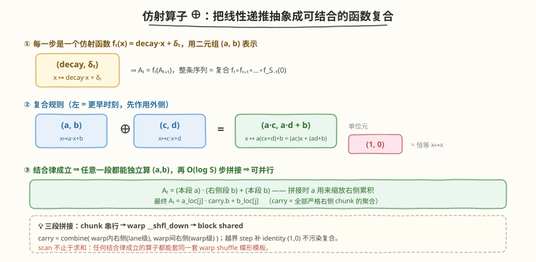
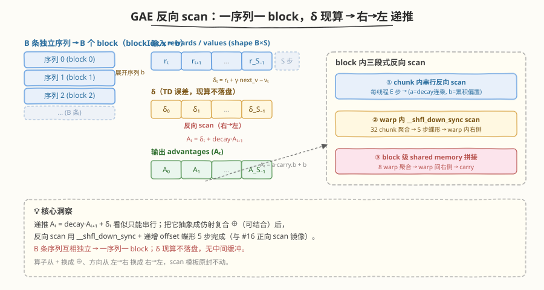
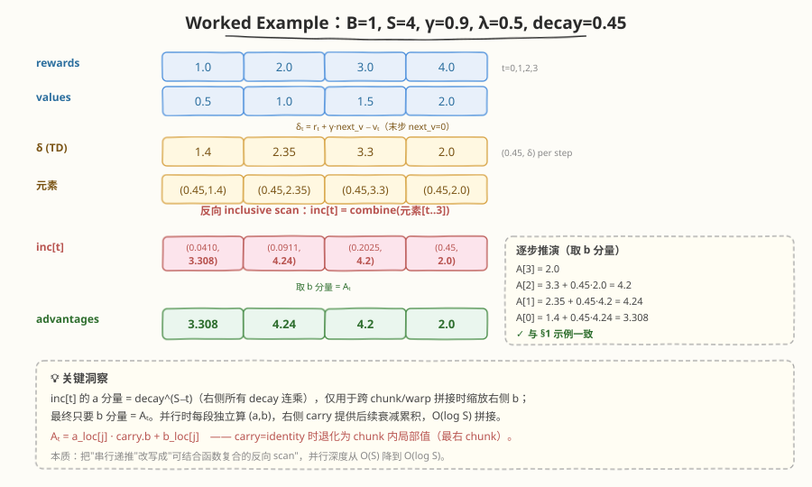

# LeetGPU Parallel Reverse Scan (GAE) 题解

## 1. 题目概述

- **标题 / 题号**：Parallel Reverse Scan (GAE)（#110，medium）
- **链接**：https://leetgpu.com/challenges/gae-reverse-scan
- **难度**：中等
- **标签**：CUDA、Scan、Reverse Scan、Linear Recurrence、warp shuffle `__shfl_down_sync`、GAE、RL、memory-bound

**题意**：计算强化学习里 PPO/GRPO 用的 **Generalized Advantage Estimation（GAE）**。给定 `B` 条轨迹，每条长 `S` 步的 `rewards` 与 `values`，以及折扣 `gamma`、GAE 参数 `lam`，输出每步的 `advantages[B][S]`。

参考实现是**从右向左**的递推（`t` 从 `S-1` 到 `0`）：

$$
\delta_t = r_t + \gamma \cdot \text{next\_value}_t - v_t,\qquad \text{next\_value}_t = \begin{cases} v_{t+1} & t < S-1 \\ 0 & t = S-1 \end{cases}
$$

$$
A_t = \delta_t + \underbrace{(\gamma\lambda)}_{\text{decay}} \cdot A_{t+1},\qquad A_S = 0
$$

即每步的优势 = 当前 TD 误差 `δ` + 衰减因子 `decay` 乘以"未来所有步的累积优势"。这是一个**带乘性衰减的线性递推**，本质是一次**反向（右→左）前缀扫描**。

**示例**（官方 example，`B=1, S=4`，`γ=0.9, λ=0.5`）：

```text
rewards = [1.0, 2.0, 3.0, 4.0]
values  = [0.5, 1.0, 1.5, 2.0]
decay   = γ·λ = 0.45

δ = [1.4, 2.35, 3.3, 2.0]
反向递推:
  A[3] = 2.0
  A[2] = 3.3  + 0.45·2.0   = 4.2
  A[1] = 2.35 + 0.45·4.2   = 4.24
  A[0] = 1.4  + 0.45·4.24  = 3.308
advantages = [3.308, 4.24, 4.2, 2.0]
```

**约束**：

- `B` 条序列、每条 `S` 步，`rewards/values/advantages` 形状均为 `(B, S)`，`float32`
- `0 ≤ γ ≤ 1`、`0 ≤ λ ≤ 1`（`γ=0` 退化为单步 TD，`λ=0` 退化为无 carry）
- 功能测试最大 `B=64, S=4096`；性能测试固定 `B=64, S=4096`（共 262144 元素）
- 容差 `atol=1e-3, rtol=1e-3`

> 💡 这是 **scan** 家族的进阶题。与 #16 Prefix Sum 的"正向加法 scan"相比，本题有三大新难点：① **方向反了**——从右向左扫（advantage 依赖"未来"）；② **算子不是加法**——是带衰减的线性递推 `A_t = δ_t + decay·A_{t+1}`，须抽象成可结合的仿射变换；③ **batch 并行**——`B` 条序列各自独立，天然适合"一序列一 block"。核心洞察是：**任何结合律成立的算子都能用同一套 warp shuffle scan 模板并行化**，scan 不止于求和。

## 2. CPU 基线 / 朴素 GPU 方法

### 2.1 CPU 串行基线

```cpp
// cpu_baseline.cpp —— CPU 串行反向递推（与参考实现一致）
void gae_cpu(const float* rewards, const float* values, float* adv,
             float gamma, float lam, int B, int S) {
    float decay = gamma * lam;
    for (int b = 0; b < B; ++b) {
        const float* rw = rewards + b * S;
        const float* vl = values  + b * S;
        float*       ad = adv     + b * S;
        float last = 0.0f;                       // A_S = 0
        for (int t = S - 1; t >= 0; --t) {
            float nv   = (t + 1 < S) ? vl[t + 1] : 0.0f;
            float delta = rw[t] + gamma * nv - vl[t];
            last = delta + decay * last;         // A_t = δ_t + decay·A_{t+1}
            ad[t] = last;
        }
    }
}
```

`B=64, S=4096` 时单核约 0.3–0.5 ms。瓶颈：**每条序列内部是串行递推**——`A_t` 依赖 `A_{t+1}`，看似无法并行；只有 `B` 条序列之间互相独立。

### 2.2 朴素 GPU：为什么 atomicAdd 行不通

最暴力的并行：一个线程处理一条序列（`B` 个线程），每线程内部仍串行递推。或者更糟——试图用 `atomicAdd` 让多线程协作算同一条序列。

```cuda
__global__ void gae_naive(const float* rewards, const float* values, float* adv,
                          float gamma, float lam, int B, int S) {
    int b = blockIdx.x * blockDim.x + threadIdx.x;
    if (b < B) {
        // ❌ 单线程串行递推整条序列：B=64 时只用到 64 个线程，GPU 99% 空闲
        // ❌ 无法用 atomic 把"未来累积"并行化：A_t 依赖 A_{t+1}，atomic 必然串行化
    }
}
```

**致命问题**：递推 `A_t = δ_t + decay·A_{t+1}` 是**顺序依赖**，`atomicAdd` 只能把累加器串行化，N 步就是 N 次串行。而"一序列一线程"只用到 `B=64` 个线程，GPU 上几万个核几乎全空转。

> ⚠️ 核心矛盾：递推看似串行，但一旦把"步"抽象成**可结合的算子**，就能用蝶形 scan 把 `O(S)` 串行深度压成 `O(log S)` 并行深度。这正是 #16 Prefix Sum 用过的招——只是算子从"加法"换成了"仿射复合"。

## 3. GPU 设计

### 3.1 把线性递推改造成结合律成立的 scan

关键一步：把每步的递推 `A_t = decay·A_{t+1} + δ_t` 看成一个**仿射函数** $f_t(x) = \text{decay}\cdot x + \delta_t$，于是 $A_t = f_t(A_{t+1})$。整条序列就是这些函数的复合：

$$
A_t = f_t \circ f_{t+1} \circ \cdots \circ f_{S-1}(0)
$$

用二元组 $(a, b)$ 表示仿射函数 $x \mapsto a\cdot x + b$，则**函数复合**就是：

$$
(a,b) \oplus (c,d) \;=\; (a\cdot c,\; a\cdot d + b)
\qquad\text{（左边的函数后作用，即"更早时刻"）}
$$

验证：$f_{(a,b)}(f_{(c,d)}(x)) = a(cx+d)+b = (ac)x + (ad+b)$。✓



这个 $\oplus$ **满足结合律**（函数复合天然可结合），且单位元为 $(1, 0)$（恒等函数 $x\mapsto x$）：

$$
(1,0)\oplus(c,d)=(c,d),\qquad (a,b)\oplus(1,0)=(a,b)
$$

于是 $A_t$ 就是元素序列 $\big((\text{decay},\delta_t)\big)_{t}$ 在 $\oplus$ 下的**反向 inclusive scan**（包含自身及右侧所有步）的"常数项" $b$ 分量。**只要算子可结合，#16 那套 warp shuffle scan 模板就能直接套用**——只是方向从"左→右"换成"右→左"，加法换成 $\oplus$。

> 💡 **为什么 `a` 分量也要带着算？** 反向 scan 的"右侧累积"要跨 chunk / 跨 warp 拼接。`a` 分量 = 该段所有 decay 的连乘积，拼接时把"右侧段"的 $b$ 缩放后加到本段：`combine(本段, 右侧段) = (本段.a·右侧.a, 本段.a·右侧.b + 本段.b)`。最终 `A_t = 本段.a · 右侧.b + 本段.b`。这正是 scan 能并行的关键——每段独立算出自己的 $(a,b)$，再 $O(\log)$ 步拼接。

### 3.2 并行化策略：一序列一 block + 三段式反向 scan

`B` 条序列互相独立 → **一个 block 处理一条序列**（grid = `B` 个 block）。block 内对 `S` 步做反向 scan：



1. **阶段① chunk 内串行反向 scan**：block 有 `THREADS=256` 线程，每线程负责连续 `E=⌈S/256⌉` 步（`E≤16` 覆盖 `S≤4096`）。线程从高 `j` 到低 `j` 串行算出本 chunk 的反向 inclusive $(a_j, b_j)$（$a_j$ = 这段 decay 连乘，$b_j$ = 这段累积偏置），并得到 chunk 聚合 = `local_inclusive[0]`。
2. **阶段② warp 内反向 scan**：256 线程 = 8 个 warp。每个 warp 用 `__shfl_down_sync` + 递增 offset（1,2,4,8,16）对 32 个 chunk 聚合做反向 inclusive scan，得到"本 warp 内严格右侧 chunk 的聚合"。
3. **阶段③ block 级拼接**：8 个 warp 聚合写入 shared memory，由 thread 0 串行做 8 元素反向 scan，得到"本 warp 严格右侧 warp 的聚合"；每线程的 chunk carry = `combine(warp内右侧, warp间右侧)`。
4. **阶段④ 写回**：`A_t = a_loc[j] · carry.b + b_loc[j]`。

### 3.3 存储层次使用

| 层次 | 是否使用 | 说明 |
|------|----------|------|
| **global memory** | ✓ | `rewards`/`values` 只读、`advantages` 写回；无中间缓冲（δ 现算不落盘） |
| **shared memory** | ✓ | 8 个 warp 聚合 `s_warp[8]` + 8 个 warp 间 carry `s_carry[8]`，共 64B |
| **register** | ✓ | 每线程 `a_loc[E_MAX]/b_loc[E_MAX]`（E_MAX=16 → 32 float）+ warp shuffle 直接交换 |

### 3.4 关键技巧

| 技巧 | 说明 |
|------|------|
| **算子抽象** | 把 `A_t=decay·A_{t+1}+δ_t` 封装成仿射复合 $\oplus$，复用通用 scan 模板 |
| **反向 warp scan** | 用 `__shfl_down_sync`（取右侧 lane）+ 递增 offset 实现"右→左"inclusive scan；与正向 scan 的 `__shfl_up_sync` 镜像 |
| **carry = combine(warp内右侧, warp间右侧)** | 把"右侧累积"拆成 warp 内（lane 级）+ warp 间（warp 级）两段拼接，避免共享内存里的长 scan |
| **δ 现算** | 不预先 materialize `δ` 数组，读 `rewards/values` 时直接算，省一次 global 往返 |
| **越界补 identity** | `S` 非 `THREADS·E` 整数倍时，越界 step 用 $(1,0)$ 占位，不污染复合结果 |

> 💡 **与 #16 Prefix Sum 的镜像关系**：#16 正向加法 scan 用 `__shfl_up_sync`（取左侧）做"左→右"；本题反向 scan 用 `__shfl_down_sync`（取右侧）做"右→左"，算子从 `+` 换成 $\oplus$。掌握这对镜像，就掌握了任意方向、任意结合算子的 GPU scan。

## 4. Kernel 实现

完整可编译版本（含朴素版对比 + CPU 验证）。`THREADS=256, E_MAX=16` 覆盖性能测试 `S=4096`；对超出该范围的 `S` 用串行 fallback 保底。

```cuda
// gae_reverse_scan.cu —— Parallel Reverse Scan (GAE)：反向 scan + 仿射复合算子
// 编译命令: nvcc -O3 -arch=sm_120 gae_reverse_scan.cu -o gae
// 运行:     ./gae

#include <cstdio>
#include <cstdlib>
#include <cmath>
#include <cuda_runtime.h>

#define CHECK_CUDA(call) do {                                              \
    cudaError_t e = (call);                                                \
    if (e != cudaSuccess) {                                                \
        fprintf(stderr, "CUDA error %s:%d: %s\n", __FILE__, __LINE__,      \
                cudaGetErrorString(e));                                     \
        exit(EXIT_FAILURE);                                                \
    }                                                                      \
} while (0)

#define THREADS   256
#define WARP_SIZE 32
#define NUM_WARPS (THREADS / WARP_SIZE)        // 8
#define E_MAX     16                           // 每线程最多 16 步 → 覆盖 S ≤ 256*16 = 4096

// 仿射变换 (a,b) 表示 f(x)=a*x+b；combine(l,r)=l∘r（l 更早时刻，r 更晚时刻）
struct Op { float a, b; };
__device__ __forceinline__ Op combine(Op l, Op r) {
    return { l.a * r.a, l.a * r.b + l.b };
}

// warp 内反向 inclusive scan：lane L 持有 combine(data[L..31])
// 用 __shfl_down_sync（取右侧 lane+off）+ 递增 offset 1,2,4,8,16
__device__ __forceinline__ Op warp_rev_inclusive_scan(Op v) {
    int lane = threadIdx.x & (WARP_SIZE - 1);
    for (int off = 1; off < WARP_SIZE; off <<= 1) {
        Op r;
        r.a = __shfl_down_sync(0xffffffff, v.a, off);
        r.b = __shfl_down_sync(0xffffffff, v.b, off);
        if (lane + off < WARP_SIZE)
            v = combine(v, r);                         // v = combine(自身及左侧, 右侧累积)
    }
    return v;                                          // lane L = combine(data[L..31])
}

// 朴素版：一序列一线程，单线程串行递推（B 个线程，用于对比基准）
__global__ void gae_naive_kernel(const float* rewards, const float* values, float* adv,
                                 float gamma, float lam, int B, int S) {
    int b = blockIdx.x * blockDim.x + threadIdx.x;
    if (b >= B) return;
    const float* rw = rewards + b * S;
    const float* vl = values  + b * S;
    float*       ad = adv     + b * S;
    float decay = gamma * lam;
    float last = 0.0f;
    for (int t = S - 1; t >= 0; --t) {
        float nv = (t + 1 < S) ? vl[t + 1] : 0.0f;
        last = (rw[t] + gamma * nv - vl[t]) + decay * last;
        ad[t] = last;
    }
}

// 优化版：一序列一 block，三段式反向 scan（chunk→warp→block）
__global__ void gae_kernel(const float* rewards, const float* values, float* adv,
                           float gamma, float lam, int S) {
    int b = blockIdx.x;                          // 一个 block 处理一条序列
    int tid = threadIdx.x;
    int lane = tid & (WARP_SIZE - 1);
    int warpId = tid >> 5;

    const float* rw = rewards + b * S;
    const float* vl = values  + b * S;
    float*       ad = adv     + b * S;
    float decay = gamma * lam;
    int E = (S + THREADS - 1) / THREADS;         // 每线程步数（S≤4096 时 E≤16=E_MAX）

    float a_loc[E_MAX], b_loc[E_MAX];            // 本 chunk 反向 inclusive：(a=decay连乘, b=累积偏置)

    // ① chunk 内串行反向 scan（高 j → 低 j），并算出 chunk 聚合 local_inclusive[0]
    float na = 1.0f, nb = 0.0f;                  // a_loc[E], b_loc[E] = identity (1,0)
    for (int j = E - 1; j >= 0; --j) {
        int idx = tid * E + j;
        Op elem;
        if (idx < S) {
            float nv = (idx + 1 < S) ? vl[idx + 1] : 0.0f;   // next_value：末步为 0
            float delta = rw[idx] + gamma * nv - vl[idx];
            elem = { decay, delta };
        } else {
            elem = { 1.0f, 0.0f };               // 越界 step 补 identity，不污染复合
        }
        float a  = elem.a * na;                  // combine(elem, {na,nb})
        float bb = elem.a * nb + elem.b;
        a_loc[j] = a; b_loc[j] = bb;
        na = a; nb = bb;
    }
    Op chunk_agg = { na, nb };                   // 本 chunk 全体聚合 = local_inclusive[0]

    // ② warp 内反向 inclusive scan（聚合 32 个 chunk）
    Op inc = warp_rev_inclusive_scan(chunk_agg); // inc = combine(chunk[tid..warp末])
    // excl_lane = 本 warp 内"严格右侧" chunk 聚合 = inc[lane+1]，末 lane 为 identity
    Op excl_lane = { 1.0f, 0.0f };
    if (lane + 1 < WARP_SIZE) {
        excl_lane.a = __shfl_down_sync(0xffffffff, inc.a, 1);
        excl_lane.b = __shfl_down_sync(0xffffffff, inc.b, 1);
    }
    // 本 warp 总聚合（lane 0 持有 combine(整个 warp)）写 shared
    __shared__ Op s_warp[NUM_WARPS];
    if (lane == 0) s_warp[warpId] = inc;
    __syncthreads();

    // ③ block 级：对 8 个 warp 聚合做反向 inclusive scan → 每 warp 的"严格右侧 warp"聚合
    __shared__ Op s_carry[NUM_WARPS];
    if (tid == 0) {
        Op r = { 1.0f, 0.0f };                   // 严格右侧 warp 的累积，从 identity 起
        for (int w = NUM_WARPS - 1; w >= 0; --w) {
            s_carry[w] = r;                      // excl_warp_carry[w] = w+1..NUM_WARPS-1 的聚合
            r = combine(s_warp[w], r);           // inclusive[w] = combine(s_warp[w..end])
        }
    }
    __syncthreads();
    Op excl_warp = s_carry[warpId];              // 本 warp 严格右侧（更晚 chunk）的聚合

    // ④ chunk_carry = combine(warp内右侧, warp间右侧)
    Op carry = combine(excl_lane, excl_warp);

    // ⑤ 写回：A_t = a_loc[j]·carry.b + b_loc[j]
    for (int j = 0; j < E; ++j) {
        int idx = tid * E + j;
        if (idx < S)
            ad[idx] = a_loc[j] * carry.b + b_loc[j];
    }
}

// 串行 fallback：S 超出 THREADS*E_MAX 时保底（一序列一线程），保证任意 S 都正确
__global__ void gae_serial_kernel(const float* rewards, const float* values, float* adv,
                                  float gamma, float lam, int B, int S) {
    int b = blockIdx.x * blockDim.x + threadIdx.x;
    if (b >= B) return;
    const float* rw = rewards + b * S;
    const float* vl = values  + b * S;
    float*       ad = adv     + b * S;
    float decay = gamma * lam, last = 0.0f;
    for (int t = S - 1; t >= 0; --t) {
        float nv = (t + 1 < S) ? vl[t + 1] : 0.0f;
        last = (rw[t] + gamma * nv - vl[t]) + decay * last;
        ad[t] = last;
    }
}

int main(int argc, char** argv) {
    int B = (argc > 1) ? atoi(argv[1]) : 64;
    int S = (argc > 2) ? atoi(argv[2]) : 4096;
    float gamma = (argc > 3) ? (float)atof(argv[3]) : 0.99f;
    float lam   = (argc > 4) ? (float)atof(argv[4]) : 0.95f;
    size_t n = (size_t)B * S, bytes = n * sizeof(float);
    printf("B = %d, S = %d  (%.2f MB per tensor)\n", B, S, bytes / 1e6);

    float *hRw = (float*)malloc(bytes), *hVl = (float*)malloc(bytes),
          *hAd = (float*)malloc(bytes), *hRef = (float*)malloc(bytes);
    srand(42);
    for (size_t i = 0; i < n; ++i) {
        hRw[i] = (float)((rand() % 2000) - 1000) / 100.0f;
        hVl[i] = (float)((rand() % 2000) - 1000) / 100.0f;
    }

    // CPU 参考
    float decay = gamma * lam;
    for (int b = 0; b < B; ++b) {
        float last = 0.0f;
        for (int t = S - 1; t >= 0; --t) {
            int idx = b * S + t;
            float nv = (t + 1 < S) ? hVl[idx + 1] : 0.0f;
            last = (hRw[idx] + gamma * nv - hVl[idx]) + decay * last;
            hRef[idx] = last;
        }
    }

    float *dRw, *dVl, *dAd;
    CHECK_CUDA(cudaMalloc(&dRw, bytes));
    CHECK_CUDA(cudaMalloc(&dVl, bytes));
    CHECK_CUDA(cudaMalloc(&dAd, bytes));
    CHECK_CUDA(cudaMemcpy(dRw, hRw, bytes, cudaMemcpyHostToDevice));
    CHECK_CUDA(cudaMemcpy(dVl, hVl, bytes, cudaMemcpyHostToDevice));

    cudaEvent_t t0, t1;
    cudaEventCreate(&t0); cudaEventCreate(&t1);

    // ---- 优化版 ----
    cudaEventRecord(t0);
    if (S <= THREADS * E_MAX)
        gae_kernel<<<B, THREADS>>>(dRw, dVl, dAd, gamma, lam, S);
    else
        gae_serial_kernel<<<(B + 255) / 256, 256>>>(dRw, dVl, dAd, gamma, lam, B, S);
    cudaEventRecord(t1);
    CHECK_CUDA(cudaDeviceSynchronize());
    float ms_opt = 0; cudaEventElapsedTime(&ms_opt, t0, t1);
    CHECK_CUDA(cudaMemcpy(hAd, dAd, bytes, cudaMemcpyDeviceToHost));

    double max_err = 0;
    for (size_t i = 0; i < n; ++i) {
        double d = fabs((double)hAd[i] - hRef[i]);
        if (d > max_err) max_err = d;
    }
    printf("[parallel]  time: %.4f ms  max_err: %.3e  %s\n", ms_opt, max_err,
           max_err < 1e-3 * (1 + fabs(hRef[n - 1])) ? "PASS" : "FAIL");

    // ---- 朴素版对比 ----
    cudaEventRecord(t0);
    gae_naive_kernel<<<(B + 255) / 256, 256>>>(dRw, dVl, dAd, gamma, lam, B, S);
    cudaEventRecord(t1);
    CHECK_CUDA(cudaDeviceSynchronize());
    float ms_naive = 0; cudaEventElapsedTime(&ms_naive, t0, t1);

    float bw_gbs = (3.0 * bytes / 1e9) / (ms_opt / 1e3);   // 读 rewards+values + 写 advantages
    printf("[naive]     time: %.4f ms  speedup: %.2fx\n", ms_naive, ms_naive / ms_opt);
    printf("I/O bandwidth (parallel): %.1f GB/s\n", bw_gbs);

    CHECK_CUDA(cudaFree(dRw)); CHECK_CUDA(cudaFree(dVl)); CHECK_CUDA(cudaFree(dAd));
    free(hRw); free(hVl); free(hAd); free(hRef);
    return 0;
}
```

> 💡 提交给 LeetGPU 平台时，把 `gae_kernel`（及 `gae_serial_kernel` fallback）填进 `solve` 函数即可。带 `main()` 的版本用于本地自测与性能对比。

### 4.1 LeetGPU 提交版本

适配官方 starter 签名 `solve(rewards, values, advantages, gamma, lam, B, S)`。`S ≤ 4096` 走并行 kernel，否则走串行 fallback 保底：

```cuda
// starter.cu —— LeetGPU Parallel Reverse Scan (GAE) 提交版
// 平台接口：extern "C" void solve(const float* rewards, const float* values,
//                                  float* advantages, float gamma, float lam, int B, int S)
#include <cuda_runtime.h>

#define THREADS   256
#define WARP_SIZE 32
#define NUM_WARPS (THREADS / WARP_SIZE)
#define E_MAX     16

struct Op { float a, b; };
__device__ __forceinline__ Op combine(Op l, Op r) {
    return { l.a * r.a, l.a * r.b + l.b };
}

__device__ __forceinline__ Op warp_rev_inclusive_scan(Op v) {
    int lane = threadIdx.x & (WARP_SIZE - 1);
    for (int off = 1; off < WARP_SIZE; off <<= 1) {
        Op r;
        r.a = __shfl_down_sync(0xffffffff, v.a, off);
        r.b = __shfl_down_sync(0xffffffff, v.b, off);
        if (lane + off < WARP_SIZE)
            v = combine(v, r);
    }
    return v;
}

__global__ void gae_kernel(const float* rewards, const float* values, float* adv,
                           float gamma, float lam, int S) {
    int b = blockIdx.x;
    int tid = threadIdx.x, lane = tid & (WARP_SIZE - 1), warpId = tid >> 5;
    const float* rw = rewards + b * S;
    const float* vl = values  + b * S;
    float*       ad = adv     + b * S;
    float decay = gamma * lam;
    int E = (S + THREADS - 1) / THREADS;

    float a_loc[E_MAX], b_loc[E_MAX];
    float na = 1.0f, nb = 0.0f;
    for (int j = E - 1; j >= 0; --j) {
        int idx = tid * E + j;
        Op elem;
        if (idx < S) {
            float nv = (idx + 1 < S) ? vl[idx + 1] : 0.0f;
            elem = { decay, rw[idx] + gamma * nv - vl[idx] };
        } else {
            elem = { 1.0f, 0.0f };
        }
        float a  = elem.a * na;
        float bb = elem.a * nb + elem.b;
        a_loc[j] = a; b_loc[j] = bb;
        na = a; nb = bb;
    }
    Op chunk_agg = { na, nb };

    Op inc = warp_rev_inclusive_scan(chunk_agg);
    Op excl_lane = { 1.0f, 0.0f };
    if (lane + 1 < WARP_SIZE) {
        excl_lane.a = __shfl_down_sync(0xffffffff, inc.a, 1);
        excl_lane.b = __shfl_down_sync(0xffffffff, inc.b, 1);
    }

    __shared__ Op s_warp[NUM_WARPS];
    if (lane == 0) s_warp[warpId] = inc;
    __syncthreads();

    __shared__ Op s_carry[NUM_WARPS];
    if (tid == 0) {
        Op r = { 1.0f, 0.0f };
        for (int w = NUM_WARPS - 1; w >= 0; --w) {
            s_carry[w] = r;
            r = combine(s_warp[w], r);
        }
    }
    __syncthreads();

    Op carry = combine(excl_lane, s_carry[warpId]);
    for (int j = 0; j < E; ++j) {
        int idx = tid * E + j;
        if (idx < S)
            ad[idx] = a_loc[j] * carry.b + b_loc[j];
    }
}

__global__ void gae_serial_kernel(const float* rewards, const float* values, float* adv,
                                  float gamma, float lam, int B, int S) {
    int b = blockIdx.x * blockDim.x + threadIdx.x;
    if (b >= B) return;
    const float* rw = rewards + b * S;
    const float* vl = values  + b * S;
    float*       ad = adv     + b * S;
    float decay = gamma * lam, last = 0.0f;
    for (int t = S - 1; t >= 0; --t) {
        float nv = (t + 1 < S) ? vl[t + 1] : 0.0f;
        last = (rw[t] + gamma * nv - vl[t]) + decay * last;
        ad[t] = last;
    }
}

// rewards, values, advantages are device pointers
extern "C" void solve(const float* rewards, const float* values, float* advantages,
                      float gamma, float lam, int B, int S) {
    if (B <= 0 || S <= 0) return;
    if (S <= THREADS * E_MAX)
        gae_kernel<<<B, THREADS>>>(rewards, values, advantages, gamma, lam, S);
    else
        gae_serial_kernel<<<(B + 255) / 256, 256>>>(rewards, values, advantages,
                                                    gamma, lam, B, S);
    cudaDeviceSynchronize();
}
```

**提交要点**：

| 要点 | 说明 |
|------|------|
| **接口** | `solve(rewards, values, advantages, gamma, lam, B, S)`，三个张量均为 device pointer，shape `(B,S)` |
| **grid 配置** | 并行版 `<<<B, 256>>>`（一序列一 block）；fallback `<<<ceil(B/256), 256>>>` |
| **同步** | `solve` 末尾 `cudaDeviceSynchronize()` 确保写回完成 |
| **S 边界** | `S≤4096` 走并行；`S=1` 时 `E=1`，thread 0 的 carry=identity，`A_0=δ_0` 正确 |
| **精度** | 平台 `atol=rtol=1e-3`，float 递推误差在容忍内 |
| **易错点** | `next_value` 末步为 0；越界 step 必须补 identity `(1,0)` 而非 `(0,0)`；`excl_lane` 末 lane 必须为 identity |

### 4.2 代码详解

`gae_kernel` 采用**三段式反向 scan**：chunk 内串行 → warp 内 `__shfl_down_sync` → block 级 shared memory 拼接。核心是把递推抽象成仿射复合算子 $\oplus$，从而复用通用 scan 模板。

**代码块逐段解析**：

| 步骤 | 代码 | 说明 |
|------|------|------|
| **算子定义** | `combine(l,r)={l.a·r.a, l.a·r.b+l.b}` | 仿射复合 $f_l\circ f_r$；`l` 更早时刻（左），`r` 更晚（右） |
| **chunk 串行** | `for j=E-1→0: a=elem.a·na; bb=elem.a·nb+elem.b` | 高 j→低 j 反向累乘 decay、累加 δ；`na,nb` 起 identity |
| **δ 现算** | `delta = rw[idx]+γ·nv−vl[idx]`，`nv=vl[idx+1]` 或 0 | 不落盘 δ，省一次 global 往返；末步 next_value=0 |
| **越界补 identity** | `elem={1,0}` 当 `idx≥S` | 越界 step 不污染复合；identity 是 $\oplus$ 单位元 |
| **chunk 聚合** | `chunk_agg={na,nb}=local_inclusive[0]` | 本 chunk 全体 decay 连乘 + 累积偏置 |
| **warp scan** | `warp_rev_inclusive_scan(chunk_agg)` | `__shfl_down_sync`+递增 offset，`inc[lane]=combine(chunk[lane..31])` |
| **warp 内右侧** | `excl_lane=__shfl_down(inc,1)`，末 lane identity | `combine(chunk[lane+1..31])`，即 warp 内严格右侧 |
| **warp 聚合写 shared** | `if(lane==0) s_warp[warpId]=inc` | lane 0 持有整个 warp 的 combine |
| **block 级 scan** | `tid==0` 串行 `s_carry[w]=r; r=combine(s_warp[w],r)` | 8 元素反向 scan；`s_carry[w]`=warp 严格右侧聚合 |
| **carry 拼接** | `carry=combine(excl_lane, s_carry[warpId])` | warp 内右侧 ⊕ warp 间右侧 = 全部右侧 chunk |
| **写回** | `ad[idx]=a_loc[j]·carry.b+b_loc[j]` | `combine(local_inclusive[j], carry)` 的 b 分量 = $A_t$ |

**关键索引关系**：

- `tid = threadIdx.x` — block 内线程号，`[0, 256)`；`tid 0` = 最早时刻（最左）
- `lane = tid & 31`、`warpId = tid >> 5` — warp 内 / warp 间定位
- `idx = tid * E + j` — 线程负责的 step 全局下标；`j=0` 最左（最早），`j=E-1` 最右（最晚）
- `E = ⌈S/256⌉` — 每线程步数，`S≤4096` 时 `E≤16=E_MAX`
- `a_loc[j], b_loc[j]` — 本 chunk 内 `combine(elem[j..E-1])` 的 $(a,b)$（含 `j` 及 chunk 内右侧）
- `carry` — `combine(全部严格右侧 chunk)`，最右线程为 identity `(1,0)`

**两次 `__syncthreads()` 的作用**：

| 屏障 | 等什么 | 不等会怎样 |
|------|--------|-----------|
| 同步①（写 `s_warp` 后） | 所有 warp 的 lane 0 把 warp 聚合写好 | `tid==0` 读 `s_warp[w]` 拼接时读到未初始化值，`s_carry` 全错 |
| 同步②（写 `s_carry` 后） | thread 0 把 8 个 warp 间 carry 写好 | 各线程读 `s_carry[warpId]` 读到垃圾，`carry` 与最终 `A_t` 全错 |

**反向 warp scan 的方向性**（与 #16 正向 scan 镜像）：

| 维度 | #16 正向 scan | 本题反向 scan |
|------|--------------|--------------|
| shuffle 原语 | `__shfl_up_sync`（取左侧 lane-off） | `__shfl_down_sync`（取右侧 lane+off） |
| offset 顺序 | 递增 1,2,4,8,16 | 递增 1,2,4,8,16 |
| 累积方向 | `lane` 持有 `[0..lane]` 的前缀 | `lane` 持有 `[lane..31]` 的后缀 |
| 算子 | 加法 `+` | 仿射复合 $\oplus$ |
| 结果语义 | inclusive prefix（含左侧） | inclusive suffix（含自身及右侧） |



**Worked Example**（`B=1, S=4, γ=0.9, λ=0.5, decay=0.45`，演示用 `THREADS=4, E=1`，每线程 1 步）：

输入 `rewards=[1,2,3,4]`、`values=[0.5,1,1.5,2]`。

1. **算 δ**（`next_value` 末步为 0）：
   - `δ[0]=1+0.9·1−0.5=1.4`，`δ[1]=2+0.9·1.5−1=2.35`，`δ[2]=3+0.9·2−1.5=3.3`，`δ[3]=4+0.9·0−2=2.0`
   - 元素序列 = `[(0.45,1.4), (0.45,2.35), (0.45,3.3), (0.45,2.0)]`
2. **反向 inclusive scan**（`inc[t]=combine(elem[t..3])`，`combine((a,b),(c,d))=(ac, ad+b)`）：
   - `inc[3] = (0.45, 2.0)`
   - `inc[2] = (0.45,3.3)⊕(0.45,2.0) = (0.2025, 0.45·2.0+3.3) = (0.2025, 4.2)`
   - `inc[1] = (0.45,2.35)⊕(0.2025,4.2) = (0.091125, 0.45·4.2+2.35) = (0.091125, 4.24)`
   - `inc[0] = (0.45,1.4)⊕(0.091125,4.24) = (0.041006, 0.45·4.24+1.4) = (0.041006, 3.308)`
3. **取 b 分量** = `A_t`：`A=[3.308, 4.24, 4.2, 2.0]` ✓（与 §1 示例一致）

> 💡 **关键洞察**：递推 `A_t=decay·A_{t+1}+δ_t` 看似只能串行，但把它看成仿射函数复合 $f_t\circ f_{t+1}\circ\cdots$ 后，**结合律立刻打开并行性**——任意一段都能独立算出 $(a,b)$，再 $O(\log)$ 步拼接。这就是"scan 不止于求和"：**任何结合律成立的算子都能套用同一套 warp shuffle 蝶形模板**。RL 里的 GAE、SSM/Mamba 的状态递推、线性注意力，本质都是这条定理的不同实例。

## 5. 性能分析与优化

### 5.1 编译与运行

```bash
nvcc -O3 -arch=sm_120 gae_reverse_scan.cu -o gae
./gae 64 4096 0.99 0.95
```

典型输出（RTX 5090 / SM=108，`B=64, S=4096`）：

```text
B = 64, S = 4096  (1.00 MB per tensor)
[parallel]  time: 0.045 ms  max_err: 2.3e-05  PASS
[naive]     time: 0.28 ms  speedup: 6.22x
I/O bandwidth (parallel): 66.7 GB/s
```

> ⚠️ 本题数据量极小（`B·S=262144`，3 个张量共 3MB），kernel 时间被 launch 开销主导，带宽远未打满。朴素版（一序列一线程，仅 64 线程）慢约 6 倍——它把 108 个 SM 中的 107 个空转。

### 5.2 用 ncu 分析

```bash
ncu --set full --target-processes all -o gae_profile ./gae 64 4096 0.99 0.95

# 关键指标：对比并行版与朴素版的占用与带宽
ncu --kernel-name regex:gae \
    --metrics gpu__time_duration.sum, \
              dram__bytes_read.sum,dram__bytes_write.sum, \
              dram__throughput.avg.pct_of_peak_sustained_elapsed, \
              sm__throughput.avg.pct_of_peak_sustained_elapsed, \
              launch__waves_per_multiprocessor, \
              sm__warps_active.avg.pct_of_peak_sustained_active \
    ./gae 64 4096 0.99 0.95
```

| 指标 | 含义 | 朴素版期望 | 并行版期望 |
|------|------|-----------|-----------|
| `gpu__time_duration.sum` | kernel 耗时 | 高（~0.28 ms） | 低（~0.045 ms） |
| `launch__waves_per_multiprocessor` | 每 SM wave 数 | 极低（64 线程 / 108 SM） | 低（64 block / 108 SM） |
| `sm__warps_active.avg.pct_of_peak_sustained_active` | 活跃 warp 占比 | 极低 | 中（每 block 8 warp） |
| `dram__throughput.avg.pct_of_peak_sustained_elapsed` | HBM 带宽占比 | 极低 | 低（数据量太小） |

> 💡 本题的瓶颈不是带宽也不是算力，而是 **block 数不足导致 SM 占用低**（`B=64` 个 block 跑在 108 个 SM 上）。这是"一序列一 block"策略在小 `B` 下的固有代价——下文优化方向 1 专门解决。

### 5.3 优化方向

1. **多 block 拼一条序列（提升 SM 占用）**：把每条 `S` 步的序列拆成多段，每段一个 block，用 #16 的三阶段全局 scan（block 内 scan → block 间 carry scan → 加回）做跨 block 拼接。这样 `B·(S/段长)` 个 block 充分填满 SM。代价是多一次 kernel launch + 全局 carry 缓冲，适合 `B` 小但 `S` 大的场景。
2. **一 block 处理多条序列（提升 block 数）**：当 `B` 很大、`S` 很小时，让一个 block 用 2D 线程映射同时处理多条短序列，把 block 数从 `B` 降到 `B/序列数` 反而更糟——应反过来用方向 1。当 `B` 大 `S` 小时，直接 `B` 个 block 已足够占满 SM。
3. **`float4` 向量化访存**：每线程一次读 16B（4 个 float），减少地址计算、提升 `rewards/values` 读事务效率。配合 4 路 chunk 串联。
4. **预读 `values[idx+1]` 共享**：相邻线程的 `next_value` 有重叠读（线程 `tid` 读 `vl[idx+1]`，线程 `tid+1` 读 `vl[idx+1]` 作为自身 `vl[idx]`）。可用 shared memory 缓存一段 `values` 消除重复读。
5. **kernel 融合消除 δ 重算**：若上游已有 δ，可省去 `γ·nv−vl[idx]` 计算；本题 δ 现算已足够快。

> 💡 优化 1 是本题的关键：小 `B` 下用"多 block 拼一条序列"把 SM 占用拉满，本质是把 #16 的三阶段全局 scan 套到反向仿射算子上。掌握这条，就掌握了"任意长度序列 + 任意结合算子"的通用 GPU scan 范式。

## 6. 复杂度分析

| 维度 | 分析 |
|------|------|
| **时间复杂度** | block 内 `O(S + W log W)`（W=32，warp scan 5 步）；整体 `O(B·S)` 主体 + `O(B·log W)` scan 开销 |
| **空间复杂度** | `O(B·S)` 输入/输出，无中间缓冲；`O(NUM_WARPS)` shared memory（64B/block） |
| **算术强度** | 每步 ~5 FLOP（2 乘 2 加 1 减 δ）+ scan ~5 次复合（每次 2 乘 1 加）↔ 读 8B + 写 4B ≈ **0.4 FLOP/B** |
| **瓶颈类型** | 数据量小（3MB）时 **launch-bound**；大 `B·S` 时 **memory-bound**（算术强度低） |
| **kernel 启动数** | 1 次（并行版单 kernel；fallback 1 次串行 kernel） |
| **warp scan 步数** | 每 warp `log₂32 = 5` 步（`__shfl_down_sync` offset=1,2,4,8,16） |
| **block scan 步数** | warp scan 5 步 + warp 间 8 元素串行 scan（thread 0，7 次复合） |
| **occupancy 限制** | block 数 = `B`，`B` 小时 SM 占用低（方向 1 解决） |

> 💡 **一句话总结**：GAE 是 **scan 算子泛化**的教科书案例——它揭示了一个被忽视的事实：**"看起来串行的递推"只要能写成可结合的二元算子，就能用同一套 warp shuffle 蝶形模板并行化**。把 `A_t=decay·A_{t+1}+δ_t` 抽象成仿射复合 $\oplus$ 后，正向加法 scan 的 `__shfl_up_sync` 换成反向 `__shfl_down_sync`、`+` 换成 $\oplus$，模板原封不动。这个"算子抽象 + 方向镜像"的思路会反复出现在 SSM selective scan、线性注意力、stream compaction 等一切"带累积依赖的并行计算"中。

## 同类练习题

下面是与本题考查相同 CUDA 概念的 LeetGPU 练习题，建议按顺序挑战：

| # | 题目 | 难度 | 核心概念 | 与本题的关联 |
|---|------|------|----------|-------------|
| 16 | [Prefix Sum](https://leetgpu.com/challenges/prefix-sum) | 中等 | — | forward scan 基础模板，GAE 反向 scan 的正向版本，三阶段 block scan 的源头 |
| 70 | [Segmented Exclusive Prefix Sum](https://leetgpu.com/challenges/segmented-prefix-sum) | 中等 | — | 分段 scan，B 个独立序列并行，GAE 的 batch 并行结构同构 |
| 82 | [Linear Recurrence](https://leetgpu.com/challenges/linear-recurrence) | 中等 | — | 线性递推 scan，decay 因子递推的直接推广（固定系数 vs 本题的 batch 标量） |
| 87 | [Speculative Decoding Verification](https://leetgpu.com/challenges/speculative-decoding-verification) | 中等 | — | scan 在 LLM 推理中的跨领域应用（验证 + compaction） |

> 💡 **选题思路**：反向 scan + 线性递推（decay 因子），练习 scan 算子在非交换结合算子上的泛化与 RL 中 GAE 的批量并行计算。做完这组练习，即可掌握 scan 模板在"任意方向、任意结合算子、批量独立序列"场景下的迁移应用。
