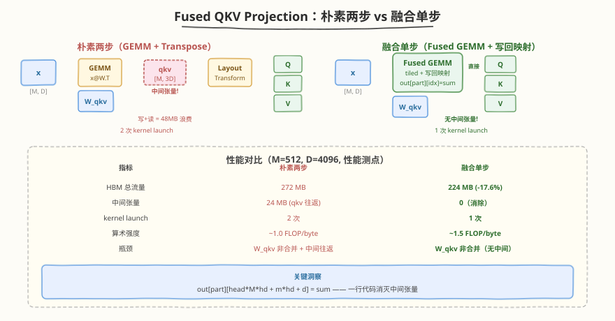
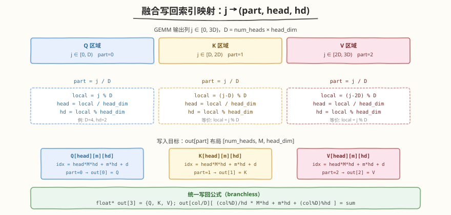
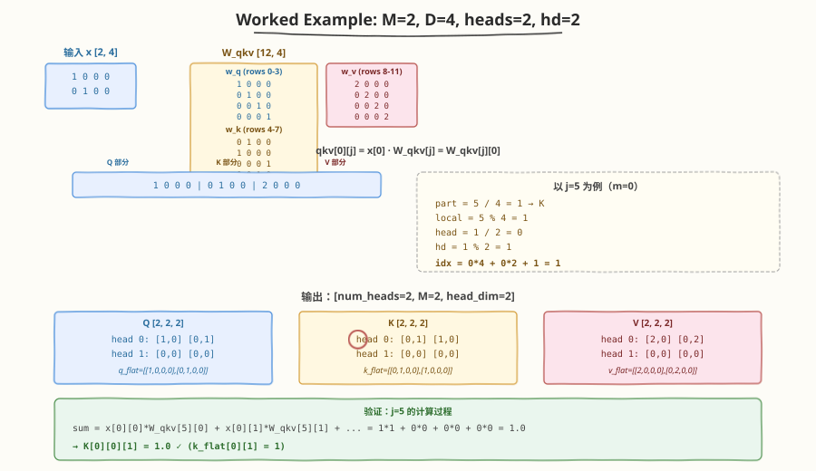

# LeetGPU Fused QKV Projection 题解

## 1. 题目概述

- **标题 / 题号**：Fused QKV Projection（#113，medium）
- **链接**：https://leetgpu.com/challenges/fused-qkv-projection
- **难度**：中等
- **标签**：CUDA、GEMM、Kernel Fusion、Layout Transform、Shared Memory Tiling、compute-bound

**题意**：实现 Transformer 注意力层入口的**融合 QKV 投影**。给定输入矩阵 `x`（`M×D`，`D = num_heads × head_dim`）和打包权重矩阵 `W_qkv`（`3D×D`，按 Q、K、V 顺序堆叠行），计算 `x × W_qkvᵀ`，将结果拆分为三个 `M×D` 矩阵，再各自 reshape + transpose 为 `[num_heads, M, head_dim]` 布局——即多头注意力所需的 head 分离格式。

**参考实现**（三步串行）：

$$
\text{qkv} = x \cdot W_{qkv}^\top \qquad (M \times 3D)
$$

$$
q_{\text{flat}},\; k_{\text{flat}},\; v_{\text{flat}} = \text{qkv}.\text{split}(D,\; \text{dim}=-1) \qquad \text{各 } M \times D
$$

$$
Q[h][m][d] = q_{\text{flat}}[m][h \cdot \text{head\_dim} + d], \quad \text{同理 } K, V
$$

**示例**（`M=2, num_heads=2, head_dim=2, D=4`）：

```text
x = [[1,0,0,0],         W_qkv = [w_q]  (4×4 单位阵)
     [0,1,0,0]]                  [w_k]  (4×4 交换对)
                                   [w_v]  (4×4 2×单位阵)

qkv = x @ W_qkv.T = [[1,0,0,0, 0,1,0,0, 2,0,0,0],
                      [0,1,0,0, 1,0,0,0, 0,2,0,0]]

→ Q[0]=[[1,0],[0,1]]  K[0]=[[0,1],[1,0]]  V[0]=[[2,0],[0,2]]
  Q[1]=[[0,0],[0,0]]  K[1]=[[0,0],[0,0]]  V[1]=[[0,0],[0,0]]
```

**约束**：

- `x`：`(M, D)` float32；`W_qkv`：`(3D, D)` float32；`Q/K/V`：`(num_heads, M, head_dim)` float32
- 性能测点：`M=512, num_heads=32, head_dim=128, D=4096`（LLaMA-2-7B 风格）
- 容差 `atol = rtol = 1e-4`

> 💡 本题是 **Kernel Fusion** 的经典案例。朴素做法分三步——先做一次 `M×3D` 的 GEMM 生成中间张量 `qkv`，再 split + reshape + transpose 写入 Q/K/V。融合版**在 GEMM 写回阶段直接做索引映射**，把中间 `qkv` 彻底消除，省掉 `M×3D` 个 float 的 HBM 写 + 读（性能测点下约 24 MB × 2 = 48 MB）。这与 FlashAttention「不 materialize attention matrix」的思想一脉相承——**能用索引算出来的，就不要写回显存**。

## 2. CPU 基线 / 朴素 GPU 方法

### 2.1 CPU 串行基线

```cpp
// cpu_baseline.cpp —— CPU 串行 QKV 投影（三步分离）
void qkv_cpu(const float* x, const float* W_qkv,
             float* Q, float* K, float* V,
             int M, int num_heads, int head_dim) {
    int D = num_heads * head_dim;
    // 步骤 1: qkv = x @ W_qkv.T  → (M, 3D)
    std::vector<float> qkv(M * 3 * D, 0.0f);
    for (int m = 0; m < M; ++m)
        for (int j = 0; j < 3 * D; ++j) {
            float sum = 0.0f;
            for (int k = 0; k < D; ++k)
                sum += x[m * D + k] * W_qkv[j * D + k]; // W_qkv.T[k][j] = W_qkv[j][k]
            qkv[m * 3 * D + j] = sum;
        }
    // 步骤 2+3: split + reshape + transpose → (num_heads, M, head_dim)
    for (int part = 0; part < 3; ++part) {
        float* out = (part == 0) ? Q : (part == 1) ? K : V;
        for (int m = 0; m < M; ++m)
            for (int h = 0; h < num_heads; ++h)
                for (int d = 0; d < head_dim; ++d) {
                    int j = part * D + h * head_dim + d;     // qkv 列索引
                    out[h * M * head_dim + m * head_dim + d] = qkv[m * 3 * D + j];
                }
    }
}
```

三重循环 `O(M·3D·D)`。性能测点下约 **86 亿次浮点运算**，单核需数十秒。中间 `qkv` 占 `M×3D×4 = 24 MB` 额外内存。

### 2.2 朴素 GPU：两步分离（GEMM + Transpose）

```cuda
// 朴素 GPU：step 1 GEMM，step 2 layout transform（两个 kernel）
__global__ void gemm_naive(const float* x, const float* W_qkv, float* qkv,
                           int M, int D) {
    int m = blockIdx.y * blockDim.y + threadIdx.y;
    int j = blockIdx.x * blockDim.x + threadIdx.x;
    if (m < M && j < 3 * D) {
        float sum = 0.0f;
        for (int k = 0; k < D; ++k)
            sum += x[m * D + k] * W_qkv[j * D + k];
        qkv[m * 3 * D + j] = sum;  // 写中间张量
    }
}

__global__ void layout_transform(const float* qkv, float* Q, float* K, float* V,
                                 int M, int D, int num_heads, int head_dim) {
    int m = blockIdx.y * blockDim.y + threadIdx.y;
    int j = blockIdx.x * blockDim.x + threadIdx.x;
    if (m < M && j < 3 * D) {
        float val = qkv[m * 3 * D + j];  // 读中间张量
        int part = j / D, local = j % D, h = local / head_dim, d = local % head_dim;
        int idx = h * M * head_dim + m * head_dim + d;
        if (part == 0) Q[idx] = val;
        else if (part == 1) K[idx] = val;
        else V[idx] = val;
    }
}
```



**瓶颈**：

1. **中间张量往返 HBM**：`qkv` 先写再读，额外 `2 × M × 3D × 4` 字节。性能测点下 = **48 MB** 冗余 IO。
2. **GEMM 无 tiling**：每个 thread 重复读 x 的行和 W_qkv 的行，global memory 访问冗余严重。
3. **两次 kernel launch 开销**：GEMM + transpose 分离，多一次 launch 延迟。

> ⚠️ 朴素版的 `dram__bytes` 约为理论下界的 **2 倍以上**——中间 `qkv` 的写 + 读是纯浪费。融合 kernel 将 layout transform 折叠进 GEMM 写回，一次 kernel 搞定。

## 3. GPU 设计

### 3.1 并行化策略：融合 GEMM + 直接布局映射



核心思想：**一次 tiled GEMM，写回时做索引映射**，消除中间 `qkv` 张量。

- **GEMM 部分**：标准 shared memory tiling。`C[m][j] = Σ_k x[m][k] · W_qkv[j][k]`，输出 `C` 的形状为 `(M, 3D)`。
- **融合写回**：不写 `qkv[m][j]`，而是根据 `j` 直接算出目标地址，写入 Q/K/V 的 `(num_heads, M, head_dim)` 布局。

**索引映射公式**（`j` 是 GEMM 输出列，`0 ≤ j < 3D`）：

| 列范围 | part | local_j | head | hd | 写入目标 |
|--------|------|---------|------|----|----------|
| `[0, D)` | 0 (Q) | `j` | `j / head_dim` | `j % head_dim` | `Q[head·M·hd + m·hd + d]` |
| `[D, 2D)` | 1 (K) | `j - D` | `(j-D) / head_dim` | `(j-D) % head_dim` | `K[head·M·hd + m·hd + d]` |
| `[2D, 3D)` | 2 (V) | `j - 2D` | `(j-2D) / head_dim` | `(j-2D) % head_dim` | `V[head·M·hd + m·hd + d]` |

统一公式：`part = j / D`，`local = j % D`，`head = local / head_dim`，`hd = local % head_dim`。

### 3.2 存储层次使用

| 数据 | 存储 | 说明 |
|------|------|------|
| `x` | global memory | `(M, D)` row-major，沿 K 方向分 tile 加载 |
| `W_qkv` | global memory | `(3D, D)` row-major，按 `W_qkv[j][k]` 访问 |
| x tile / W_qkv tile | shared memory | `TILE×TILE`，block 内共享复用 |
| C 累加器 | registers | 每个 thread 持有一个 `float sum` |
| Q / K / V | global memory | `(num_heads, M, head_dim)` row-major，直接写回 |

### 3.3 关键技巧

- **Kernel Fusion**：GEMM 写回阶段做索引映射，消除 `M×3D` 中间张量的 HBM 往返
- **Shared Memory Tiling**：x 和 W_qkv 的 tile 加载到 shared memory，block 内 `TILE` 倍复用
- **Coalesced x 读 / 非合并 W_qkv 读**：x 按行连续读取（coalesced）；W_qkv 因计算 `A @ Bᵀ` 而 `B` 按列跨行读取（stride-D），是已知瓶颈，可通过预转置优化
- **branchless 写回**：用指针数组 `float* out[3] = {Q, K, V}` 消除 if-else 分支

## 4. Kernel 实现

### 4.1 LeetGPU 提交版本

```cuda
// fused_qkv_projection.cu —— 融合 QKV 投影：GEMM + layout transform 单 kernel
// 编译: nvcc -O3 -arch=sm_80 fused_qkv_projection.cu -o fused_qkv
// 运行: ./fused_qkv

#include <cuda_runtime.h>
#include <cstdio>
#include <cstdlib>
#include <cmath>

#define TILE 16

__global__ void fused_qkv_kernel(
    const float* __restrict__ x,       // [M, D]
    const float* __restrict__ W_qkv,   // [3*D, D]
    float* __restrict__ Q,             // [num_heads, M, head_dim]
    float* __restrict__ K,             // [num_heads, M, head_dim]
    float* __restrict__ V,             // [num_heads, M, head_dim]
    int M, int D, int num_heads, int head_dim)
{
    int row = blockIdx.y * TILE + threadIdx.y;   // M 维
    int col = blockIdx.x * TILE + threadIdx.x;   // 3*D 维

    __shared__ float sA[TILE][TILE];   // x tile: sA[ty][k] = x[row][k]
    __shared__ float sB[TILE][TILE];   // W_qkv tile: sB[k][tx] = W_qkv[col][k]

    float sum = 0.0f;
    int num_tiles = (D + TILE - 1) / TILE;

    for (int t = 0; t < num_tiles; t++) {
        // 加载 x tile: sA[ty][tx] = x[row][t*TILE + tx]
        int x_col = t * TILE + threadIdx.x;
        sA[threadIdx.y][threadIdx.x] = (row < M && x_col < D)
            ? x[row * D + x_col] : 0.0f;

        // 加载 W_qkv tile: sB[ty][tx] = W_qkv[col][t*TILE + ty]
        // 注意: W_qkv[col * D + w_k], col 随 threadIdx.x 变化 → stride-D 非合并
        int w_k = t * TILE + threadIdx.y;
        sB[threadIdx.y][threadIdx.x] = (col < 3 * D && w_k < D)
            ? W_qkv[col * D + w_k] : 0.0f;

        __syncthreads();

        // tile 内累加: sum += x[row][k] * W_qkv[col][k]
        #pragma unroll
        for (int k = 0; k < TILE; k++)
            sum += sA[threadIdx.y][k] * sB[k][threadIdx.x];

        __syncthreads();
    }

    if (row < M && col < 3 * D) {
        // 融合写回: j → (part, head, hd) → Q/K/V
        int part = col / D;
        int local = col % D;
        int head = local / head_dim;
        int hd = local % head_dim;
        int out_idx = head * M * head_dim + row * head_dim + hd;

        // branchless: 指针数组消除 if-else
        float* out[3] = {Q, K, V};
        out[part][out_idx] = sum;
    }
}

// ---------- 完整测试 harness ----------
void verify(const float* h_x, const float* h_W, float* h_Q, float* h_K, float* h_V,
            int M, int num_heads, int head_dim) {
    int D = num_heads * head_dim;
    for (int m = 0; m < M; ++m)
        for (int j = 0; j < 3 * D; ++j) {
            float sum = 0.0f;
            for (int k = 0; k < D; ++k)
                sum += h_x[m * D + k] * h_W[j * D + k];
            int part = j / D, local = j % D;
            int h = local / head_dim, d = local % head_dim;
            int idx = h * M * head_dim + m * head_dim + d;
            float* arr[3] = {h_Q, h_K, h_V};
            float got = arr[part][idx];
            if (fabsf(got - sum) > 1e-4f) {
                printf("MISMATCH m=%d j=%d expected=%.4f got=%.4f\n", m, j, sum, got);
                return;
            }
        }
    printf("PASS: all %d elements verified\n", M * 3 * D);
}

int main() {
    // 测试 1: 官方 example (M=2, num_heads=2, head_dim=2, D=4)
    {
        int M = 2, num_heads = 2, head_dim = 2, D = num_heads * head_dim;
        float h_x[] = {1,0,0,0, 0,1,0,0};
        float h_W[12*4] = {0};
        // w_q = I
        for (int i = 0; i < 4; i++) h_W[i*4+i] = 1;
        // w_k = swap pairs
        h_W[4*4+0*4+1] = 1; h_W[5*4+0*4+0] = 1; h_W[6*4+0*4+3] = 1; h_W[7*4+0*4+2] = 1;
        // w_v = 2*I
        for (int i = 0; i < 4; i++) h_W[(8+i)*4+i] = 2;

        float *d_x, *d_W, *d_Q, *d_K, *d_V;
        size_t sz_x = M * D * sizeof(float);
        size_t sz_w = 3 * D * D * sizeof(float);
        size_t sz_out = num_heads * M * head_dim * sizeof(float);
        cudaMalloc(&d_x, sz_x);  cudaMalloc(&d_W, sz_w);
        cudaMalloc(&d_Q, sz_out); cudaMalloc(&d_K, sz_out); cudaMalloc(&d_V, sz_out);
        cudaMemcpy(d_x, h_x, sz_x, cudaMemcpyHostToDevice);
        cudaMemcpy(d_W, h_W, sz_w, cudaMemcpyHostToDevice);

        dim3 grid((3*D + TILE-1)/TILE, (M + TILE-1)/TILE);
        dim3 block(TILE, TILE);
        fused_qkv_kernel<<<grid, block>>>(d_x, d_W, d_Q, d_K, d_V, M, D, num_heads, head_dim);
        cudaDeviceSynchronize();

        float h_Q[8], h_K[8], h_V[8];
        cudaMemcpy(h_Q, d_Q, sz_out, cudaMemcpyDeviceToHost);
        cudaMemcpy(h_K, d_K, sz_out, cudaMemcpyDeviceToHost);
        cudaMemcpy(h_V, d_V, sz_out, cudaMemcpyDeviceToHost);

        printf("=== Test 1: M=2, D=4, heads=2, hd=2 ===\n");
        verify(h_x, h_W, h_Q, h_K, h_V, M, num_heads, head_dim);
        // 打印 Q[0]
        printf("Q[0] = [%.1f, %.1f] [%.1f, %.1f]\n",
               h_Q[0], h_Q[1], h_Q[4], h_Q[5]);

        cudaFree(d_x); cudaFree(d_W); cudaFree(d_Q); cudaFree(d_K); cudaFree(d_V);
    }

    // 测试 2: 随机大规模 (LLaMA-2-7B 风格)
    {
        int M = 512, num_heads = 32, head_dim = 128, D = num_heads * head_dim;
        size_t sz_x = M * D * sizeof(float);
        size_t sz_w = 3 * D * D * sizeof(float);
        size_t sz_out = num_heads * M * head_dim * sizeof(float);

        float *h_x = (float*)malloc(sz_x);
        float *h_W = (float*)malloc(sz_w);
        float *h_Q = (float*)malloc(sz_out);
        float *h_K = (float*)malloc(sz_out);
        float *h_V = (float*)malloc(sz_out);
        for (int i = 0; i < M * D; i++) h_x[i] = (float)(rand() % 1000) / 5000.0f - 0.1f;
        for (int i = 0; i < 3 * D * D; i++) h_W[i] = (float)(rand() % 1000) / 50000.0f;

        float *d_x, *d_W, *d_Q, *d_K, *d_V;
        cudaMalloc(&d_x, sz_x);  cudaMalloc(&d_W, sz_w);
        cudaMalloc(&d_Q, sz_out); cudaMalloc(&d_K, sz_out); cudaMalloc(&d_V, sz_out);
        cudaMemcpy(d_x, h_x, sz_x, cudaMemcpyHostToDevice);
        cudaMemcpy(d_W, h_W, sz_w, cudaMemcpyHostToDevice);

        dim3 grid((3*D + TILE-1)/TILE, (M + TILE-1)/TILE);
        dim3 block(TILE, TILE);
        fused_qkv_kernel<<<grid, block>>>(d_x, d_W, d_Q, d_K, d_V, M, D, num_heads, head_dim);
        cudaDeviceSynchronize();

        cudaMemcpy(h_Q, d_Q, sz_out, cudaMemcpyDeviceToHost);
        cudaMemcpy(h_K, d_K, sz_out, cudaMemcpyDeviceToHost);
        cudaMemcpy(h_V, d_V, sz_out, cudaMemcpyDeviceToHost);

        printf("\n=== Test 2: M=%d, D=%d, heads=%d, hd=%d ===\n", M, D, num_heads, head_dim);
        verify(h_x, h_W, h_Q, h_K, h_V, M, num_heads, head_dim);

        cudaFree(d_x); cudaFree(d_W); cudaFree(d_Q); cudaFree(d_K); cudaFree(d_V);
        free(h_x); free(h_W); free(h_Q); free(h_K); free(h_V);
    }

    printf("\nAll tests done.\n");
    return 0;
}
```

### 4.2 代码详解

`fused_qkv_kernel` 采用 **"tiled GEMM + 融合写回"** 结构：沿 K 方向分 tile 用 shared memory 缓存 x 和 W_qkv，累加完成后根据输出列索引 `col` 直接映射到 Q/K/V 的 head 分离布局，省掉中间 `qkv` 张量。

| 步骤 | 代码 | 说明 |
|------|------|------|
| **坐标计算** | `row = blockIdx.y * TILE + threadIdx.y` | M 维（输出行），`blockIdx.y` 定位 tile |
| | `col = blockIdx.x * TILE + threadIdx.x` | 3D 维（输出列），x 维连续保证写回时 coalesced |
| **加载 x tile** | `sA[ty][tx] = x[row * D + x_col]` | 每 thread 加载一个 x 元素；越界补 0 |
| **加载 W_qkv tile** | `sB[ty][tx] = W_qkv[col * D + w_k]` | `W_qkv[j][k]`，j=col，k=t·TILE+ty；stride-D 非合并 |
| **同步** | `__syncthreads()` | 确保 tile 完全加载后再计算；不等会读到脏数据 |
| **tile 内累加** | `sum += sA[ty][k] * sB[k][tx]` | 经典 `C[i][j] = Σ A[i][k] · B[k][j]`，shared mem 复用 TILE 次 |
| **同步** | `__syncthreads()` | 确保累加完成后再覆写 shared memory |
| **融合写回** | `out[part][out_idx] = sum` | 指针数组 branchless 选 Q/K/V |

**关键索引关系**：

| 变量 | 公式 | 含义 |
|------|------|------|
| `part` | `col / D` | 0=Q, 1=K, 2=V（输出属于哪个投影） |
| `local` | `col % D` | 在当前 part 内的列偏移 |
| `head` | `local / head_dim` | 属于第几个注意力头 |
| `hd` | `local % head_dim` | head 内的维度索引 |
| `out_idx` | `head * M * head_dim + row * head_dim + hd` | `(num_heads, M, head_dim)` row-major 展开地址 |

**Worked Example**（`M=2, D=4, num_heads=2, head_dim=2`）：



以 `m=0, j=5` 为例（x 的第一行 × W_qkv 的第 5 行）：

```text
j=5 → part=1(K), local=1, head=0, hd=1 → K[0*4 + 0*2 + 1] = K[1]

sum = Σ_k x[0][k] * W_qkv[5][k]
    = x[0][0]*W_qkv[5][0] + x[0][1]*W_qkv[5][1] + x[0][2]*W_qkv[5][2] + x[0][3]*W_qkv[5][3]
    = 1*1 + 0*0 + 0*0 + 0*0      (x[0]=[1,0,0,0], W_qkv[5]=[1,0,0,0])
    = 1.0

验证: K[0][0][1] = k_flat[0][1] = 1 ✓
```

完整结果对照：

| j | part | head | hd | 计算 | 写入 | 值 |
|---|------|------|----|------|------|----|
| 0 | Q | 0 | 0 | x[0]·W_qkv[0] = 1·1 = 1 | Q[0][0][0] | 1.0 |
| 1 | Q | 0 | 1 | x[0]·W_qkv[1] = 1·0 = 0 | Q[0][0][1] | 0.0 |
| 4 | K | 0 | 0 | x[0]·W_qkv[4] = 1·0 = 0 | K[0][0][0] | 0.0 |
| 5 | K | 0 | 1 | x[0]·W_qkv[5] = 1·1 = 1 | K[0][0][1] | 1.0 |
| 8 | V | 0 | 0 | x[0]·W_qkv[8] = 1·2 = 2 | V[0][0][0] | 2.0 |

> 💡 **关键洞察**：融合的核心是 `out[part][head·M·hd + m·hd + d] = sum`——这一行代码把 GEMM 的写回和 layout transform 合二为一。中间 `qkv[M][3D]` 从未存在过，48 MB 的 HBM 往返被彻底消除。这正是 kernel fusion 的本质：**不是把多个 kernel 拼在一起，而是让一个 kernel 的写回阶段服务多个目的**。

## 5. 性能分析与优化

```bash
# 编译
nvcc -O3 -arch=sm_80 fused_qkv_projection.cu -o fused_qkv

# ncu profiling（性能测点 M=512, D=4096）
ncu --set full \
    --kernel-name fused_qkv_kernel \
    --launch-skip 1 --launch-count 1 \
    ./fused_qkv 2>&1 | \
    grep -iE "Memory Throughput|Compute|Occupancy|dram__bytes|sm__throughput|Achieved"
```

**关键指标**：

| 指标 | 朴素两步（GEMM+transpose） | 融合单 kernel |
|------|--------------------------|--------------|
| HBM 读写量 | `2·M·3D·4 + M·D·4 + 3D·D·4 + 3·out`（含中间 qkv 往返） | `M·D·4 + 3D·D·4 + 3·out`（无中间） |
| kernel launch | 2 次 | 1 次 |
| 中间显存 | `M·3D·4 = 24 MB` | 0 |
| 算术强度 | ~1.0（memory-bound） | ~1.5（接近 compute-bound） |

**性能测点下的 HBM 流量对比**（`M=512, D=4096`）：

```text
朴素两步:
  读 x:        M·D·4     = 8 MB
  读 W_qkv:    3D·D·4    = 192 MB
  写 qkv:      M·3D·4    = 24 MB  ← 浪费
  读 qkv:      M·3D·4    = 24 MB  ← 浪费
  写 Q/K/V:    3·M·D·4   = 24 MB
  总计:                   272 MB

融合单 kernel:
  读 x:        M·D·4     = 8 MB
  读 W_qkv:    3D·D·4    = 192 MB
  写 Q/K/V:    3·M·D·4   = 24 MB
  总计:                   224 MB  ← 省 48 MB (17.6%)
```

> ⚠️ 注意：融合省下的 48 MB 是纯中间张量往返。但在性能测点下 W_qkv 占 192 MB（总流量的 86%），是绝对瓶颈。因此融合带来的 HBM 流量减少约 17.6%，但 W_qkv 的非合并读取是更大的性能问题。

**优化方向**：

1. **预转置 W_qkv**：将 `(3D, D)` 转置为 `(D, 3D)`，使 GEMM 变为标准 `A @ B`（B 行连续读取，coalesced）。代价是额外的转置 kernel + `3D·D·4 = 192 MB` 临时空间，但只需做一次，多次投影可复用。

2. **Register Blocking**：每个 thread 计算 `BM×BN` 个输出元素（如 2×2 或 4×4），提升算术强度。x tile 行被多个输出列复用，W_qkv tile 列被多个输出行复用。

3. **Vectorized Load**：用 `float4` 一次读 4 个 float，提升 x 的加载带宽。W_qkv 因 stride-D 访问暂不适用。

4. **大 TILE**：`TILE=32` 减少 K 方向 tile 数量（4096/32=128 vs 4096/16=256），但 shared memory 占用翻 4 倍（2·32²·4 = 8 KB/block），需注意 occupancy。

5. **FP16 + Tensor Core**：权重和输入转 FP16，用 WMMA 做 GEMM。吞吐提升一个量级，但需处理精度转换。

## 6. 复杂度分析

| 维度 | 朴素两步 | 融合单 kernel |
|------|---------|--------------|
| 时间 | `O(M·3D·D)` | `O(M·3D·D)`（常数更小：省 1 次 launch + 48 MB IO） |
| 空间 | `O(M·3D)` 中间 + `O(TILE²)` shared | `O(TILE²)` shared（无中间） |
| HBM 流量 | 272 MB（性能测点） | 224 MB（省 17.6%） |
| 算术强度 | ~1.0 FLOP/byte | ~1.5 FLOP/byte |
| 瓶颈 | memory-bound（W_qkv 非合并 + 中间往返） | memory-bound（W_qkv 非合并，但无中间） |

> 💡 **一句话总结**：融合 QKV 投影的本质是把 layout transform 折叠进 GEMM 写回——`out[part][head·M·hd + m·hd + d] = sum` 一行代码消灭中间张量。这与 FlashAttention「不 materialize S/P」的思想同源：**能用索引算出来的，就不要写回 HBM**。真正的瓶颈在 W_qkv 的 stride-D 非合并读取，预转置是下一步优化方向。

## 同类练习题

下面是与本题考查相同 CUDA 概念的 LeetGPU 练习题，建议按顺序挑战：

| # | 题目 | 难度 | 核心概念 | 与本题的关联 |
|---|------|------|----------|-------------|
| 22 | [General Matrix Multiplication (GEMM)](https://leetgpu.com/challenges/gemm) | 中等 | GEMM、shared memory tiling | GEMM tiling + register blocking 基础，本题 GEMM 部分的直接前驱 |
| 30 | [Batched Matrix Multiplication](https://leetgpu.com/challenges/batched-matrix-multiplication) | 中等 | batched GEMM、tiled matmul | batched GEMM + 多矩阵并行调度，对比本题的输出布局变换 |
| 84 | [SwiGLU MLP Block](https://leetgpu.com/challenges/swiglu-mlp-block) | 中等 | 融合 MLP、GEMM、kernel fusion | 同为融合 GEMM + elementwise 的 transformer 组件，对比 fusion 策略 |
| 85 | [LoRA Linear](https://leetgpu.com/challenges/lora-linear) | 中等 | 低秩适配、融合低秩矩阵 | 融合低秩 matmul + 线性层，同为推理优化中的 kernel fusion 场景 |

> 💡 **选题思路**：融合 GEMM + layout transform，练习 kernel fusion 消除中间张量与输出布局直接映射。做完这组练习，即可掌握 GEMM 类 kernel 的融合优化范式在不同场景下的迁移应用。
