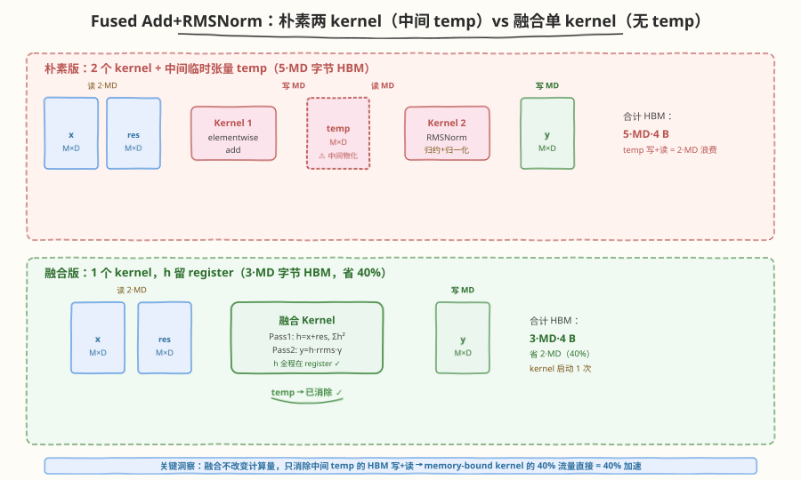
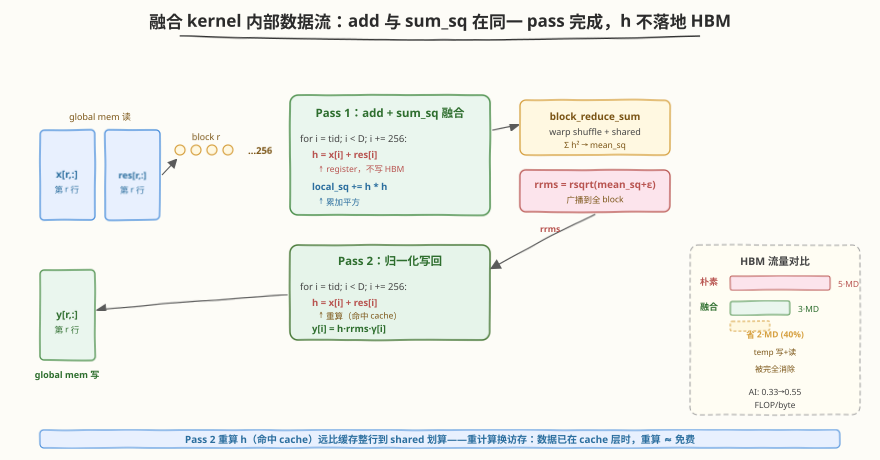

# LeetGPU Fused Add and RMSNorm 题解

## 1. 题目概述

- **标题 / 题号**：Fused Residual Add and RMSNorm（#116，medium）
- **链接**：https://leetgpu.com/challenges/fused-add-rmsnorm
- **难度**：中等
- **标签**：CUDA、kernel fusion、RMSNorm、residual connection、memory-bound、epilogue fusion、Llama

**题意**：给定输入张量 $x$（`M×D`）、残差张量 $residual$（`M×D`）、可学习权重 $\gamma$（`D`）和常数 $\epsilon$，计算**残差相加后再做 RMS 归一化**的结果 $y$——这正是每个 Llama Transformer block 中 `Add & RMSNorm` 子层的核心计算：

$$
h_i = x_i + residual_i, \qquad \text{RMS}(h) = \sqrt{\frac{1}{D}\sum_{j=0}^{D-1} h_j^2 + \epsilon}, \qquad y_i = \frac{h_i}{\text{RMS}(h)} \cdot \gamma_i
$$

对**每一行独立**计算（沿 feature 维 $D$ 归一化），所有张量行主序、`float32`。

**示例**（单行 `D=4`，`eps=1e-5`，`gamma=[1,1,1,1]`）：

```text
x        = [1.0, 2.0, 3.0, 4.0]
residual = [3.0, 2.0, 1.0, 0.0]
h = x + residual = [4.0, 4.0, 4.0, 4.0]
sum_sq   = 16 + 16 + 16 + 16 = 64
mean_sq  = 64 / 4 = 16.0
RMS      = sqrt(16.0 + 1e-5) = 4.00000
rrms     = 1 / RMS = 0.25000
output   = [4.0·0.25, 4.0·0.25, 4.0·0.25, 4.0·0.25] = [1.0, 1.0, 1.0, 1.0]
```

**约束**：

- `1 ≤ M × D ≤ 1,000,000`（总元素数）
- 元素范围 `[-10.0, 10.0]`
- 容差 `atol = rtol = 1e-4`
- 性能测试取较大 `M×D`（如 `M=128, D=8192`，LLaMA-7B 隐藏维风格）

> 💡 本题是 [RMS Normalization (#50)](./leetgpu-rms-normalization-solution.html) 的**融合进阶版**——RMSNorm 本身只教「单次块归约 + 归一化」，而本题的考点是 **kernel fusion（算子融合）**：朴素做法用两个独立 kernel（先 elementwise add 写临时张量，再 RMSNorm 读它），融合做法把 add 嵌入 RMSNorm 的访存 pass 里、**消除中间临时张量的全部 HBM 往返**。这是 LLM 推理引擎（vLLM、TensorRT-LLM）消除 memory-bound kernel 间「materialize 中间结果」开销的最典型手法，也是 [LayerNorm (#115) 优化方向 5](./leetgpu-layer-normalization-solution.html)「与下游算子融合」的具体落地。

## 2. CPU 基线 / 朴素 GPU 方法

### 2.1 CPU 串行基线

```cpp
// cpu_baseline.cpp —— CPU 串行 Fused Add+RMSNorm
void fused_add_rmsnorm_cpu(const float* x, const float* residual, const float* gamma,
                           float* y, int M, int D, float eps) {
    for (int r = 0; r < M; ++r) {
        const float* xr = x + r * D;
        const float* rr = residual + r * D;
        float* yr = y + r * D;
        // ① 残差相加 + 求 sum of squares（可合并到一遍循环）
        float sq = 0.0f;
        for (int i = 0; i < D; ++i) {
            float h = xr[i] + rr[i];
            sq += h * h;
            // 注：CPU 版可把 h 缓存到栈数组，避免重算；这里展示一遍扫描的思路
        }
        float rrms = 1.0f / sqrtf(sq / D + eps);
        // ② 归一化 + affine（需重新算 h，或第一遍缓存）
        for (int i = 0; i < D; ++i) {
            float h = xr[i] + rr[i];
            yr[i] = h * rrms * gamma[i];
        }
    }
}
```

每行两遍扫描 $O(D)$，总计 $O(M \times D)$。

### 2.2 朴素 GPU：两个独立 kernel + 中间临时张量（待消除的瓶颈）



最直观的 GPU 实现是把 CPU 的两步拆成两个独立 kernel，中间用一个 `M×D` 的临时张量 `temp` 衔接：

```cuda
// 朴素版 Kernel 1：elementwise add → 写 temp[M×D]
__global__ void add_kernel(const float* x, const float* residual, float* temp, int N) {
    int i = blockIdx.x * blockDim.x + threadIdx.x;
    if (i < N) temp[i] = x[i] + residual[i];
}

// 朴素版 Kernel 2：RMSNorm(temp) → y（结构同 #50 RMSNorm）
__global__ void rmsnorm_kernel(const float* temp, const float* gamma, float* y,
                               int M, int D, float eps) {
    __shared__ float shared[8];
    int r = blockIdx.x;
    const float* tr = temp + r * D;
    float* yr = y + r * D;
    float sq = 0.0f;
    for (int i = threadIdx.x; i < D; i += blockDim.x) sq += tr[i] * tr[i];
    // ... block_reduce_sum → rrms ...
    float rrms = 1.0f / sqrtf(block_reduce_sum(sq, shared) / D + eps);
    for (int i = threadIdx.x; i < D; i += blockDim.x) yr[i] = tr[i] * rrms * gamma[i];
}
```

**瓶颈分析**（这是本题的核心）：两个 kernel 之间必须把 `temp` **物化（materialize）到 HBM**——Kernel 1 写一遍 `temp`，Kernel 2 再读一遍 `temp`。这笔 `2 \times M \times D \times 4` 字节的 HBM 往返完全是无用的中间开销：

| 步骤 | HBM 读 | HBM 写 | 说明 |
|------|--------|--------|------|
| Kernel 1 读 `x`+`residual` | $2MD$ | — | 合并读 |
| Kernel 1 写 `temp` | — | $MD$ | **中间结果物化** |
| Kernel 2 读 `temp`+`gamma` | $MD$ | — | **中间结果再读回** |
| Kernel 2 写 `y` | — | $MD$ | 最终输出 |
| **合计** | $3MD$ | $2MD$ | **$5MD$ 字节** |

> ⚠️ 朴素版的浪费不在计算，而在**访存**：`temp` 从未被任何下游长期使用，却要完整地写进 HBM 再读出来。融合的核心动机就是**让 add 的结果留在 register/shared 里直接喂给归一化**，彻底抹掉 `temp` 的两趟 HBM 流量。这正是「kernel fusion for memory-bound ops」的范式——算子越 memory-bound，融合收益越大。

## 3. GPU 设计

### 3.1 并行化策略：一个 block 负责一行，add 嵌入归约 pass



**核心映射**：`blockIdx.x → 行号 r`，block 内 `BLOCK_SIZE=256` 个 thread 协作处理该行的 $D$ 个元素。融合 kernel 把朴素版的「add → temp」与「读 temp → sum_sq」合并成**单遍 pass**：

1. **Pass 1（add + sum_sq 融合）**：每个 thread 用 grid-stride 扫描行内元素，**当场**算 $h_i = x_i + residual_i$ 并累加 $h_i^2$ 到本地寄存器 `local_sq`——`h` 不落地 HBM。块归约得到 $\sum h_i^2$ → $\text{rrms} = 1/\sqrt{\text{mean\_sq} + \epsilon}$，广播到全 block。
2. **Pass 2（归一化写回）**：再扫一遍重算 $h_i = x_i + residual_i$（`x`/`residual` 重读，但 `temp` 不再存在），写 $y_i = h_i \cdot \text{rrms} \cdot \gamma_i$。

> 💡 **为什么 Pass 2 要重算 `h` 而不缓存？** 若 $D$ 较大（如 8192），把整行 `h` 缓存到 shared memory 需 $D \times 4 = 32$ KB，挤占 shared 容量。更关键的是：`x` 和 `residual` 本就在 L2/L1 缓存里（刚被 Pass 1 读过），Pass 2 重读几乎命中 cache，代价远低于显式占用 32 KB shared。这是一种典型的「**重计算换访存**」权衡——当数据已在 cache 层，重算比缓存更划算。若 $D$ 很小（≤ 2048，8 KB），则可缓存 `h` 到 shared 把 global 读降到 1 遍（见 §5 优化方向）。

### 3.2 存储层次使用

| 数据 | 存储 | 访问模式 | 说明 |
|------|------|----------|------|
| `x` / `residual` | global memory → L1/L2 cache | 合并读 | 每行读 2 遍（Pass 1 + Pass 2），第二遍命中 cache |
| `gamma` | global memory | 合并读 | 读 1 遍（Pass 2），$D$ 个元素，可忽略 |
| `y` | global memory | 合并写 | 写 1 遍 |
| `h = x+residual` | **registers**（即时计算，不落地） | 不访存 HBM | **融合消除的核心**——朴素版的 `temp` 在此被 register 计算取代 |
| `local_sq` | registers | 每 thread 1 个累加器 | sum of squares 中间值 |
| 跨 warp 汇总 | shared memory | `shared[NUM_WARPS+1]` | warp 间归约 + 广播 `rrms` |

### 3.3 关键技巧

- **算子融合（kernel fusion）**：把 `add` 和 `rmsnorm` 两个独立 kernel 合并为一个。朴素版 `temp` 的写+读（$2MD$ 字节）被完全消除，HBM 流量从 $5MD$ 降到 $3MD$（**省 40%**）。这是 memory-bound 算子融合的标准范式——中间结果留在 register/shared，不物化到 HBM。
- **复用 `block_reduce_sum` 模板**：归约结构与 [RMSNorm (#50)](./leetgpu-rms-normalization-solution.html) 完全一致（warp shuffle `__shfl_down_sync` + shared 跨 warp 汇总 + 广播），融合只是在归约的 load 点插入了一次 `+` 运算，零额外同步开销。
- **`rsqrtf` 硬件指令**：用 `rsqrtf(mean_sq + eps)` 而非 `1.0f / sqrtf(...)`，单条指令更快且精度足够。
- **`__restrict__` + `const`**：提示编译器 `x`/`residual`/`gamma`/`y` 无别名，启用 load 重排与向量化优化。

## 4. Kernel 实现

### 4.1 LeetGPU 提交版本

```cuda
// fused_add_rmsnorm.cu —— 融合 Residual Add + RMSNorm：单 kernel，无中间临时张量
// 编译: nvcc -O3 -arch=sm_80 fused_add_rmsnorm.cu -o fused_add_rmsnorm
// 运行: ./fused_add_rmsnorm

#include <cuda_runtime.h>
#include <cstdio>
#include <cstdlib>
#include <cmath>

#define BLOCK_SIZE 256
#define WARP_SIZE 32
#define NUM_WARPS (BLOCK_SIZE / WARP_SIZE)   // 8

// ---- warp 级归约：sum（复用 Reduction / RMSNorm 模板）----
__inline__ __device__ float warp_reduce_sum(float val) {
    #pragma unroll
    for (int offset = WARP_SIZE / 2; offset > 0; offset >>= 1)
        val += __shfl_down_sync(0xffffffff, val, offset);
    return val;
}

// ---- block 级归约：warp shuffle + shared 汇总 + 广播 ----
__inline__ __device__ float block_reduce_sum(float val, float* shared) {
    int lane = threadIdx.x & (WARP_SIZE - 1);
    int wid  = threadIdx.x >> 5;

    val = warp_reduce_sum(val);
    if (lane == 0) shared[wid] = val;        // 每 warp 的和写入 shared
    __syncthreads();

    if (wid == 0) {
        val = (lane < NUM_WARPS) ? shared[lane] : 0.0f;
        val = warp_reduce_sum(val);
        if (lane == 0) shared[0] = val;      // 广播 slot
    }
    __syncthreads();
    return shared[0];
}

// ---- 融合 kernel：一个 block 负责一行，add 嵌入归约 pass ----
__global__ void fused_add_rmsnorm_kernel(const float* __restrict__ x,
                                         const float* __restrict__ residual,
                                         const float* __restrict__ gamma,
                                         float* __restrict__ y,
                                         int M, int D, float eps) {
    __shared__ float shared[NUM_WARPS + 1];

    int r = blockIdx.x;
    if (r >= M) return;
    const float* xr = x + r * D;
    const float* rr = residual + r * D;
    float* yr = y + r * D;

    // ---- Pass 1：add + sum_sq 融合（h 不落地 HBM）----
    float local_sq = 0.0f;
    for (int i = threadIdx.x; i < D; i += BLOCK_SIZE) {
        float h = xr[i] + rr[i];        // 残差相加，结果留在 register
        local_sq += h * h;              // 累加平方，无需写 temp
    }
    float mean_sq = block_reduce_sum(local_sq, shared) / D;
    float rrms = rsqrtf(mean_sq + eps);

    // ---- Pass 2：归一化写回（重算 h，避免缓存整行到 shared）----
    for (int i = threadIdx.x; i < D; i += BLOCK_SIZE) {
        float h = xr[i] + rr[i];        // 重算 h（命中 L1/L2 cache）
        yr[i] = h * rrms * gamma[i];
    }
}

// ---------- 完整测试 harness ----------
void fused_add_rmsnorm_cpu(const float* x, const float* residual, const float* gamma,
                           float* y, int M, int D, float eps) {
    for (int r = 0; r < M; ++r) {
        const float* xr = x + r * D;
        const float* rr = residual + r * D;
        float* yr = y + r * D;
        float sq = 0.0f;
        for (int i = 0; i < D; ++i) {
            float h = xr[i] + rr[i];
            sq += h * h;
        }
        float rrms = 1.0f / sqrtf(sq / D + eps);
        for (int i = 0; i < D; ++i) {
            float h = xr[i] + rr[i];
            yr[i] = h * rrms * gamma[i];
        }
    }
}

int main() {
    const float eps = 1e-5f;

    // 测试 1：官方 example (M=1, D=4)
    {
        int M = 1, D = 4;
        float h_x[]  = {1, 2, 3, 4};
        float h_r[]  = {3, 2, 1, 0};
        float h_g[]  = {1, 1, 1, 1};
        float h_y[4], ref[4];

        float *d_x, *d_r, *d_g, *d_y;
        cudaMalloc(&d_x, M * D * sizeof(float));
        cudaMalloc(&d_r, M * D * sizeof(float));
        cudaMalloc(&d_g, D * sizeof(float));
        cudaMalloc(&d_y, M * D * sizeof(float));
        cudaMemcpy(d_x, h_x, M * D * sizeof(float), cudaMemcpyHostToDevice);
        cudaMemcpy(d_r, h_r, M * D * sizeof(float), cudaMemcpyHostToDevice);
        cudaMemcpy(d_g, h_g, D * sizeof(float), cudaMemcpyHostToDevice);

        fused_add_rmsnorm_kernel<<<M, BLOCK_SIZE>>>(d_x, d_r, d_g, d_y, M, D, eps);
        cudaDeviceSynchronize();
        cudaMemcpy(h_y, d_y, M * D * sizeof(float), cudaMemcpyDeviceToHost);

        fused_add_rmsnorm_cpu(h_x, h_r, h_g, ref, M, D, eps);
        printf("=== Test 1: M=%d, D=%d ===\n", M, D);
        bool ok = true;
        for (int i = 0; i < M * D; ++i) {
            printf("y[%d] = %.5f (ref %.5f)\n", i, h_y[i], ref[i]);
            if (fabsf(h_y[i] - ref[i]) > 1e-4f) ok = false;
        }
        printf("%s\n\n", ok ? "PASS" : "FAIL");

        cudaFree(d_x); cudaFree(d_r); cudaFree(d_g); cudaFree(d_y);
    }

    // 测试 2：随机大规模 (M=128, D=8192，性能测点)
    {
        int M = 128, D = 8192;
        size_t sz = (size_t)M * D * sizeof(float);
        float *h_x = (float*)malloc(sz);
        float *h_r = (float*)malloc(sz);
        float *h_g = (float*)malloc(D * sizeof(float));
        float *h_y = (float*)malloc(sz);
        float *ref = (float*)malloc(sz);
        for (int i = 0; i < M * D; ++i) {
            h_x[i] = (float)(rand() % 2000) / 1000.0f - 1.0f;
            h_r[i] = (float)(rand() % 2000) / 1000.0f - 1.0f;
        }
        for (int i = 0; i < D; ++i) h_g[i] = (float)(rand() % 1000) / 1000.0f;

        float *d_x, *d_r, *d_g, *d_y;
        cudaMalloc(&d_x, sz);
        cudaMalloc(&d_r, sz);
        cudaMalloc(&d_g, D * sizeof(float));
        cudaMalloc(&d_y, sz);
        cudaMemcpy(d_x, h_x, sz, cudaMemcpyHostToDevice);
        cudaMemcpy(d_r, h_r, sz, cudaMemcpyHostToDevice);
        cudaMemcpy(d_g, h_g, D * sizeof(float), cudaMemcpyHostToDevice);

        fused_add_rmsnorm_kernel<<<M, BLOCK_SIZE>>>(d_x, d_r, d_g, d_y, M, D, eps);
        cudaDeviceSynchronize();
        cudaMemcpy(h_y, d_y, sz, cudaMemcpyDeviceToHost);

        fused_add_rmsnorm_cpu(h_x, h_r, h_g, ref, M, D, eps);
        printf("=== Test 2: M=%d, D=%d ===\n", M, D);
        double max_err = 0.0;
        for (int i = 0; i < M * D; ++i)
            max_err = fmax(max_err, fabs((double)h_y[i] - ref[i]));
        printf("max abs err = %.3e  (%s)\n", max_err, max_err < 1e-4 ? "PASS" : "FAIL");

        cudaFree(d_x); cudaFree(d_r); cudaFree(d_g); cudaFree(d_y);
        free(h_x); free(h_r); free(h_g); free(h_y); free(ref);
    }

    printf("\nAll tests done.\n");
    return 0;
}
```

### 4.2 代码详解

`fused_add_rmsnorm_kernel` 采用 **"1 block per row + add 嵌入归约 pass + 重计算写回"** 结构：每个 block 固定一行 $r$，256 个 thread 沿 $D$ 维 grid-stride 协作，把残差加法织进 RMSNorm 的两遍扫描里，全程不物化 `temp`。

| 步骤 | 代码 | 说明 |
|------|------|------|
| **block 映射** | `r = blockIdx.x` | 1 个 block 负责一行，M 个 block 并行 |
| **行指针偏移** | `xr = x + r*D; rr = residual + r*D` | 定位该行在 `x`/`residual` 中的起点 |
| **Pass 1 add+归约** | `h = xr[i] + rr[i]; local_sq += h*h` | add 与 sum_sq 在同一循环——`h` 留 register，不写 HBM |
| **块归约** | `block_reduce_sum(local_sq, shared)` | warp shuffle + shared 跨 warp 汇总，得 $\sum h^2$ |
| **求 rrms** | `rrms = rsqrtf(mean_sq + eps)` | `rsqrtf` 单条硬件指令 |
| **Pass 2 写回** | `h = xr[i] + rr[i]; yr[i] = h*rrms*gamma[i]` | 重算 `h`（命中 cache）+ 归一化 + affine，写最终输出 |

**关键索引关系**：

| 变量 | 公式 | 含义 |
|------|------|------|
| `r` | `blockIdx.x` | 行索引（$0 \le r < M$） |
| `tid` | `threadIdx.x` | block 内线程号（$0 \le \text{tid} < 256$） |
| `i` | `tid, tid+256, ...` | 行内元素索引（grid-stride 扫 $D$） |
| `h` | `xr[i] + rr[i]` | 残差相加结果（register 内，不落地 HBM） |
| `mean_sq` | $\sum h_i^2 / D$ | 平方均值（块归约结果） |
| `rrms` | `rsqrtf(mean_sq + eps)` | $1/\text{RMS}$，广播到全 block |

**同步语义**：

| 屏障 | 位置 | 等什么 | 不等会怎样 |
|------|------|--------|-----------|
| `__syncthreads()` ① | `block_reduce_sum` 内，warp 写 `shared[wid]` 后 | 等所有 warp 把部分和写入 `shared` | warp 0 读到未初始化的 `shared[wid]`，归约结果错误 |
| `__syncthreads()` ② | `block_reduce_sum` 内，warp 0 写 `shared[0]` 后 | 等 warp 0 把最终 `rrms` 广播到 `shared[0]` | 其他线程 Pass 2 用到未更新的 `shared[0]`，`rrms` 错误 |
| Pass 1 → Pass 2 | 无显式屏障（`block_reduce_sum` 末尾的 `__syncthreads` 兼顾） | 等 `rrms` 就绪 | Pass 2 用错误 `rrms` 归一化 |

> 注：`block_reduce_sum` 末尾的第二个 `__syncthreads()` 已确保 `shared[0]`（即 `rrms`）对全 block 可见，因此 Pass 1 到 Pass 2 的衔接**无需额外屏障**——这是复用归约模板的便利。

**Worked Example**（`M=1, D=4, BLOCK_SIZE=4`，即每 block 4 thread 各算 1 个元素）：

![逐步演算：[1,2,3,4]+[3,2,1,0] 的 Fused Add+RMSNorm](../../images/fused_add_rmsnorm_worked.svg)

以 `x=[1,2,3,4]`, `residual=[3,2,1,0]`, `gamma=[1,1,1,1]` 为例：

```text
Pass 1（add + sum_sq 融合，每 thread 处理 1 个元素）：
  thread 0: h = 1+3 = 4,  h² = 16
  thread 1: h = 2+2 = 4,  h² = 16
  thread 2: h = 3+1 = 4,  h² = 16
  thread 3: h = 4+0 = 4,  h² = 16
  block_reduce_sum(16,16,16,16) → 64
  mean_sq = 64 / 4 = 16.0
  rrms    = rsqrtf(16.0 + 1e-5) ≈ 0.25000

Pass 2（重算 h + 归一化写回）：
  thread 0: h = 1+3 = 4,  y[0] = 4 · 0.25 · 1 = 1.0
  thread 1: h = 2+2 = 4,  y[1] = 4 · 0.25 · 1 = 1.0
  thread 2: h = 3+1 = 4,  y[2] = 4 · 0.25 · 1 = 1.0
  thread 3: h = 4+0 = 4,  y[3] = 4 · 0.25 · 1 = 1.0
  → y = [1.0, 1.0, 1.0, 1.0] ✓
```

> 💡 **关键洞察**：融合的全部意义不在「少算」，而在「**少搬**」——`h = x + residual` 的计算量没变（Pass 1 和 Pass 2 各算一遍，朴素版也算了），但 `temp` 张量的 HBM 写+读（$2MD$ 字节）被彻底消除。对 memory-bound kernel 而言，省掉的 HBM 往返直接等价于省掉的时间。这正是「**算子融合是 memory-bound kernel 的免费午餐**」——计算冗余（重算 `h`）远比访存冗余（物化 `temp`）便宜。

## 5. 性能分析与优化

```bash
# 编译
nvcc -O3 -arch=sm_80 fused_add_rmsnorm.cu -o fused_add_rmsnorm

# ncu profiling（性能测点 M=128, D=8192）
ncu --set full \
    --kernel-name fused_add_rmsnorm_kernel \
    --launch-skip 0 --launch-count 1 \
    ./fused_add_rmsnorm 2>&1 | \
    grep -iE "Memory Throughput|Compute|Occupancy|dram__bytes|dram__throughput|sm__throughput|Achieved"
```

**HBM 流量对比**（性能测点 `M=128, D=8192`，$MD = 1{,}048{,}576$ 元素）：

```text
朴素两 kernel：
  读  x + residual      = 2·MD·4 = 8.00 MB
  写  temp              =   MD·4 = 4.00 MB   ← 中间物化
  读  temp + gamma      =   MD·4 = 4.00 MB   ← 中间再读
  写  y                 =   MD·4 = 4.00 MB
  合计                  = 20.00 MB  (5·MD·4)

融合单 kernel：
  读  x + residual (×2 pass) ≈ 2·MD·4 = 8.00 MB  (第 2 pass 命中 cache，有效 HBM < 8 MB)
  读  gamma             =       D·4 ≈ 0.03 MB
  写  y                 =   MD·4 = 4.00 MB
  合计 (有效 HBM)        ≈ 12.00 MB  (3·MD·4)   ← 省 40%
```

| 指标 | 朴素两 kernel | 融合单 kernel |
|------|--------------|---------------|
| HBM 流量 | $5MD \cdot 4$ B = 20 MB | $3MD \cdot 4$ B ≈ 12 MB（省 40%） |
| 中间 `temp` 张量 | $MD \cdot 4$ B = 4 MB（需 `cudaMalloc`） | **0**（register 内即时计算） |
| kernel 启动 | 2 次 | 1 次 |
| 算术强度 | $\approx 0.33$ FLOP/B | $\approx 0.55$ FLOP/B（分母变小） |
| 瓶颈 | memory-bound（`temp` 往返） | memory-bound（HBM 读 `x`+`residual`，已接近下界） |

> ⚠️ 融合**没有改变总 FLOPs**（甚至 Pass 2 重算 `h` 让 FLOPs 略增），但把 HBM 流量砍掉 40%。对 memory-bound kernel，延迟 $\approx$ HBM 流量 / 带宽，所以这 40% 流量减少直接转化为约 40% 加速——这就是 fusion 的威力。算术强度从 0.33 升到 0.55（分母变小），kernel 更靠近 roofline 拐点。

**优化方向**：

1. **shared memory 缓存 `h`（小 $D$ 场景）**：当 $D \le 2048$（$D \cdot 4 \le 8$ KB 可放入 shared），Pass 1 把 `h` 写到 `shared` 而非丢弃，Pass 2 从 `shared` 读——global 读从 2 遍降到 1 遍。但 $D=8192$ 时需 32 KB shared，挤占 occupancy，得不偿失（故本题默认重算）。
2. **`float4` 向量化加载**：`x`/`residual` 按行连续，用 `float4` 一次读 4 个 float，减少 load 指令数，进一步逼近带宽峰值。
3. **FP16/BF16 输入 + FP32 归约**：Transformer 实际用 FP16 存储 `x`/`residual`，HBM 流量再减半，但 `h*h` 与累加必须用 FP32 保精度。
4. **与下游 QKV/MLP 投影融合**：把 `Add+RMSNorm` 的输出 `y` 直接喂给下游 GEMM 的 epilogue，消除 `y` 的一次 HBM 写——这是 [Llama Transformer Block (#93)](./leetgpu-llama-transformer-block-solution.html) 的融合策略，把整个 `Add→Norm→Linear` 链压进一个 kernel。
5. **与上游 attention/MLP 输出融合**：让 attention kernel 直接把结果写到 `x` 的位置（in-place），省掉 `x` 的独立读——即 `residual + attn_out` 在 attention epilogue 里完成。

> 💡 优化 4/5 是推理引擎的终极形态：把 `Add → RMSNorm → Linear` 三步融合成单个 kernel，整段计算只剩最终 GEMM 输出的一次 HBM 写。本题的「add+norm 融合」是这个链条的第一块积木。

## 6. 复杂度分析

| 维度 | 朴素两 kernel | 融合单 kernel |
|------|--------------|---------------|
| **时间复杂度** | $O(M \cdot D)$ | $O(M \cdot D)$（常数更小：少 $2MD$ 字节 HBM 流量） |
| **空间复杂度** | $O(M \cdot D)$ 输入/输出 + **$O(M \cdot D)$ 临时 `temp`** | $O(M \cdot D)$ 输入/输出 + $O(\text{NUM\_WARPS})$ shared |
| **HBM 流量** | $5MD \cdot 4$ B（含 `temp` 写+读） | $3MD \cdot 4$ B（无 `temp`） |
| **算术强度** | $\approx 0.33$ FLOP/B | $\approx 0.55$ FLOP/B |
| **kernel 启动** | 2 次 | 1 次 |
| **块归约次数** | 每行 1 次（仅 RMSNorm kernel） | 每行 1 次（add 不需归约） |
| **瓶颈类型** | memory-bound（`temp` 物化是主要浪费） | memory-bound（HBM 读 `x`+`residual`，已逼近下界） |

> 💡 **一句话总结**：Fused Add+RMSNorm 是 **memory-bound 算子融合**的教科书案例——朴素版用两个 kernel 串一个临时张量 `temp`，白白多出 $2MD$ 字节的 HBM 往返；融合版把 add 织进 RMSNorm 的归约 pass，`h` 全程留在 register，流量从 $5MD$ 砍到 $3MD$（省 40%）。它复用 [RMSNorm (#50)](./leetgpu-rms-normalization-solution.html) 的 `block_reduce_sum` 模板，融合只在 load 点加一次 `+`，零额外同步。掌握了这个范式，就能理解推理引擎为何把 `Add→Norm→Linear` 链压成单 kernel——每消除一个中间张量，就省一趟 HBM 往返，对 memory-bound 场景是线性的延迟收益。

## 同类练习题

下面是与本题考查相同 CUDA 概念的 LeetGPU 练习题，建议按顺序挑战：

| # | 题目 | 难度 | 核心概念 | 与本题的关联 |
|---|------|------|----------|-------------|
| 50 | [RMS Normalization](https://leetgpu.com/challenges/rms-normalization) | 中等 | 归约、归一化 | 本题的归一化组件——融合版直接复用 RMSNorm 的 `block_reduce_sum` 模板，对比融合前后的归约结构完全不变 |
| 115 | [Layer Normalization](https://leetgpu.com/challenges/layer-normalization) | 中等 | 两次串行归约、mean-centering | 同为 norm 类 kernel，对比本题的一次归约；其「优化方向 5：与下游算子融合」正是本题融合思想的具体化 |
| 113 | [Fused QKV Projection](https://leetgpu.com/challenges/fused-qkv-projection) | 中等 | kernel fusion、GEMM epilogue | 同为 kernel fusion 主题——QKV 融合消除 3 次独立 GEMM 的中间输出，本题消除 add+norm 的中间 temp，对比 compute-bound 融合与 memory-bound 融合的差异 |
| 84 | [SwiGLU MLP Block](https://leetgpu.com/challenges/swiglu-mlp-block) | 中等 | 融合 MLP、SwiGLU | 另一类融合 kernel（GEMM + gate + activation），对比其 compute-bound 融合（省中间 GEMM 输出）与本题 memory-bound 融合（省中间 temp）的动机差异 |

> 💡 **选题思路**：memory-bound 算子融合（消除中间临时张量的 HBM 往返），练习 LLM 推理中 `Add & Norm` 融合这一核心优化范式。做完这组练习，即可掌握 kernel fusion 在 memory-bound（本题）与 compute-bound（#113/#84）场景下的迁移应用。
