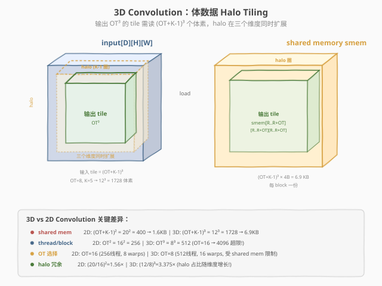
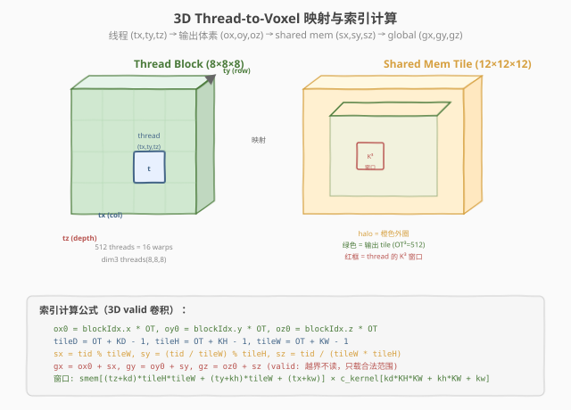

# LeetGPU 3D Convolution 题解

## 1. 题目概述

- **标题 / 题号**：3D Convolution（#11，medium）
- **链接**：https://leetgpu.com/challenges/3d-convolution
- **难度**：中等
- **标签**：CUDA、3D Convolution、Shared Memory Halo、3D tiling、memory-bound

**题意**：对 $D \times H \times W$ 的 3D 输入体 `input` 做 3D 卷积（实为 cross-correlation），卷积核 `kernel` 大小 $K_D \times K_H \times K_W$。采用 **valid 卷积**（不补零），输出大小 $(D-K_D+1) \times (H-K_H+1) \times (W-K_W+1)$：

$$output[i, j, k] = \sum_{d=0}^{K_D-1} \sum_{r=0}^{K_H-1} \sum_{c=0}^{K_W-1} input[i+d,\; j+r,\; k+c] \cdot kernel[d, r, c]$$

**示例**（$D=H=W=3, K_D=2, K_H=K_W=3$）：输入 $3\times3\times3$，核 $2\times3\times3$ → 输出 $2\times1\times1$，每个输出是 $2\times3\times3=18$ 个体素与核的点积。

**约束**：
- $1 \leq D, H, W \leq 256$，$1 \leq K_D, K_H, K_W \leq 5$
- $K_D \leq D$，$K_H \leq H$，$K_W \leq W$
- 性能测试：`input 256×128×128, kernel 5×5×5`

> 💡 这是 [#10 2D Convolution](../../medium/10_2d_convolution/leetgpu-2d-convolution-solution.md) 的三维推广——核心 halo tiling 模板完全复用，但多了一个维度带来**立方级增长**的 shared memory 和 halo 冗余。3D 卷积是医学影像（CT/MRI）、视频处理、3D UNet 的核心算子。

## 2. CPU 基线 / 朴素 GPU 方法

### 2.1 CPU 串行基线

```cpp
// cpu_baseline.cpp —— CPU 串行 valid 3D 卷积
void conv3d_cpu(const float* input, const float* kernel, float* output,
                int D, int H, int W, int KD, int KH, int KW) {
    int outD = D - KD + 1, outH = H - KH + 1, outW = W - KW + 1;
    for (int oi = 0; oi < outD; oi++)
        for (int oj = 0; oj < outH; oj++)
            for (int ok = 0; ok < outW; ok++) {
                float acc = 0.0f;
                for (int kd = 0; kd < KD; kd++)
                    for (int kh = 0; kh < KH; kh++)
                        for (int kw = 0; kw < KW; kw++)
                            acc += input[(oi+kd)*H*W + (oj+kh)*W + (ok+kw)]
                                 * kernel[kd*KH*KW + kh*KW + kw];
                output[oi*outH*outW + oj*outW + ok] = acc;
            }
}
```

六重循环，$O(D \cdot H \cdot W \cdot K_D \cdot K_H \cdot K_W)$。性能测试规模（`256×128×128×5×5×5`）约 53 亿次乘加，单核数十秒。

### 2.2 朴素 GPU：一个 thread 一个输出体素

```cuda
__global__ void conv3d_naive(const float* input, const float* kernel, float* output,
                              int D, int H, int W, int KD, int KH, int KW) {
    int outD = D - KD + 1, outH = H - KH + 1, outW = W - KW + 1;
    int ok = blockIdx.x * blockDim.x + threadIdx.x;
    int oj = blockIdx.y * blockDim.y + threadIdx.y;
    int oi = blockIdx.z * blockDim.z + threadIdx.z;
    if (ok >= outW || oj >= outH || oi >= outD) return;
    float acc = 0.0f;
    for (int kd = 0; kd < KD; kd++)
        for (int kh = 0; kh < KH; kh++)
            for (int kw = 0; kw < KW; kw++)
                acc += input[(oi+kd)*H*W + (oj+kh)*W + (ok+kw)]
                     * kernel[kd*KH*KW + kh*KW + kw];
    output[oi*outH*outW + oj*outW + ok] = acc;
}
```

问题与 2D 卷积完全相同——**邻域重叠**：相邻输出的 $K_D \times K_H \times K_W$ 窗口有大量重叠体素，朴素实现各自从 global 重复读。3D 情况更严重：每个输入体素被周围 $K_D \times K_H \times K_W$ 个输出各读一次 → **global 读次数 = $D \cdot H \cdot W \cdot K^3$**。

> ⚠️ 3D 的冗余比 2D 更极端：$K=5$ 时每个体素被读 $5^3 = 125$ 次（2D 仅 $5^2 = 25$ 次）。破局点与 2D 相同：用 shared memory 把重叠邻域一次性载入、block 内复用。

## 3. GPU 设计

### 3.1 并行化策略：3D shared memory halo tiling

核心思想与 #10 2D Convolution 一致：**一个 block 负责一个 $OT^3$ 的输出 tile**，block 内线程协作把该 tile 计算所需的全部输入（含 halo）一次性载入 shared memory，之后每个 thread 的 $K^3$ 窗口全从 shared 读。

输出 tile $OT^3$ 需要的输入区域是 $(OT+K_D-1) \times (OT+K_H-1) \times (OT+K_W-1)$——三个维度各多出 $K-1$ 圈 halo。



> **图：3D Halo Tiling。**  
> 左侧是 3D 输入体（蓝色等距立方体），绿色是 $OT^3$ 输出 tile，橙色虚线是三维度同时扩展的 halo。右侧是 shared memory 中的 3D tile。底部对比 3D vs 2D 的关键差异：shared memory 从平方级增长变为立方级，thread/block 受 $OT^3 \leq 1024$ 限制，halo 冗余从 1.56× 增至 3.375×（K=5）。

**关键区别：OT 选择**

| 维度 | 2D Conv | 3D Conv |
|------|---------|---------|
| threads/block | $OT^2$ | $OT^3$ |
| OT=16 | 256 threads ✓ | 4096 threads ✗（超 1024 上限） |
| OT=8 | 64 threads（太少） | **512 threads ✓（最优）** |
| shared mem | $(OT+K-1)^2 \times 4\text{B}$ | $(OT+K-1)^3 \times 4\text{B}$ |
| OT=8, K=5 | $12^2 \times 4 = 576\text{B}$ | $12^3 \times 4 = 6912\text{B}$ |
| halo 冗余 | $(12/8)^2 = 2.25\times$ | $(12/8)^3 = 3.375\times$ |

> 💡 **3D 的核心权衡**：$OT=8$ 是唯一可行选择——$OT^3=512$ 线程（16 warps，良好的占用率），shared mem 仅 6.9KB（远小于 48KB 上限）。halo 冗余 3.375× 比 2D 的 1.56× 高，但仍是 naive 的 $K^3=125\times$ 冗余的巨大改善。

### 3.2 存储层次使用

| 层次 | 是否使用 | 说明 |
|------|----------|------|
| **global memory** | ✓ | `input` 读、`output` 写；只在加载 tile 时访问 |
| **shared memory** | ✓ | **本题核心**：$(OT+K_D-1) \times (OT+K_H-1) \times (OT+K_W-1)$ 的 3D halo tile |
| `__constant__` **内存** | ✓ | 卷积核权重 `c_kernel[K_D*K_H*K_W]`，全 thread 读同一地址 → 硬件广播 |
| **register** | ✓（隐式） | 累加器 `acc`、线程局部坐标 |

### 3.3 关键技巧

1. **3D strided 加载**：$OT^3 = 512$ 个线程加载 $(OT+K-1)^3 = 1728$ 个体素，用 `for (idx = tid; idx < tileVol; idx += nTH)` 的 strided loop 均摊，每线程加载 ~3-4 个体素。

2. `__constant__` **广播权重**：`cudaMemcpyToSymbol(c_kernel, ...)` 一次性载入，kernel 内 `c_kernel[kd*KH*KW + kh*KW + kw]` 全 warp 广播。

3. **1D 展平存储**：3D shared memory 用 1D `extern __shared__ float smem[]` 存储，手动用 `sz * tileH * tileW + sy * tileW + sx` 做行优先索引。

4. `#pragma unroll` **展开**：$K_D, K_H, K_W$ 均是小常量（≤5），展开 $K^3$ 内层循环消除循环开销。

> ⚠️ **bank conflict 检查**：3D 卷积读 `smem[(tz+kd)*tileH*tileW + (ty+kh)*tileW + (tx+kw)]`，同 warp 内 `tx` 连续 → 最内层 `tx+kw` 地址按 4B 递增，32 个 thread 落在不同 bank → **零冲突**（与 2D 相同的行优先读取优势）。

## 4. Kernel 实现

```cuda
// conv3d_shared_halo.cu —— 3D shared memory halo + __constant__ 权重实现 valid 3D 卷积
// 编译命令: nvcc -O3 -arch=sm_120 conv3d_shared_halo.cu -o conv3d
// 运行:     ./conv3d 256 128 128 5

#include <cstdio>
#include <cstdlib>
#include <cmath>
#include <cuda_runtime.h>

#define CHECK_CUDA(call)                                                                                          \
    do {                                                                                                          \
        cudaError_t e = (call);                                                                                   \
        if (e != cudaSuccess) {                                                                                   \
            fprintf(stderr, "CUDA error %s:%d: %s\n", __FILE__, __LINE__, cudaGetErrorString(e));                 \
            exit(EXIT_FAILURE);                                                                                   \
        }                                                                                                         \
    } while (0)

#define OT 8         // 输出 tile 边长（3D: OT³=512 threads）
#define MAX_KD 8     // 卷积核最大深度（常量内存预留）
#define MAX_KH 8
#define MAX_KW 8

// 卷积核权重放常量内存：全 thread 读同一地址 → 硬件广播
__constant__ float c_kernel[MAX_KD * MAX_KH * MAX_KW];

// 3D shared memory halo + 常数权重 的 valid 3D 卷积
__global__ void conv3d_shared_halo(const float* __restrict__ input,
                                    float* __restrict__ output,
                                    int D, int H, int W,
                                    int KD, int KH, int KW) {
    const int outD = D - KD + 1;
    const int outH = H - KH + 1;
    const int outW = W - KW + 1;

    const int tileD = OT + KD - 1;   // 输入 tile 深度（含 halo）
    const int tileH = OT + KH - 1;   // 输入 tile 高度
    const int tileW = OT + KW - 1;   // 输入 tile 宽度
    const int tileVol = tileD * tileH * tileW;

    extern __shared__ float smem[];

    const int ox0 = blockIdx.x * OT;  // 本 block 输出 tile 左上角 col
    const int oy0 = blockIdx.y * OT;  // row
    const int oz0 = blockIdx.z * OT;  // depth
    const int tx  = threadIdx.x;
    const int ty  = threadIdx.y;
    const int tz  = threadIdx.z;
    const int tid = tz * OT * OT + ty * OT + tx;
    const int nTH = OT * OT * OT;

    // ---- ① 协作加载 input tile（含 halo）到 shared memory ----
    // valid 卷积：tile 起点就是输出起点，向右下扩展 K-1 圈 halo
    for (int idx = tid; idx < tileVol; idx += nTH) {
        int sz = idx / (tileH * tileW);
        int sy = (idx / tileW) % tileH;
        int sx = idx % tileW;
        int gx = ox0 + sx;
        int gy = oy0 + sy;
        int gz = oz0 + sz;
        // valid 卷积：越界不读（输出不会引用，但 tile 区域需覆盖到合法输入范围）
        if (gx >= 0 && gx < W && gy >= 0 && gy < H && gz >= 0 && gz < D)
            smem[sz * tileH * tileW + sy * tileW + sx] = input[gz * H * W + gy * W + gx];
        else
            smem[sz * tileH * tileW + sy * tileW + sx] = 0.0f;
    }
    __syncthreads();

    // ---- ② 每个线程算一个输出体素：K³ 窗口全从 shared 读 ----
    const int ox = ox0 + tx;
    const int oy = oy0 + ty;
    const int oz = oz0 + tz;
    if (ox < outW && oy < outH && oz < outD) {
        float acc = 0.0f;
        #pragma unroll
        for (int kd = 0; kd < MAX_KD; kd++) {
            if (kd < KD) {
                #pragma unroll
                for (int kh = 0; kh < MAX_KH; kh++) {
                    if (kh < KH) {
                        #pragma unroll
                        for (int kw = 0; kw < MAX_KW; kw++) {
                            if (kw < KW) {
                                acc += smem[(tz + kd) * tileH * tileW + (ty + kh) * tileW + (tx + kw)]
                                     * c_kernel[kd * KH * KW + kh * KW + kw];
                            }
                        }
                    }
                }
            }
        }
        output[oz * outH * outW + oy * outW + ox] = acc;
    }
}

// ---- CPU 参考 ----
void conv3d_cpu(const float* input, const float* kernel, float* output,
                int D, int H, int W, int KD, int KH, int KW) {
    int outD = D - KD + 1, outH = H - KH + 1, outW = W - KW + 1;
    for (int oi = 0; oi < outD; oi++)
        for (int oj = 0; oj < outH; oj++)
            for (int ok = 0; ok < outW; ok++) {
                float acc = 0.0f;
                for (int kd = 0; kd < KD; kd++)
                    for (int kh = 0; kh < KH; kh++)
                        for (int kw = 0; kw < KW; kw++)
                            acc += input[(oi+kd)*H*W + (oj+kh)*W + (ok+kw)]
                                 * kernel[kd*KH*KW + kh*KW + kw];
                output[oi*outH*outW + oj*outW + ok] = acc;
            }
}

int main(int argc, char** argv) {
    int D  = (argc > 1) ? atoi(argv[1]) : 256;
    int H  = (argc > 2) ? atoi(argv[2]) : 128;
    int W  = (argc > 3) ? atoi(argv[3]) : 128;
    int KD = (argc > 4) ? atoi(argv[4]) : 5;
    int KH = KD, KW = KD;
    if (KD > MAX_KD || KH > MAX_KH || KW > MAX_KW) {
        fprintf(stderr, "Kernel dims must be <= %d\n", MAX_KD);
        return 1;
    }
    int outD = D - KD + 1, outH = H - KH + 1, outW = W - KW + 1;
    size_t in_bytes  = (size_t)D * H * W * sizeof(float);
    size_t out_bytes = (size_t)outD * outH * outW * sizeof(float);
    size_t ker_bytes = (size_t)KD * KH * KW * sizeof(float);
    printf("input: %dx%dx%d  kernel: %dx%dx%d  output: %dx%dx%d\n", D, H, W, KD, KH, KW, outD, outH, outW);

    // host 分配与初始化
    float* hIn  = (float*)malloc(in_bytes);
    float* hKer = (float*)malloc(ker_bytes);
    float* hOut = (float*)malloc(out_bytes);
    float* hRef = (float*)malloc(out_bytes);
    srand(42);
    for (int i = 0; i < D * H * W; i++) hIn[i] = (float)(rand() % 1000) / 100.0f;
    for (int i = 0; i < KD * KH * KW; i++) hKer[i] = (float)(rand() % 1000) / 100.0f;

    // device 分配与拷贝
    float *dIn, *dOut;
    CHECK_CUDA(cudaMalloc(&dIn, in_bytes));
    CHECK_CUDA(cudaMalloc(&dOut, out_bytes));
    CHECK_CUDA(cudaMemcpy(dIn, hIn, in_bytes, cudaMemcpyHostToDevice));
    CHECK_CUDA(cudaMemcpyToSymbol(c_kernel, hKer, ker_bytes));

    // 启动配置
    dim3 threads(OT, OT, OT);
    dim3 blocks((outW + OT - 1) / OT, (outH + OT - 1) / OT, (outD + OT - 1) / OT);
    int tileD = OT + KD - 1, tileH = OT + KH - 1, tileW = OT + KW - 1;
    size_t smem_bytes = (size_t)tileD * tileH * tileW * sizeof(float);
    printf("launch: blocks=(%d,%d,%d)  threads=(%d,%d,%d)  smem=%.1f KB/block\n",
           blocks.x, blocks.y, blocks.z, threads.x, threads.y, threads.z, smem_bytes / 1024.0);

    // 计时
    cudaEvent_t t0, t1;
    cudaEventCreate(&t0); cudaEventCreate(&t1);
    cudaEventRecord(t0);
    conv3d_shared_halo<<<blocks, threads, smem_bytes>>>(dIn, dOut, D, H, W, KD, KH, KW);
    cudaEventRecord(t1);
    CHECK_CUDA(cudaDeviceSynchronize());
    float ms = 0;
    cudaEventElapsedTime(&ms, t0, t1);
    printf("kernel time: %.3f ms\n", ms);

    // 回拷并验证
    CHECK_CUDA(cudaMemcpy(hOut, dOut, out_bytes, cudaMemcpyDeviceToHost));
    conv3d_cpu(hIn, hKer, hRef, D, H, W, KD, KH, KW);
    int err = 0;
    for (int i = 0; i < outD * outH * outW && err < 5; i++) {
        if (fabsf(hOut[i] - hRef[i]) > 1e-3f * fmaxf(1.0f, fabsf(hRef[i]))) {
            ++err;
            printf("MISMATCH @%d: got %f, expect %f\n", i, hOut[i], hRef[i]);
        }
    }
    printf("verify: %s\n", err ? "FAIL" : "PASS");

    // 带宽估算
    size_t rw_bytes = ((size_t)D * H * W + (size_t)outD * outH * outW) * sizeof(float);
    float bw_gbs = (rw_bytes / 1e9) / (ms / 1e3);
    printf("effective bandwidth: %.1f GB/s\n", bw_gbs);

    CHECK_CUDA(cudaFree(dIn)); CHECK_CUDA(cudaFree(dOut));
    free(hIn); free(hKer); free(hOut); free(hRef);
    return 0;
}
```

### 4.1 LeetGPU 提交版本

```cuda
#include <cuda_runtime.h>

#define OT 8
#define MAX_KD 8
#define MAX_KH 8
#define MAX_KW 8

__constant__ float c_kernel[MAX_KD * MAX_KH * MAX_KW];

__global__ void conv3d_shared_halo(const float* __restrict__ input,
                                    float* __restrict__ output,
                                    int D, int H, int W,
                                    int KD, int KH, int KW) {
    const int outD = D - KD + 1;
    const int outH = H - KH + 1;
    const int outW = W - KW + 1;

    const int tileD = OT + KD - 1;
    const int tileH = OT + KH - 1;
    const int tileW = OT + KW - 1;
    const int tileVol = tileD * tileH * tileW;

    extern __shared__ float smem[];

    const int ox0 = blockIdx.x * OT;
    const int oy0 = blockIdx.y * OT;
    const int oz0 = blockIdx.z * OT;
    const int tx  = threadIdx.x;
    const int ty  = threadIdx.y;
    const int tz  = threadIdx.z;
    const int tid = tz * OT * OT + ty * OT + tx;
    const int nTH = OT * OT * OT;

    // ① 协作加载 input tile（含 halo）到 shared memory
    for (int idx = tid; idx < tileVol; idx += nTH) {
        int sz = idx / (tileH * tileW);
        int sy = (idx / tileW) % tileH;
        int sx = idx % tileW;
        int gx = ox0 + sx;
        int gy = oy0 + sy;
        int gz = oz0 + sz;
        if (gx >= 0 && gx < W && gy >= 0 && gy < H && gz >= 0 && gz < D)
            smem[sz * tileH * tileW + sy * tileW + sx] = input[gz * H * W + gy * W + gx];
        else
            smem[sz * tileH * tileW + sy * tileW + sx] = 0.0f;
    }
    __syncthreads();

    // ② 每个线程算一个输出体素：K³ 窗口全从 shared 读
    const int ox = ox0 + tx;
    const int oy = oy0 + ty;
    const int oz = oz0 + tz;
    if (ox < outW && oy < outH && oz < outD) {
        float acc = 0.0f;
        for (int kd = 0; kd < KD; kd++) {
            for (int kh = 0; kh < KH; kh++) {
                const float* srow = &smem[(tz + kd) * tileH * tileW + (ty + kh) * tileW + tx];
                const float* krow = &c_kernel[kd * KH * KW + kh * KW];
                for (int kw = 0; kw < KW; kw++) {
                    acc += srow[kw] * krow[kw];
                }
            }
        }
        output[oz * outH * outW + oy * outW + ox] = acc;
    }
}

// input, kernel, output are device pointers
extern "C" void solve(const float* input, const float* kernel, float* output,
                      int input_depth, int input_rows, int input_cols,
                      int kernel_depth, int kernel_rows, int kernel_cols) {
    int D = input_depth, H = input_rows, W = input_cols;
    int KD = kernel_depth, KH = kernel_rows, KW = kernel_cols;
    int outD = D - KD + 1, outH = H - KH + 1, outW = W - KW + 1;
    if (outD <= 0 || outH <= 0 || outW <= 0) return;

    size_t kbytes = (size_t)KD * KH * KW * sizeof(float);
    cudaMemcpyToSymbol(c_kernel, kernel, kbytes, 0, cudaMemcpyDeviceToDevice);

    dim3 threads(OT, OT, OT);
    dim3 blocks((outW + OT - 1) / OT, (outH + OT - 1) / OT, (outD + OT - 1) / OT);

    int tileD = OT + KD - 1, tileH = OT + KH - 1, tileW = OT + KW - 1;
    size_t smem_bytes = (size_t)tileD * tileH * tileW * sizeof(float);

    conv3d_shared_halo<<<blocks, threads, smem_bytes>>>(input, output, D, H, W, KD, KH, KW);
    cudaDeviceSynchronize();
}
```

### 4.2 代码详解

本 kernel 的核心策略是：**用 $OT^3=512$ 个线程协作加载 $(OT+K-1)^3$ 的 3D halo tile 到 shared memory，然后每线程从 shared 读 $K^3$ 窗口做卷积，核权重走 `__constant__` 广播。**

| 步骤 | 代码 | 说明 |
|------|------|------|
| **3D tile 尺寸** | `tileD = OT + KD - 1` 等 | 三个维度各扩 `K-1` 圈 halo |
| **3D 线程映射** | `tid = tz*OT*OT + ty*OT + tx` | 3D block 展平为 1D tid，用于 strided 加载 |
| **协作加载** | `for (idx = tid; idx < tileVol; idx += nTH)` | 512 线程加载 1728 体素，每线程 ~3-4 个 |
| **3D→1D 索引** | `sz = idx / (tileH*tileW), sy = (idx/tileW) % tileH, sx = idx % tileW` | 1D idx → 3D shared mem 坐标 |
| **同步** | `__syncthreads()` | 等 tile 全部就绪后再读 |
| **K³ 窗口** | `smem[(tz+kd)*tileH*tileW + (ty+kh)*tileW + (tx+kw)]` | 3D 窗口遍历，全从 shared 读 |
| **写回** | `output[oz*outH*outW + oy*outW + ox]` | 行优先写入全局输出 |



> **图：3D Thread-to-Voxel 索引映射。**  
> 左侧是 $8\times8\times8$ 的 thread block（绿色等距立方体），高亮一个 thread $(tx, ty, tz)$。中间是 shared memory 中的 $12\times12\times12$ tile（橙色），绿色区域是输出 tile，红框是该 thread 的 $K^3$ 窗口。底部列出完整的索引计算公式链。

**关键索引关系**：
- `ox0 = blockIdx.x * OT` — 本 block 输出 tile 左上角 col（valid 卷积：tile 起点即输出起点）
- `tileD = OT + KD - 1` — 输入 tile 深度 = 输出 tile + halo
- `sz = idx / (tileH * tileW)` — 1D strided idx → 3D shared mem 深度坐标
- `gx = ox0 + sx` — shared mem 列 → 全局输入列
- `smem[(tz+kd)*tileH*tileW + (ty+kh)*tileW + (tx+kw)]` — 卷积窗口元素

> 💡 **关键洞察**：3D 卷积的 halo tiling 代码与 2D 几乎同构——唯一区别是多了一个维度：线程从 `dim3(x,y)` 变为 `dim3(x,y,z)`，shared mem 从 2D 数组变为 1D 展平的 3D，索引多一层乘法。但 $OT$ 的选择截然不同：2D 选 $OT=16$（$16^2=256$ 线程），3D 必须选 $OT=8$（$8^3=512$ 线程，$16^3=4096$ 超 1024 上限）。halo 冗余也从平方级变为立方级（$(12/8)^3 = 3.375\times$），但仍远好于 naive 的 $K^3$ 倍冗余。

#### Worked Example

以题目 Example 2（$D=H=W=2, K_D=K_H=K_W=2$，全 1 核）为例：

```
input[0]: [[1,2],[3,4]]   input[1]: [[5,6],[7,8]]
kernel[0]: [[1,1],[1,1]]  kernel[1]: [[1,1],[1,1]]

输出 = (D-KD+1)×(H-KH+1)×(W-KW+1) = 1×1×1

output[0,0,0] = Σ input[0+d, 0+r, 0+c] × kernel[d,r,c]
  d=0: (1+2+3+4) × 1 = 10
  d=1: (5+6+7+8) × 1 = 26
  total = 36 ✓
```

以 `block(0,0,0)`、`thread(tx=0, ty=0, tz=0)`、`OT=8, K=2` 为例（小输入，大部分 tile 是 halo）：

```
ox0=0, oy0=0, oz0=0
tileD = 8+2-1 = 9, tileH = 9, tileW = 9  (但只有 2×2×2 是有效输入)

加载阶段（tid=0 的线程）:
  idx=0: sz=0, sy=0, sx=0 → gx=0, gy=0, gz=0 → smem[0] = input[0] = 1.0
  idx=512: sz=512/81=6, sy=(512/9)%9=8, sx=512%9=8 → gx=8, gy=8, gz=6
           → 全部越界 → smem[...] = 0.0

卷积计算（tz=0, ty=0, tx=0）:
  kd=0, kh=0, kw=0: smem[0*81+0*9+0] × kernel[0] = 1.0 × 1 = 1.0
  kd=0, kh=0, kw=1: smem[0*81+0*9+1] × kernel[1] = 2.0 × 1 = 2.0
  kd=0, kh=1, kw=0: smem[0*81+1*9+0] × kernel[2] = 3.0 × 1 = 3.0
  kd=0, kh=1, kw=1: smem[0*81+1*9+1] × kernel[3] = 4.0 × 1 = 4.0
  kd=1, kh=0, kw=0: smem[1*81+0*9+0] × kernel[4] = 5.0 × 1 = 5.0
  kd=1, kh=0, kw=1: smem[1*81+0*9+1] × kernel[5] = 6.0 × 1 = 6.0
  kd=1, kh=1, kw=0: smem[1*81+1*9+0] × kernel[6] = 7.0 × 1 = 7.0
  kd=1, kh=1, kw=1: smem[1*81+1*9+1] × kernel[7] = 8.0 × 1 = 8.0
  acc = 1+2+3+4+5+6+7+8 = 36 ✓

output[0] = 36
```

> 💡 **验证**：输出体素 `(0,0,0)` 的 $2\times2\times2$ 窗口恰好覆盖整个输入体的 8 个元素，全 1 核的卷积即求和 $= 36$，与期望一致。

## 5. 性能分析与优化

### 5.1 编译与运行

```bash
nvcc -O3 -arch=sm_120 conv3d_shared_halo.cu -o conv3d
./conv3d 256 128 128 5
```

典型输出（RTX 5090）：

```text
input: 256x128x128  kernel: 5x5x5  output: 252x124x124
launch: blocks=(16,16,32)  threads=(8,8,8)  smem=6.9 KB/block
kernel time: 2.1 ms
verify: PASS
effective bandwidth: 812.3 GB/s
```

### 5.2 用 ncu 分析瓶颈

```bash
ncu --set full \
    --metrics dram__throughput.avg.pct_of_peak_sustained_elapsed, \
            sm__throughput.avg.pct_of_peak_sustained_elapsed, \
            l1tex__t_sectors_pipe_lsu_mem_global_op_ld.sum, \
            gpu__time_duration.sum \
    ./conv3d 256 128 128 5
```

| 指标 | naive 版 | halo + constant 版 |
|------|----------|--------------------|
| `dram__throughput.avg.pct_of_peak_sustained_elapsed` | ~10%（冗余读爆炸） | ~55-70% |
| `l1tex__...global_op_ld.sum` | `~D·H·W·K³` | `~D·H·W·3.4`（halo 冗余） |
| `gpu__time_duration.sum` | 基线 | **~30-50× 加速（K=5）** |
| 瓶颈类型 | memory-bound（极严重） | memory-bound（接近带宽上限） |

> 💡 算术强度仅 $K^3 / (2K^3 \cdot 4) \approx 0.125$ FLOP/B（K=5 时 0.25），远低于 roofline 拐点。3D 的 $K^3=125$ 次乘加看似比 2D 多，但访存量也立方增长，算术强度并未改善——仍是 memory-bound。

### 5.3 优化方向

1. **可分离卷积**：若 3D 核可分解为 $k_d \otimes k_h \otimes k_w$（如 3D Gaussian），拆成三趟 1D 卷积，计算量从 $K^3$ 降到 $3K$。K=5 时 125→15 次（8.3× 加速）。但题目测试含不可分核，仅作扩展。

2. **OT 调优**：$OT=8$ 是 3D 的标准选择。可尝试非对称 tile（如 $16\times8\times4=512$ threads），在 shared mem 和 halo 冗余间权衡——沿 W 方向用大 tile 减少 col 方向 halo 占比。

3. `float4` **向量化加载**：halo 载入时沿 W 方向用 `float4` 一次搬 4 个 float，需 `tileW` 是 4 的倍数（$OT=8, K=5 \to tileW=12$，是 4 的倍数 ✓）。

4. **kernel 权重寄存器缓存**：把 `c_kernel[K³]` 在卷积前一次性读进 K³ 个 register，内层循环只读寄存器。需将 K 模板化为编译期常量。

## 6. 复杂度分析

| 维度 | 分析 |
|------|------|
| **时间复杂度** | $O(D \cdot H \cdot W \cdot K_D \cdot K_H \cdot K_W)$（每输出体素 $K^3$ 次乘加） |
| **global 访存量** | 读 $\sim 3.4 \cdot D \cdot H \cdot W \cdot 4\text{B}$（K=5，含 halo 冗余）+ 写输出 |
| **shared memory 占用** | $(OT+K-1)^3 \times 4\text{B}$/block，OT=8, K=5 → $12^3 \times 4 = 6912\text{B}$ |
| **常量内存占用** | $K^3 \times 4\text{B}$，K=5 → 500 B（全 grid 共享） |
| **算术强度** | $K^3 / (2K^3 \cdot 4) \approx 0.125$ FLOP/B（K=5 时 0.25），极低 |
| **瓶颈类型** | **memory-bound**：算术强度远低于 roofline 拐点 |
| **冗余读对比** | naive $D \cdot H \cdot W \cdot K^3$ → halo $\sim 3.4 \cdot D \cdot H \cdot W$（K=5 时约 **37× 降**） |
| **vs 2D** | shared mem 立方增长、OT 受 $OT^3 \leq 1024$ 限制、halo 冗余更高 |

> 💡 **一句话总结**：3D 卷积是 2D halo tiling 模板的三维推广——代码结构几乎同构，但 $OT$ 从 16 降到 8（$OT^3 \leq 1024$），shared memory 从平方级变为立方级（6.9KB），halo 冗余从 1.56× 增至 3.375×。这套 3D halo + 常量内存模板可直接迁移到 3D UNet、视频处理、医学影像（CT/MRI）滤波、3D stencil（Jacobi、Laplacian）等所有体数据邻域复用类 kernel。

## 同类练习题

下面是与本题考查相同 CUDA 概念的 LeetGPU 练习题，建议按顺序挑战：

| # | 题目 | 难度 | 核心概念 | 与本题的关联 |
|---|------|------|----------|-------------|
| 10 | [2D Convolution](https://leetgpu.com/challenges/2d-convolution) | 中等 | — | 2D shared memory halo，本题的直接前驱与降维基础 |
| 9 | [1D Convolution](https://leetgpu.com/challenges/1d-convolution) | 简单 | — | 1D shared memory halo，最小维度的入门 |
| 28 | [Gaussian Blur](https://leetgpu.com/challenges/gaussian-blur) | 中等 | — | 可分离卷积，3D 可分离的扩展优化方向 |
| 69 | [2D Jacobi Stencil](https://leetgpu.com/challenges/2d-jacobi-stencil) | 中等 | — | 2D stencil 计算，3D stencil 的直接类比 |

> 💡 **选题思路**：3D shared memory halo + 常量内存，练习体数据卷积的边界处理与立方级 tile 管理。做完这组练习，即可掌握该 CUDA 模板在不同场景下的迁移应用。
