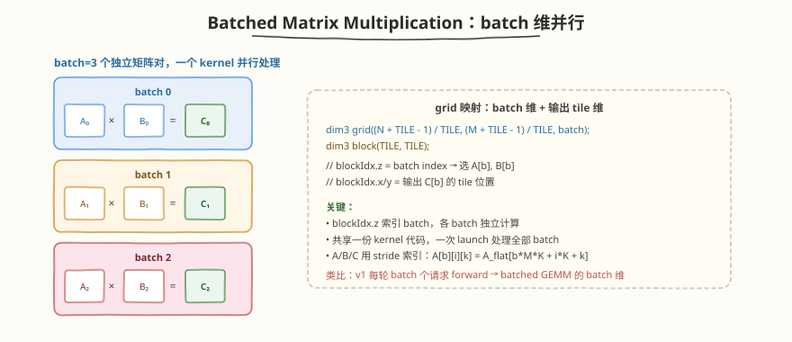

# LeetGPU Batched Matrix Multiplication 题解

## 1. 题目概述

- **标题 / 题号**：Batched Matrix Multiplication（#30，medium）
- **链接**：https://leetgpu.com/challenges/batched-matrix-multiplication
- **难度**：中等
- **标签**：CUDA、batched GEMM、register blocking、shared memory tiling

**题意**：给定一个 batch 的矩阵对 `(A[i], B[i])`，对每个 batch 元素独立做矩阵乘法 `C[i] = A[i] × B[i]`。`A[i]` 是 `M×K`，`B[i]` 是 `K×N`，`C[i]` 是 `M×N`。所有 batch 元素共享相同的 `M, N, K` 形状。

**示例**：

```text
batch=2, M=2, K=2, N=2
A[0] = [[1,2],[3,4]]  B[0] = [[5,6],[7,8]]  → C[0] = [[19,22],[43,50]]
A[1] = [[1,0],[0,1]]  B[1] = [[1,2],[3,4]]  → C[1] = [[1,2],[3,4]]
```

**约束**：`1 ≤ batch ≤ 256`，`1 ≤ M, N, K ≤ 1024`；性能测试取大 batch。

> 💡 这道题的 **batched GEMM** 与 [Week6 Day5](../../../aiinfra/daily/week6/day5/README.md) Mini Engine v1 的多请求并发 forward 同构——v1 每轮把多个请求拼 batch 送 model forward，其中 attention/FFN 的核心计算就是 batched GEMM（batch=请求数）。batched matmul 的"每个 batch 独立计算、共享 kernel launch"正是 v1 Scheduler"每轮选多请求组 batch、一次 forward"的底层映射。

## 2. CPU 基线 / 朴素 GPU 方法

### CPU 串行

```cpp
// 对每个 batch 顺序做矩阵乘法，O(batch × M × N × K)
for (int b = 0; b < batch; b++)
    for (int i = 0; i < M; i++)
        for (int j = 0; j < N; j++) {
            int sum = 0;
            for (int k = 0; k < K; k++)
                sum += A[b][i][k] * B[b][k][j];
            C[b][i][j] = sum;
        }
```

### 朴素 GPU（一 thread 一输出元素）

```cuda
// 每个 thread 算 C[b][i][j] 一个元素
__global__ void naive_batched_matmul(const float* A, const float* B, float* C, int batch, int M, int N, int K) {
    int b = blockIdx.z;
    int j = blockIdx.x * blockDim.x + threadIdx.x; // N 维
    int i = blockIdx.y * blockDim.y + threadIdx.y; // M 维
    if (b >= batch || i >= M || j >= N)
        return;
    float sum = 0;
    for (int k = 0; k < K; k++)
        sum += A[b * M * K + i * K + k] * B[b * K * N + k * N + j];
    C[b * M * N + i * N + j] = sum;
}
```

**瓶颈**：每个 thread 重复读 A 的行和 B 的列，global memory 访问冗余严重，无 tiling。shared memory tiling（`TILE=16`，每 thread 算 1 个元素）能降低 `TILE` 倍 global 读量，但每个 thread 只产出 1 个输出，算术强度仍偏低。要进一步提升必须做 **register blocking**——每 thread 持有 `TM×TN` 个累加器，让 shared tile 的每个 A 行被 `TN` 个输出列复用、每个 B 列被 `TM` 个输出行复用，把算术强度再提升 `TM×TN` 倍。

## 3. GPU 设计

### 3.1 并行化策略：batch 维 + register blocking



三维并行 + 两级 tiling：
1. **batch 维**（`blockIdx.z`）：每个 batch 元素独立，一个 block 处理一个 batch 的一个 tile
2. **block tile 维**（`blockIdx.x/y`）：把 `C[b]` 切成 `BM×BN`（64×64）的块，block 内 256 个 thread 协作
3. **register tile 维**：每个 thread 负责 `TM×TN`（4×4=16）个输出元素，累加器常驻寄存器
4. **K 维累加**：沿 K 方向遍历 `BK=16` 的 tile，shared memory 缓存 A/B 子块

### 3.2 存储层次使用

| 数据 | 存储 | 说明 |
|------|------|------|
| `A[b]`, `B[b]` | global memory（stride 索引） | batch 维 stride 寻址 |
| A/B tile | shared memory | `As[BM][BK]` + `Bs[BK][BN]`，block 内共享 |
| C tile 累加器 | registers | 每 thread 持有 `TM×TN=16` 个 `acc`，常驻寄存器 |

### 3.3 关键技巧

- `blockIdx.z` **索引 batch**：grid 第三维天然映射 batch 维，各 batch 独立
- **stride 寻址**：`A[b][i][k] = A_flat[b * M * K + i * K + k]`，batch 间 stride = `M*K`
- **register blocking**：每 thread 算 `TM×TN=16` 个输出，shared tile 的 A 行被 `BN/TN=16` 个 thread 复用，B 列被 `BM/TM=16` 个 thread 复用，算术强度比朴素 tiling 提升 `TM×TN` 倍
- **协作加载**：256 个 thread 平摊 `As` 的 `64×16=1024` 和 `Bs` 的 `16×64=1024` 个元素，每 thread 各搬 4 个

## 4. Kernel 实现

```cuda
// batched_matmul.cu —— Batched Matrix Multiplication（batch 维 + register blocking）
// 编译命令: nvcc -O3 -arch=sm_120 batched_matmul.cu -o batched_matmul
// 运行:     ./batched_matmul

#include <cstdio>
#include <cstdlib>
#include <vector>
#include <cuda_runtime.h>

// register blocking 分块参数：block 负责 64×64 输出，每个 thread 算 4×4 = 16 个元素
const int BM = 64, BN = 64, BK = 16;
const int TM = 4, TN = 4;
const int BLOCK_M = BM / TM;               // 16
const int BLOCK_N = BN / TN;               // 16
const int NUM_THREADS = BLOCK_M * BLOCK_N; // 256
const int LOAD_A = BM * BK / NUM_THREADS;  // 4
const int LOAD_B = BK * BN / NUM_THREADS;  // 4

// batched matmul：grid((N+BN-1)/BN, (M+BM-1)/BM, batch)
// blockIdx.z = batch index, blockIdx.x/y = 输出 C[b] 的 block tile 位置
__global__ void batched_matmul_kernel(const float* A, const float* B, float* C, int batch, int M, int N, int K) {
    int b = blockIdx.z;
    int by = blockIdx.y;
    int bx = blockIdx.x;
    int tid = threadIdx.x;
    int tx = tid % BLOCK_N;  // 0..15
    int ty = tid / BLOCK_N;  // 0..15

    // batch stride 寻址
    const float* A_b = A + b * M * K;
    const float* B_b = B + b * K * N;
    float* C_b = C + b * M * N;

    __shared__ float As[BM][BK];
    __shared__ float Bs[BK][BN];

    float acc[TM][TN];
    #pragma unroll
    for (int i = 0; i < TM; ++i)
        #pragma unroll
        for (int j = 0; j < TN; ++j)
            acc[i][j] = 0.0f;

    // 沿 K 方向分 tile 累加
    for (int bk = 0; bk < K; bk += BK) {
        // 协作加载 As[BM][BK]（越界补 0）
        #pragma unroll
        for (int i = 0; i < LOAD_A; ++i) {
            int lin = tid + i * NUM_THREADS;
            int r = lin / BK;
            int c = lin % BK;
            int ar = by * BM + r;
            int ac = bk + c;
            As[r][c] = (ar < M && ac < K) ? A_b[ar * K + ac] : 0.0f;
        }
        // 协作加载 Bs[BK][BN]（越界补 0）
        #pragma unroll
        for (int i = 0; i < LOAD_B; ++i) {
            int lin = tid + i * NUM_THREADS;
            int r = lin / BN;
            int c = lin % BN;
            int br = bk + r;
            int bc = bx * BN + c;
            Bs[r][c] = (br < K && bc < N) ? B_b[br * N + bc] : 0.0f;
        }
        __syncthreads();

        // register blocking：每 thread 算 TM×TN 个输出
        #pragma unroll
        for (int k = 0; k < BK; ++k) {
            float a[TM], b[TN];
            #pragma unroll
            for (int i = 0; i < TM; ++i)
                a[i] = As[ty * TM + i][k];
            #pragma unroll
            for (int j = 0; j < TN; ++j)
                b[j] = Bs[k][tx * TN + j];
            #pragma unroll
            for (int i = 0; i < TM; ++i) {
                #pragma unroll
                for (int j = 0; j < TN; ++j) {
                    acc[i][j] += a[i] * b[j];
                }
            }
        }
        __syncthreads();
    }

    // 写回输出
    #pragma unroll
    for (int i = 0; i < TM; ++i) {
        #pragma unroll
        for (int j = 0; j < TN; ++j) {
            int gr = by * BM + ty * TM + i;
            int gc = bx * BN + tx * TN + j;
            if (gr < M && gc < N)
                C_b[gr * N + gc] = acc[i][j];
        }
    }
}

int main() {
    int batch = 4, M = 64, N = 64, K = 64;
    size_t a_bytes = batch * M * K * sizeof(float);
    size_t b_bytes = batch * K * N * sizeof(float);
    size_t c_bytes = batch * M * N * sizeof(float);

    std::vector<float> h_A(batch * M * K), h_B(batch * K * N), h_C(batch * M * N);
    srand(42);
    for (auto& x : h_A)
        x = (rand() % 100) / 100.0f;
    for (auto& x : h_B)
        x = (rand() % 100) / 100.0f;

    float *d_A, *d_B, *d_C;
    cudaMalloc(&d_A, a_bytes);
    cudaMalloc(&d_B, b_bytes);
    cudaMalloc(&d_C, c_bytes);
    cudaMemcpy(d_A, h_A.data(), a_bytes, cudaMemcpyHostToDevice);
    cudaMemcpy(d_B, h_B.data(), b_bytes, cudaMemcpyHostToDevice);

    dim3 grid((N + BN - 1) / BN, (M + BM - 1) / BM, batch);
    dim3 block(NUM_THREADS);
    batched_matmul_kernel<<<grid, block>>>(d_A, d_B, d_C, batch, M, N, K);
    cudaDeviceSynchronize();
    cudaMemcpy(h_C.data(), d_C, c_bytes, cudaMemcpyDeviceToHost);

    // CPU 验证
    bool pass = true;
    for (int b = 0; b < batch && pass; b++)
        for (int i = 0; i < M && pass; i++)
            for (int j = 0; j < N && pass; j++) {
                float s = 0;
                for (int k = 0; k < K; k++)
                    s += h_A[b * M * K + i * K + k] * h_B[b * K * N + k * N + j];
                if (fabs(s - h_C[b * M * N + i * N + j]) > 1e-3)
                    pass = false;
            }
    printf("batch=%d M=N=K=%d, %s\n", batch, M, pass ? "PASS" : "FAIL");

    cudaFree(d_A);
    cudaFree(d_B);
    cudaFree(d_C);
    return 0;
}
```

> 💡 提交给 LeetGPU 平台时，把 `batched_matmul_kernel` 填进 `solve`。核心是 `blockIdx.z` 索引 batch + stride 寻址 `A + b*M*K`，配合 register blocking 每 thread 算 `TM×TN=16` 个输出，把算术强度提升到朴素 tiling 的 16 倍。

### 4.1 LeetGPU 提交版本

下面给出适配 LeetGPU 官方 starter 签名的提交版本。它使用 `blockIdx.z` 索引 batch，并用 register blocking + shared memory tiling 完成每个 batch 的 GEMM。

```cuda
#include <cuda_runtime.h>

const int BM = 64, BN = 64, BK = 16;
const int TM = 4, TN = 4;
const int BLOCK_M = BM / TM;
const int BLOCK_N = BN / TN;
const int NUM_THREADS = BLOCK_M * BLOCK_N;
const int LOAD_A = BM * BK / NUM_THREADS;
const int LOAD_B = BK * BN / NUM_THREADS;

__global__ void batched_matmul_kernel(const float* A, const float* B, float* C,
                                       int batch, int M, int N, int K) {
    int b = blockIdx.z;
    int by = blockIdx.y;
    int bx = blockIdx.x;
    int tid = threadIdx.x;
    int tx = tid % BLOCK_N;
    int ty = tid / BLOCK_N;

    const float* A_b = A + b * M * K;
    const float* B_b = B + b * K * N;
    float* C_b = C + b * M * N;

    __shared__ float As[BM][BK];
    __shared__ float Bs[BK][BN];

    float acc[TM][TN];
    #pragma unroll
    for (int i = 0; i < TM; ++i)
        #pragma unroll
        for (int j = 0; j < TN; ++j)
            acc[i][j] = 0.0f;

    for (int bk = 0; bk < K; bk += BK) {
        #pragma unroll
        for (int i = 0; i < LOAD_A; ++i) {
            int lin = tid + i * NUM_THREADS;
            int r = lin / BK;
            int c = lin % BK;
            int ar = by * BM + r;
            int ac = bk + c;
            As[r][c] = (ar < M && ac < K) ? A_b[ar * K + ac] : 0.0f;
        }
        #pragma unroll
        for (int i = 0; i < LOAD_B; ++i) {
            int lin = tid + i * NUM_THREADS;
            int r = lin / BN;
            int c = lin % BN;
            int br = bk + r;
            int bc = bx * BN + c;
            Bs[r][c] = (br < K && bc < N) ? B_b[br * N + bc] : 0.0f;
        }
        __syncthreads();

        #pragma unroll
        for (int k = 0; k < BK; ++k) {
            float a[TM], b[TN];
            #pragma unroll
            for (int i = 0; i < TM; ++i)
                a[i] = As[ty * TM + i][k];
            #pragma unroll
            for (int j = 0; j < TN; ++j)
                b[j] = Bs[k][tx * TN + j];
            #pragma unroll
            for (int i = 0; i < TM; ++i) {
                #pragma unroll
                for (int j = 0; j < TN; ++j) {
                    acc[i][j] += a[i] * b[j];
                }
            }
        }
        __syncthreads();
    }

    #pragma unroll
    for (int i = 0; i < TM; ++i) {
        #pragma unroll
        for (int j = 0; j < TN; ++j) {
            int gr = by * BM + ty * TM + i;
            int gc = bx * BN + tx * TN + j;
            if (gr < M && gc < N)
                C_b[gr * N + gc] = acc[i][j];
        }
    }
}

// A, B, C are device pointers
extern "C" void solve(const float* A, const float* B, float* C,
                      int BATCH, int M, int N, int K) {
    dim3 grid((N + BN - 1) / BN, (M + BM - 1) / BM, BATCH);
    dim3 block(NUM_THREADS);
    batched_matmul_kernel<<<grid, block>>>(A, B, C, BATCH, M, N, K);
    cudaDeviceSynchronize();
}
```

### 4.2 代码详解

`batched_matmul_kernel` 采用 **"batch 维 + register blocking"** 结构：`blockIdx.z` 索引 batch，`blockIdx.x/y` 索引 `64×64` 的 block tile，每 thread 在 block tile 内负责 `4×4=16` 个输出元素的累加。每个 batch 元素独立计算，共享同一次 kernel launch。

**kernel 逐段解析**：

1. **索引与 batch stride 寻址**
   - `int b = blockIdx.z`：batch 维，grid 第三维天然映射 batch，各 batch 独立。
   - `int by = blockIdx.y`、`int bx = blockIdx.x`：输出 `C[b]` 的 block tile 行/列坐标，每个 block 负责 `BM×BN = 64×64` 的输出子块。
   - `int tid = threadIdx.x`（0..255）→ `tx = tid % 16`、`ty = tid / 16`：把 256 个 thread 排成 `16×16` 的网格，每个 thread 负责 block tile 内 `ty` 行 `tx` 列处的 `TM×TN=4×4` 子块。
   - `const float* A_b = A + b * M * K`：batch stride 寻址，`A[b]` 的起点偏移 `b * M * K` 个 float。`B_b`、`C_b` 同理。

2. **shared memory tile 声明**
   - `__shared__ float As[BM][BK]`（`64×16`）、`Bs[BK][BN]`（`16×64`）：缓存 A 的 `64×16` 行块和 B 的 `16×64` 列块，共 `(1024+1024)×4B = 8KB`，block 内 256 个 thread 共享复用。

3. **寄存器累加器声明**
   - `float acc[TM][TN]`（`4×4=16` 个 float）：每 thread 持有 16 个输出元素的 FP32 累加器，常驻寄存器，K 循环里不落盘。这是 register blocking 的核心——让 shared tile 的每个 A 元素被 `TN=4` 个输出列复用、每个 B 元素被 `TM=4` 个输出行复用，算术强度比"每 thread 算 1 个元素"提升 `TM×TN=16` 倍。

4. **沿 K 方向分 tile 累加**
   - `for (int bk = 0; bk < K; bk += BK)`：外层循环以 `BK=16` 为步长遍历 K 方向。
   - **协作加载 tile**：256 个 thread 平摊 `As` 的 `64×16=1024` 和 `Bs` 的 `16×64=1024` 个元素，每 thread 各搬 `LOAD_A=LOAD_B=4` 个（`lin = tid + i*256` 线性映射到 `r,c`）。越界补 0（`(ar < M && ac < K) ? ... : 0.0f`），使内层累加无需判边界。
   - `__syncthreads`：确保 tile 完全加载后再计算。
   - **register blocking 内层累加**：对 `BK=16` 个 k 值，先把 thread 需要的 `TM` 个 A 元素和 `TN` 个 B 元素从 shared 读到寄存器 `a[]`/`b[]`，再做 `TM×TN=16` 次 FMA 累加到 `acc[i][j]`。`#pragma unroll` 全展开，让编译器把 `a[]`/`b[]` 提升到寄存器、FMA 指令流水化。
   - `__syncthreads`：确保累加完成后再加载下一 tile（覆写 shared memory）。

5. **写回输出**
   - 双重循环遍历 `TM×TN=16` 个累加器，由 thread 的 `(ty, tx)` 位置和 block 的 `(by, bx)` 位置算出全局行列号 `gr = by*BM + ty*TM + i`、`gc = bx*BN + tx*TN + j`，写入 `C_b[gr * N + gc]`。相邻 thread 的 `tx` 连续 → `gc` 连续 → 写 C 时 coalesced。

**关键索引说明**：

| 变量 | 含义 |
|------|------|
| `b` | batch 索引（`blockIdx.z`），决定 `A_b/B_b/C_b` 的偏移 |
| `by` / `bx` | block tile 在 `C[b]` 中的行列坐标（步长 `BM=64`/`BN=64`） |
| `ty` / `tx` | thread 在 `16×16` 线程网格中的行列号（`tid/16`、`tid%16`） |
| `A_b` / `B_b` / `C_b` | 当前 batch 的 A/B/C 子矩阵起点指针 |
| `As` / `Bs` | shared memory tile，缓存当前 K-tile 的 `64×16` 行块和 `16×64` 列块 |
| `acc` | 寄存器累加器，`TM×TN=16` 个 float，常驻寄存器沿 K 全程累加 |
| `bk` | K 方向的 tile 编号（步长 `BK=16`） |

> **关键洞察**：register blocking 把"每 thread 算 1 个输出"升级为"每 thread 算 16 个输出"。shared tile 的每个 A 行从被 16 个 thread 复用（朴素 tiling）提升到被 `BN/TN=16` 个 thread × `TN=4` 列 = 64 次复用，B 列同理。global 读量降低 `TM×TN=16` 倍，算术强度从 ~2 提升到 ~32，把 GEMM 从 memory-bound 推向 compute-bound。

## 5. 性能分析与优化

### 5.1 编译与运行

```bash
nvcc -O3 -arch=sm_120 batched_matmul.cu -o batched_matmul
ncu --set full ./batched_matmul | rg -i "Memory Throughput|Compute|Occupancy"
```

### 5.2 register blocking vs shared memory tiling 实测对比

在 RTX 5090（sm_120, 170 SM）上对比两种写法，`M=N=K=256`，FP32，`iters=200` 取均值：

| batch | smem 版 (ms) | regblk 版 (ms) | smem TFLOPS | regblk TFLOPS | 加速比 |
|-------|-------------|---------------|-------------|---------------|--------|
| 1 | 0.0082 | 0.0123 | 4.07 | 2.73 | 0.67x（regblk 反而更慢） |
| 4 | 0.0185 | 0.0123 | 7.27 | 10.89 | 1.50x |
| 16 | 0.0577 | 0.0186 | 9.31 | 28.92 | 3.11x |
| 64 | 0.2170 | 0.0577 | 9.90 | 37.20 | 3.76x |
| 256 | 0.8586 | 0.2213 | 10.01 | 38.81 | 3.88x |

**两种写法参数对比**：

| | shared memory tiling | register blocking |
|---|---|---|
| block tile | 16×16 | 64×64（BM=BN=64, BK=16） |
| 每thread算 | 1 个输出 | 16 个输出（TM=TN=4） |
| 寄存器 | 40 regs/thread | 72 regs/thread |
| shared memory | 2 KB/block | 8 KB/block |
| block 数（256²/batch） | 256/batch | 16/batch |

**关键解读**：

1. **batch=1 时 regblk 反而慢 33%**：RTX 5090 有 170 个 SM，regblk 每 batch 只有 `(256/64)²=16` 个 block，仅能填满 ~9% 的 SM，并行度严重不足；smem 版有 `(256/16)²=256` 个 block，能充分填满 GPU。
2. **batch≥4 时 regblk 开始反超**：64 个 block 勉强够用，算术强度优势开始显现（每 thread 16 个输出，shared tile 复用 16 倍）。
3. **batch≥16 后 regblk 稳定 3-4x 优势**：block 数足够填满 GPU 后，瓶颈转为算术强度。smem 版每 thread 只算 1 个元素，shared tile 每个 A 行只被 16 个 thread 复用；regblk 版每个 A 行被 64 个 thread 复用（`TM×TN=16` 倍复用），global 读量降低 16 倍。smem 在 ~10 TFLOPS 封顶，regblk 在 ~39 TFLOPS 封顶。
4. **交叉点约在 batch=2-3**：此时 regblk 的 block 数（32-48）刚好接近能填满 170 SM 的下限。

> ⚠️ **小 batch 小矩阵的陷阱**：register blocking 的 block 数为 `(M/BM)×(N/BN)×batch`，当 `M=N=256, batch=1` 时只有 16 个 block，远小于 SM 数。若题目性能测试取大 batch（如 `batch=256`），regblk 是正确选择；若 batch 很小，可减小 `BM/BN`（如 `32×32`）增加 block 数来兼顾并行度。

### 5.3 寄存器用量与占用率

```bash
nvcc -O3 -arch=sm_120 -Xptxas -v batched_matmul.cu -o batched_matmul 2>&1 | rg "registers|spill|stack|smem"
```

```text
ptxas info    : Used 72 registers, used 1 barriers, 8192 bytes smem
                 0 bytes stack frame, 0 bytes spill stores, 0 bytes spill loads
```

- **寄存器用量**：约 **72 regs/thread**（`TM×TN=16` 个 acc + `a[TM]+b[TN]=8` 个临时 + 地址计算）。无 spill。
- **shared memory**：`As[64×16] + Bs[16×64] = (1024+1024)×4B = 8KB/block`。
- **占用率**：`256 thread × 72 reg = 18432 regs/block`，RTX 5090 每 SM 65536 regs → 寄存器限制约 3 block/SM；shared 8KB → 约 12 block/SM。综合约 **3 block/SM = 768 thread/SM = 50% 占用率**。对 compute-bound 的 FP32 CUDA Core kernel 已足够，靠 K 维 `#pragma unroll` 的指令级并行隐藏延迟。

### 5.4 优化方向

1. **vectorized load**：`float4` 一次读 4 个 float，协作加载阶段指令数减 3/4，缓解加载端口压力
2. **double buffering**：双 shared buffer，当前 tile 计算时预取下一 tile，让计算与 global→shared 传输重叠
3. **大 BK**：`BK=32` 减少沿 K 的 tile 数（但 shared 占用翻倍，需权衡占用率）
4. **auto-tuning**：`BM/BN/BK/TM/TN` 在不同 `M/N/K` 与 batch 下最优不同，可对几组配置做 sweep
5. **cuBLASLt batched**：生产环境用 `cublasLtMatmul` 的 batched 接口，已极致优化

## 6. 复杂度分析

| 维度 | 朴素（无 tiling） | shared memory tiling | register blocking |
|------|------|------|-----------------|
| 时间 | `O(batch×M×N×K)` | `O(batch×M×N×K)`（常数更小） | `O(batch×M×N×K)`（常数最小） |
| 空间 | `O(1)` 额外 | `O(TILE²)=2KB` shared/block | `O(BM×BK + BK×BN)=8KB` shared/block |
| 每thread输出 | 1 | 1 | `TM×TN=16` |
| 算术强度 | ~0.5（memory-bound） | ~2-4 | ~32（接近 compute-bound） |
| 瓶颈 | global 带宽 | global 带宽 | 算力（大 batch 时） |

> 💡 **一句话总结**：Batched Matmul 的核心是 `blockIdx.z` 索引 batch + stride 寻址——各 batch 间零通信、零同步，天然并行。register blocking 把每 thread 的输出从 1 个提升到 `TM×TN=16` 个，让 shared tile 的复用倍数从 `TILE=16` 跃升到 `TM×TN×(BLOCK_N)=256`，算术强度提升一个数量级。在大 batch 场景下比朴素 shared memory tiling 快 3-4 倍（RTX 5090, M=N=K=256, batch=256: 38.8 vs 10.0 TFLOPS）。它是 Mini Engine v1 多请求 forward 的底层映射——batch 维并行 = v1 每轮 batch 个请求，stride 寻址 = 各请求独立 KV Cache。生产环境用 cuBLASLt batched 接口。

## 同类练习题

下面是与本题考查相同 CUDA 概念的 LeetGPU 练习题，建议按顺序挑战：

| # | 题目 | 难度 | 核心概念 | 与本题的关联 |
|---|------|------|----------|-------------|
| 22 | [General Matrix Multiplication (GEMM)](https://leetgpu.com/challenges/gemm) | 中等 | — | 完整 GEMM，register blocking 基础 |
| 57 | [FP16 Batched Matrix Multiplication](https://leetgpu.com/challenges/fp16-batched-matmul) | 中等 | — | FP16 Batched MatMul，半精度 + Tensor Core |
| 32 | [INT8 Quantized MatMul](https://leetgpu.com/challenges/int8-quantized-matmul) | 中等 | — | INT8 量化 GEMM，低精度 batch |
| 37 | [Matrix Power](https://leetgpu.com/challenges/matrix-power) | 中等 | — | Matrix Power，重复 matmul 调度 |

> 💡 **选题思路**：batched GEMM + 多组矩阵并行调度，练习 batch 维度的 kernel 设计。做完这组练习，即可掌握该 CUDA 模板在不同场景下的迁移应用。
