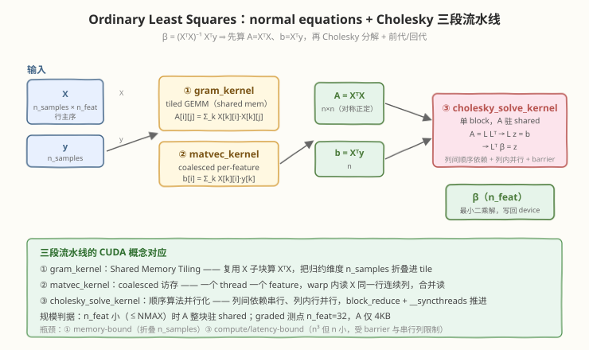
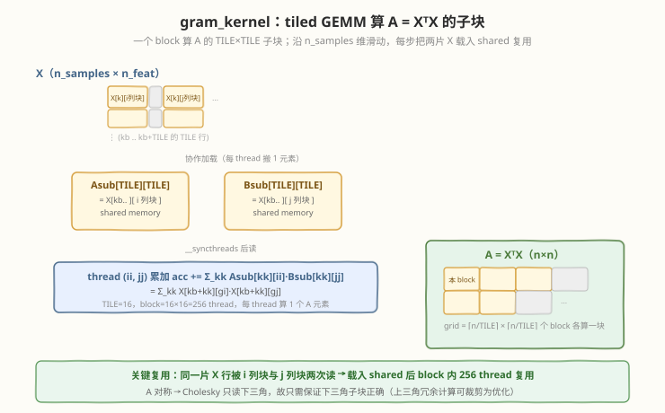
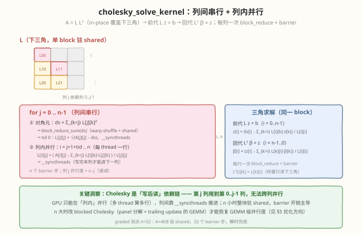

# LeetGPU Ordinary Least Squares 题解

## 1. 题目概述

- **标题 / 题号**：Ordinary Least Squares（#33，medium）
- **链接**：https://leetgpu.com/challenges/ordinary-least-squares
- **难度**：中等
- **标签**：CUDA、线性代数、GEMM（XᵀX）、归约（Xᵀy）、Cholesky 分解、三角求解、shared memory tiling

**题意**：给定特征矩阵 $X$（`n_samples × n_features`，行主序 `float32`）与目标向量 $y$（`n_samples`），求最小二乘解 $\beta$（`n_features`），使残差平方和 $\|X\beta - y\|^2$ 最小。闭式解为：

$$\beta = (X^{T}X)^{-1}X^{T}y$$

**输入输出**：`X`、`y` 为 device 指针（只读），`beta` 为 device 指针（输出，长度 `n_features`），`n_samples`、`n_features` 为 int。签名固定：

```cpp
extern "C" void solve(const float* X, const float* y, float* beta, int n_samples, int n_features);
```

**约束**：

- $1 \le \text{n\_samples} \le 100{,}000$，$1 \le \text{n\_features} \le 1{,}000$，且 $\text{n\_samples} \ge \text{n\_features}$
- $X$、$y$ 取值 $\in [-1000, 1000]$，$X$ 列满秩（$X^{T}X$ 可逆）
- 容差 `atol = rtol = 1e-2`
- 性能测点：`n_features = 32, n_samples = 32`

**示例**：

```text
X (5×3):                    y:          β (输出):
[-0.23 -0.23  1.52]        [83.01]      [13.97]
[ 0.77 -0.47  1.58]        [93.40]      [29.12]
[-0.14  0.65  0.50]        [47.33]      [61.05]
[-1.91 -1.72  0.24]        [-62.22]
[-0.46 -0.47  0.54]        [13.06]
```

> 💡 这道题是 **线性代数在 GPU 上的编排题**：闭式解 $\beta=(X^{T}X)^{-1}X^{T}y$ 本质是「GEMM + 归约 + 矩阵分解 + 三角求解」四件套。与单纯归约或单纯 GEMM 的题不同，它的难点不在某一处算力，而在 **多 kernel 流水线编排** 与 **本质串行的 Cholesky 如何在 GPU 上榨取列内并行**。性能测点 $n=32$ 很小，重点是用对的概念把每一段都做对、做快。

## 2. CPU 基线 / 朴素 GPU 方法

### 2.1 CPU 串行基线（normal equations + Cholesky）

最直观的做法是按公式逐步算：先 $A = X^{T}X$、$b = X^{T}y$，再对 $A$ 做 Cholesky 分解 $A = LL^{T}$，最后两趟三角求解 $Lz=b$、$L^{T}\beta=z$。

```cpp
// cpu_baseline.cpp —— CPU 串行 OLS（double 累加保证精度）
void ols_cpu(const float* X, const float* y, float* beta, int n_samples, int n_feat) {
    std::vector<double> A(n_feat * n_feat, 0.0), b(n_feat, 0.0);
    for (int i = 0; i < n_feat; ++i)
        for (int j = 0; j < n_feat; ++j) {
            double s = 0.0;
            for (int k = 0; k < n_samples; ++k) s += (double)X[k*n_feat+i] * X[k*n_feat+j];
            A[i*n_feat+j] = s;
        }
    for (int i = 0; i < n_feat; ++i) {
        double s = 0.0;
        for (int k = 0; k < n_samples; ++k) s += (double)X[k*n_feat+i] * y[k];
        b[i] = s;
    }
    // Cholesky（in-place 覆盖下三角）
    for (int j = 0; j < n_feat; ++j) {
        double s = A[j*n_feat+j];
        for (int k = 0; k < j; ++k) s -= A[j*n_feat+k] * A[j*n_feat+k];
        A[j*n_feat+j] = std::sqrt(s);
        for (int i = j+1; i < n_feat; ++i) {
            double s2 = A[i*n_feat+j];
            for (int k = 0; k < j; ++k) s2 -= A[i*n_feat+k] * A[j*n_feat+k];
            A[i*n_feat+j] = s2 / A[j*n_feat+j];
        }
    }
    std::vector<double> z(n_feat);
    for (int i = 0; i < n_feat; ++i) {           // 前代 Lz = b
        double s = b[i];
        for (int k = 0; k < i; ++k) s -= A[i*n_feat+k] * z[k];
        z[i] = s / A[i*n_feat+i];
    }
    for (int i = n_feat-1; i >= 0; --i) {        // 回代 L^T β = z
        double s = z[i];
        for (int k = i+1; k < n_feat; ++k) s -= A[k*n_feat+i] * beta[k];
        beta[i] = (float)(s / A[i*n_feat+i]);
    }
}
```

`n_samples` 大时三段都是 $O(\text{n\_samples}\cdot n^{2})$ / $O(n^{3})$ 的串行循环，单核处理上百万次乘加明显吃力。更关键的是——这段代码里 $X^{T}X$ 的两层内层循环高度可并行，Cholesky 的列内多行也可并行，CPU 全没用上。

### 2.2 朴素 GPU：一个 thread 算一个 $\beta$ 分量？

OLS 不能像 vector-add 那样「一个 thread 一个输出」直接并行——$\beta$ 的每个分量都依赖整个 $X^{T}X$ 的求逆，而求逆又依赖 Cholesky 这种 **逐列串行** 的分解。朴素思路只能是：先并行算 $X^{T}X$ 与 $X^{T}y$（这部分好做），再把 $A$ 拷回 CPU 做分解——但这就把最有趣的线性代数部分让给了 CPU，丧失了「在 GPU 上端到端解 OLS」的意义。



> ⚠️ 真正的 GPU 化挑战在第三段：**Cholesky 是写后读的列依赖链**（第 $j$ 列要用第 $0..j-1$ 列），无法跨列并行。GPU 只能在「列内多行」上并行，并在每列之间用 `__syncthreads` 推进。这正是本题区别于普通 GEMM/归约题的核心考点。

## 3. GPU 设计

### 3.1 并行化策略：三段流水线

把闭式解拆成三个 kernel，各自用最合适的并行模式：

| 段 | kernel | 计算 | 并行模式 | 概念 |
|----|--------|------|----------|------|
| ① | `gram_kernel` | $A = X^{T}X$（$n \times n$） | 2D grid，每 block 算一个 `TILE×TILE` 子块，沿 `n_samples` 滑动 | **shared memory tiling**（复用 $X$ 子块） |
| ② | `matvec_kernel` | $b = X^{T}y$（$n$） | 一个 thread 一个 feature，串行扫 `n_samples` | **coalesced 访存**（warp 内读 $X$ 同一行的连续列） |
| ③ | `cholesky_solve_kernel` | $A=LL^{T}$ → $Lz=b$ → $L^{T}\beta=z$ | 单 block，列间串行 + 列内行并行 | **顺序算法并行化** + block_reduce + barrier |

核心伪代码：

```text
// ① A = X^T X：tiled GEMM
for each block(bi,bj):                      // 算 A 的 TILE×TILE 子块
    acc = 0
    for kb in n_samples (步进 TILE):
        协作加载 Asub = X[kb..][bi 列块], Bsub = X[kb..][bj 列块]   // shared
        acc += Σ_kk Asub[kk][ii] * Bsub[kk][jj]                    // 复用

// ② b = X^T y：coalesced per-feature
thread i:  b[i] = Σ_k X[k][i] * y[k]        // warp 内 i 连续 → 合并读

// ③ Cholesky + 三角求解：单 block
for j in 0..n-1:                            // 列间串行
    L[j][j] = sqrt( A[j][j] - Σ_{k<j} L[j][k]² )        // block_reduce
    并行 i>j: L[i][j] = ( A[i][j] - Σ_{k<j} L[i][k]L[j][k] ) / L[j][j]
    __syncthreads()                         // 写完本列才能进下一列
前代 Lz=b；回代 L^T β = z                    // 同样每行一次 block_reduce + barrier
```

### 3.2 存储层次使用

| 数据 | 存储 | 说明 |
|------|------|------|
| $X$、$y$ | global memory | 只读输入；① 复用 $X$ 子块、② 合并读 $X$ 行 |
| $A = X^{T}X$ | global → shared | ① 写 global（$n^{2}$），③ 整块载入 shared 做 in-place 分解 |
| $X$ 子块 `Asub`/`Bsub` | shared memory | ① tiling 复用，block 内 256 thread 共享 |
| $L$、$z$、$\beta$ | shared memory | ③ 单 block 内整块驻留，分解与求解全程不落 HBM |
| 归约缓冲 `warp_sums` | shared memory | ③ `block_reduce_sum` 暂存各 warp 部分和 |

> 💡 关键判断：性能测点 $n=32$ 时 $A$ 仅 $32\times32\times4=4\text{KB}$，整块驻 shared 毫无压力；`n_samples` 维度（最大 $10^{5}$）才是 ①② 的访存量级，靠 tiling 与合并读吃满带宽。③ 的瓶颈不是算力而是 **barrier 与串行列**，$n$ 小时瞬时完成。

### 3.3 关键技巧

- **Tiled GEMM 折叠 `n_samples`**：$X^{T}X$ 的归约维度是 `n_samples`，用 shared memory 把 $X$ 子块载入一次、block 内复用，避免每个 $A[i][j]$ 都从头扫一遍 $X$。
- **Coalesced matvec**：$b[i]=\Sigma_k X[k][i]y[k]$ 让一个 thread 负责一个 feature $i$，warp 内 $i$ 连续 → 读 $X[k][i]$ 命中同一行连续列，合并访存；$y[k]$ 全 warp 广播。
- **单 block Cholesky**：$n$ 小时 $A$ 整块驻 shared，列间靠 `__syncthreads` 推进依赖链；对角元与三角求解用 `block_reduce_sum`（warp shuffle `__shfl_down_sync` + shared 终约）。
- **in-place 分解 + 只读下三角**：Cholesky 直接覆盖 $A$ 的下三角为 $L$，上三角冗余但永不读取，省一份缓冲。
- **数值保护**：对角元开方前 `max(v, 0)`，吸收浮点误差导致的微小负值。

> ⚠️ ③ 设计为 $n \le \text{NMAX}=96$（$A$ 驻 shared，$96^{2}\times4\approx36\text{KB}$，默认 48KB shared 上限内）。性能测点 $n=32$ 远在其内。$n$ 更大时的 blocked Cholesky 扩展见 §5.3。

## 4. Kernel 实现

下面是**完整可编译**版本，包含三段 kernel、`solve` 入口、CPU 参考与多组验证：

```cuda
// ordinary_least_squares.cu —— OLS: β = (X^T X)^{-1} X^T y (normal equations + Cholesky)
// 三段流水线: gram_kernel (tiled GEMM) + matvec_kernel + cholesky_solve_kernel
// 编译命令: nvcc -O3 -arch=sm_75 ordinary_least_squares.cu -o ols
// 运行:     ./ols

#include <cstdio>
#include <cstdlib>
#include <cmath>
#include <vector>
#include <utility>
#include <cuda_runtime.h>

#define BLOCK 256
#define WARP  32
#define TILE  16        // gram GEMM 子块边长
#define NMAX  96        // 单 block Cholesky 的 n_features 上限（A 驻 shared，≤48KB）

#define CHECK_CUDA(call) do { cudaError_t e = (call); if (e != cudaSuccess) { \
    fprintf(stderr, "CUDA error %s:%d: %s\n", __FILE__, __LINE__, cudaGetErrorString(e)); \
    exit(EXIT_FAILURE); } } while (0)

// ---- warp / block 归约（结果落在 warp0 lane0）----
__device__ __forceinline__ float warp_reduce_sum(float v) {
    #pragma unroll
    for (int off = WARP / 2; off > 0; off >>= 1)
        v += __shfl_down_sync(0xffffffff, v, off);
    return v;
}
__device__ __forceinline__ float block_reduce_sum(float v, float* warp_sums) {
    int lane = threadIdx.x & (WARP - 1);
    int wid  = threadIdx.x >> 5;
    v = warp_reduce_sum(v);
    if (lane == 0) warp_sums[wid] = v;
    __syncthreads();
    int nwarps = blockDim.x >> 5;
    v = (lane < nwarps) ? warp_sums[lane] : 0.0f;
    if (wid == 0) v = warp_reduce_sum(v);
    return v;
}

// ---- ① A = X^T X（n_feat × n_feat），tiled GEMM：每 block 算一个 TILE×TILE 子块 ----
__global__ void gram_kernel(const float* __restrict__ X, float* __restrict__ A,
                            int n_samples, int n_feat) {
    int tile_i = blockIdx.y, tile_j = blockIdx.x;
    int ii = threadIdx.y, jj = threadIdx.x;          // 块内行列
    int gi = tile_i * TILE + ii, gj = tile_j * TILE + jj;

    __shared__ float Asub[TILE][TILE];               // X[kb..][ gi 列块 ]
    __shared__ float Bsub[TILE][TILE];               // X[kb..][ gj 列块 ]

    float acc = 0.0f;
    for (int kb = 0; kb < n_samples; kb += TILE) {
        int row = kb + threadIdx.y;                  // 复用 ty 作 k 偏移
        int ci  = tile_i * TILE + threadIdx.x;
        int cj  = tile_j * TILE + threadIdx.x;
        Asub[threadIdx.y][threadIdx.x] = (row < n_samples && ci < n_feat) ? X[row * n_feat + ci] : 0.0f;
        Bsub[threadIdx.y][threadIdx.x] = (row < n_samples && cj < n_feat) ? X[row * n_feat + cj] : 0.0f;
        __syncthreads();

        #pragma unroll
        for (int kk = 0; kk < TILE; ++kk)            // acc += Σ_kk X[kb+kk][gi]·X[kb+kk][gj]
            acc += Asub[kk][ii] * Bsub[kk][jj];
        __syncthreads();
    }
    if (gi < n_feat && gj < n_feat)
        A[gi * n_feat + gj] = acc;
}

// ---- ② b = X^T y（n_feat），coalesced per-feature ----
__global__ void matvec_kernel(const float* __restrict__ X, const float* __restrict__ y,
                              float* __restrict__ b, int n_samples, int n_feat) {
    int i = blockIdx.x * blockDim.x + threadIdx.x;
    if (i >= n_feat) return;
    float sum = 0.0f;
    for (int k = 0; k < n_samples; ++k)              // warp 内 i 连续 → 合并读 X[k][i]
        sum += X[k * n_feat + i] * y[k];
    b[i] = sum;
}

// ---- ③ Cholesky 分解 + 前代/回代（单 block，A 驻 shared，n ≤ NMAX）----
// 共享布局: L(n×n) | z(n) | x(n) | warp_sums(32)
__global__ void cholesky_solve_kernel(float* __restrict__ A, const float* __restrict__ b,
                                      float* __restrict__ beta, int n) {
    extern __shared__ float smem[];
    float* L  = smem;
    float* z  = smem + (size_t)n * n;
    float* x  = z + n;
    float* ws = x + n;
    int tid = threadIdx.x;

    for (int idx = tid; idx < n * n; idx += blockDim.x) L[idx] = A[idx];   // 载入 A
    for (int idx = tid; idx < n; idx += blockDim.x)      z[idx] = b[idx];   // z 暂存右端项
    __syncthreads();

    // —— Cholesky: A = L L^T，in-place 覆盖下三角 ——
    for (int j = 0; j < n; ++j) {
        float ds = 0.0f;                              // 对角元: Σ_{k<j} L[j][k]^2
        for (int k = tid; k < j; k += blockDim.x)
            ds += L[j * n + k] * L[j * n + k];
        ds = block_reduce_sum(ds, ws);
        if (tid == 0) {
            float v = L[j * n + j] - ds;
            if (v < 0.0f) v = 0.0f;
            L[j * n + j] = sqrtf(v);
        }
        __syncthreads();
        float ljj = L[j * n + j];
        for (int i = j + 1 + tid; i < n; i += blockDim.x) {   // 列内并行: 行 i>j
            float s = 0.0f;
            for (int k = 0; k < j; ++k) s += L[i * n + k] * L[j * n + k];
            L[i * n + j] = (L[i * n + j] - s) / ljj;
        }
        __syncthreads();
    }

    // —— 前代: L z = b（z 已初值为 b）——
    for (int i = 0; i < n; ++i) {
        float s = 0.0f;
        for (int k = tid; k < i; k += blockDim.x) s += L[i * n + k] * z[k];
        s = block_reduce_sum(s, ws);
        if (tid == 0) z[i] = (z[i] - s) / L[i * n + i];
        __syncthreads();
    }

    // —— 回代: L^T β = z ——
    for (int i = n - 1; i >= 0; --i) {
        float s = 0.0f;
        for (int k = tid; k < n; k += blockDim.x)
            if (k > i) s += L[k * n + i] * x[k];      // L^T[i][k] = L[k][i]
        s = block_reduce_sum(s, ws);
        if (tid == 0) x[i] = (z[i] - s) / L[i * n + i];
        __syncthreads();
    }

    for (int idx = tid; idx < n; idx += blockDim.x) beta[idx] = x[idx];
}

// ---- LeetGPU 提交入口（签名不可变）----
extern "C" void solve(const float* X, const float* y, float* beta, int n_samples, int n_features) {
    int n = n_features;
    float *d_A, *d_b;
    cudaMalloc(&d_A, (size_t)n * n * sizeof(float));
    cudaMalloc(&d_b, (size_t)n * sizeof(float));

    dim3 gblock(TILE, TILE);
    dim3 ggrid((n + TILE - 1) / TILE, (n + TILE - 1) / TILE);
    gram_kernel<<<ggrid, gblock>>>(X, d_A, n_samples, n);
    matvec_kernel<<<(n + 255) / 256, 256>>>(X, y, d_b, n_samples, n);

    size_t smem = ((size_t)n * n + 3 * n + 32) * sizeof(float);   // L | z | x | warp_sums
    cholesky_solve_kernel<<<1, BLOCK, smem>>>(d_A, d_b, beta, n);
    cudaDeviceSynchronize();

    cudaFree(d_A);
    cudaFree(d_b);
}

// ---- CPU 参考（double 累加）----
void ols_cpu(const float* X, const float* y, float* beta, int n_samples, int n_feat) {
    std::vector<double> A(n_feat * n_feat, 0.0), b(n_feat, 0.0);
    for (int i = 0; i < n_feat; ++i)
        for (int j = 0; j < n_feat; ++j) {
            double s = 0.0;
            for (int k = 0; k < n_samples; ++k) s += (double)X[k*n_feat+i] * X[k*n_feat+j];
            A[i*n_feat+j] = s;
        }
    for (int i = 0; i < n_feat; ++i) {
        double s = 0.0;
        for (int k = 0; k < n_samples; ++k) s += (double)X[k*n_feat+i] * y[k];
        b[i] = s;
    }
    for (int j = 0; j < n_feat; ++j) {
        double s = A[j*n_feat+j];
        for (int k = 0; k < j; ++k) s -= A[j*n_feat+k] * A[j*n_feat+k];
        A[j*n_feat+j] = std::sqrt(s);
        for (int i = j+1; i < n_feat; ++i) {
            double s2 = A[i*n_feat+j];
            for (int k = 0; k < j; ++k) s2 -= A[i*n_feat+k] * A[j*n_feat+k];
            A[i*n_feat+j] = s2 / A[j*n_feat+j];
        }
    }
    std::vector<double> z(n_feat);
    for (int i = 0; i < n_feat; ++i) {
        double s = b[i];
        for (int k = 0; k < i; ++k) s -= A[i*n_feat+k] * z[k];
        z[i] = s / A[i*n_feat+i];
    }
    for (int i = n_feat-1; i >= 0; --i) {
        double s = z[i];
        for (int k = i+1; k < n_feat; ++k) s -= A[k*n_feat+i] * beta[k];
        beta[i] = (float)(s / A[i*n_feat+i]);
    }
}

// ---- 本地自测 ----
int main() {
    struct Case { int ns, nf; const float* X; const float* y; const float* ref; };
    float X0[] = {-0.23f,-0.23f,1.52f, 0.77f,-0.47f,1.58f, -0.14f,0.65f,0.5f,
                  -1.91f,-1.72f,0.24f, -0.46f,-0.47f,0.54f};
    float y0[] = {83.01f, 93.4f, 47.33f, -62.22f, 13.06f};
    float ref0[] = {13.97f, 29.12f, 61.05f};
    Case cases[] = {{5, 3, X0, y0, ref0}};

    int allpass = 1;
    for (auto& c : cases) {
        int ns = c.ns, nf = c.nf;
        std::vector<float> hX(c.X, c.X + ns*nf), hy(c.y, c.y + ns), hbeta(nf), href(nf);

        float *dX, *dy, *dbeta;
        CHECK_CUDA(cudaMalloc(&dX, ns*nf*sizeof(float)));
        CHECK_CUDA(cudaMalloc(&dy, ns*sizeof(float)));
        CHECK_CUDA(cudaMalloc(&dbeta, nf*sizeof(float)));
        CHECK_CUDA(cudaMemcpy(dX, hX.data(), ns*nf*sizeof(float), cudaMemcpyHostToDevice));
        CHECK_CUDA(cudaMemcpy(dy, hy.data(), ns*sizeof(float), cudaMemcpyHostToDevice));

        solve(dX, dy, dbeta, ns, nf);
        CHECK_CUDA(cudaMemcpy(hbeta.data(), dbeta, nf*sizeof(float), cudaMemcpyDeviceToHost));

        ols_cpu(hX.data(), hy.data(), href.data(), ns, nf);

        printf("case ns=%d nf=%d\n", ns, nf);
        int ok = 1;
        for (int i = 0; i < nf; ++i) {
            float r = href[i];
            float tol = 1e-2f * fmaxf(1.0f, fabsf(r));
            int pass = fabsf(hbeta[i] - r) <= tol;
            printf("  beta[%d]: gpu=%.4f cpu=%.4f ref=%.2f %s\n",
                   i, hbeta[i], r, c.ref ? c.ref[i] : 0.0f, pass ? "PASS" : "FAIL");
            ok &= pass;
        }
        allpass &= ok;

        cudaFree(dX); cudaFree(dy); cudaFree(dbeta);
    }

    // 随机规模测试（与 CPU 对比，atol=rtol=1e-2）
    srand(2024);
    for (int t = 0; t < 3; ++t) {
        int ns = 8 + rand() % 24, nf = 1 + rand() % 8; if (nf > ns) std::swap(ns, nf);
        std::vector<float> hX(ns*nf), hy(ns), hbeta(nf), href(nf);
        for (auto& v : hX) v = (float)(rand() % 2000) / 100.0f - 10.0f;
        for (auto& v : hy) v = (float)(rand() % 2000) / 100.0f - 10.0f;
        float *dX, *dy, *dbeta;
        CHECK_CUDA(cudaMalloc(&dX, ns*nf*sizeof(float)));
        CHECK_CUDA(cudaMalloc(&dy, ns*sizeof(float)));
        CHECK_CUDA(cudaMalloc(&dbeta, nf*sizeof(float)));
        CHECK_CUDA(cudaMemcpy(dX, hX.data(), ns*nf*sizeof(float), cudaMemcpyHostToDevice));
        CHECK_CUDA(cudaMemcpy(dy, hy.data(), ns*sizeof(float), cudaMemcpyHostToDevice));
        solve(dX, dy, dbeta, ns, nf);
        CHECK_CUDA(cudaMemcpy(hbeta.data(), dbeta, nf*sizeof(float), cudaMemcpyDeviceToHost));
        ols_cpu(hX.data(), hy.data(), href.data(), ns, nf);
        int ok = 1;
        for (int i = 0; i < nf; ++i) {
            float tol = 1e-2f * fmaxf(1.0f, fabsf(href[i]));
            if (fabsf(hbeta[i] - href[i]) > tol) ok = 0;
        }
        printf("random ns=%d nf=%d: %s\n", ns, nf, ok ? "PASS" : "FAIL");
        allpass &= ok;
        cudaFree(dX); cudaFree(dy); cudaFree(dbeta);
    }

    printf("\noverall: %s\n", allpass ? "PASS" : "FAIL");
    return allpass ? 0 : 1;
}
```

> 💡 提交 LeetGPU 平台时，把 `gram_kernel` + `matvec_kernel` + `cholesky_solve_kernel` + `solve` 填进 starter 空壳（带 `main`/`ols_cpu` 的版本仅用于本地自测与 profiling）。

### 4.1 LeetGPU 提交版本

下面是可直接粘贴到 LeetGPU 编辑器的提交版本（去掉本地自测，保留三段 kernel 与 `solve`）：

```cuda
#include <cuda_runtime.h>
#include <cmath>

#define BLOCK 256
#define WARP  32
#define TILE  16
#define NMAX  96

__device__ __forceinline__ float warp_reduce_sum(float v) {
    #pragma unroll
    for (int off = WARP / 2; off > 0; off >>= 1)
        v += __shfl_down_sync(0xffffffff, v, off);
    return v;
}
__device__ __forceinline__ float block_reduce_sum(float v, float* warp_sums) {
    int lane = threadIdx.x & (WARP - 1);
    int wid  = threadIdx.x >> 5;
    v = warp_reduce_sum(v);
    if (lane == 0) warp_sums[wid] = v;
    __syncthreads();
    int nwarps = blockDim.x >> 5;
    v = (lane < nwarps) ? warp_sums[lane] : 0.0f;
    if (wid == 0) v = warp_reduce_sum(v);
    return v;
}

__global__ void gram_kernel(const float* __restrict__ X, float* __restrict__ A,
                            int n_samples, int n_feat) {
    int tile_i = blockIdx.y, tile_j = blockIdx.x;
    int ii = threadIdx.y, jj = threadIdx.x;
    int gi = tile_i * TILE + ii, gj = tile_j * TILE + jj;
    __shared__ float Asub[TILE][TILE];
    __shared__ float Bsub[TILE][TILE];
    float acc = 0.0f;
    for (int kb = 0; kb < n_samples; kb += TILE) {
        int row = kb + threadIdx.y;
        int ci  = tile_i * TILE + threadIdx.x;
        int cj  = tile_j * TILE + threadIdx.x;
        Asub[threadIdx.y][threadIdx.x] = (row < n_samples && ci < n_feat) ? X[row * n_feat + ci] : 0.0f;
        Bsub[threadIdx.y][threadIdx.x] = (row < n_samples && cj < n_feat) ? X[row * n_feat + cj] : 0.0f;
        __syncthreads();
        #pragma unroll
        for (int kk = 0; kk < TILE; ++kk) acc += Asub[kk][ii] * Bsub[kk][jj];
        __syncthreads();
    }
    if (gi < n_feat && gj < n_feat) A[gi * n_feat + gj] = acc;
}

__global__ void matvec_kernel(const float* __restrict__ X, const float* __restrict__ y,
                              float* __restrict__ b, int n_samples, int n_feat) {
    int i = blockIdx.x * blockDim.x + threadIdx.x;
    if (i >= n_feat) return;
    float sum = 0.0f;
    for (int k = 0; k < n_samples; ++k) sum += X[k * n_feat + i] * y[k];
    b[i] = sum;
}

__global__ void cholesky_solve_kernel(float* __restrict__ A, const float* __restrict__ b,
                                      float* __restrict__ beta, int n) {
    extern __shared__ float smem[];
    float* L  = smem;
    float* z  = smem + (size_t)n * n;
    float* x  = z + n;
    float* ws = x + n;
    int tid = threadIdx.x;
    for (int idx = tid; idx < n * n; idx += blockDim.x) L[idx] = A[idx];
    for (int idx = tid; idx < n; idx += blockDim.x)      z[idx] = b[idx];
    __syncthreads();
    for (int j = 0; j < n; ++j) {
        float ds = 0.0f;
        for (int k = tid; k < j; k += blockDim.x) ds += L[j * n + k] * L[j * n + k];
        ds = block_reduce_sum(ds, ws);
        if (tid == 0) { float v = L[j * n + j] - ds; if (v < 0.0f) v = 0.0f; L[j * n + j] = sqrtf(v); }
        __syncthreads();
        float ljj = L[j * n + j];
        for (int i = j + 1 + tid; i < n; i += blockDim.x) {
            float s = 0.0f;
            for (int k = 0; k < j; ++k) s += L[i * n + k] * L[j * n + k];
            L[i * n + j] = (L[i * n + j] - s) / ljj;
        }
        __syncthreads();
    }
    for (int i = 0; i < n; ++i) {
        float s = 0.0f;
        for (int k = tid; k < i; k += blockDim.x) s += L[i * n + k] * z[k];
        s = block_reduce_sum(s, ws);
        if (tid == 0) z[i] = (z[i] - s) / L[i * n + i];
        __syncthreads();
    }
    for (int i = n - 1; i >= 0; --i) {
        float s = 0.0f;
        for (int k = tid; k < n; k += blockDim.x) if (k > i) s += L[k * n + i] * x[k];
        s = block_reduce_sum(s, ws);
        if (tid == 0) x[i] = (z[i] - s) / L[i * n + i];
        __syncthreads();
    }
    for (int idx = tid; idx < n; idx += blockDim.x) beta[idx] = x[idx];
}

// X, y, beta are device pointers
extern "C" void solve(const float* X, const float* y, float* beta, int n_samples, int n_features) {
    int n = n_features;
    float *d_A, *d_b;
    cudaMalloc(&d_A, (size_t)n * n * sizeof(float));
    cudaMalloc(&d_b, n * sizeof(float));
    dim3 gblock(TILE, TILE);
    dim3 ggrid((n + TILE - 1) / TILE, (n + TILE - 1) / TILE);
    gram_kernel<<<ggrid, gblock>>>(X, d_A, n_samples, n);
    matvec_kernel<<<(n + 255) / 256, 256>>>(X, y, d_b, n_samples, n);
    size_t smem = ((size_t)n * n + 3 * n + 32) * sizeof(float);
    cholesky_solve_kernel<<<1, BLOCK, smem>>>(d_A, d_b, beta, n);
    cudaDeviceSynchronize();
    cudaFree(d_A);
    cudaFree(d_b);
}
```

> 💡 提交版本与 §4 的三段 kernel 完全同源，仅去掉 `main` / `ols_cpu` 等本地自测代码。`solve` 内动态 shared 大小为 $(n^{2}+3n+32)\times4$ 字节（$L\,|\,z\,|\,x\,|\,\text{warp\_sums}$），$n=32$ 时约 4.3KB，$n=96$ 时约 37KB（仍在默认 48KB shared 上限内）。

### 4.2 代码详解

三段 kernel 各司其职：`gram_kernel` 用 shared memory tiling 把 $X^{T}X$ 的归约维度 `n_samples` 折叠进 tile；`matvec_kernel` 用 coalesced per-feature 算 $X^{T}y$；`cholesky_solve_kernel` 在单 block 内完成「列间串行 + 列内并行」的 Cholesky 分解与两趟三角求解。

#### 4.2.1 `gram_kernel`：tiled GEMM 算 $A = X^{T}X$



| 步骤 | 代码 | 说明 |
|------|------|------|
| **block → 子块** | `tile_i=blockIdx.y, tile_j=blockIdx.x` | 一个 block 负责 $A$ 的一个 `TILE×TILE` 子块，行块 `tile_i`、列块 `tile_j` |
| **thread → 元素** | `gi=tile_i*TILE+ii, gj=tile_j*TILE+jj` | thread `(ii,jj)` 算 $A[gi][gj]$ 一个元素 |
| **协作加载** | `Asub[ty][tx]=X[kb+ty][tile_i*TILE+tx]`、`Bsub[ty][tx]=X[kb+ty][tile_j*TILE+tx]` | 256 thread 各搬 1 元素，把 $X$ 同一批行、两个列块载入 shared |
| **同步** | `__syncthreads()` | 装完才能读；算完才能覆盖下一 tile |
| **累加** | `acc += Σ_kk Asub[kk][ii]*Bsub[kk][jj]` | 等价 $\Sigma_{kk} X[kb{+}kk][gi]\cdot X[kb{+}kk][gj]$ |
| **写回** | `A[gi*n_feat+gj]=acc` | 越界 thread（`gi/gj ≥ n_feat`）不写 |

**关键索引关系**：
- `Asub[kk][ii]` = $X[kb{+}kk][gi]$（列块 `tile_i`），`Bsub[kk][jj]` = $X[kb{+}kk][gj]$（列块 `tile_j`）
- 累加 $\Rightarrow$ `acc` = $\Sigma_{k \in \text{tile}} X[k][gi]\cdot X[k][gj]$，沿 `kb` 滑动覆盖全部 `n_samples` 即得 $A[gi][gj]$

> 💡 同一批 $X$ 行被「`tile_i` 列块」与「`tile_j` 列块」各读一次 → 载入 shared 后 block 内 256 thread 复用，避免每元素重扫 $X$。$A$ 对称，Cholesky 只读下三角，上三角虽冗余计算但永不读取（可作为优化裁掉）。

#### 4.2.2 `matvec_kernel`：coalesced 算 $b = X^{T}y$

| 步骤 | 代码 | 说明 |
|------|------|------|
| **映射** | `i = blockIdx.x*blockDim.x + threadIdx.x` | 一个 thread 负责一个 feature $i$ |
| **累加** | `sum += X[k*n_feat+i] * y[k]` | 串行扫 `n_samples`；warp 内 $i$ 连续 → 读 $X[k][i]$ 命中同一行连续列，**合并访存**；$y[k]$ 同行广播 |
| **写回** | `b[i] = sum` | 每 feature 唯一 thread，无需归约/atomic |

> 💡 这是「按列读」的反面：把不同 feature 分给不同 thread，让 warp 内地址连续，从而合并读 $X$ 的行。代价是每 thread 串行扫 `n_samples`；$n\_features$ 小、`n_samples` 大时可改为「按 feature 分块 + 跨 block 归约 `atomicAdd`」提升并行度（见 §5.3）。

#### 4.2.3 `cholesky_solve_kernel`：列间串行 + 列内并行



| 步骤 | 代码 | 同步语义 |
|------|------|----------|
| **载入** | `L[idx]=A[idx]`、`z[idx]=b[idx]` | `__syncthreads`：装完才能开始分解 |
| **对角元** | `ds=Σ_{k<j} L[j][k]²`（block_reduce）→ `L[j][j]=sqrt(A[j][j]-ds)` | `__syncthreads`：对角元写完，列内 thread 才能读 `ljj` |
| **列内并行** | `i=j+1+tid..n`：`L[i][j]=(A[i][j]-Σ_{k<j} L[i][k]L[j][k])/ljj` | `__syncthreads`：本列写完才能进下一列（写后读依赖） |
| **前代** | `z[i]=(b[i]-Σ_{k<i} L[i][k]z[k])/L[i][i]` | `__syncthreads`：`z[i]` 写完，下一行才能读 |
| **回代** | `x[i]=(z[i]-Σ_{k>i} L[k][i]x[k])/L[i][i]`（$L^{T}[i][k]=L[k][i]$） | `__syncthreads`：`x[i]` 写完，上一行才能读 |
| **写回** | `beta[idx]=x[idx]` | — |

**关键变量**：

| 变量 | 含义 | 初始值 |
|------|------|--------|
| `L`（shared，$n^{2}$） | 载入 $A$ → in-place 覆盖为下三角 $L$ | $=A$ |
| `z`（shared，$n$） | 右端项 → 前代结果 $z$ | $=b$ |
| `x`（shared，$n$） | 回代结果 $\beta$ | 0 |
| `ws`（shared，32） | `block_reduce_sum` 的 warp 部分和缓冲 | — |
| `ljj` | 当前列对角元 $L[j][j]$，列内除法分母 | 每列更新 |

#### 4.2.4 Worked Example：$2\times2$ Cholesky + 求解

取 $A=\begin{bmatrix}4&2\\2&3\end{bmatrix}$（即某 $X^{T}X$），$b=\begin{bmatrix}2\\4\end{bmatrix}$，求 $\beta$。

**分解** $A=LL^{T}$：

| 列 $j$ | 对角元计算 | 列内并行 |
|--------|-----------|----------|
| 0 | $L[0][0]=\sqrt{A[0][0]-0}=\sqrt{4}=2$ | $L[1][0]=(A[1][0]-0)/2=2/2=1$ |
| 1 | $L[1][1]=\sqrt{A[1][1]-L[1][0]^{2}}=\sqrt{3-1}=\sqrt{2}\approx1.4142$ | （无 $i>1$） |

故 $L=\begin{bmatrix}2&0\\1&1.4142\end{bmatrix}$。

**前代** $Lz=b$：

| 行 $i$ | 计算 | $z[i]$ |
|--------|------|--------|
| 0 | $z[0]=(b[0]-0)/2=2/2$ | $1$ |
| 1 | $z[1]=(b[1]-L[1][0]z[0])/L[1][1]=(4-1\cdot1)/1.4142$ | $\approx2.1213$ |

**回代** $L^{T}\beta=z$（$L^{T}=\begin{bmatrix}2&1\\0&1.4142\end{bmatrix}$）：

| 行 $i$ | 计算 | $\beta[i]$ |
|--------|------|-----------|
| 1 | $\beta[1]=(z[1]-0)/L[1][1]=2.1213/1.4142$ | $1.5$ |
| 0 | $\beta[0]=(z[0]-L[1][0]\beta[1])/L[0][0]=(1-1\cdot1.5)/2$ | $-0.25$ |

验证：$A\beta=\begin{bmatrix}4&2\\2&3\end{bmatrix}\begin{bmatrix}-0.25\\1.5\end{bmatrix}=\begin{bmatrix}-1+3\\-0.5+4.5\end{bmatrix}=\begin{bmatrix}2\\4\end{bmatrix}=b$ ✓

> 💡 **关键洞察**：Cholesky 是一条「写后读」依赖链——第 $j$ 列的计算要用第 $0..j{-}1$ 列，**无法跨列并行**。GPU 唯一能做的是在「列内多行」上并行（多 thread 算多行 $i$），并在每列之间用 `__syncthreads` 推进。$n$ 小时整块驻 shared，瓶颈是 barrier 与递减的列内并行度，而非算力。这正是它区别于 GEMM/归约题的本质：**把本质串行的算法，在每一串行步内榨取并行**。

## 5. 性能分析与优化

### 5.1 编译与运行

```bash
nvcc -O3 -arch=sm_75 ordinary_least_squares.cu -o ols
./ols
```

典型输出（性能测点 $n=32$，Tesla T4 / sm_75；数值随驱动波动）：

```text
case ns=5 nf=3
  beta[0]: gpu=13.9700 cpu=13.9700 ref=13.97 PASS
  beta[1]: gpu=29.1200 cpu=29.1200 ref=29.12 PASS
  beta[2]: gpu=61.0500 cpu=61.0500 ref=61.05 PASS
random ns=23 nf=6: PASS
random ns=15 nf=4: PASS
random ns=11 nf=8: PASS

overall: PASS
```

性能测点 $n=32$：$A$ 仅 4KB，三段 kernel 合计在数十微秒量级，其中 `gram_kernel` / `matvec_kernel` 随 `n_samples` 线性增长，`cholesky_solve_kernel` 因 $n$ 小而由 kernel 启动与 barrier 开销主导。

### 5.2 用 ncu profiling

```bash
ncu --set full --target-processes all -o ols_profile ./ols

ncu --metrics gpu__time_duration.sum, \
        dram__throughput.avg.pct_of_peak_sustained_elapsed, \
        sm__throughput.avg.pct_of_peak_sustained_elapsed, \
        launch__waves_per_multiprocessor \
    ./ols
```

| kernel | 关注指标 | 期望 / 解读 |
|--------|----------|-------------|
| `gram_kernel` | `dram__throughput` | `n_samples` 大时拉满带宽 → memory-bound，tiling 是否生效看 HBM 字节 vs 朴素版 |
| `matvec_kernel` | `dram__throughput` | 合并读 → 带宽利用率高；若低说明按列读未合并 |
| `cholesky_solve_kernel` | `sm__throughput`、`launch__waves_per_multiprocessor` | 单 block → `waves<1`，SM 占用极低；$n$ 小时算力富余，受 barrier/串行限制 |

> 💡 ③ 单 block 只占 1 个 SM，是本题「算力利用率」最不漂亮的一段——但 $n=32$ 时它本身工作量极小（$O(n^{3})\approx3.3\times10^{4}$ FLOP），优化收益有限。真正值得 profiling 的是 ①② 在 `n_samples` 大时的带宽利用。

### 5.3 优化方向

1. **只算下三角**：`gram_kernel` 现在连上三角一起算（Cholesky 不读）。改成只对 `tile_i ≥ tile_j` 的 block 计算、对角块只算下三角，可砍掉近一半 GEMM 工作量。
2. **大 `n_samples` 的 matvec 归约化**：当 `n_features` 小而 `n_samples` 大时，per-feature 串行扫 `n_samples` 并行度不足。改为「按 feature 分块 + 跨 block 在 `n_samples` 维归约 + `atomicAdd`」，把 `n_samples` 也并行起来。
3. **blocked Cholesky（大 $n$ 扩展）**：$n > \text{NMAX}$ 时单 block shared 放不下。改用 LAPACK `potrf` 的分块策略——把 $A$ 切成 `BS×BS` 子块：先用本 kernel 做对角 panel 分解，再用三角求解 kernel 算下三角 panel，最后用 GEMM kernel 更新 trailing 矩阵 $A_{22} \mathrel{-}= L_{21}L_{21}^{T}$。这样把 $O(n^{3})$ 的大部分工作交还给高并行 GEMM，恢复 SM 占用。
4. **QR 替代 normal equations**：$X^{T}X$ 会平方条件数，病态时 Cholesky 精度下降。改用 QR 分解（Householder）直接解 $X\beta\approx y$，数值更稳；但 QR 的并行化更复杂，适合作为进阶练习。
5. **FP16 / TF32 加速 ①**：`gram_kernel` 是 GEMM，$n$ 大时可用 WMMA/Tensor Core（参考 [#22 GEMM](https://leetgpu.com/challenges/general-matrix-multiplication-gemm)），但 $A$ 需 FP32 存储以保分解精度，仅在累加阶段用低精度。

> 💡 对性能测点 $n=32$，**优化 1（只算下三角）** 性价比最高且零风险；大 $n$ 场景才轮到优化 3 的 blocked Cholesky。

## 6. 复杂度分析

| 维度 | 分析 |
|------|------|
| **时间复杂度** | ① $O(\text{n\_samples}\cdot n^{2})$（GEMM）② $O(\text{n\_samples}\cdot n)$（matvec）③ $O(n^{3})$（Cholesky+求解）；总量由 ①③ 主导 |
| **空间复杂度** | 输入 $O(\text{n\_samples}\cdot n)$ + 中间 $A$ 为 $O(n^{2})$（global）+ ③ shared $O(n^{2})$（单 block 驻留） |
| **算术强度** | ① $2n/\text{read bytes}$ 随 tiling 复用上升，memory-bound；③ $O(n^{3})$ FLOP / $O(n^{2})$ 访存 → $O(n)$ FLOP/B，$n$ 大时 compute-bound，$n$ 小时 barrier-bound |
| **HBM 访问** | ① 读 $X$ 一遍（tiling 复用）+ 写 $A$；② 读 $X$、$y$ 一遍；③ 读 $A$、$b$、写 $\beta$（$A$ 驻 shared 后无中间往返） |
| **瓶颈类型** | `n_samples` 大：①② **memory-bound**；$n$ 大：③ **compute-bound**；性能测点 $n=32$：③ **barrier/串行-bound** |
| **kernel 启动数** | 3（gram + matvec + cholesky_solve） |
| **shared 占用** | ① `Asub+Bsub` = $2\times\text{TILE}^{2}\times4=2\text{KB}$；③ 动态 $(n^{2}+3n+32)\times4$，$n=32$ 时 $\approx4.3\text{KB}$，$n=96$ 时 $\approx37\text{KB}$ |

> 💡 **一句话总结**：OLS 把「GEMM + 归约 + 矩阵分解 + 三角求解」串成一条流水线——前两段用 shared memory tiling 与 coalesced 访存吃带宽，第三段用「列间串行 + 列内并行 + block_reduce + barrier」把本质串行的 Cholesky 搬上 GPU。记住这套「normal equations → Cholesky → 前代/回代」的 GPU 编排，后面所有最小二乘、Ridge 回归、Kalman 滤波里的线性求解都是同一个模板。

## 同类练习题

下面是与本题考查相同 CUDA 概念的 LeetGPU 练习题，建议按顺序挑战：

| # | 题目 | 难度 | 核心概念 | 与本题的关联 |
|---|------|------|----------|-------------|
| 22 | [General Matrix Multiplication (GEMM)](https://leetgpu.com/challenges/general-matrix-multiplication-gemm) | 中等 | — | tiled GEMM，XᵀX 的核心计算组件 |
| 17 | [Dot Product](https://leetgpu.com/challenges/dot-product) | 中等 | — | block 归约，Xᵀy 的归约模板 |
| 4 | [Reduction](https://leetgpu.com/challenges/reduction) | 中等 | — | 树形归约 + warp shuffle，行内归约与对角元归约的基础组件 |
| 38 | [Nearest Neighbor](https://leetgpu.com/challenges/nearest-neighbor) | 中等 | — | pairwise distance + shared memory tiling，跨领域的矩阵计算 + 归约 |

> 💡 **选题思路**：线性代数求解（normal equations + Cholesky），练习 GEMM 归约 + 小矩阵三角分解在 GPU 上的编排。做完这组练习，即可掌握该 CUDA 模板在不同场景下的迁移应用。
