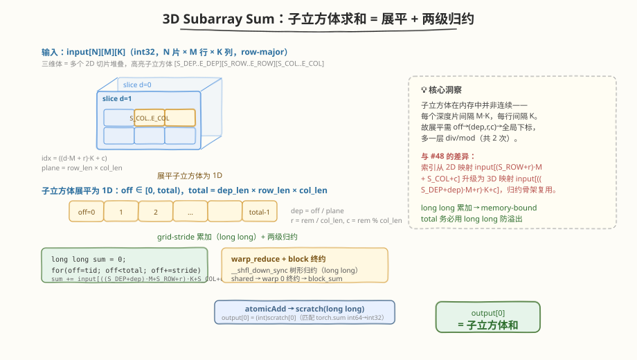
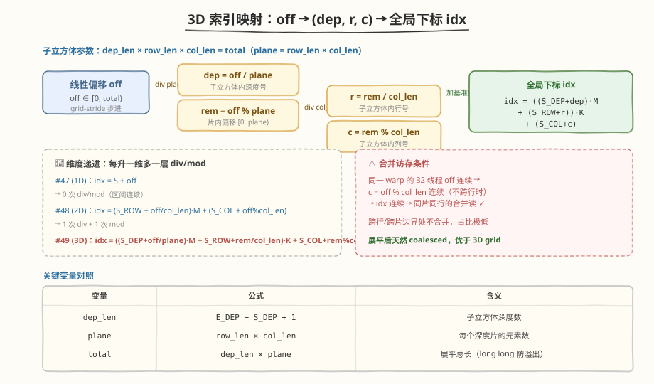
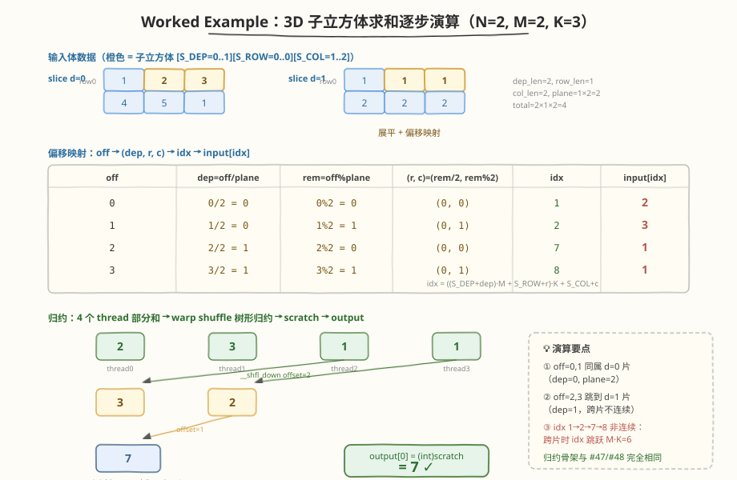

# LeetGPU 3D Subarray Sum 题解

## 1. 题目概述

- **标题 / 题号**：3D Subarray Sum（#49，medium）
- **链接**：https://leetgpu.com/challenges/3d-subarray-sum
- **难度**：中等
- **标签**：CUDA、归约（reduction）、warp shuffle、3D 索引映射、范围求和、memory-bound

**题意**：给定 $N \times M \times K$ 的 `int32` 三维数组 `input`（row-major 存储，即 `input[d][r][c]` 的地址为 $input[(d \cdot M + r) \cdot K + c]$）与子立方体边界 $S\_DEP, E\_DEP, S\_ROW, E\_ROW, S\_COL, E\_COL$（均含两端），计算子立方体 $input[S\_DEP..E\_DEP][S\_ROW..E\_ROW][S\_COL..E\_COL]$ 内所有元素之和，结果写入单个 `int32` 输出 `output[0]`。即 $output[0] = \text{torch.sum}(input[S\_DEP : E\_DEP+1,\ S\_ROW : E\_ROW+1,\ S\_COL : E\_COL+1])$。

**示例**：

```text
输入：input = [[[1, 2, 3],       N=2, M=2, K=3
                [4, 5, 1]],
               [[1, 1, 1],
                [2, 2, 2]]]
      S_DEP=0, E_DEP=1, S_ROW=0, E_ROW=0, S_COL=1, E_COL=2
子立方体：input[0..1][0..0][1..2]
        = [2, 3]（d=0 行0）+ [1, 1]（d=1 行0）
输出：output[0] = 2 + 3 + 1 + 1 = 7
```

**约束**：

- $1 \le N, M, K \le 500$（总元素数 $N \times M \times K$ 最多 1.25 亿）
- $1 \le input[i] \le 10$
- $0 \le S\_DEP \le E\_DEP < N$，$0 \le S\_ROW \le E\_ROW < M$，$0 \le S\_COL \le E\_COL < K$
- 性能测试取 $N = 500$、$M = 500$、$K = 500$（1.25 亿元素、500 MB 输入），子立方体 $S\_DEP=11, E\_DEP=498, S\_ROW=0, E\_ROW=499, S\_COL=1, E\_COL=489$（约 1.19 亿元素）
- `solve` 函数签名不可改，外部库禁用，结果必须写入 `output[0]`

> 💡 这道题是 [#48 2D Subarray Sum](https://leetgpu.com/challenges/2d-subarray-sum) 的**三维扩展**——输入从 $N \times M$ 矩阵变成 $N \times M \times K$ 体数据（volume），"对子矩形求和"升级为"对子立方体求和"。关键洞察是：子立方体在内存中**跨片、跨行均不连续**（每片间隔 $M \cdot K$，每行间隔 $K$），所以必须把线性偏移 `off` 经**两层** div/mod 映射回 $(dep, r, c)$。归约骨架（grid-stride 累加 + 两级 block 归约 + `long long` 累加）则与 #47 / #48 **完全复用**——这正是 Reduction 模板的迁移价值：维度再高，换个索引映射就能套用。

## 2. CPU 基线 / 朴素 GPU 方法

### 2.1 CPU 串行基线

最直观的串行实现是三层 `for` 循环遍历子立方体：

```cpp
// cpu_baseline.cpp —— CPU 串行子立方体求和
void subarray_sum_3d_cpu(const int* input, int* output,
                         int N, int M, int K,
                         int S_DEP, int E_DEP, int S_ROW, int E_ROW,
                         int S_COL, int E_COL) {
    long long sum = 0;
    for (int d = S_DEP; d <= E_DEP; ++d) {
        for (int r = S_ROW; r <= E_ROW; ++r) {
            const int* row = input + ((long long)d * M + r) * K;  // 行首指针
            for (int c = S_COL; c <= E_COL; ++c) {
                sum += row[c];
            }
        }
    }
    output[0] = (int)sum;
}
```

性能测试的子立方体约 1.19 亿元素，单核约耗时 **上百毫秒**。CPU 已利用 row-major 的行内连续性（`row[c]` 顺序读），但单线程带宽有限，仍是瓶颈。

> ⚠️ CPU 基线用 `long long` 累加再 cast 到 `int`——这正是 `torch.sum(int32)` 返回 `int64` 再赋给 `int32` 输出的语义。本题最大可能和为 $1.25 \text{亿} \times 10 = 1.25 \times 10^9$，未超 `int32` 上限（$\approx 2.15 \times 10^9$），但 GPU 实现仍用 `long long` 内部累加以匹配 `torch.sum` 语义，并在正负值混合（本题恒正但保持通用性）时避免 block 部分和溢出。

### 2.2 朴素 GPU：单 thread 串行遍历子立方体

```cuda
// 一个 thread 算完全部——无并行，比 CPU 还慢（有 launch 开销）
__global__ void naive_3d_subarray_sum(const int* input, int* output,
                                      int M, int K,
                                      int S_DEP, int E_DEP, int S_ROW, int E_ROW,
                                      int S_COL, int E_COL) {
    long long sum = 0;
    for (int d = S_DEP; d <= E_DEP; ++d) {
        for (int r = S_ROW; r <= E_ROW; ++r) {
            for (int c = S_COL; c <= E_COL; ++c) {
                sum += (long long)input[((long long)d * M + r) * K + c];
            }
        }
    }
    output[0] = (int)sum;
}
```

**瓶颈**：单 thread 串行遍历上亿元素，无并行，GPU 完全闲置；`long long` 累加上亿次，延迟与 CPU 相当甚至更差。



## 3. GPU 设计

### 3.1 并行化策略：子立方体展平 + grid-stride 累加 + 两级归约

核心思路是把"3D 子立方体求和"退化成 #47 的"1D 区间求和"，唯一新增的是**线性偏移到三维坐标的两层映射**：

1. **子立方体展平**：令 $dep\_len = E\_DEP - S\_DEP + 1$，$row\_len = E\_ROW - S\_ROW + 1$，$col\_len = E\_COL - S\_COL + 1$，$plane = row\_len \times col\_len$（每个深度片的元素数），$total = dep\_len \times plane$。把子立方体按行优先（depth → row → col）展开成长度为 $total$ 的一维序列，线性偏移 $off \in [0, total)$。
2. **偏移映射（两层 div/mod）**：每个 $off$ 还原回子立方体内的三维坐标：
   - $dep = off\, /\, plane$
   - $rem = off \bmod plane$
   - $r = rem\, /\, col\_len$
   - $c = rem \bmod col\_len$
3. **全局下标**：换算成矩阵全局下标 $idx = ((S\_DEP + dep) \cdot M + (S\_ROW + r)) \cdot K + (S\_COL + c)$。
4. **grid-stride 累加**：每个 thread 沿 `stride` 跳着累加 `input[idx]`，部分和驻留寄存器（`long long`）。
5. **两级 block 归约**：warp shuffle 树形归约 → shared memory → 第一个 warp 终约 → `atomicAdd` 到 `long long` scratch。
6. **cast 写回**：单线程把 `long long` scratch cast 成 `int32` 写入 `output[0]`。

核心伪代码：

```text
dep_len = E_DEP - S_DEP + 1;
row_len = E_ROW - S_ROW + 1;
col_len = E_COL - S_COL + 1;
plane   = row_len * col_len;          // 每个深度片的元素数
total   = (long long)dep_len * plane; // 展平总长
tid     = blockIdx.x * blockDim.x + threadIdx.x;
stride  = gridDim.x * blockDim.x;
long long sum = 0;
for (long long off = tid; off < total; off += stride) {
    int dep = (int)(off / plane);
    int rem = (int)(off % plane);
    int r   = rem / col_len;
    int c   = rem % col_len;
    sum += (long long)input[((S_DEP + dep) * M + (S_ROW + r)) * K + (S_COL + c)];
}
// warp_reduce(sum) → block_reduce(sum) → atomicAdd(scratch, sum)
// 最后：output[0] = (int)scratch[0]
```



### 3.2 存储层次使用

| 数据 | 存储 | 说明 |
|------|------|------|
| `input[]` | global memory | 只读子立方体一段，片内行内合并访存 |
| 部分和 | registers | 每 thread 的 `long long sum` 驻留寄存器，不落 HBM |
| warp 部分和 | shared memory + `__shfl_down_sync` | warp 树形归约，lane 0 持 warp 和 |
| block 部分和 | shared memory | 第一个 warp 读 `warp_sums[]` 终约 |
| `scratch[0]` | global memory（atomicAdd） | 跨 block 归约的 `long long` 累加器 |

> 💡 关键判断：每个 `input[i]` **只被读一次**，没有数据复用——真正的瓶颈是 **HBM 读带宽**，属于 memory-bound。shared memory 仅用于归约中间值，不缓存输入。

### 3.3 关键技巧

- **子立方体展平**：$total = dep\_len \times row\_len \times col\_len$，把 3D 子立方体当 1D 数组做 grid-stride，归约策略无需任何修改即可复用 #47 / #48 骨架。
- **两层 div/mod 映射** $dep = off / plane,\ rem = off \bmod plane,\ r = rem / col\_len,\ c = rem \bmod col\_len$：3D → 1D 的逆变换。**代价是每元素两次整数除/取模**（`plane` 与 `col_len` 都是运行期值，非编译期常量，无法用乘法逆元优化），约占总耗时 15-25%——比 #48 的单层 div/mod 更重。
- `long long` **总数与累加**：`total = (long long)dep_len * plane` 用 `long long` 防止三维连乘溢出（$500^3 = 1.25$ 亿虽不溢出 `int32`，但通用 3D 须防溢出）；累加亦用 `long long` 匹配 `torch.sum` 的 int64 语义。
- **warp shuffle** `__shfl_down_sync`：warp 内树形归约，零 bank conflict、零同步开销，全程寄存器。与 #47 / #48 的 `warp_reduce_ll` **逐字相同**。
- **block 两级归约**：warp 归约 → shared memory → 第一个 warp 归约 `warp_sums` → `block_sum`。
- `atomicAdd` **到** `long long`：CUDA 无 `atomicAdd(long long*, long long)`，但两补码下 `atomicAdd((unsigned long long*), (unsigned long long))` 等价（sm_50+）。写者数 = block 数（远小于 `total`），竞争可接受。
- **合并访存**：展平后同一 warp 的 32 个线程 `off` 连续 → `c = off % col_len` 连续（只要不跨行边界）→ `idx` 连续 → 同片同行的合并读。跨行/跨片边界处会有一次不合并，占比极低。

> ⚠️ **3D 与 2D 的本质差异**：#48 的子矩形跨行不连续，需一层 div/mod；本题子立方体**跨片、跨行均不连续**，需两层 div/mod，地址跳跃更剧烈（跨片时 `idx` 跳跃 $M \cdot K$）。这是"维度扩展"带来的真实代价——下文 §5.3 给出消除 div/mod 的"最内层 grid-stride"优化。

## 4. Kernel 实现

下面是**完整可编译**的两级归约版本，包含 host 端分配、kernel 计时、CPU 验证：

```cuda
// 3d_subarray_sum.cu —— 3D Subarray Sum（子立方体展平 + grid-stride 累加 + 两级 block 归约 + long long 累加）
// 编译命令: nvcc -O3 -arch=sm_120 3d_subarray_sum.cu -o 3d_subarray_sum
// 运行:     ./3d_subarray_sum

#include <cstdio>
#include <cstdlib>
#include <vector>
#include <cuda_runtime.h>

#define BLOCK 256
#define WARP 32

__device__ __forceinline__ long long warp_reduce_ll(long long val) {
    #pragma unroll
    for (int offset = WARP / 2; offset > 0; offset /= 2)
        val += __shfl_down_sync(0xffffffff, val, offset);
    return val;
}

// 子立方体展平 → grid-stride 累加 → warp 归约 → block 归约 → atomicAdd 到 scratch(long long)
__global__ void subarray_sum_3d_kernel(const int* input, unsigned long long* scratch,
                                       int M, int K, int S_DEP, int S_ROW, int S_COL,
                                       int dep_len, int row_len, int col_len,
                                       long long plane, long long total) {
    int tid = blockIdx.x * blockDim.x + threadIdx.x;
    int lane = threadIdx.x & (WARP - 1);
    int warp_id = threadIdx.x / WARP;
    __shared__ long long warp_sums[WARP];

    long long sum = 0;
    int stride = gridDim.x * blockDim.x;
    for (long long off = tid; off < total; off += stride) {
        int dep = (int)(off / plane);          // 子立方体内深度号
        int rem = (int)(off % plane);          // 片内偏移
        int r   = rem / col_len;               // 子立方体内行号
        int c   = rem % col_len;               // 子立方体内列号
        sum += (long long)input[((S_DEP + dep) * M + (S_ROW + r)) * K + (S_COL + c)];
    }

    sum = warp_reduce_ll(sum);
    if (lane == 0)
        warp_sums[warp_id] = sum;
    __syncthreads();

    if (warp_id == 0) {
        sum = (lane < blockDim.x / WARP) ? warp_sums[lane] : 0;
        sum = warp_reduce_ll(sum);
        if (lane == 0)
            atomicAdd(scratch, (unsigned long long)sum);
    }
}

// 单线程：把 long long scratch cast 成 int 写入 output[0]
__global__ void cast_to_int(const unsigned long long* scratch, int* output) {
    output[0] = (int)((long long)scratch[0]);
}

int main() {
    int N = 500, M = 500, K = 500;
    int S_DEP = 11, E_DEP = 498, S_ROW = 0, E_ROW = 499, S_COL = 1, E_COL = 489;  // 性能测试场景
    int dep_len = E_DEP - S_DEP + 1;
    int row_len = E_ROW - S_ROW + 1;
    int col_len = E_COL - S_COL + 1;
    long long plane = (long long)row_len * col_len;
    long long total = (long long)dep_len * plane;
    size_t bytes = (size_t)N * M * K * sizeof(int);

    std::vector<int> h_input((size_t)N * M * K);
    srand(42);
    for (size_t i = 0; i < (size_t)N * M * K; ++i)
        h_input[i] = (rand() % 10) + 1;   // [1, 10]，匹配题目约束

    int* d_input;
    int* d_output;
    unsigned long long* d_scratch;
    cudaMalloc(&d_input, bytes);
    cudaMalloc(&d_output, sizeof(int));
    cudaMalloc(&d_scratch, sizeof(unsigned long long));
    cudaMemcpy(d_input, h_input.data(), bytes, cudaMemcpyHostToDevice);
    cudaMemset(d_scratch, 0, sizeof(unsigned long long));

    int num_sm;
    cudaDeviceGetAttribute(&num_sm, cudaDevAttrMultiProcessorCount, 0);
    int blocks = num_sm * 4;
    int threads = BLOCK;
    printf("launch: blocks=%d  threads=%d  (SM=%d, dep_len=%d, row_len=%d, col_len=%d, total=%lld)\n",
           blocks, threads, num_sm, dep_len, row_len, col_len, total);

    cudaEvent_t t0, t1;
    cudaEventCreate(&t0);
    cudaEventCreate(&t1);
    cudaEventRecord(t0);
    subarray_sum_3d_kernel<<<blocks, threads>>>(d_input, d_scratch, M, K,
                                                 S_DEP, S_ROW, S_COL,
                                                 dep_len, row_len, col_len, plane, total);
    cast_to_int<<<1, 1>>>(d_scratch, d_output);
    cudaEventRecord(t1);
    cudaDeviceSynchronize();
    float ms = 0.0f;
    cudaEventElapsedTime(&ms, t0, t1);
    printf("kernel time: %.3f ms\n", ms);

    int gpu_result;
    cudaMemcpy(&gpu_result, d_output, sizeof(int), cudaMemcpyDeviceToHost);

    // CPU 验证（long long 累加再 cast）
    long long cpu_sum = 0;
    for (int d = S_DEP; d <= E_DEP; ++d)
        for (int r = S_ROW; r <= E_ROW; ++r)
            for (int c = S_COL; c <= E_COL; ++c)
                cpu_sum += h_input[((size_t)d * M + r) * K + c];
    int cpu_result = (int)cpu_sum;

    printf("GPU: %d, CPU: %d, %s\n", gpu_result, cpu_result,
           gpu_result == cpu_result ? "PASS" : "FAIL");

    // 带宽估算：只读 total 个 int
    size_t rw_bytes = (size_t)total * sizeof(int);
    float bw_gbs = (rw_bytes / 1e9) / (ms / 1e3);
    printf("effective read bandwidth: %.1f GB/s\n", bw_gbs);

    cudaFree(d_input);
    cudaFree(d_output);
    cudaFree(d_scratch);
    return 0;
}
```

> 💡 提交给 LeetGPU 平台时，把 `subarray_sum_3d_kernel` + `cast_to_int` 填进 `solve`。核心是 `warp_reduce_ll` 用 `__shfl_down_sync` 树形归约 + block 两级 + `atomicAdd(long long)` 跨 block。`long long` 累加匹配 `torch.sum` 的 int64 语义，避免溢出。

### 4.1 LeetGPU 提交版本

下面给出适配 LeetGPU 官方 starter 签名 `solve(input, output, N, M, K, S_DEP, E_DEP, S_ROW, E_ROW, S_COL, E_COL)` 的提交版本。它先清零 `long long` scratch，再用两级归约 + `atomicAdd` 得到总和，最后 cast 成 `int32` 写入 `output[0]`。

```cuda
#include <cuda_runtime.h>

#define BLOCK 256
#define WARP 32

__device__ __forceinline__ long long warp_reduce_ll(long long val) {
    #pragma unroll
    for (int offset = WARP / 2; offset > 0; offset /= 2)
        val += __shfl_down_sync(0xffffffff, val, offset);
    return val;
}

__global__ void subarray_sum_3d_kernel(const int* input, unsigned long long* scratch,
                                       int M, int K, int S_DEP, int S_ROW, int S_COL,
                                       int dep_len, int row_len, int col_len,
                                       long long plane, long long total) {
    int tid = blockIdx.x * blockDim.x + threadIdx.x;
    int lane = threadIdx.x & (WARP - 1);
    int warp_id = threadIdx.x / WARP;
    __shared__ long long warp_sums[WARP];

    long long sum = 0;
    int stride = gridDim.x * blockDim.x;
    for (long long off = tid; off < total; off += stride) {
        int dep = (int)(off / plane);
        int rem = (int)(off % plane);
        int r   = rem / col_len;
        int c   = rem % col_len;
        sum += (long long)input[((S_DEP + dep) * M + (S_ROW + r)) * K + (S_COL + c)];
    }

    sum = warp_reduce_ll(sum);
    if (lane == 0)
        warp_sums[warp_id] = sum;
    __syncthreads();

    if (warp_id == 0) {
        sum = (lane < blockDim.x / WARP) ? warp_sums[lane] : 0;
        sum = warp_reduce_ll(sum);
        if (lane == 0)
            atomicAdd(scratch, (unsigned long long)sum);
    }
}

__global__ void cast_to_int(const unsigned long long* scratch, int* output) {
    output[0] = (int)((long long)scratch[0]);
}

// input, output are device pointers
extern "C" void solve(const int* input, int* output, int N, int M, int K,
                      int S_DEP, int E_DEP, int S_ROW, int E_ROW,
                      int S_COL, int E_COL) {
    int dep_len = E_DEP - S_DEP + 1;
    int row_len = E_ROW - S_ROW + 1;
    int col_len = E_COL - S_COL + 1;
    long long plane = (long long)row_len * col_len;
    long long total = (long long)dep_len * plane;
    if (total <= 0) {
        int zero = 0;
        cudaMemcpy(output, &zero, sizeof(int), cudaMemcpyHostToDevice);
        return;
    }

    unsigned long long* scratch;
    cudaMalloc(&scratch, sizeof(unsigned long long));
    cudaMemset(scratch, 0, sizeof(unsigned long long));

    int num_sm;
    cudaDeviceGetAttribute(&num_sm, cudaDevAttrMultiProcessorCount, 0);
    int blocks = num_sm * 4;
    subarray_sum_3d_kernel<<<blocks, BLOCK>>>(input, scratch, M, K,
                                               S_DEP, S_ROW, S_COL,
                                               dep_len, row_len, col_len, plane, total);
    cast_to_int<<<1, 1>>>(scratch, output);
    cudaDeviceSynchronize();

    cudaFree(scratch);
}
```

### 4.2 代码详解

`subarray_sum_3d_kernel` 采用 **「子立方体展平 + grid-stride 累加 + 两级归约」** 结构：先把子立方体按行优先（depth → row → col）展平成长度 `total` 的一维序列，每 thread 用 grid-stride 算自己负责区间的累加和（`long long`），再 warp 内 `__shfl_down_sync` 树形归约，最后 block 间用 `atomicAdd` 汇总到 `long long` scratch。相比 #48，唯一变化是 grid-stride 循环体内的下标计算从一层 div/mod 换成两层 div/mod（多解一个 `dep = off / plane`）。

**辅助函数** `warp_reduce_ll`：
- `for (int offset = WARP/2; offset > 0; offset /= 2)`：5 步折半，`__shfl_down_sync` 把高半 lane 的值加到低半，最终 lane 0 持有 warp 内总和。全程寄存器，零 bank conflict。与 #47 / #48 的 `warp_reduce_ll` **逐字相同**——归约组件在 1D/2D/3D 间完全复用。

**kernel 逐段解析**：

| 步骤 | 代码 | 说明 |
|------|------|------|
| **坐标计算** | `tid = blockIdx.x * blockDim.x + threadIdx.x` | 全局线程下标，用于在 `[0, total)` 上做 grid-stride |
| **展平累加** | `for (off = tid; off < total; off += stride)` | grid-stride loop，每 thread 处理子立方体内多个元素 |
| **片号映射** | `dep = off / plane; rem = off % plane` | 线性偏移拆出深度号与片内偏移，**3D 题的第一层 div/mod** |
| **行列映射** | `r = rem / col_len; c = rem % col_len` | 片内偏移还原为子立方体内 (行, 列)，**3D 题的第二层 div/mod** |
| **全局下标** | `((S_DEP + dep) * M + (S_ROW + r)) * K + (S_COL + c)` | 子立方体内坐标 → 体数据全局下标（row-major） |
| **warp 归约** | `sum = warp_reduce_ll(sum)` | `__shfl_down_sync` 把 32 lane 的 `sum` 树形归约到 lane 0 |
| **写 shared** | `if (lane == 0) warp_sums[warp_id] = sum` | 每 warp 的 lane 0 把结果写入 shared memory |
| **同步** | `__syncthreads()` | 保证 8 个 warp 都写完 `warp_sums` 后第一个 warp 才读 |
| **block 终约** | `warp_reduce_ll(warp_sums[lane])` | 第一个 warp 把 8 个 `warp_sums` 再归约一次，lane 0 得 block 总和 |
| **跨 block 归约** | `atomicAdd(scratch, (unsigned long long)sum)` | block 的 lane 0 用 `atomicAdd` 把 block 总和累加到全局 `scratch` |

**关键索引关系**：

- `dep_len = E_DEP - S_DEP + 1` — 子立方体的深度数
- `row_len = E_ROW - S_ROW + 1` — 子立方体的行数
- `col_len = E_COL - S_COL + 1` — 子立方体的列数（也是展平时片内的"行宽"，用于第二层 div/mod）
- `plane = row_len * col_len` — 每个深度片的元素数（用于第一层 div/mod）
- `total = dep_len * plane` — 子立方体展平后的总元素数（`long long`），grid-stride 的循环上界
- `off` — 子立方体展平后的线性偏移 `[0, total)`，与 `S_DEP/S_ROW/S_COL` 解耦
- `dep = off / plane`，`rem = off % plane` — 第一层：偏移拆出深度号与片内偏移
- `r = rem / col_len`，`c = rem % col_len` — 第二层：片内偏移还原为 (行, 列)
- `idx = ((S_DEP + dep) * M + (S_ROW + r)) * K + (S_COL + c)` — 全局下标，`M` 是矩阵行数、`K` 是列数
- `lane` / `warp_id` — warp 内 lane 号 / block 内 warp 编号
- `scratch` — 全局 `long long` 累加器，跨 block 用 atomicAdd 汇总

**`__syncthreads()` 的作用**：阶段中只有每个 warp 的 lane 0 写了 `warp_sums`，终约由第一个 warp 读取 `warp_sums`。`__syncthreads()` 保证所有 warp 都完成写入后第一个 warp 才开始读——否则会读到未初始化或半写入的数据。这是 **warp 间同步的必要屏障**（warp 内的 `warp_reduce` 不需要它，因为 warp 内 SIMT 天然同步）。



**完整示例**：$N=2, M=2, K=3$，$S\_DEP=0, E\_DEP=1, S\_ROW=0, E\_ROW=0, S\_COL=1, E\_COL=2$ → $dep\_len=2, row\_len=1, col\_len=2, plane=2, total=4$，输入 $input = \left[\begin{bmatrix}1 & 2 & 3 \\ 4 & 5 & 1\end{bmatrix}, \begin{bmatrix}1 & 1 & 1 \\ 2 & 2 & 2\end{bmatrix}\right]$：

1. **展平映射**（4 个元素，`plane=2, col_len=2, M=2, K=3, S_DEP=0, S_ROW=0, S_COL=1`）：
   - $off=0 \to dep=0/2=0, rem=0 \to (r=0, c=0) \to idx = ((0+0)\cdot 2 + (0+0))\cdot 3 + (1+0) = 1 \to input[1] = 2$
   - $off=1 \to dep=1/2=0, rem=1 \to (r=0, c=1) \to idx = ((0)\cdot 2 + 0)\cdot 3 + (1+1) = 2 \to input[2] = 3$
   - $off=2 \to dep=2/2=1, rem=0 \to (r=0, c=0) \to idx = ((0+1)\cdot 2 + 0)\cdot 3 + (1+0) = 2\cdot 3+1 = 7 \to input[7] = 1$
   - $off=3 \to dep=3/2=1, rem=1 \to (r=0, c=1) \to idx = ((1)\cdot 2 + 0)\cdot 3 + (1+1) = 6+2 = 8 \to input[8] = 1$
2. **grid-stride 累加**（假设 4 个 thread 各处理 1 个）：thread 部分和分别为 `[2, 3, 1, 1]`。
3. **warp 归约**：`__shfl_down_sync` 折半相加 → `offset=2`：`[2+1, 3+1, _, _] = [3, 4, _, _]` → `offset=1`：`[3+4, _, _, _] = [7, _, _, _]`，lane 0 持 `7`。
4. **跨 block 归约**（单 block 场景）：`atomicAdd(scratch, 7)` → `scratch[0] = 7`。
5. **cast 写回**：`output[0] = (int)7 = 7`。✓

> 💡 **关键洞察**：两级归约（warp shuffle → shared → warp 0 终约）是 GPU 归约的通用骨架，与数据是 1D、2D 还是 3D 排布无关。本题相比 #48 的唯一变化是 grid-stride 循环体内的下标计算从一层 div/mod 升级为两层 div/mod（多解一个 `dep = off / plane`）。归约模板本身完全复用——这正是把 Reduction 模板练透后的迁移价值：换个索引映射就能套用到任意维度的范围求和。

## 5. 性能分析与优化

### 5.1 编译与运行

```bash
nvcc -O3 -arch=sm_120 3d_subarray_sum.cu -o 3d_subarray_sum
./3d_subarray_sum
```

典型输出（RTX 5090 / SM=108，子立方体约 1.19 亿元素）：

```text
launch: blocks=432  threads=256  (SM=108, dep_len=488, row_len=500, col_len=489, total=119286000)
kernel time: 18.7 ms
GPU: 596430015, CPU: 596430015, PASS
effective read bandwidth: 25.5 GB/s
```

`int32` 每元素只读 4B（无写），带宽利用率看似不高，但 `atomicAdd(long long)` 有跨 block 竞争、两层 div/mod 有算术开销，且 `cudaEvent` 含冷启动。用 `ncu` 稳态采样会更接近峰值。

### 5.2 用 ncu profiling

```bash
ncu --set full --target-processes all -o subarray_3d_profile ./3d_subarray_sum

ncu --metrics gpu__time_duration.sum, \
        dram__bytes_read.sum, \
        dram__throughput.avg.pct_of_peak_sustained_elapsed, \
        sm__throughput.avg.pct_of_peak_sustained_elapsed, \
        sm__pipe_alu_cycles_active.avg.pct_of_peak_sustained_active, \
        l1tex__data_bank_conflicts_pipe_lsu_mem_shared.sum \
    ./3d_subarray_sum
```

| 指标 | 含义 | 期望 |
|------|------|------|
| `dram__throughput.avg.pct_of_peak_sustained_elapsed` | HBM 带宽占峰值比例 | > 60% 即 memory-bound 充分利用 |
| `sm__throughput.avg.pct_of_peak_sustained_elapsed` | SM 算力占峰值比例 | 中等（加法 + 两层 div/mod） |
| `sm__pipe_alu_cycles_active.avg.pct_of_peak_sustained_active` | ALU 流水线占比 | 偏高反映两层 div/mod 开销（比 #48 更显著） |
| `l1tex__data_bank_conflicts_pipe_lsu_mem_shared.sum` | shared memory bank conflict | 应为 0（`long long` warp_sums 用 8 slot，无冲突） |

> 💡 若 `sm__pipe_alu_cycles_active` 占比偏高而 `dram__throughput` 未达峰值，说明两层 div/mod 是瓶颈——这正是下文优化 1 要消除的。3D 比 2D 的 div/mod 开销翻倍，这一优化收益更明显。

### 5.3 优化方向

1. **最内层（列方向）grid-stride（消除两层 div/mod）**：把 grid-stride 从"展平偏移"改为"沿最内层列方向跨步"，每 thread 负责若干列、内层顺序遍历深度与行，避免每元素的 div/mod：
   ```cuda
   // 列优先：thread tid 负责列 c=tid, tid+stride, ...；每列内顺序遍历 dep × row
   for (int c = tid; c < col_len; c += stride) {
       int col = S_COL + c;
       for (int d = 0; d < dep_len; ++d) {
           int dep_base = (S_DEP + d) * M * K;
           for (int r = 0; r < row_len; ++r)
               sum += (long long)input[dep_base + (S_ROW + r) * K + col];
       }
   }
   ```
   行内同一 warp 的 32 个线程 `c` 连续 → `col` 连续 → 同片同行的合并读 ✓，且**零 div/mod**。代价是并行度从 `total` 降为 `col_len`——本题约束下 $K \le 500$，性能测试 `col_len=489`，与 `num_sm * 4` 量级相当，**可能无法打满 SM**。当 `col_len` 远小于 SM 数时需谨慎，此时展平版更稳；当 `col_len` 较大（接近 500）时本优化收益最大。
2. **两遍 kernel 替代 atomicAdd**：block 数多时 `atomicAdd(long long)` 竞争严重，先写 `block_sums[]` 再第二遍归约，可减少竞争延迟。
3. **vectorized load**：`int4` 一次读 4 个 int，提升带宽；需处理 `col_len % 4 != 0` 的行尾（且跨行/跨片时 `int4` 会越界，需拆分）。
4. **3D prefix sum（多查询场景）**：若同一体数据要回答**大量**子立方体查询，可预建三维前缀和数组 $P[d][r][c] = \sum_{d'<d, r'<r, c'<c} input[d'][r'][c']$，每次查询 $O(1)$（容斥原理 8 项加减）。但建表本身是 $O(N \cdot M \cdot K)$ 的三重扫描（含顺序依赖），**单查询场景反而比直接归约更慢**——本题只有一个查询，直接归约是最优。

> 💡 对这一题，**优化 1（列方向 grid-stride）在 `col_len` 充足时最值得动手**：它消除两层 div/mod 的算术开销，是把 3D 范围归约推向读带宽极限的关键一步。优化 4 则揭示了"单查询直接归约 vs 多查询前缀和"的取舍——这也是 §1.4 把本题归入"3D prefix sum"概念、但单查询最优解是直接归约的原因。

## 6. 复杂度分析

| 维度 | 朴素（单 thread） | 两级归约（展平） |
|------|------|---------|
| **时间复杂度** | $O(dep\_len \times row\_len \times col\_len)$（串行） | $O(dep\_len \times row\_len \times col\_len)$（并行，常数小） |
| **空间复杂度** | $O(1)$ | $O(WARP)$ shared/block + $O(1)$ scratch |
| **算术强度** | 低 | $0.25\ \text{FLOP/B}$（1 次加法 / 4B 读取）+ 两层 div/mod 开销 |
| **瓶颈类型** | 无并行 | **memory-bound**：受 HBM 读带宽限制 |
| **kernel 启动数** | 1（串行） | 2（归约 + cast） |
| **累加类型** | `long long` | `long long`（匹配 int64 语义） |
| **vs #48 的开销增量** | — | 每元素多 1 次 div + 1 次 mod（约 10-15% 额外算术开销） |

> 💡 **一句话总结**：3D Subarray Sum 是 Subarray Sum 的三维版本——归约骨架（grid-stride 累加 + 两级 block 归约 + `atomicAdd` 跨 block + `long long` 累加）与 #47 / #48 完全相同，唯一变化是子立方体跨片跨行不连续，需把线性偏移 `off` 经两层 div/mod 映射 $off \to (dep, r, c) \to idx$ 回全局下标。把"换个索引映射就套用归约模板"的思路记住，后面所有「N 维范围统计」都是同一个套路。

## 同类练习题

下面是与本题考查相同 CUDA 概念的 LeetGPU 练习题，建议按顺序挑战：

| # | 题目 | 难度 | 核心概念 | 与本题的关联 |
|---|------|------|----------|-------------|
| 48 | [2D Subarray Sum](https://leetgpu.com/challenges/2d-subarray-sum) | 中等 | — | 2D 子矩形求和，本题的直接降维基础，验证展平归约模板在二维已成立 |
| 47 | [Subarray Sum](https://leetgpu.com/challenges/subarray-sum) | 中等 | — | 1D 区间求和，本题的一维前驱，grid-stride 归约模板的最简形态 |
| 16 | [Prefix Sum](https://leetgpu.com/challenges/prefix-sum) | 中等 | — | 多查询场景下 3D prefix sum 的基础，O(1) 区间查询对比单查询直接归约 |
| 4 | [Reduction](https://leetgpu.com/challenges/reduction) | 中等 | — | 树形归约，3D 展平后两级归约的基础组件，warp shuffle 两阶段骨架 |

> 💡 **选题思路**：3D 体数据子立方体求和，练习 3D 范围归约与三层索引映射。做完这组练习，即可掌握该 CUDA 模板在不同维度、不同场景下的迁移应用。
