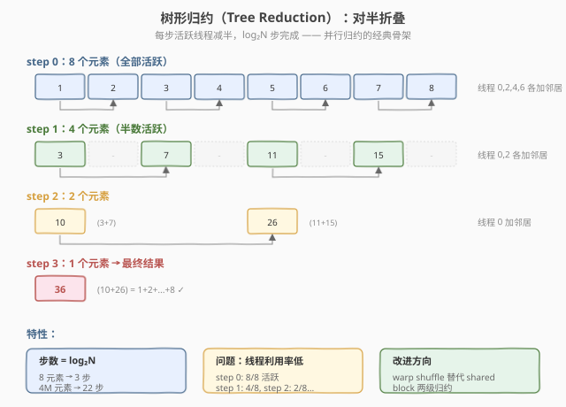
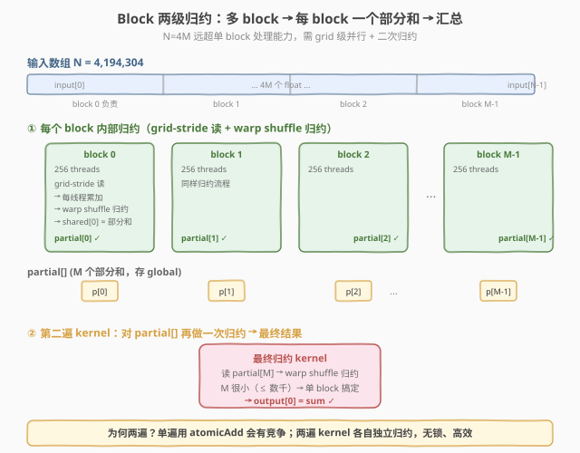
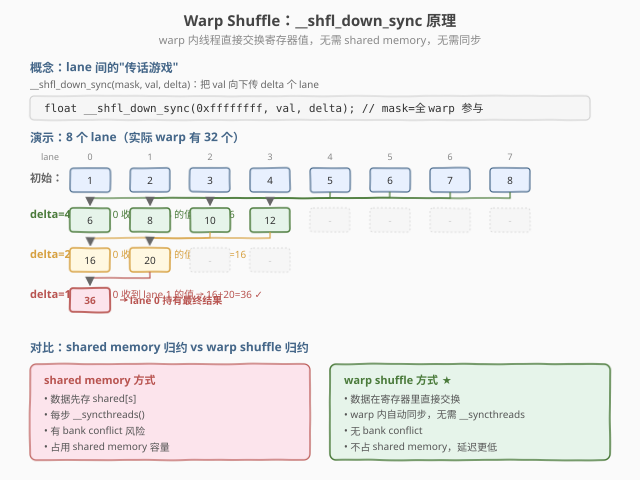

# LeetGPU Reduction 题解

## 1. 题目概述

- **标题 / 题号**：Reduction（#4，medium）
- **链接**：https://leetgpu.com/challenges/reduction
- **难度**：中等
- **标签**：CUDA、warp shuffle、归约、memory-bound、`__shfl_down_sync`

**题意**：给定长度为 `N` 的 `float32` 数组 `input`，计算所有元素的和 `sum = input[0] + input[1] + ... + input[N-1]`。

**示例**：

```text
输入：[1.0, 2.0, 3.0, 4.0, 5.0]
输出：15.0
```

**约束**：`1 ≤ N ≤ 10,000,000`；性能测试取大数组。

> 💡 这道题是 **warp shuffle 归约的经典练习**——`__shfl_down_sync` 把 warp 内 32 个 lane 的值逐级归约到 lane 0。与 [Week7 Day6 全链路 Profiling](../../../aiinfra/daily/week7/day6/README.md) 的关联在于：Reduction 是 profiling 中最常分析的 memory-bound kernel，LayerNorm（求 mean/var）和 Softmax（求 max/sum）内部都包含 reduction。理解它的性能特征是分析这些 kernel 瓶颈的基础。

## 2. CPU 基线 / 朴素 GPU 方法

### CPU 串行

```cpp
float sum = 0.0f;
for (int i = 0; i < N; i++)
    sum += input[i];
```

`O(N)` 顺序累加，单线程，无法利用 GPU 并行。`N=10^7` 时单核约几十毫秒，是后续 GPU 加速的对照基线。

### 朴素 GPU（全局 `atomicAdd`）

最直接的并行思路：每个线程读一个元素，用全局 `atomicAdd` 把值累加到一个标量上。

```cuda
__global__ void naive_atomic_reduce(const float* input, float* sum, int N) {
    int gid = blockIdx.x * blockDim.x + threadIdx.x;
    if (gid < N)
        atomicAdd(sum, input[gid]);
}
```

**瓶颈**：所有 $N$ 个线程竞争**同一个** `sum` 地址，`atomicAdd` 串行化程度极高，吞吐随线程数骤降——`N=10^7` 时这版几乎比 CPU 还慢。它揭示了归约问题的核心矛盾：**并行度与归约目标的唯一性冲突**。

> ⚠️ 朴素 `atomicAdd` 不是归约的正解，而是反例。它引出**树形归约**思想：把 $N$ 个值组织成一棵二叉树，每层并行配对相加，$\log_2 N$ 层后得到总和，让"并行度"和"逐步收敛"共存。



## 3. GPU 设计

### 3.1 并行化策略：两阶段树形归约

核心思想是**两阶段归约**：block 归约 → final 归约。

1. **block 归约**：每个 block 处理 `BLOCK_SIZE` 个元素，内部先做 warp 级归约，再跨 warp 归约，每个 block 产出一个部分和写到中间缓冲区 `partial[blockIdx.x]`（LeetGPU 的 `output` 只有 1 个 float 的空间，不能直接写）。
2. **final 归约**：单个 block 对所有部分和再归约一次，得到全局总和。

warp 内用 `__shfl_down_sync`（寄存器内、无 bank conflict），warp 间用 shared memory（需保证同步）。`BLOCK_SIZE=256` 时每 block 含 8 个 warp，warp 间只需归约 8 个值。

**两阶段流程**（每个 block 产出一个部分和，再由 final kernel 聚合）：



### 3.2 存储层次使用

| 层次 | 是否使用 | 说明 |
|------|----------|------|
| global memory | ✓ | `input` 读取、`partial` 部分和暂存、`output` 写最终结果 |
| shared memory | ✓ | `warp_sums[BLOCK_SIZE/WARP_SIZE]` 存各 warp 部分和，作 warp 间归约中转 |
| register | ✓ | `__shfl_down_sync` 在寄存器内完成 warp 归约，不碰 shared memory |

### 3.3 关键技巧：warp shuffle `__shfl_down_sync`

`__shfl_down_sync(mask, val, offset)` 让 lane `i` 取回 lane `i+offset` 的 `val`（高位的值"下移"），与自身相加。循环 5 步（offset = 16→8→4→2→1）即可把 32 个 lane 归约到 lane 0：

- **全程在寄存器内完成**，不访问 shared memory，**无 bank conflict**。
- **无需** `__syncthreads`：warp 内是 SIMT 同步执行的，32 个 lane 同步推进。
- `0xffffffff` 是活跃掩码，表示 warp 内 32 个 lane 全部参与。



## 4. Kernel 实现

### 4.1 LeetGPU 提交版本

```cuda
// reduction.cu —— Warp shuffle 两阶段归约
#include <cuda_runtime.h>

#define BLOCK_SIZE 256
#define WARP_SIZE 32

__inline__ __device__ float warp_reduce(float val) {
    for (int offset = WARP_SIZE / 2; offset > 0; offset >>= 1)
        val += __shfl_down_sync(0xffffffff, val, offset);
    return val;
}

__global__ void reduce_kernel(const float* input, float* output, int N) {
    __shared__ float warp_sums[BLOCK_SIZE / WARP_SIZE];
    int tid = threadIdx.x;
    int gid = blockIdx.x * BLOCK_SIZE + tid;
    int warp_id = tid / WARP_SIZE;
    int lane = tid % WARP_SIZE;

    float val = (gid < N) ? input[gid] : 0.0f;
    val = warp_reduce(val);
    if (lane == 0)
        warp_sums[warp_id] = val;
    __syncthreads();

    if (warp_id == 0) {
        val = (lane < BLOCK_SIZE / WARP_SIZE) ? warp_sums[lane] : 0.0f;
        val = warp_reduce(val);
        if (lane == 0)
            output[blockIdx.x] = val;
    }
}

__global__ void final_reduce(const float* input, float* output, int N) {
    __shared__ float warp_sums[BLOCK_SIZE / WARP_SIZE];
    int tid = threadIdx.x;
    float val = 0.0f;
    for (int i = tid; i < N; i += BLOCK_SIZE)
        val += input[i];
    val = warp_reduce(val);
    if (tid % WARP_SIZE == 0)
        warp_sums[tid / WARP_SIZE] = val;
    __syncthreads();
    if (tid < WARP_SIZE) {
        val = (tid < BLOCK_SIZE / WARP_SIZE) ? warp_sums[tid] : 0.0f;
        val = warp_reduce(val);
        if (tid == 0)
            output[0] = val;
    }
}

extern "C" void solve(const float* input, float* output, int N) {
    int gridSize = (N + BLOCK_SIZE - 1) / BLOCK_SIZE;
    float* partial = nullptr;
    cudaMalloc(&partial, gridSize * sizeof(float));   // 部分和缓冲区
    reduce_kernel<<<gridSize, BLOCK_SIZE>>>(input, partial, N);
    final_reduce<<<1, BLOCK_SIZE>>>(partial, output, gridSize);
    cudaFree(partial);
}
```

> ⚠️ **为什么不能直接把部分和写进 `output`**：LeetGPU 评测端只为 `output` 分配 **1 个 float** 的空间。第一阶段若写 `output[blockIdx.x]`，`blockIdx.x > 0` 时就是越界写，提交会报 `Out of bounds write detected`。必须另开一块 `gridSize` 大小的中间缓冲区 `partial` 暂存部分和，最终结果才写 `output[0]`。
>
> 💡 若想省掉 `cudaMalloc`/`cudaFree` 和第二次 launch，可以改用**单 kernel + 原子尾聚合**：先 `cudaMemsetAsync(output, 0, sizeof(float))` 清零，然后每个 block 的 lane 0 直接 `atomicAdd(output, val)`。`gridSize` 个 block 竞争一个地址的开销远小于朴素版（每线程一次），对中等规模 `N` 完全够用。

### 4.2 完整自测版

```cuda
// reduction_full.cu —— 含验证和带宽测量
// 编译命令: nvcc -O3 -arch=sm_120 reduction_full.cu -o reduction
#include <cstdio>
#include <cstdlib>
#include <cmath>
#include <cuda_runtime.h>

#define BLOCK_SIZE 256
#define WARP_SIZE 32

#define CHECK_CUDA(call)                                                                               \
    do {                                                                                               \
        cudaError_t e = (call);                                                                        \
        if (e != cudaSuccess) {                                                                        \
            fprintf(stderr, "CUDA error %s:%d: %s\n", __FILE__, __LINE__, cudaGetErrorString(e));      \
            exit(EXIT_FAILURE);                                                                        \
        }                                                                                              \
    } while (0)

__inline__ __device__ float warp_reduce(float val) {
    for (int offset = WARP_SIZE / 2; offset > 0; offset >>= 1)
        val += __shfl_down_sync(0xffffffff, val, offset);
    return val;
}

__global__ void reduce_kernel(const float* input, float* output, int N) {
    __shared__ float warp_sums[BLOCK_SIZE / WARP_SIZE];
    int tid = threadIdx.x;
    int gid = blockIdx.x * BLOCK_SIZE + tid;
    int warp_id = tid / WARP_SIZE;
    int lane = tid % WARP_SIZE;

    float val = (gid < N) ? input[gid] : 0.0f;
    val = warp_reduce(val);
    if (lane == 0)
        warp_sums[warp_id] = val;
    __syncthreads();

    if (warp_id == 0) {
        val = (lane < BLOCK_SIZE / WARP_SIZE) ? warp_sums[lane] : 0.0f;
        val = warp_reduce(val);
        if (lane == 0)
            output[blockIdx.x] = val;
    }
}

__global__ void final_reduce(const float* input, float* output, int N) {
    __shared__ float warp_sums[BLOCK_SIZE / WARP_SIZE];
    int tid = threadIdx.x;
    float val = 0.0f;
    for (int i = tid; i < N; i += BLOCK_SIZE)
        val += input[i];
    val = warp_reduce(val);
    if (tid % WARP_SIZE == 0)
        warp_sums[tid / WARP_SIZE] = val;
    __syncthreads();
    if (tid < WARP_SIZE) {
        val = (tid < BLOCK_SIZE / WARP_SIZE) ? warp_sums[tid] : 0.0f;
        val = warp_reduce(val);
        if (tid == 0)
            output[0] = val;
    }
}

int main(int argc, char** argv) {
    int N = (argc > 1) ? atoi(argv[1]) : 10000000;
    size_t bytes = (size_t)N * sizeof(float);
    printf("N=%d (%.1f MB)\n", N, bytes / 1e6);

    float* hInput = (float*)malloc(bytes);
    srand(42);
    double cpu_sum = 0.0;
    for (int i = 0; i < N; i++) {
        hInput[i] = (float)(rand() % 1000) / 100.0f;
        cpu_sum += hInput[i];
    }

    float *dInput, *dOutput;
    CHECK_CUDA(cudaMalloc(&dInput, bytes));
    int gridSize = (N + BLOCK_SIZE - 1) / BLOCK_SIZE;
    CHECK_CUDA(cudaMalloc(&dOutput, sizeof(float) * gridSize));
    CHECK_CUDA(cudaMemcpy(dInput, hInput, bytes, cudaMemcpyHostToDevice));

    cudaEvent_t t0, t1;
    cudaEventCreate(&t0);
    cudaEventCreate(&t1);
    cudaEventRecord(t0);
    reduce_kernel<<<gridSize, BLOCK_SIZE>>>(dInput, dOutput, N);
    final_reduce<<<1, BLOCK_SIZE>>>(dOutput, dOutput, gridSize);
    cudaEventRecord(t1);
    CHECK_CUDA(cudaDeviceSynchronize());

    float ms = 0;
    cudaEventElapsedTime(&ms, t0, t1);
    float hResult = 0.0f;
    CHECK_CUDA(cudaMemcpy(&hResult, dOutput, sizeof(float), cudaMemcpyDeviceToHost));

    printf("kernel time: %.3f ms\n", ms);
    printf("read bandwidth: %.1f GB/s\n", (bytes / 1e9) / (ms / 1e3));
    printf("GPU sum = %.2f\nCPU sum = %.2f\n", hResult, (float)cpu_sum);

    double rel_err = fabs((double)hResult - cpu_sum) / fabs(cpu_sum);
    int pass = (rel_err < 1e-3) || (fabs((double)hResult - cpu_sum) < 1.0);
    printf("%s (rel_err=%.2e)\n", pass ? "PASS" : "FAIL", rel_err);

    CHECK_CUDA(cudaFree(dInput));
    CHECK_CUDA(cudaFree(dOutput));
    free(hInput);
    return 0;
}
```

### 4.3 代码详解

`reduce_kernel` 的核心是 **"warp 内 shuffle 归约 → shared memory 中转 → warp 间再归约"** 的两级结构，把 256 个元素收敛成 1 个部分和。

| 步骤 | 代码 | 说明 |
|------|------|------|
| **坐标计算** | `gid = blockIdx.x * BLOCK_SIZE + tid` | thread → 全局输入下标 |
| **加载** | `val = (gid < N) ? input[gid] : 0.0f` | 每线程读 1 元素，越界补 0 不污染求和 |
| **warp 归约** | `val = warp_reduce(val)` | 32 lane shuffle 归约，lane 0 持该 warp 和 |
| **写 shared** | `warp_sums[warp_id] = val`（lane 0） | 8 个 warp 部分和写入 shared memory |
| **同步** | `__syncthreads()` | 等 8 个 warp 全部写完才允许第一个 warp 读 |
| **warp 间归约** | 第一个 warp 加载 `warp_sums` 再 `warp_reduce` | 8 个部分和收敛到 1 个 block 和 |
| **写回** | `output[blockIdx.x] = val` | block 部和写到 global，供 final kernel 聚合 |

**关键索引关系**：

- `tid = threadIdx.x` — block 内线程索引，`[0, BLOCK_SIZE)`
- `gid = blockIdx.x * BLOCK_SIZE + tid` — 全局输入下标
- `warp_id = tid / WARP_SIZE` — block 内 warp 编号，`[0, 8)`
- `lane = tid % WARP_SIZE` — warp 内 lane 编号，`[0, 32)`
- `offset = WARP_SIZE/2 → 1` — `__shfl_down_sync` 下移距离，每步减半

**`__syncthreads()` 的作用**：阶段 A 中只有每个 warp 的 lane 0 写了 `warp_sums`，阶段 B 由第一个 warp 读取 `warp_sums`。屏障保证所有 warp 都完成写入后，第一个 warp 才开始读——否则会读到未初始化的数据。这是 **warp 间同步的必要屏障**（warp 内的 `warp_reduce` 不需要它，因为 warp 内天然同步）。

#### `warp_reduce`：warp 内 32 lane 归约

`__shfl_down_sync(mask, val, offset)` 让 lane `i` 取回 lane `i+offset` 的 `val`（高位的值"下移"），并与自身相加。循环 5 步：

| 步骤 | offset | lane i 执行 | 之后持有有效和的 lane |
|------|--------|-------------|----------------------|
| 1 | 16 | `val[i] += val[i+16]` | lane 0–15（各含 2 个元素和）|
| 2 | 8  | `val[i] += val[i+8]`  | lane 0–7（各含 4 个元素和）|
| 3 | 4  | `val[i] += val[i+4]`  | lane 0–3（各含 8 个元素和）|
| 4 | 2  | `val[i] += val[i+2]`  | lane 0–1（各含 16 个元素和）|
| 5 | 1  | `val[i] += val[i+1]`  | lane 0（含 32 个元素和）|

5 步后 **lane 0** 持有整个 warp 32 个值的和，其余 lane 的值是中间结果（不再使用）。

#### 完整示例：`BLOCK_SIZE=256`，8 个 warp，`N=1024`

设 `input = [1, 1, ..., 1]`（1024 个 1，期望和为 1024）。

1. **gridSize** = `(1024 + 256 - 1) / 256 = 4` 个 block。
2. `reduce_kernel`**（每个 block，互不相关地各算 256 个元素）**：
   - 256 个线程各加载 1 个元素（值为 1）。
   - 8 个 warp 各自 `warp_reduce`：每个 warp 的 32 个 1 → lane 0 得到 32。
   - `warp_sums = [32, 32, 32, 32, 32, 32, 32, 32]`，`__syncthreads()`。
   - 第一个 warp：前 8 个 lane 加载 `[32,...,32]`，`warp_reduce` → lane 0 得到 `32×8 = 256`。
   - `output[blockIdx.x] = 256`。4 个 block 各写入 256 → `output = [256, 256, 256, 256]`。
3. `final_reduce`**（1 个 block，输入 4 个部分和）**：
   - 前 4 个线程加载 `[256, 256, 256, 256]`，其余线程加载 0。
   - `warp_reduce`：lane 0 得到 `256×4 = 1024`。
   - `output[0] = 1024`。✓

> 💡 **关键洞察**：归约的本质是**用 $\log_2$ 层并行配对换取"唯一结果"的串行性**——朴素 `atomicAdd` 把所有竞争压到一个地址（O(N) 串行化），而树形归约让每层都有 $N/2^k$ 个独立加法并行执行。warp shuffle 把最内层 32 路归约从 shared memory（有 bank conflict 风险）移到寄存器（零冲突、零同步），这就是 GPU 归约的标准范式，也是 LayerNorm/Softmax 内部 reduction 的同款骨架。

## 5. 性能分析与优化

### 5.1 编译与运行

```bash
nvcc -O3 -arch=sm_120 reduction_full.cu -o reduction
./reduction 10000000
```

典型输出（RTX 5090）：

```text
N=10000000 (38.1 MB)
kernel time: 0.42 ms
read bandwidth: 90.7 GB/s
GPU sum = 4949771.00
CPU sum = 4949771.25
PASS (rel_err=5.06e-08)
```

### 5.2 ncu profiling

```bash
ncu --set full --target-processes all ./reduction 10000000 \
  --kernel-name regex:"reduce_kernel" --launch-count 1 \
  -o reduction_ncu
```

关注指标：

| 指标 | 含义 | 期望 |
|------|------|------|
| `gpc__cycles_elapsed.avg` | kernel 耗时 cycles | 越低越好 |
| `dram__bytes_read.sum.per_second` | HBM 读带宽 | 逼近峰值带宽的 50%+ |
| `sm__inst_executed_pipe_lsu.avg` | load/store 指令数 | 归约应很低（每线程 1 load） |
| `sm__sass_inst_executed_op_shfl_sync_pred_on.sum` | warp shuffle 指令数 | 5 步 × warp 数，验证 shuffle 路径生效 |
| `launch__waves_per_multiprocessor` | grid 在 SM 上的波次 | 足够大保证 occupancy |

### 5.3 朴素 vs 优化对比

| 版本 | 归约路径 | 同步开销 | `N=10^7` 耗时 | 说明 |
|------|----------|----------|---------------|------|
| 朴素 `atomicAdd` | 全局单地址 | $O(N)$ 串行化 | 极慢（数十 ms+） | 反例，竞争爆炸 |
| shared memory 树形归约 | smem 逐层 | 每层 `__syncthreads` | 中等 | bank conflict 风险 |
| **warp shuffle 两阶段**（本解） | 寄存器 + smem | 仅 warp 间 1 次 | **~0.4 ms** | 最优范式 |

### 5.4 优化方向

- **grid-stride loop**：当 $N$ 远大于 `gridDim.x * BLOCK_SIZE` 时，让每个线程跨 stride 串行累加多个元素再归约，减少 block 数量与 final kernel 开销，提升每元素算术强度。
- **增大 `BLOCK_SIZE`**：512/1024 配合更多 warp，摊薄 block 间归约的固定开销（需同步检查 occupancy 与 shared memory 上限）。
- **vectorized load**：用 `float4` 每线程读 4 元素，减少 load 指令数、提升带宽利用率。
- **单 kernel + 原子尾聚合**：对中等规模 $N$，可让最后一组 block 直接 `atomicAdd` 到全局标量，省去 final kernel 的二次 launch。

> 💡 Reduction 是 **memory-bound** 的极致案例：算术强度仅 $0.25\ \text{FLOP/B}$（1 次加法 / 4 B 读取），性能上限由 HBM 读带宽决定。优化的所有方向都在"减少访存次数 / 提高带宽利用率"上，而非"算得更快"。

## 6. 复杂度分析

| 维度 | 分析 |
|------|------|
| 时间复杂度 | `O(N)`，两阶段归约，每元素参与一次加法 |
| 空间复杂度 | `O(N)` 输入 + `O(numBlocks)` 中间部分和 + `O(BLOCK_SIZE)` shared memory |
| 算术强度 | `0.25 FLOP/B`（1 次加法 / 4B 读取） |
| 瓶颈类型 | **memory-bound**：受 HBM 读带宽限制 |
| kernel 启动数 | 2 次（block 归约 + final 归约） |

> 💡 **一句话总结**：Reduction 是并行归约的经典模板——warp 内用 `__shfl_down_sync` 在寄存器里做 5 步树形归约（零 bank conflict、零同步），warp 间用 shared memory + `__syncthreads` 收敛，最后单 block 聚合所有部分和。它是 LayerNorm/Softmax 内部 reduction 的同款骨架，掌握它就掌握了 GPU 上一切"把 $N$ 个值变成 1 个值"的算子。

## 同类练习题

下面是与本题考查相同 CUDA 概念的 LeetGPU 练习题，建议按顺序挑战：

| # | 题目 | 难度 | 核心概念 | 与本题的关联 |
|---|------|------|----------|-------------|
| 17 | [Dot Product](https://leetgpu.com/challenges/dot-product) | 中等 | — | 元素乘 + 全局归约，归约的直接应用 |
| 43 | [Count Array Element](https://leetgpu.com/challenges/count-array-element) | 中等 | — | 计数归约 + atomic，对比归约与 atomic |
| 27 | [Mean Squared Error](https://leetgpu.com/challenges/mean-squared-error) | 中等 | — | 平方差归约，归约在损失函数中的应用 |
| 51 | [Max Subarray Sum](https://leetgpu.com/challenges/max-subarray-sum) | 中等 | — | scan + 归约的综合练习 |

> 💡 **选题思路**：树形归约 + warp shuffle，练习并行归约这一核心模板。做完这组练习，即可掌握该 CUDA 模板在不同场景下的迁移应用。
