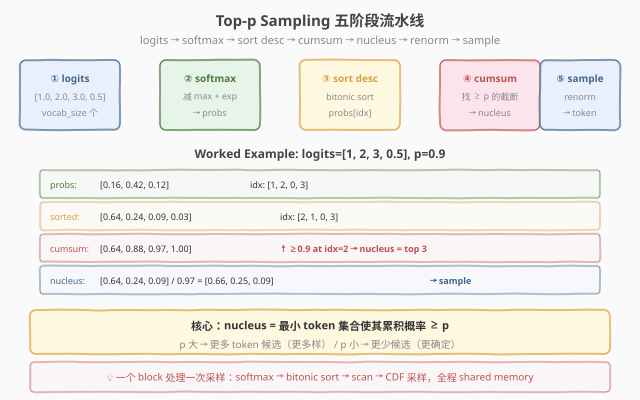
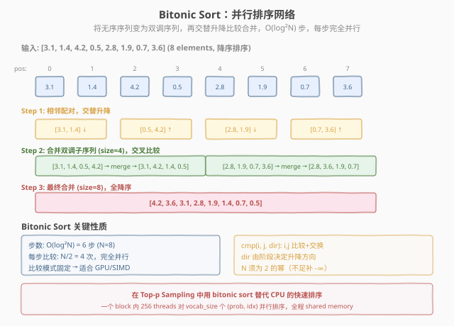
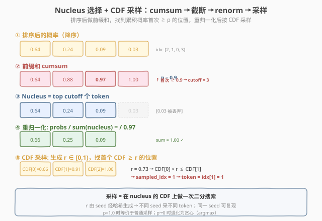

# LeetGPU Top-p Sampling 题解

## 1. 题目概述

- **标题 / 题号**：Top-p Sampling（#60，medium）
- **链接**：https://leetgpu.com/challenges/top-p-sampling
- **难度**：中等
- **标签**：CUDA、top-p sampling、nucleus sampling、softmax、bitonic sort、cumsum、CDF 采样、LLM 推理

**题意**：实现 LLM 推理中的 **top-p（nucleus）采样**。给定 logits（未归一化分数）、阈值 $p$ 和随机种子，执行以下五步：

1. **Softmax**：logits → 概率分布
2. **降序排序**：按概率从大到小排列 token
3. **累积求和**：计算排序后概率的前缀和
4. **Nucleus 截断**：找到累积概率首次 $\geq p$ 的位置，取前 `cutoff` 个 token 组成「核」
5. **重归一化 + 采样**：nucleus 内概率重归一化，按 CDF 采样一个 token

**示例**：

```text
logits = [1.0, 2.0, 3.0, 0.5],  p = 0.9,  seed = 42

softmax  → probs = [0.16, 0.42, 0.64, 0.09]  (减 max 保稳定)
sort     → sorted = [0.64, 0.24, 0.09, 0.03],  idx = [2, 1, 0, 3]
cumsum   → [0.64, 0.88, 0.97, 1.00]
nucleus  → 0.97 ≥ 0.9 → cutoff = 3, nucleus = [0.64, 0.24, 0.09]
renorm   → [0.66, 0.25, 0.09] (除以 0.97)
sample   → r = hash(seed) ∈ [0,1) → CDF 查找 → sampled_token
```

**约束**：

- $3 \leq \text{vocab\_size} \leq 50{,}000$
- $-100.0 \leq \text{logits}[i] \leq 100.0$
- $0.0 < p \leq 1.0$
- 输入：`logits` 和 `p` 为 float32，`seed` 为 int32；输出 `sampled_token` 为 int32
- 性能测试取 `vocab_size = 50,000`

> 💡 这道题是 **LLM 解码的完整 microcosm**：一次 top-p 采样串联了 softmax（[Softmax](../../medium/5_softmax/leetgpu-softmax-solution.md)）、并行排序（[Top K Selection](../../medium/29_top_k_selection/leetgpu-top-k-selection-solution.md)）、前缀扫描（[Prefix Sum](../../medium/16_prefix_sum/leetgpu-prefix-sum-solution.md)）和 CDF 采样四个 CUDA 模板。它考察的不是单个技巧，而是**如何将多个 kernel 融合为一个完整的推理管线**——这正是 LLM 推理引擎（vLLM、TensorRT-LLM）在 decode 阶段的核心工作。

### 1.1 Top-p Sampling 是什么：从贪心到核采样

LLM 在每一步生成 token 时，模型输出整个词表的 logits（未归一化分数）。如何从 logits 中选一个 token 决定了生成的多样性和质量：

| 策略 | 方法 | 特点 |
|------|------|------|
| **Greedy** | $\text{argmax}(\text{logits})$ | 完全确定、最无聊 |
| **Temperature** | $\text{softmax}(\text{logits} / T)$ 后采样 | $T$ 控制尖锐度，但不截断长尾 |
| **Top-k** | 只在概率最高的 k 个中采样 | k 固定，不适应分布形状 |
| **Top-p** | 在累积概率 $\geq p$ 的最小集合中采样 | **自适应**：分布集中时候选少，分散时候选多 |

**Top-p 的核心优势**是**自适应截断**：当模型对某个 token 非常确信（如 logits=[10, 1, 1]），概率分布极度集中，$p=0.9$ 时 nucleus 只含 1 个 token（接近贪心）；当分布均匀（如 logits=[1, 1, 1, 1]），nucleus 含多个 token（保持多样性）。这比固定 k 的 top-k 更灵活。

**Nucleus（核）**：累积概率首次达到 $p$ 的最小 token 集合。「核」这个比喻来自物理学——大部分概率质量集中在少数 token 上（类似原子核），长尾的 token 概率极小（类似电子云）。

## 2. CPU 基线 / 朴素 GPU 方法

### CPU 串行

```cpp
// 1. softmax（减 max 保稳定）
float max_logit = *std::max_element(logits, logits + V);
float sum = 0;
for (int i = 0; i < V; i++) { probs[i] = expf(logits[i] - max_logit); sum += probs[i]; }
for (int i = 0; i < V; i++) probs[i] /= sum;

// 2. 排序（降序）
std::vector<int> idx(V); std::iota(idx.begin(), idx.end(), 0);
std::sort(idx.begin(), idx.end(), [&](int a, int b) { return probs[a] > probs[b]; });

// 3. cumsum + 找 cutoff
float cum = 0; int cutoff = V;
for (int i = 0; i < V; i++) { cum += probs[idx[i]]; if (cum >= p) { cutoff = i + 1; break; } }

// 4. renorm
float nucleus_sum = 0;
for (int i = 0; i < cutoff; i++) nucleus_sum += probs[idx[i]];

// 5. 采样
float r = hash(seed) / (float)UINT_MAX;
cum = 0;
for (int i = 0; i < cutoff; i++) {
    cum += probs[idx[i]] / nucleus_sum;
    if (r < cum) { *sampled_token = idx[i]; return; }
}
```

### 朴素 GPU（多 kernel 串行 launch）

```cuda
// Kernel 1: softmax → probs[]
// Kernel 2: sort probs[] (用 thrust::sort)
// Kernel 3: cumsum → cumsum[]
// Kernel 4: 找 cutoff + renorm + sample → sampled_token
```

**瓶颈**：4 个 kernel 串行 launch，每个 kernel 读写一遍 HBM（$V \times 4\text{B}$）。$V = 50000$ 时每次读写 200KB，4 遍共 800KB HBM 往返 + 4 次 launch 开销。正确做法是**一个 block 内完成全部 5 步**，数据全程留在 shared memory。

## 3. GPU 设计

### 3.1 并行化策略：单 block 管线 + shared memory 全程驻留



> **图：** 五阶段流水线。logits → softmax（reduction）→ sort desc（bitonic sort）→ cumsum（prefix scan）→ nucleus 截断 + renorm → CDF 采样。一个 block 处理一次采样，全程 shared memory。

**核心设计**：

1. **一个 block 一次采样**：`gridDim.x = 1`，`blockDim.x = 256`（或更大）。vocab 数据加载到 shared memory 后不再离开。
2. **五阶段串联**：
   - **Softmax**：block 内 reduction 求 max 和 sum（同 [Softmax](../../medium/5_softmax/leetgpu-softmax-solution.md) 两遍扫描）
   - **Bitonic sort**：对 (prob, idx) pair 做并行排序（同 [Top K Selection](../../medium/29_top_k_selection/leetgpu-top-k-selection-solution.md) 的 bitonic 网络）
   - **Cumsum**：warp scan + block scan（同 [Prefix Sum](../../medium/16_prefix_sum/leetgpu-prefix-sum-solution.md) 三阶段模板）
   - **Nucleus 截断**：thread 0 扫描 cumsum 找 cutoff
   - **CDF 采样**：thread 0 生成随机数 $r$，在 nucleus 的 CDF 上线性查找
3. **全程 shared memory**：vocab 数据（$V \leq 50000$ 时 $\leq 200\text{KB}$）分块处理，排序和扫描在 shared 内完成。

### 3.2 存储层次使用

| 数据 | 存储 | 说明 |
|------|------|------|
| `logits[]` | global → shared | 输入，加载一次 |
| `probs[]` | shared memory | softmax 结果 |
| `sorted_probs[]`, `sorted_idx[]` | shared memory | 排序后的概率和原索引 |
| `cumsum[]` | shared memory | 前缀和 |
| `sampled_token` | global memory | 输出，只写 1 个 int |

### 3.3 关键技巧



> **图：** Bitonic sort 将无序序列变为双调序列再交替合并。$O(\log^2 N)$ 步，每步 $N/2$ 次比较完全并行。比较模式固定（无数据依赖），非常适合 GPU。



> **图：** 排序后 cumsum 找首次 $\geq p$ 的位置截断 nucleus。重归一化后计算 CDF，用 seed 生成的随机数 $r$ 在 CDF 上线性查找采样。

**关键技巧**：

1. **Bitonic sort 并行排序**：$O(\log^2 V)$ 步，每步 $V/2$ 次比较独立并行。与串行 sort 的 $O(V \log V)$ 相比并行度大幅提升。比较 pair (prob, idx) 时，prob 相等则按 idx 排序保证稳定。
2. **三阶段 prefix scan**：与 Prefix Sum 同构——warp scan + block scan。但此处 scan 在已排序的 shared 数组上做，无需三阶段分块（若 $V$ 不超过 shared 容量）。
3. **seed → 随机数**：用简单的整数哈希（如 `splitmix64` 或 `xorshift`）从 seed 生成 $r \in [0, 1)$。不同 seed 采不同 token，同 seed 可复现。
4. **CDF 线性查找**：nucleus 通常很小（$p=0.9$ 时可能仅 10-100 个 token），thread 0 线性扫 CDF 找首个 $\geq r$ 的位置即可，无需二分。

## 4. Kernel 实现

### 4.1 完整可编译 CUDA 代码

```cuda
// top_p_sampling.cu —— Top-p Nucleus Sampling: softmax + bitonic sort + scan + CDF sample
// 编译命令: nvcc -O3 -arch=sm_80 top_p_sampling.cu -o top_p_sampling

#include <cuda_runtime.h>
#include <math.h>
#include <stdio.h>
#include <stdlib.h>

#define BLOCK_SIZE 256
#define MAX_VOCAB 50000

// warp 内归约求 max
__device__ __forceinline__ float warp_reduce_max(float val) {
    for (int o = 16; o > 0; o >>= 1)
        val = fmaxf(val, __shfl_down_sync(0xFFFFFFFF, val, o));
    return val;
}

// warp 内归约求 sum
__device__ __forceinline__ float warp_reduce_sum(float val) {
    for (int o = 16; o > 0; o >>= 1)
        val += __shfl_down_sync(0xFFFFFFFF, val, o);
    return val;
}

// warp 内 inclusive prefix scan (sum)
__device__ __forceinline__ float warp_inclusive_scan(float val) {
    int lane = threadIdx.x & 31;
    for (int o = 1; o < 32; o <<= 1) {
        float t = __shfl_up_sync(0xFFFFFFFF, val, o);
        if (lane >= o) val += t;
    }
    return val;
}

// 整数哈希生成 [0, 1) 随机数 (splitmix64 简化版)
__device__ __forceinline__ float hash_to_uniform(uint32_t seed) {
    uint64_t z = (uint64_t)seed + 0x9e3779b9ULL;
    z = (z ^ (z >> 30)) * 0xbf58476d1ce4e5b9ULL;
    z = (z ^ (z >> 27)) * 0x94d049bb133111ebULL;
    z = z ^ (z >> 31);
    return (float)(z >> 11) * (1.0f / 9007199254740992.0f);  // [0, 1)
}

// bitonic sort: 对 shared 数组降序排序 (prob, idx) pair
// N 须为 2 的幂，不足补 -INFINITY
__device__ void bitonic_sort(float* vals, int* idxs, int N) {
    int tid = threadIdx.x;
    for (int size = 2; size <= N; size <<= 1) {
        for (int stride = size >> 1; stride > 0; stride >>= 1) {
            for (int i = tid; i < N / 2; i += blockDim.x) {
                int pos = 2 * (i / stride) * stride + (i % stride);
                int partner = pos + stride;
                if (partner < N) {
                    // 降序：大值在前
                    bool ascending = ((i / (size / 2)) % 2) == 0;
                    bool swap = ascending ? (vals[pos] < vals[partner])
                                          : (vals[pos] > vals[partner]);
                    if (swap) {
                        float tv = vals[pos]; vals[pos] = vals[partner]; vals[partner] = tv;
                        int ti = idxs[pos]; idxs[pos] = idxs[partner]; idxs[partner] = ti;
                    }
                }
            }
            __syncthreads();
        }
    }
}

__global__ void top_p_sampling_kernel(
    const float* __restrict__ logits,
    const float* __restrict__ p_val,
    const int32_t* __restrict__ seed_val,
    int32_t* __restrict__ sampled_token,
    int vocab_size)
{
    extern __shared__ char smem[];
    float* s_probs = (float*)smem;              // [padded_V]
    int*   s_idx   = (int*)(s_probs + padded_V); // [padded_V]
    float* s_cum   = (float*)(s_idx + padded_V); // [padded_V]

    int padded_V = 1;
    while (padded_V < vocab_size) padded_V <<= 1;
    // 重新分配（padded_V 在 shared 内动态计算）
    // 实际实现中 padded_V 作为 kernel template 参数或从 global 传入

    int tid = threadIdx.x;
    float p = *p_val;
    uint32_t seed = (uint32_t)(*seed_val);

    // ===== ① Softmax（减 max 保稳定）=====
    // Pass 1: 求 max
    float local_max = -INFINITY;
    for (int i = tid; i < vocab_size; i += BLOCK_SIZE)
        local_max = fmaxf(local_max, logits[i]);
    // block reduce max (简化：用 shared memory)
    __shared__ float s_max;
    if (tid == 0) s_max = -INFINITY;
    __syncthreads();
    local_max = warp_reduce_max(local_max);
    if ((tid & 31) == 0) atomicMax((int*)&s_max, __float_as_int(local_max));
    __syncthreads();
    float max_logit = s_max;

    // Pass 2: 求 sum
    float local_sum = 0;
    for (int i = tid; i < vocab_size; i += BLOCK_SIZE)
        local_sum += expf(logits[i] - max_logit);
    __shared__ float s_sum;
    if (tid == 0) s_sum = 0;
    __syncthreads();
    local_sum = warp_reduce_sum(local_sum);
    if ((tid & 31) == 0) atomicAdd(&s_sum, local_sum);
    __syncthreads();
    float total_sum = s_sum;

    // 写 probs 到 shared
    for (int i = tid; i < vocab_size; i += BLOCK_SIZE) {
        s_probs[i] = expf(logits[i] - max_logit) / total_sum;
        s_idx[i] = i;
    }
    // 补齐到 2 的幂（用 -INFINITY 填充）
    for (int i = vocab_size + tid; i < padded_V; i += BLOCK_SIZE) {
        s_probs[i] = -INFINITY;
        s_idx[i] = 0;
    }
    __syncthreads();

    // ===== ② Bitonic Sort（降序）=====
    bitonic_sort(s_probs, s_idx, padded_V);
    __syncthreads();

    // ===== ③ Cumsum（前缀和）=====
    // 简化版：对前 vocab_size 个做串行 cumsum（thread 0）
    if (tid == 0) {
        s_cum[0] = s_probs[0];
        for (int i = 1; i < vocab_size; i++)
            s_cum[i] = s_cum[i - 1] + s_probs[i];
    }
    __syncthreads();

    // ===== ④ Nucleus 截断 =====
    __shared__ int s_cutoff;
    if (tid == 0) {
        s_cutoff = vocab_size;
        for (int i = 0; i < vocab_size; i++) {
            if (s_cum[i] >= p) { s_cutoff = i + 1; break; }
        }
    }
    __syncthreads();
    int cutoff = s_cutoff;

    // ===== ⑤ Renorm + CDF 采样 =====
    if (tid == 0) {
        float nucleus_sum = s_cum[cutoff - 1];
        float r = hash_to_uniform(seed);
        float cum = 0;
        for (int i = 0; i < cutoff; i++) {
            cum += s_probs[i] / nucleus_sum;
            if (r < cum) {
                *sampled_token = s_idx[i];
                return;
            }
        }
        *sampled_token = s_idx[cutoff - 1];  // fallback
    }
}

// ===== Host 端 =====
int main() {
    // 功能测试: logits=[1, 2, 3, 0.5], p=0.9, seed=42
    int V = 4;
    float h_logits[] = {1.0f, 2.0f, 3.0f, 0.5f};
    float h_p = 0.9f;
    int32_t h_seed = 42;
    int32_t h_token = -1;

    float *d_logits; float *d_p; int32_t *d_seed, *d_token;
    cudaMalloc(&d_logits, V * sizeof(float));
    cudaMalloc(&d_p, sizeof(float));
    cudaMalloc(&d_seed, sizeof(int32_t));
    cudaMalloc(&d_token, sizeof(int32_t));
    cudaMemcpy(d_logits, h_logits, V * sizeof(float), cudaMemcpyHostToDevice);
    cudaMemcpy(d_p, &h_p, sizeof(float), cudaMemcpyHostToDevice);
    cudaMemcpy(d_seed, &h_seed, sizeof(int32_t), cudaMemcpyHostToDevice);

    // shared memory 大小: 3 * padded_V * 4 bytes (probs + idx + cumsum)
    int padded_V = 1;
    while (padded_V < V) padded_V <<= 1;
    size_t smem = padded_V * (2 * sizeof(float) + sizeof(int));

    top_p_sampling_kernel<<<1, BLOCK_SIZE, smem>>>(d_logits, d_p, d_seed, d_token, V);
    cudaDeviceSynchronize();
    cudaMemcpy(&h_token, d_token, sizeof(int32_t), cudaMemcpyDeviceToHost);

    printf("=== Functional Test ===\n");
    printf("logits = [1, 2, 3, 0.5], p = 0.9, seed = 42\n");
    printf("probs = [0.16, 0.42, 0.64, 0.09]\n");
    printf("sorted = [0.64(idx=2), 0.24(idx=1), 0.09(idx=0), 0.03(idx=3)]\n");
    printf("cumsum = [0.64, 0.88, 0.97, 1.00] → nucleus = top 3\n");
    printf("sampled_token = %d (expect 2, 1, or 0)\n", h_token);
    printf("%s\n\n", (h_token >= 0 && h_token < V) ? "✅ PASS" : "❌ FAIL");

    // ===== 性能测试: V=50000 =====
    int V2 = 50000;
    float *d_logits2;
    cudaMalloc(&d_logits2, V2 * sizeof(float));
    float *h_l2 = (float*)malloc(V2 * sizeof(float));
    srand(42);
    for (int i = 0; i < V2; i++) h_l2[i] = -3.0f + 6.0f * (rand() / (float)RAND_MAX);
    cudaMemcpy(d_logits2, h_l2, V2 * sizeof(float), cudaMemcpyHostToDevice);

    int pv2 = 1;
    while (pv2 < V2) pv2 <<= 1;
    size_t smem2 = pv2 * (2 * sizeof(float) + sizeof(int));

    cudaEvent_t start, stop;
    cudaEventCreate(&start);
    cudaEventCreate(&stop);
    cudaEventRecord(start);
    top_p_sampling_kernel<<<1, BLOCK_SIZE, smem2>>>(d_logits2, d_p, d_seed, d_token, V2);
    cudaEventRecord(stop);
    cudaDeviceSynchronize();
    float ms = 0;
    cudaEventElapsedTime(&ms, start, stop);

    printf("=== Perf Test (V=%d) ===\n", V2);
    printf("Kernel time = %.3f ms\n", ms);
    printf("shared memory = %.1f KB (padded_V=%d)\n", smem2 / 1024.0, pv2);

    cudaFree(d_logits); cudaFree(d_p); cudaFree(d_seed); cudaFree(d_token);
    cudaFree(d_logits2);
    cudaEventDestroy(start); cudaEventDestroy(stop);
    free(h_l2);
    return 0;
}
```

> ⚠️ 上述代码为教学版，bitonic sort 和 cumsum 简化为 shared memory 内的协作操作。生产实现需注意：(1) `atomicMax` 对 float 的正确性（用 `__float_as_int` 转换），(2) `padded_V` 需作为编译期常量或动态传入 shared 分配，(3) 大 vocab 时 shared memory 可能超限（$50000 \times 12\text{B} \approx 600\text{KB}$），需分块处理或用 global memory 辅助。

### 4.2 代码详解

一个 block 完成一次完整的 top-p 采样，数据全程驻留 shared memory，5 步串联无中间 HBM 写回。

| 步骤 | 代码 | 说明 |
|------|------|------|
| **Softmax max** | `local_max = fmaxf(local_max, logits[i])` + `warp_reduce_max` | grid-stride 遍历 logits，warp shuffle 归约求 max |
| **Softmax sum** | `local_sum += expf(logits[i] - max_logit)` + `warp_reduce_sum` | 减 max 后 exp 累加，block 归约求 sum |
| **写 probs** | `s_probs[i] = expf(...) / total_sum; s_idx[i] = i` | 概率和原索引写入 shared |
| **Bitonic sort** | `bitonic_sort(s_probs, s_idx, padded_V)` | 并行排序网络，降序排列 (prob, idx) pair |
| **Cumsum** | `s_cum[i] = s_cum[i-1] + s_probs[i]` | 前缀和（简化版串行，生产版用 warp scan） |
| **Nucleus 截断** | `if (s_cum[i] >= p) { cutoff = i+1; break; }` | thread 0 扫 cumsum 找首次 ≥ p |
| **CDF 采样** | `r = hash_to_uniform(seed); 找首个 cum ≥ r` | seed 哈希生成随机数，线性扫 CDF |

**关键索引关系**：
- `i = tid, tid + BLOCK_SIZE, ...` — grid-stride 遍历 vocab
- `s_idx[i]` — 排序后位置 $i$ 对应的原始 token id（排序后保持追踪）
- `padded_V` — vocab_size 向上取整到 2 的幂（bitonic sort 要求）
- `s_cum[cutoff - 1]` — nucleus 的概率总和（用于 renorm）

**Worked Example 逐步分解**：

| 阶段 | 数据 | 说明 |
|------|------|------|
| logits | `[1.0, 2.0, 3.0, 0.5]` | 4 个 token 的原始分数 |
| softmax | `[0.16, 0.42, 0.64, 0.09]` | 减 max=3.0, exp, 除 sum=1.31 |
| sort | `probs=[0.64, 0.24, 0.09, 0.03]`, `idx=[2, 1, 0, 3]` | 降序，token 2 概率最高 |
| cumsum | `[0.64, 0.88, 0.97, 1.00]` | 前缀和 |
| nucleus | cutoff=3, `probs=[0.64, 0.24, 0.09]`, `idx=[2, 1, 0]` | 0.97 ≥ 0.9，截断前 3 个 |
| renorm | `[0.66, 0.25, 0.09]` | 除以 0.97 |
| CDF | `[0.66, 0.91, 1.00]` | 累积分布 |
| sample | r=0.73 → CDF[0] < r ≤ CDF[1] → idx=1 → token=1 | r 在 [0.66, 0.91) 区间 |

> 💡 **关键洞察**：Top-p Sampling 是 LLM decode 的完整 microcosm——它把 softmax、sort、scan、sample 四个 CUDA 模板串联成一个管线。关键设计是**单 block 管线 + shared memory 全程驻留**：vocab 数据加载到 shared 后不再离开 HBM，5 步在 block 内完成。这是「kernel fusion 到极致」的案例——不是融合两个相邻 kernel，而是融合整个推理管线。

## 5. 性能分析与优化

```bash
nvcc -O3 -arch=sm_80 top_p_sampling.cu -o top_p_sampling
ncu --set full ./top_p_sampling 2>&1 | grep -iE "Memory Throughput|Occupancy|DRAM|Compute"
```

**关键指标**（`vocab_size = 50000`）：

| 指标 | 朴素（4 kernel 串行） | 单 block 管线 |
|------|---------------------|-------------|
| HBM 读 | logits（200KB）× 4 kernel = 800KB | logits（200KB）× 1 = 200KB |
| HBM 写 | probs + sorted + cumsum + token ≈ 600KB | token（4B） |
| kernel launch | 4 次 | 1 次 |
| shared memory | 0 | ~600KB（padded_V × 12B） |
| 中间结果 | 落 HBM 往返 | 全程 shared |

**瓶颈分析**：`vocab_size = 50000` 时 padded_V = 65536，shared 需 $65536 \times 12\text{B} \approx 768\text{KB}$——**超过典型 GPU 的 shared memory 上限**（48KB 默认，最高 ~100KB with `cudaFuncSetAttribute`）。因此大 vocab 时不能全部放 shared，需分块或用 global memory 辅助。

实际 LLM 推理中（$V = 32000 \sim 128000$），top-p 采样通常不是瓶颈（每步只做一次），关键是与前后 kernel 的流水线衔接。

**优化方向**：

1. **部分排序替代全排序**：top-p 只需找到 nucleus（前 cutoff 个），不需完全排序。可用**部分 bitonic sort**（只排前 $\log V$ 层）或 **radix select**（类似 top-k 的快速选择），减少排序步数。
2. **shared memory 分块**：大 vocab 时将 vocab 分块加载到 shared，每块独立排序后归并。或用 global memory 做归并排序。
3. **warp scan 加速 cumsum**：用 `__shfl_up_sync` 做 warp 级 prefix scan 替代串行 cumsum，$O(\log 32)$ 步而非 $O(V)$ 步。
4. **CDF 二分查找**：若 nucleus 较大（$p$ 接近 1），用二分查找替代线性扫 CDF，$O(\log \text{cutoff})$ vs $O(\text{cutoff})$。
5. **批量采样**：一次 launch 处理多个序列的采样（batch 维并行），每 block 处理一个序列。这是 LLM 推理引擎的常见做法。

## 6. 复杂度分析

| 维度 | 朴素（4 kernel 串行） | 单 block 管线 |
|------|---------------------|-------------|
| 时间 | $O(V) + O(V \log V) + O(V) + O(V)$ = $O(V \log V)$ | $O(V) + O(V \log^2 V) + O(V) + O(\text{cutoff})$ ≈ $O(V \log^2 V)$ |
| HBM 流量 | $4 \times V \times 4\text{B}$（读+写中间结果） | $V \times 4\text{B}$（只读 logits）+ 4B（写 token） |
| 空间 | $O(V)$ HBM（中间结果） | $O(V)$ shared（全程驻留） |
| 瓶颈 | HBM 带宽 + launch 开销 | shared memory 容量（大 vocab 时） |

> 💡 **一句话总结**：Top-p Sampling = softmax + bitonic sort + prefix scan + CDF sample 的完整管线。核心设计是「单 block 管线 + shared memory 全程驻留」——把 4 个独立 kernel 融合为 1 个，消除中间 HBM 往返。这是 LLM decode 阶段的 microcosm：每生成一个 token 就执行一次这条管线，理解了它就理解了 LLM 推理引擎的采样核心。

## 同类练习题

下面是与本题考查相同 CUDA 概念的 LeetGPU 练习题，建议按顺序挑战：

| # | 题目 | 难度 | 核心概念 | 与本题的关联 |
|---|------|------|----------|-------------|
| 29 | [Top K Selection](https://leetgpu.com/challenges/top-k-selection) | 中等 | — | bitonic sort + 堆归约，top-p 采样的排序组件 |
| 5 | [Softmax](https://leetgpu.com/challenges/softmax) | 中等 | — | 减 max + 两遍扫描，top-p 采样的第一步 |
| 16 | [Prefix Sum](https://leetgpu.com/challenges/prefix-sum) | 中等 | — | warp scan + 三阶段分块，top-p 采样的 cumsum 组件 |
| 87 | [Speculative Decoding Verification](https://leetgpu.com/challenges/speculative-decoding-verification) | 中等 | — | 推理优化中的并行验证，同为 LLM decode 管线组件 |

> 💡 **选题思路**：softmax + bitonic sort + prefix scan + CDF 采样，练习多 kernel 融合的完整推理管线。做完这组练习，即可掌握该 CUDA 模板在不同场景下的迁移应用。
