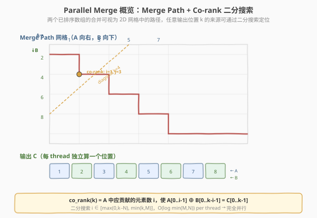
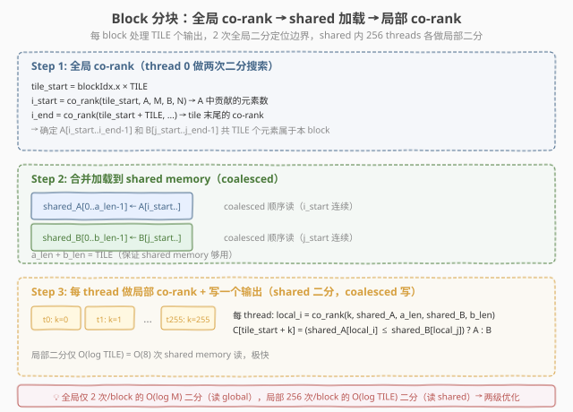
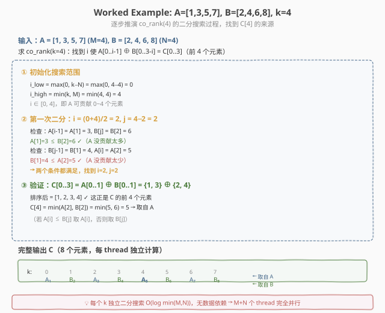

# LeetGPU Parallel Merge 题解

## 1. 题目概述

- **标题 / 题号**：Parallel Merge（#71，medium）
- **链接**：https://leetgpu.com/challenges/parallel-merge
- **难度**：中等
- **标签**：CUDA、parallel merge、co-rank、binary search、merge path

**题意**：给定两个已排序（非降序）的 `float32` 数组 $A$（长度 $M$）和 $B$（长度 $N$），合并为一个长度 $M + N$ 的已排序数组 $C$。

$$C = \text{merge}(A, B), \quad |C| = M + N, \quad C[0] \leq C[1] \leq \cdots \leq C[M+N-1]$$

**示例**：

```text
A = [1.0, 3.0, 5.0, 7.0],  M = 4
B = [2.0, 4.0, 6.0, 8.0],  N = 4
C = [1.0, 2.0, 3.0, 4.0, 5.0, 6.0, 7.0, 8.0]
```

**约束**：

- $1 \leq M, N \leq 50{,}000{,}000$
- $M + N \leq 50{,}000{,}000$
- 容差 `atol = rtol = 0.0`（精确匹配，浮点不允许误差）
- 性能测试取 $M = 25{,}000{,}000$, $N = 25{,}000{,}000$

> 💡 这道题是 **并行算法设计**的经典练习。串行归并（双指针）人人都会，但在 GPU 上把 $O(M+N)$ 的串行扫描变成 $O(\log \min(M,N))$ 的并行搜索，需要**重新思考合并的本质**——不是「从前往后扫」，而是「每个输出位置独立定位」。这就是 **Merge Path / Co-rank** 算法的核心思想。

### 1.1 Parallel Merge 是什么：从串行双指针到并行 co-rank

**串行归并**用两个指针 $i, j$ 分别扫描 $A$ 和 $B$，每次取较小者写入 $C$：

```text
i=0, j=0 → C[0]=min(A[0],B[0])=1 → i++
i=1, j=0 → C[1]=min(A[1],B[0])=2 → j++
i=1, j=1 → C[2]=min(A[1],B[1])=3 → i++
...  （严格串行，下一步依赖上一步）
```

**问题**：第 $k$ 步必须等前 $k-1$ 步完成才能知道 $i, j$ 的值——串行依赖。

**关键洞察**：合并两个有序数组等价于在 $M \times N$ 的二维网格上画一条**单调路径**（Merge Path）。路径上第 $k$ 步的位置 $(i, j)$（$i + j = k$）可以通过**二分搜索**独立确定，不需要从头扫描。

| 概念 | 串行归并 | 并行 co-rank |
|------|---------|-------------|
| 核心操作 | 双指针逐步前进 | 二分搜索定位 |
| 第 k 步依赖 | 依赖前 k-1 步 | **无依赖**，独立计算 |
| 时间复杂度 | $O(M + N)$ 串行 | $O(\log \min(M, N))$ per thread |
| 并行度 | 1 | $M + N$（每 thread 一个输出位置） |

**Co-rank 定义**：对输出位置 $k$，`co_rank(k)` 返回 $i$，表示 $A$ 中前 $i$ 个元素和 $B$ 中前 $j = k - i$ 个元素合起来正好是 $C$ 的前 $k$ 个元素。找到 $i$ 后：

$$C[k] = \begin{cases} A[i] & \text{if } A[i] \leq B[j] \\ B[j] & \text{otherwise} \end{cases}$$

## 2. CPU 基线 / 朴素 GPU 方法

### CPU 串行

```cpp
// 经典双指针归并，O(M+N)
int i = 0, j = 0;
while (i < M && j < N) {
    C[i + j] = (A[i] <= B[j]) ? A[i++] : B[j++];
}
while (i < M) C[i + j] = A[i++];
while (j < N) C[i + j] = B[j++];
```

### 朴素 GPU（一个 thread 串行归并）

```cuda
// 一个 thread 做全部——完全串行，比 CPU 还慢
__global__ void naive_merge(const float* A, const float* B, float* C, int M, int N) {
    if (threadIdx.x == 0 && blockIdx.x == 0) {
        int i = 0, j = 0;
        while (i < M && j < N)
            C[i + j] = (A[i] <= B[j]) ? A[i++] : B[j++];
        while (i < M) C[i + j] = A[i++];
        while (j < N) C[i + j] = B[j++];
    }
}
```

**瓶颈**：$M + N = 50{,}000{,}000$ 步串行，GPU 完全闲置。正确做法是让每个 thread 独立计算一个输出位置。

## 3. GPU 设计

### 3.1 并行化策略：Co-rank 二分搜索 + Block 分块



> **图：** Merge Path 网格。A 沿水平方向，B 沿垂直方向，红色路径是合并轨迹。对角线 $k=4$ 与路径的交点给出 co-rank $(i=1, j=3)$，即 $C[4]$ 的来源可独立确定。每个输出位置 $k$ 都可通过二分搜索找到对应的 $(i, j)$，无需串行扫描。

**核心设计**（两级 co-rank）：

1. **Block 分块**：输出 $C$ 分成若干 tile（每 tile `TILE=256` 个元素），一个 block 处理一个 tile。
2. **全局 co-rank**（每 block 2 次）：block 的 thread 0 对**完整数组** $A, B$ 做二分搜索，定位 tile 起止的 $(i_{\text{start}}, j_{\text{start}})$ 和 $(i_{\text{end}}, j_{\text{end}})$。这是 $O(\log \min(M, N))$ 次 global memory 读。
3. **Shared memory 加载**：将 $A[i_{\text{start}}..i_{\text{end}}-1]$ 和 $B[j_{\text{start}}..j_{\text{end}}-1]$ 合并加载到 shared memory（coalesced 顺序读）。
4. **局部 co-rank**（每 thread 1 次）：每个 thread 对 shared memory 中的小数组做二分搜索，定位自己的输出位置，写一个元素到 $C$（coalesced 顺序写）。

### 3.2 存储层次使用

| 数据 | 存储 | 说明 |
|------|------|------|
| $A$, $B$ | global memory | 输入数组，全局二分搜索 + tile 加载时读 |
| $C$ | global memory | 输出数组，每 thread 写 1 个元素 |
| `shared_A[TILE]`, `shared_B[TILE]` | shared memory | tile 内的 $A, B$ 片段，局部二分搜索用 |
| $i, j, k$ | register | thread 局部的 co-rank 值 |

### 3.3 关键技巧



> **图：** 两级优化。Step 1 全局二分（2 次/block，读 global）。Step 2 合并加载到 shared（coalesced）。Step 3 每 thread 局部二分（256 次/block，读 shared）。全局二分开销分摊到 256 个元素上，局部二分仅需 $O(\log \text{TILE}) = O(8)$ 次 shared memory 读。

**关键技巧**：

1. **Co-rank 二分搜索**：对输出位置 $k$，在 $i \in [\max(0, k-N), \min(k, M)]$ 范围内二分搜索，找到满足合并条件的 $i$。每次迭代比较 $A[i-1]$ vs $B[j]$ 和 $B[j-1]$ vs $A[i]$。
2. **两级 co-rank**：全局二分（$O(\log 25\text{M}) \approx 25$ 次 global 读）只在每 block 做 2 次，分摊到 256 个元素上。局部二分（$O(\log 256) = 8$ 次 shared 读）每 thread 做 1 次，极快。
3. **Coalesced 访问**：tile 内 $A, B$ 的加载是连续的（$i_{\text{start}}$ 到 $i_{\text{end}}$ 连续），$C$ 的写也是连续的（tile_start 到 tile_start+TILE）。
4. **精确匹配**：`atol = rtol = 0.0` 要求浮点精确相等。由于输入已是排序数组，合并时用 `<=` 比较（不用 `>`），保证相等元素的顺序一致（稳定归并）。

## 4. Kernel 实现

### 4.1 完整可编译 CUDA 代码

```cuda
// parallel_merge.cu —— Co-rank 二分搜索 + Block 分块并行归并
// 编译命令: nvcc -O3 -arch=sm_80 parallel_merge.cu -o parallel_merge

#include <cuda_runtime.h>
#include <stdio.h>
#include <stdlib.h>

#define TILE 256

// co-rank: 对输出位置 k，返回 A 中应贡献的元素数 i
// 二分搜索 i ∈ [max(0,k-N), min(k,M)]，使 A[0..i-1] ⊕ B[0..k-i-1] = C[0..k-1]
__device__ __forceinline__ int co_rank(int k, const float* A, int M,
                                       const float* B, int N) {
    int i_low = max(0, k - N);
    int i_high = min(k, M);
    while (i_low <= i_high) {
        int i = (i_low + i_high) >> 1;
        int j = k - i;
        if (i > 0 && j < N && A[i - 1] > B[j]) {
            i_high = i - 1;      // A 贡献太多，减小 i
        } else if (j > 0 && i < M && B[j - 1] > A[i]) {
            i_low = i + 1;       // A 贡献太少，增大 i
        } else {
            return i;            // 找到
        }
    }
    return i_low;
}

__global__ void parallel_merge_kernel(const float* __restrict__ A,
                                      const float* __restrict__ B,
                                      float* __restrict__ C,
                                      int M, int N) {
    int tile_start = blockIdx.x * TILE;
    int total = M + N;
    if (tile_start >= total) return;

    int tile_end = min(tile_start + TILE, total);

    // ===== Step 1: 全局 co-rank（定位 tile 边界）=====
    int i_start = co_rank(tile_start, A, M, B, N);
    int j_start = tile_start - i_start;
    int i_end   = co_rank(tile_end, A, M, B, N);
    int j_end   = tile_end - i_end;

    int a_len = i_end - i_start;
    int b_len = j_end - j_start;

    // ===== Step 2: 合并加载到 shared memory =====
    __shared__ float shared_A[TILE + 1];
    __shared__ float shared_B[TILE + 1];

    for (int t = threadIdx.x; t < a_len; t += blockDim.x)
        shared_A[t] = A[i_start + t];
    for (int t = threadIdx.x; t < b_len; t += blockDim.x)
        shared_B[t] = B[j_start + t];
    __syncthreads();

    // ===== Step 3: 每 thread 局部 co-rank + 写一个输出 =====
    int local_k = threadIdx.x;
    if (tile_start + local_k < total) {
        int local_i = co_rank(local_k, shared_A, a_len, shared_B, b_len);
        int local_j = local_k - local_i;
        float a_val = (local_i < a_len) ? shared_A[local_i] : INFINITY;
        float b_val = (local_j < b_len) ? shared_B[local_j] : INFINITY;
        C[tile_start + local_k] = (a_val <= b_val) ? a_val : b_val;
    }
}

int cmpfloat(const void* a, const void* b) {
    float fa = *(const float*)a, fb = *(const float*)b;
    return (fa > fb) - (fa < fb);
}

// ===== Host 端 =====
int main() {
    // 功能测试: A=[1,3,5,7], B=[2,4,6,8]
    int M = 4, N = 4;
    float h_A[] = {1.0f, 3.0f, 5.0f, 7.0f};
    float h_B[] = {2.0f, 4.0f, 6.0f, 8.0f};
    float h_C[8];

    float *d_A, *d_B, *d_C;
    cudaMalloc(&d_A, M * sizeof(float));
    cudaMalloc(&d_B, N * sizeof(float));
    cudaMalloc(&d_C, (M + N) * sizeof(float));
    cudaMemcpy(d_A, h_A, M * sizeof(float), cudaMemcpyHostToDevice);
    cudaMemcpy(d_B, h_B, N * sizeof(float), cudaMemcpyHostToDevice);

    int blocks = (M + N + TILE - 1) / TILE;
    parallel_merge_kernel<<<blocks, TILE>>>(d_A, d_B, d_C, M, N);
    cudaDeviceSynchronize();
    cudaMemcpy(h_C, d_C, (M + N) * sizeof(float), cudaMemcpyDeviceToHost);

    printf("=== Functional Test ===\n");
    printf("A = [1, 3, 5, 7], B = [2, 4, 6, 8]\n");
    printf("C = [");
    for (int i = 0; i < M + N; i++) printf("%.0f%s", h_C[i], i < M+N-1 ? ", " : "");
    printf("]\n");
    float ref[] = {1, 2, 3, 4, 5, 6, 7, 8};
    int pass = 1;
    for (int i = 0; i < M + N; i++)
        if (h_C[i] != ref[i]) pass = 0;
    printf("%s\n\n", pass ? "✅ PASS" : "❌ FAIL");

    // ===== 性能测试: M=N=25M =====
    int M2 = 25000000, N2 = 25000000;
    float *d_A2, *d_B2, *d_C2;
    cudaMalloc(&d_A2, (size_t)M2 * sizeof(float));
    cudaMalloc(&d_B2, (size_t)N2 * sizeof(float));
    cudaMalloc(&d_C2, (size_t)(M2 + N2) * sizeof(float));

    float *hA2 = (float*)malloc((size_t)M2 * sizeof(float));
    float *hB2 = (float*)malloc((size_t)N2 * sizeof(float));
    srand(42);
    for (int i = 0; i < M2; i++) hA2[i] = -1.0f + 2.0f * (rand() / (float)RAND_MAX);
    for (int i = 0; i < N2; i++) hB2[i] = -1.0f + 2.0f * (rand() / (float)RAND_MAX);
    // 排序
    qsort(hA2, M2, sizeof(float), (int(*)(const void*,const void*))cmpfloat);
    qsort(hB2, N2, sizeof(float), (int(*)(const void*,const void*))cmpfloat);

    cudaMemcpy(d_A2, hA2, (size_t)M2 * sizeof(float), cudaMemcpyHostToDevice);
    cudaMemcpy(d_B2, hB2, (size_t)N2 * sizeof(float), cudaMemcpyHostToDevice);

    cudaEvent_t start, stop;
    cudaEventCreate(&start);
    cudaEventCreate(&stop);
    int blocks2 = (M2 + N2 + TILE - 1) / TILE;
    cudaEventRecord(start);
    parallel_merge_kernel<<<blocks2, TILE>>>(d_A2, d_B2, d_C2, M2, N2);
    cudaEventRecord(stop);
    cudaDeviceSynchronize();

    float ms = 0;
    cudaEventElapsedTime(&ms, start, stop);
    printf("=== Perf Test (M=%d, N=%d) ===\n", M2, N2);
    printf("Blocks = %d, TILE = %d\n", blocks2, TILE);
    printf("Kernel time = %.3f ms\n", ms);
    size_t bytes = ((size_t)M2 + N2 + (M2 + N2)) * sizeof(float);
    printf("Data traffic = %.2f MB (read A+B + write C)\n", bytes / 1e6);
    printf("Effective bandwidth = %.2f GB/s\n", bytes / (ms * 1e6));

    cudaFree(d_A); cudaFree(d_B); cudaFree(d_C);
    cudaFree(d_A2); cudaFree(d_B2); cudaFree(d_C2);
    cudaEventDestroy(start); cudaEventDestroy(stop);
    free(hA2); free(hB2);
    return 0;
}
```

> ⚠️ 上方 `qsort` 用到 `cmpfloat` 比较函数，编译时需补充：`int cmpfloat(const void* a, const void* b) { float fa=*(const float*)a, fb=*(const float*)b; return (fa>fb)-(fa<fb); }`。Kernel 本身不依赖它。

### 4.2 代码详解

每个 block 处理 $C$ 中连续的 `TILE=256` 个元素，通过两级 co-rank（全局定位 + 局部搜索）实现并行归并。

| 步骤 | 代码 | 说明 |
|------|------|------|
| **tile 定位** | `tile_start = blockIdx.x * TILE` | block 到输出位置的映射 |
| **全局 co-rank** | `i_start = co_rank(tile_start, A, M, B, N)` | 二分搜索 tile 起始位置在 $A$ 中的对应下标 |
| **tile 边界** | `i_end = co_rank(tile_end, ...)` | 二分搜索 tile 结束位置，确定 $A, B$ 各贡献多少 |
| **shared 加载** | `shared_A[t] = A[i_start + t]` | 256 threads 协作加载，coalesced 顺序读 |
| **`__syncthreads`** | 加载后 | 确保 shared memory 数据就绪 |
| **局部 co-rank** | `local_i = co_rank(local_k, shared_A, a_len, shared_B, b_len)` | thread 在 shared 中二分搜索自己的位置 |
| **写输出** | `C[tile_start + local_k] = (a_val <= b_val) ? a_val : b_val` | 取较小者写入，coalesced 顺序写 |

**关键索引关系**：
- `tile_start = blockIdx.x * TILE` — block 到 $C$ 中输出区间的映射
- `i_start = co_rank(tile_start, ...)` — tile 起始在 $A$ 中的 co-rank（全局二分）
- `local_k = threadIdx.x` — thread 在 tile 内的位置（0~255）
- `local_i = co_rank(local_k, shared_A, ...)` — thread 在 shared 中的 co-rank（局部二分）

**Co-rank 二分搜索的正确性**：



> **图：** 以 $A=[1,3,5,7]$, $B=[2,4,6,8]$, $k=4$ 为例。初始化 $i \in [0, 4]$。第一次二分 $i=2, j=2$：检查 $A[1]=3 \leq B[2]=6$ ✓ 且 $B[1]=4 \leq A[2]=5$ ✓ → 找到 $i=2$。$C[4] = \min(A[2], B[2]) = \min(5, 6) = 5$ → 取自 $A$。

**二分搜索的两个条件**：

| 条件 | 含义 | 不满足时的动作 |
|------|------|--------------|
| `A[i-1] <= B[j]` | $A$ 没贡献太多（$A$ 的最后一个 $\leq B$ 的下一个） | $i$ 太大，`i_high = i - 1` |
| `B[j-1] <= A[i]` | $A$ 没贡献太少（$B$ 的最后一个 $\leq A$ 的下一个） | $i$ 太小，`i_low = i + 1` |
| 两者都满足 | $i$ 正确，$A[0..i-1] \oplus B[0..j-1]$ 是前 $k$ 小 | 返回 $i$ |

> 💡 **关键洞察**：Parallel Merge 的本质是**把串行的「逐步前进」变成并行的「随机访问定位」**。串行归并中，第 $k$ 步的 $(i, j)$ 依赖前 $k-1$ 步的累积；而 co-rank 利用有序性，直接用二分搜索独立定位 $(i, j)$。这是「**用计算换并行**」的经典范例——多做了 $O(\log N)$ 次比较，换来了完全并行。

## 5. 性能分析与优化

```bash
nvcc -O3 -arch=sm_80 parallel_merge.cu -o parallel_merge
ncu --set full ./parallel_merge 2>&1 | grep -iE "Memory Throughput|Occupancy|DRAM|Compute"
```

**关键指标**（$M = N = 25{,}000{,}000$）：

| 指标 | 朴素（单 thread） | Co-rank 分块 |
|------|-----------------|-------------|
| 并行度 | 1 thread | $(M+N)/\text{TILE} \approx 195\text{K}$ blocks × 256 threads |
| 每 thread 工作 | $M+N$ 步串行 | 8 次局部二分 + 1 次全局二分摊 |
| HBM 读 | $A + B$ 顺序（100MB + 100MB） | 同（coalesced） |
| HBM 写 | $C$ 顺序（200MB） | 同（coalesced） |
| shared memory | 0 | $2 \times \text{TILE} \times 4\text{B} = 2\text{KB}$/block |

**瓶颈分析**：总 HBM 流量 $= (M + N) \times 4 \times 3 = 600\text{MB}$（读 $A$ + 读 $B$ + 写 $C$）。典型 GPU HBM 带宽 $>500\text{ GB/s}$，理论下界 $\approx 1.2\text{ ms}$。实际若测得 $2\text{-}4\text{ ms}$，带宽利用率约 $15\text{-}30\%$——**memory-bound**。

主要开销不在二分搜索（shared 上的 8 次比较极快），而在 HBM 读写带宽。全局 co-rank 的 $O(\log 25\text{M}) \approx 25$ 次随机 global 读每 block 仅 2 次，分摊到 256 个元素上可忽略。

**优化方向**：

1. **增大 TILE**：`TILE=512` 或 `1024` 减少全局 co-rank 次数（更多元素分摊 2 次二分）。但 shared memory 占用增大（$2 \times 1024 \times 4 = 8\text{KB}$），需权衡 occupancy。
2. **float4 向量化加载**：每 thread 一次读 4 个 float，减少 memory transaction 数量。但 co-rank 定位是逐元素的，向量化只能用于 shared 加载阶段。
3. **多元素/thread**：每 thread 处理 $E$ 个输出元素（grid-stride），减少 thread 数量、降低调度开销。但每 thread 仍需 1 次局部 co-rank。
4. **串行归并 tile 内部**：不用局部 co-rank，而是用串行双指针归并 shared 中的数据。当 $a\_len, b\_len$ 都较小时，串行归并的 cache 局部性可能优于多次二分搜索。但需要线程协作和同步，实现更复杂。
5. **稳定归并**：用 `<=` 而非 `<` 比较，保证 $A, B$ 中相等元素的相对顺序。本题 `atol=rtol=0` 要求精确匹配，相等元素的处理需与参考实现一致。

## 6. 复杂度分析

| 维度 | 朴素（单 thread） | Co-rank 分块 |
|------|-----------------|-------------|
| 时间 | $O(M + N)$ 串行 | $O(\frac{M+N}{P} \cdot \log \text{TILE} + \frac{M+N}{\text{TILE}} \cdot \log \min(M,N))$ |
| 空间 | $O(1)$ | $O(\text{TILE})$ shared/block |
| HBM 流量 | $3(M+N) \times 4$B | 同左（coalesced 读写） |
| 算术强度 | $\sim 1$ 比较 / 12B = $0.08$ | $\sim 10$ 比较 / 12B = $0.83$（含二分搜索） |
| 瓶颈 | 串行（无并行） | DRAM 带宽（memory-bound） |

> 💡 **一句话总结**：Parallel Merge = Co-rank 二分搜索 + Block 分块。核心是**把串行的双指针扫描变成每个输出位置独立的二分搜索**——用 $O(\log N)$ 次比较换取完全并行。两级 co-rank（全局定位 + 局部搜索）将全局随机访问降到每 block 仅 2 次，其余在 shared memory 上完成。这是「merge sort GPU 化」的基础组件，也是数据库查询引擎中 sort-merge join 的核心原语。

## 同类练习题

下面是与本题考查相同 CUDA 概念的 LeetGPU 练习题，建议按顺序挑战：

| # | 题目 | 难度 | 核心概念 | 与本题的关联 |
|---|------|------|----------|-------------|
| 29 | [Top K Selection](https://leetgpu.com/challenges/top-k-selection) | 中等 | — | bitonic 排序 + 堆归约，同为并行排序/选择类算法 |
| 15 | [Sorting](https://leetgpu.com/challenges/sorting) | 困难 | — | 通用并行排序，parallel merge 是 merge sort 的核心组件 |
| 16 | [Prefix Sum](https://leetgpu.com/challenges/prefix-sum) | 中等 | — | warp scan + 三阶段分块，同「把串行变并行」的思路 |
| 36 | [Radix Sort](https://leetgpu.com/challenges/radix-sort) | 困难 | — | 按位 histogram + scan 排序，另一种并行排序范式 |

> 💡 **选题思路**：co-rank 二分搜索 + Block 分块，练习并行归并这一核心模板。做完这组练习，即可掌握该 CUDA 模板在不同场景下的迁移应用。
