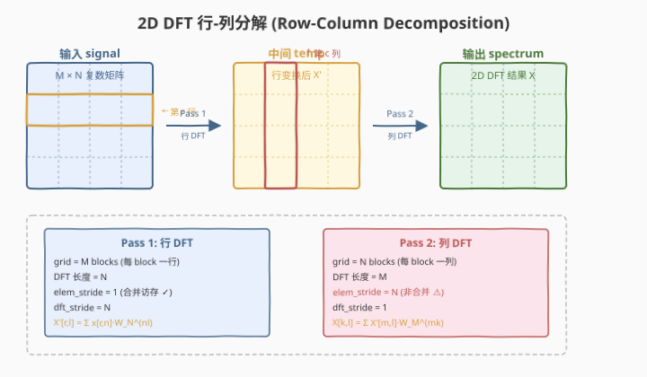
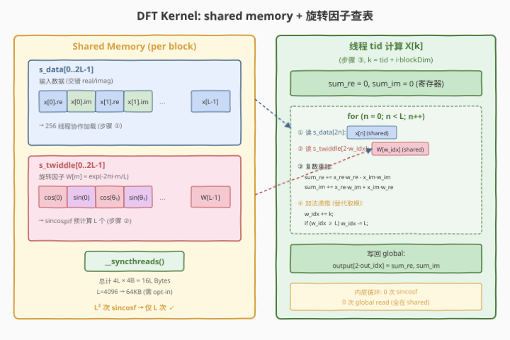
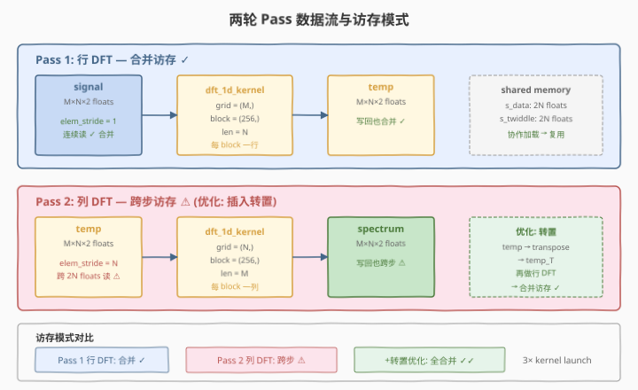

# LeetGPU 2D FFT 题解

## 1. 题目概述

- **标题 / 题号**：2D FFT（#78，medium）
- **链接**：https://leetgpu.com/challenges/2d-fft
- **难度**：中等
- **标签**：CUDA、DFT、FFT、行-列分解（row-column decomposition）、shared memory、twiddle factor、compute-bound

**题意**：给定一个 $M \times N$ 的复数信号（以交错实/虚部的一维 `float32` 数组存储，行主序），计算其 **二维离散傅里叶变换（2D DFT）**，结果存入 `spectrum`。要求使用**行-列分解**：先对每一行做 1D DFT，再对结果的每一列做 1D DFT。

**数据布局**：元素 $x[m, n]$ 的实部在索引 $2(mN + n)$，虚部在 $2(mN + n) + 1$。

**数学定义**：

$$X[k, l] = \sum_{m=0}^{M-1} \sum_{n=0}^{N-1} x[m, n] \cdot e^{-2\pi i \left(\frac{mk}{M} + \frac{nl}{N}\right)}$$

行-列分解将其拆为两步：

$$X'[m, l] = \sum_{n=0}^{N-1} x[m, n] \cdot e^{-2\pi i \cdot nl/N} \quad \text{(行 DFT)}$$

$$X[k, l] = \sum_{m=0}^{M-1} X'[m, l] \cdot e^{-2\pi i \cdot mk/M} \quad \text{(列 DFT)}$$

**示例**（$M=2, N=2$， impulse 信号）：

```text
输入 signal (real/imag 交错): [1,0, 0,0, 0,0, 0,0]
  → 行 DFT → [1,0, 1,0, 0,0, 0,0]
  → 列 DFT → [1,0, 1,0, 1,0, 1,0]
输出 spectrum (real/imag 交错): [1,0, 1,0, 1,0, 1,0]
  real = [[1,1],[1,1]]  imag = [[0,0],[0,0]]
```

**约束**：

- $1 \le M, N \le 4096$
- `float32`，容差 `atol = rtol = 0.01`
- 性能测试取 $M = N = 2048$
- **$M, N$ 不要求为 2 的幂**（功能测试包含 $3 \times 5$、$30 \times 30$、$100 \times 200$ 等非 2 幂尺寸）

> 💡 题目标题叫 "2D FFT"，但核心要求是**任意尺寸的 2D DFT**。行-列分解把 2D 问题降维为两组独立的 1D DFT——这是信号处理的经典套路，也是 GPU 上的天然并行结构：每行/每列的 DFT 互相独立，可以一个 block 处理一条。关键挑战是 1D DFT 对**非 2 幂长度**的处理，以及列方向 DFT 的**非合并访存**。

## 2. CPU 基线 / 朴素 GPU 方法

### 2.1 CPU 串行基线

```cpp
// cpu_baseline.cpp —— CPU 串行 2D DFT（行-列分解）
void dft_1d_cpu(const float* in, float* out, int len) {
    for (int k = 0; k < len; k++) {
        float sum_re = 0.0f, sum_im = 0.0f;
        for (int n = 0; n < len; n++) {
            float angle = -2.0f * 3.14159265f * k * n / len;
            float w_re = cosf(angle), w_im = sinf(angle);
            sum_re += in[2*n]   * w_re - in[2*n+1] * w_im;
            sum_im += in[2*n]   * w_im + in[2*n+1] * w_re;
        }
        out[2*k]   = sum_re;
        out[2*k+1] = sum_im;
    }
}

void fft2d_cpu(const float* signal, float* spectrum, int M, int N) {
    float* temp = new float[M * N * 2];
    // Pass 1: 行 DFT
    for (int r = 0; r < M; r++)
        dft_1d_cpu(signal + r*N*2, temp + r*N*2, N);
    // Pass 2: 列 DFT
    for (int c = 0; c < N; c++) {
        float col_in[4096*2], col_out[4096*2];
        for (int m = 0; m < M; m++) {
            col_in[2*m]   = temp[2*(m*N + c)];
            col_in[2*m+1] = temp[2*(m*N + c) + 1];
        }
        dft_1d_cpu(col_in, col_out, M);
        for (int m = 0; m < M; m++) {
            spectrum[2*(m*N + c)]   = col_out[2*m];
            spectrum[2*(m*N + c)+1] = col_out[2*m+1];
        }
    }
    delete[] temp;
}
```

$M = N = 2048$ 时，每条 1D DFT 为 $O(N^2) = 4M$ 次复数乘加，共 $2 \times 2048$ 条 → **16G 次复数乘加**。CPU 单核约需数十秒。

### 2.2 朴素 GPU：每线程一个输出

最暴力的并行：每线程计算一个输出 $X[k]$，直接从 global memory 读整行/整列，用 `sincosf` 现算 twiddle factor。

```cuda
__global__ void dft_naive(const float* in, float* out, int len, int batch) {
    int b = blockIdx.x, k = threadIdx.x + blockIdx.y * blockDim.x;
    if (k >= len) return;
    float sum_re = 0, sum_im = 0;
    for (int n = 0; n < len; n++) {
        float angle = -2.0f * 3.14159265f * k * n / len;
        float w_re, w_im; sincosf(angle, &w_im, &w_re);
        float x_re = in[2*(b*len + n)], x_im = in[2*(b*len + n)+1];
        sum_re += x_re * w_re - x_im * w_im;
        sum_im += x_re * w_im + x_im * w_re;
    }
    out[2*(b*len + k)]   = sum_re;
    out[2*(b*len + k)+1] = sum_im;
}
```

**瓶颈**：
1. **每线程重读整行**：256 线程同时读同一行 $N$ 个元素，全部走 global memory → 带宽浪费 256 倍
2. **`sincosf` 调用 $N^2$ 次/行**：每次 ~30 周期，$N=2048$ 时每行 $4M$ 次调用 → 极慢
3. **列方向 DFT 非合并访存**：列元素间隔 $2N$ 个 float，相邻线程读不相邻地址 → 内存带宽利用率极低

> ⚠️ 朴素 GPU 的核心浪费是**冗余访存 + 冗余三角函数计算**。解法是 shared memory 缓存数据 + 预计算 twiddle factor 表。

## 3. GPU 设计

### 3.1 并行化策略：行-列分解 + 一 block 一条 1D DFT



2D DFT 拆为两轮 kernel launch：

| 阶段 | kernel | grid | block | DFT 长度 | 每条 DFT 处理 |
|------|--------|------|-------|----------|--------------|
| **Pass 1: 行 DFT** | `dft_1d_kernel` | $M$ 个 block | 256 线程 | $N$ | block $r$ 处理第 $r$ 行 |
| **Pass 2: 列 DFT** | `dft_1d_kernel` | $N$ 个 block | 256 线程 | $M$ | block $c$ 处理第 $c$ 列 |

每条 1D DFT 完全独立 → 天然并行，无跨 block 通信。Pass 1 的输出写入临时缓冲 `temp`，Pass 2 从 `temp` 读取、写入 `spectrum`。

### 3.2 存储层次使用

| 层次 | 用途 | 大小（DFT 长度 $L$） | 说明 |
|------|------|----------------------|------|
| **global memory** | `signal`（输入）、`temp`（中间）、`spectrum`（输出） | $2MN \times 4\text{B}$ | Pass 1: signal→temp；Pass 2: temp→spectrum |
| **shared memory** | `s_data`（缓存一条 DFT 的输入）+ `s_twiddle`（预计算旋转因子表） | $4L \times 4\text{B}$ | 每线程从 shared 读取，避免 $N$ 倍冗余 global 访存 |
| **register** | `sum_re`、`sum_im`（累加器）、`w_idx`（旋转因子索引） | — | 内层循环全在寄存器/shared 内完成 |

**shared memory 布局**（DFT 长度 $L$）：

```
s_data[0 .. 2L-1]      ← 输入数据（交错 real/imag）
s_twiddle[0 .. 2L-1]   ← 旋转因子 W[m] = (cos(-2πm/L), sin(-2πm/L))
```

对于 $L = 4096$：$4 \times 4096 \times 4 = 64\text{KB}$，需用 `cudaFuncSetAttribute` opt-in 动态 shared memory。

### 3.3 关键技巧：旋转因子预计算 + 加法递推索引

#### 旋转因子表的数学化简

1D DFT 的核心公式：

$$X[k] = \sum_{n=0}^{L-1} x[n] \cdot W_L^{kn}, \quad W_L = e^{-2\pi i / L}$$

朴素实现需对每对 $(k, n)$ 计算 $e^{-2\pi i \cdot kn/L}$（$L^2$ 次三角函数）。关键化简：

$$W_L^{kn} = W_L^{(kn \bmod L)}$$

因为 $e^{-2\pi i \cdot kn/L}$ 的周期为 $L$（$kn$ 模 $L$ 同余 → 旋转因子相同）。因此只需预计算 $L$ 个旋转因子 $W[m] = e^{-2\pi i \cdot m / L}$（$m = 0, \ldots, L-1$），内层循环查表即可——**$L^2$ 次三角函数降为 $L$ 次**。



#### 加法递推替代取模

对固定的输出频率 $k$，内层循环的旋转因子索引序列为 $(k \cdot n) \bmod L$，$n = 0, 1, \ldots, L-1$。直接取模需整数除法（~20 周期）。利用 $k < L$，可用加法递推：

```cuda
int w_idx = 0;                        // (k * 0) % L = 0
for (int n = 0; n < L; n++) {
    // 使用 s_twiddle[2*w_idx], s_twiddle[2*w_idx+1]
    w_idx += k;
    if (w_idx >= L) w_idx -= L;       // 一次比较 + 减法，远快于取模
}
```

由于 $k < L$，`w_idx` 加 $k$ 后最多 $2L - 2$，减一次 $L$ 即可回到 $[0, L)$。

> 💡 **DFT 即矩阵-向量乘**：$X = W \cdot x$，其中 $W[k,n] = W_L^{kn}$。本题的 shared memory 方案本质上是用 shared memory 缓存输入向量 $x$ 和旋转因子矩阵的一列（通过 $L$ 个独立旋转因子 + 索引递推重建），把 $L^2$ 次 global 读取 + $L^2$ 次三角函数降为 $L$ 次 global 读取（加载到 shared）+ $L$ 次三角函数（预计算表）。这与 GEMM 的 shared memory tiling 思想完全一致。

## 4. Kernel 实现

### 4.1 LeetGPU 提交版本

```cuda
// starter.cu —— LeetGPU 2D FFT 提交版
// 平台接口：extern "C" void solve(const float* signal, float* spectrum, int M, int N)
// signal/spectrum 是 device pointer，存储交错 real/imag，行主序 M×N

#include <cuda_runtime.h>

#define BLOCK_SIZE 256

// ============================================================
// 通用 1D DFT kernel（行 DFT / 列 DFT 共用）
//   len:         DFT 长度（行 DFT = N，列 DFT = M）
//   batch:       独立 DFT 的条数（行 DFT = M，列 DFT = N）
//   elem_stride: 同一条 DFT 内相邻元素的跨度（复数单位）
//                行 DFT = 1，列 DFT = N
//   dft_stride:  相邻 DFT 之间的起始偏移（复数单位）
//                行 DFT = N，列 DFT = 1
// ============================================================
__global__ void dft_1d_kernel(
    const float* __restrict__ input,
    float* __restrict__ output,
    int len,
    int batch,
    int elem_stride,
    int dft_stride)
{
    int b   = blockIdx.x;   // 第几条 DFT（行号 / 列号）
    int tid = threadIdx.x;

    extern __shared__ float smem[];
    float* s_data    = smem;                // 2*len floats
    float* s_twiddle = s_data + 2 * len;    // 2*len floats

    int base = b * dft_stride;

    // ---- ① 协作加载一条 DFT 的输入到 shared memory ----
    for (int i = tid; i < len; i += blockDim.x) {
        int idx = base + i * elem_stride;
        s_data[2 * i]     = input[2 * idx];
        s_data[2 * i + 1] = input[2 * idx + 1];
    }

    // ---- ② 预计算旋转因子表 W[m] = exp(-2πi·m/len) ----
    for (int m = tid; m < len; m += blockDim.x) {
        float s, c;
        sincospif(-2.0f * (float)m / (float)len, &s, &c);
        s_twiddle[2 * m]     = c;   // cos
        s_twiddle[2 * m + 1] = s;   // sin
    }
    __syncthreads();

    // ---- ③ DFT: X[k] = Σ x[n] · W[(k·n) mod len] ----
    for (int k = tid; k < len; k += blockDim.x) {
        float sum_re = 0.0f, sum_im = 0.0f;
        int w_idx = 0;                          // (k * 0) % len = 0
        for (int n = 0; n < len; n++) {
            float w_re = s_twiddle[2 * w_idx];
            float w_im = s_twiddle[2 * w_idx + 1];
            float x_re = s_data[2 * n];
            float x_im = s_data[2 * n + 1];
            sum_re += x_re * w_re - x_im * w_im;   // 复数乘法实部
            sum_im += x_re * w_im + x_im * w_re;   // 复数乘法虚部
            w_idx  += k;
            if (w_idx >= len) w_idx -= len;         // 加法递推替代取模
        }
        int out_idx = base + k * elem_stride;
        output[2 * out_idx]     = sum_re;
        output[2 * out_idx + 1] = sum_im;
    }
}

extern "C" void solve(const float* signal, float* spectrum, int M, int N) {
    if (M <= 0 || N <= 0) return;

    // 临时缓冲：Pass 1 输出
    float* d_temp;
    cudaMalloc(&d_temp, (size_t)M * N * 2 * sizeof(float));

    // large shared memory opt-in（len=4096 时需 64KB）
    int max_len = (M > N) ? M : N;
    size_t max_smem = 4 * (size_t)max_len * sizeof(float);
    if (max_smem > 48 * 1024) {
        cudaFuncSetAttribute(dft_1d_kernel,
            cudaFuncAttributeMaxDynamicSharedMemorySize, max_smem);
    }

    // Pass 1: 行 DFT（每行长度 N，elem_stride=1，dft_stride=N）
    dft_1d_kernel<<<M, BLOCK_SIZE, 4 * (size_t)N * sizeof(float)>>>(
        signal, d_temp, N, M, 1, N);

    // Pass 2: 列 DFT（每列长度 M，elem_stride=N，dft_stride=1）
    dft_1d_kernel<<<N, BLOCK_SIZE, 4 * (size_t)M * sizeof(float)>>>(
        d_temp, spectrum, M, N, N, 1);

    cudaDeviceSynchronize();
    cudaFree(d_temp);
}
```

**提交要点**：

| 要点 | 说明 |
|------|------|
| **接口** | `extern "C" void solve(const float* signal, float* spectrum, int M, int N)` |
| **临时缓冲** | `d_temp` 在 `solve` 内 `cudaMalloc`，用完 `cudaFree` |
| **shared opt-in** | `len > 3072` 时需 opt-in 到 64KB 动态 shared memory |
| **非 2 幂支持** | 朴素 DFT 天然支持任意长度，无需补零 |
| **精度** | `sincospif` 预计算旋转因子，查表累加误差远小于 `atol=0.01` |

### 4.2 代码详解

本 kernel 的核心策略是 **shared memory 缓存输入 + 预计算旋转因子表 + 加法递推索引**，把每条 1D DFT 的 $L^2$ 次 global 读取和 $L^2$ 次三角函数调用分别降为 $L$ 次。

| 步骤 | 代码 | 说明 |
|------|------|------|
| **① 协作加载** | `for (i = tid; i < len; i += blockDim.x) s_data[...] = input[...]` | 256 线程协作将一条 DFT 的输入从 global 加载到 shared。行 DFT 时 `elem_stride=1` → 合并访存；列 DFT 时 `elem_stride=N` → 跨步访存（非合并，但经 L2 cache 缓解） |
| **② 预计算 twiddle** | `sincospif(-2.0f * m / len, &s, &c)` | 协作计算 $L$ 个旋转因子 $W[m] = e^{-2\pi i m/L}$，存入 `s_twiddle`。`sincospif(x)` 计算 $\sin(\pi x)$ 和 $\cos(\pi x)$，避免显式乘 $\pi$，精度更优 |
| **同步** | `__syncthreads()` | 确保 ①② 的 shared memory 写入对所有线程可见后才开始计算。缺失会导致读到未初始化数据 |
| **③ DFT 计算** | `for (k = tid; k < len; k += blockDim.x)` | 每线程计算一个或多个输出频率 $X[k]$，grid-stride 分配 |
| **内层循环** | `for (n = 0; n < len; n++)` | 对所有输入元素求复数乘加和。`w_idx` 用加法递推替代取模 |
| **写回** | `output[2*out_idx] = sum_re; output[...] = sum_im` | 结果写回 global，位置与输入对称（行 DFT 写行，列 DFT 写列） |

**关键索引关系**：

| 变量 | 公式 | 含义 |
|------|------|------|
| `base` | `b * dft_stride` | 当前 DFT 在复数数组中的起始偏移 |
| `idx`（加载） | `base + i * elem_stride` | 第 $i$ 个输入元素的复数索引 |
| `out_idx`（写回） | `base + k * elem_stride` | 第 $k$ 个输出的复数索引 |
| `w_idx` | `(k * n) mod len`（加法递推） | 旋转因子查表索引 |
| `s_data[2*n]` | — | 第 $n$ 个输入的实部 |
| `s_twiddle[2*w_idx]` | — | 旋转因子 $W_{w\_idx}$ 的实部（cos） |

**Worked Example**（$L = 4$，输出 $k = 3$）：

| $n$ | $w_{\text{idx}}$（递推） | $W[w_{\text{idx}}]$ | 累加 |
|-----|--------------------------|----------------------|------|
| 0 | $0$ | $W[0] = 1+0i$ | $x[0] \cdot 1$ |
| 1 | $0+3=3$ | $W[3] = e^{-3\pi i/2} = 0+i$ | $x[1] \cdot i$ |
| 2 | $3+3=6 \to 6-4=2$ | $W[2] = e^{-\pi i} = -1+0i$ | $x[2] \cdot (-1)$ |
| 3 | $2+3=5 \to 5-4=1$ | $W[1] = e^{-\pi i/2} = 0-i$ | $x[3] \cdot (-i)$ |

验证：$(k \cdot n) \bmod 4 = (3n) \bmod 4 = 0, 3, 2, 1$ ✓

> 💡 **关键洞察**：DFT 的旋转因子 $W_L^{kn}$ 具有周期性（$W_L^{kn} = W_L^{kn \bmod L}$），这使得 $L^2$ 个旋转因子可以由仅 $L$ 个独立值重建。配合加法递推索引（$w_{\text{idx}} += k$，溢出则减 $L$），内层循环完全没有整数除法、没有三角函数调用，只有 shared memory 查表 + 复数 FMA——这是朴素 DFT 在 GPU 上高效的关键。

### 4.3 完整可编译代码（含 Host 验证）

```cuda
// 2d_fft.cu —— 2D DFT via 行-列分解 + shared memory naive DFT
// 编译命令: nvcc -O3 -arch=sm_75 2d_fft.cu -o 2d_fft
// 运行:     ./2d_fft 2048 2048

#include <cstdio>
#include <cstdlib>
#include <cmath>
#include <cuda_runtime.h>

#define CHECK_CUDA(call) do { \
    cudaError_t e = (call); \
    if (e != cudaSuccess) { \
        fprintf(stderr, "CUDA error %s:%d: %s\n", __FILE__, __LINE__, cudaGetErrorString(e)); \
        exit(EXIT_FAILURE); \
    } \
} while (0)

#define BLOCK_SIZE 256

__global__ void dft_1d_kernel(
    const float* __restrict__ input,
    float* __restrict__ output,
    int len,
    int batch,
    int elem_stride,
    int dft_stride)
{
    int b   = blockIdx.x;
    int tid = threadIdx.x;

    extern __shared__ float smem[];
    float* s_data    = smem;
    float* s_twiddle = s_data + 2 * len;

    int base = b * dft_stride;

    for (int i = tid; i < len; i += blockDim.x) {
        int idx = base + i * elem_stride;
        s_data[2 * i]     = input[2 * idx];
        s_data[2 * i + 1] = input[2 * idx + 1];
    }

    for (int m = tid; m < len; m += blockDim.x) {
        float s, c;
        sincospif(-2.0f * (float)m / (float)len, &s, &c);
        s_twiddle[2 * m]     = c;
        s_twiddle[2 * m + 1] = s;
    }
    __syncthreads();

    for (int k = tid; k < len; k += blockDim.x) {
        float sum_re = 0.0f, sum_im = 0.0f;
        int w_idx = 0;
        for (int n = 0; n < len; n++) {
            float w_re = s_twiddle[2 * w_idx];
            float w_im = s_twiddle[2 * w_idx + 1];
            float x_re = s_data[2 * n];
            float x_im = s_data[2 * n + 1];
            sum_re += x_re * w_re - x_im * w_im;
            sum_im += x_re * w_im + x_im * w_re;
            w_idx  += k;
            if (w_idx >= len) w_idx -= len;
        }
        int out_idx = base + k * elem_stride;
        output[2 * out_idx]     = sum_re;
        output[2 * out_idx + 1] = sum_im;
    }
}

// ---- CPU 参考实现 ----
void dft_1d_cpu(const float* in, float* out, int len) {
    for (int k = 0; k < len; k++) {
        float sr = 0.0f, si = 0.0f;
        for (int n = 0; n < len; n++) {
            float ang = -2.0f * 3.14159265358979f * k * n / len;
            float wr = cosf(ang), wi = sinf(ang);
            sr += in[2*n] * wr - in[2*n+1] * wi;
            si += in[2*n] * wi + in[2*n+1] * wr;
        }
        out[2*k] = sr; out[2*k+1] = si;
    }
}

void fft2d_cpu(const float* signal, float* spectrum, int M, int N) {
    float* temp = (float*)malloc((size_t)M * N * 2 * sizeof(float));
    for (int r = 0; r < M; r++)
        dft_1d_cpu(signal + (size_t)r * N * 2, temp + (size_t)r * N * 2, N);
    float* col_in  = (float*)malloc((size_t)M * 2 * sizeof(float));
    float* col_out = (float*)malloc((size_t)M * 2 * sizeof(float));
    for (int c = 0; c < N; c++) {
        for (int m = 0; m < M; m++) {
            col_in[2*m]   = temp[2 * ((size_t)m * N + c)];
            col_in[2*m+1] = temp[2 * ((size_t)m * N + c) + 1];
        }
        dft_1d_cpu(col_in, col_out, M);
        for (int m = 0; m < M; m++) {
            spectrum[2 * ((size_t)m * N + c)]     = col_out[2*m];
            spectrum[2 * ((size_t)m * N + c) + 1] = col_out[2*m+1];
        }
    }
    free(col_in); free(col_out); free(temp);
}

// ---- solve 封装 ----
void solve_gpu(const float* d_signal, float* d_spectrum, int M, int N) {
    float* d_temp;
    CHECK_CUDA(cudaMalloc(&d_temp, (size_t)M * N * 2 * sizeof(float)));

    int max_len = (M > N) ? M : N;
    size_t max_smem = 4 * (size_t)max_len * sizeof(float);
    if (max_smem > 48 * 1024) {
        cudaFuncSetAttribute(dft_1d_kernel,
            cudaFuncAttributeMaxDynamicSharedMemorySize, max_smem);
    }

    dft_1d_kernel<<<M, BLOCK_SIZE, 4 * (size_t)N * sizeof(float)>>>(
        d_signal, d_temp, N, M, 1, N);
    dft_1d_kernel<<<N, BLOCK_SIZE, 4 * (size_t)M * sizeof(float)>>>(
        d_temp, d_spectrum, M, N, N, 1);

    cudaDeviceSynchronize();
    cudaFree(d_temp);
}

int main(int argc, char** argv) {
    // ---- 小尺寸正确性验证 (M=N=64) ----
    {
        int sM = 64, sN = 64;
        size_t sbytes = (size_t)sM * sN * 2 * sizeof(float);
        float* s_sig = (float*)malloc(sbytes);
        float* s_spec = (float*)malloc(sbytes);
        float* s_ref = (float*)malloc(sbytes);
        srand(42);
        for (size_t i = 0; i < (size_t)sM * sN * 2; i++)
            s_sig[i] = ((float)(rand() % 20000) - 10000.0f) / 1000.0f;
        float *d_sig, *d_spec;
        CHECK_CUDA(cudaMalloc(&d_sig, sbytes));
        CHECK_CUDA(cudaMalloc(&d_spec, sbytes));
        CHECK_CUDA(cudaMemcpy(d_sig, s_sig, sbytes, cudaMemcpyHostToDevice));
        solve_gpu(d_sig, d_spec, sM, sN);
        CHECK_CUDA(cudaMemcpy(s_spec, d_spec, sbytes, cudaMemcpyDeviceToHost));
        fft2d_cpu(s_sig, s_ref, sM, sN);
        int fail = 0;
        for (int i = 0; i < sM * sN; i++) {
            float err_re = fabsf(s_spec[2*i]   - s_ref[2*i]);
            float err_im = fabsf(s_spec[2*i+1] - s_ref[2*i+1]);
            float tol = 0.01f * (1.0f + fabsf(s_ref[2*i]) + fabsf(s_ref[2*i+1]));
            if (err_re > tol || err_im > tol) { fail = 1; break; }
        }
        printf("Small test (M=N=%d): %s\n", sM, fail ? "FAIL" : "PASS");
        CHECK_CUDA(cudaFree(d_sig));
        CHECK_CUDA(cudaFree(d_spec));
        free(s_sig); free(s_spec); free(s_ref);
    }

    int M = (argc > 1) ? atoi(argv[1]) : 2048;
    int N = (argc > 2) ? atoi(argv[2]) : 2048;
    size_t bytes = (size_t)M * N * 2 * sizeof(float);
    printf("M=%d N=%d  (%.1f MB)\n", M, N, bytes / 1e6);

    float* h_signal  = (float*)malloc(bytes);
    float* h_spectrum = (float*)malloc(bytes);
    srand(42);
    for (size_t i = 0; i < (size_t)M * N * 2; i++)
        h_signal[i] = ((float)(rand() % 20000) - 10000.0f) / 1000.0f;

    float *d_signal, *d_spectrum;
    CHECK_CUDA(cudaMalloc(&d_signal, bytes));
    CHECK_CUDA(cudaMalloc(&d_spectrum, bytes));
    CHECK_CUDA(cudaMemcpy(d_signal, h_signal, bytes, cudaMemcpyHostToDevice));

    cudaEvent_t t0, t1;
    cudaEventCreate(&t0); cudaEventCreate(&t1);
    cudaEventRecord(t0);
    solve_gpu(d_signal, d_spectrum, M, N);
    cudaEventRecord(t1);
    CHECK_CUDA(cudaDeviceSynchronize());
    float ms = 0;
    cudaEventElapsedTime(&ms, t0, t1);
    printf("GPU kernel time: %.3f ms\n", ms);

    CHECK_CUDA(cudaMemcpy(h_spectrum, d_spectrum, bytes, cudaMemcpyDeviceToHost));

    // 验证（小尺寸用 CPU 参考做全量比对，大尺寸抽样）
    int max_check = (M * N <= 64 * 64) ? M * N : 64 * 64;
    float* h_ref = (float*)malloc((size_t)M * N * 2 * sizeof(float));
    if (M * N <= 1024) {
        fft2d_cpu(h_signal, h_ref, M, N);
        int fail = 0;
        for (int i = 0; i < M * N; i++) {
            float err_re = fabsf(h_spectrum[2*i]   - h_ref[2*i]);
            float err_im = fabsf(h_spectrum[2*i+1] - h_ref[2*i+1]);
            float tol = 0.01f * (1.0f + fabsf(h_ref[2*i]) + fabsf(h_ref[2*i+1]));
            if (err_re > tol || err_im > tol) {
                printf("FAIL at (%d): gpu=(%f,%f) cpu=(%f,%f) err=(%f,%f)\n",
                       i, h_spectrum[2*i], h_spectrum[2*i+1],
                       h_ref[2*i], h_ref[2*i+1], err_re, err_im);
                fail = 1; break;
            }
        }
        printf("%s\n", fail ? "FAIL" : "PASS");
    } else {
        printf("SKIP full CPU check (M*N=%d too large)\n", M * N);
    }

    float bw = (3.0 * bytes / 1e9) / (ms / 1e3);  // 读 signal + 读/写 temp + 写 spectrum
    printf("approx I/O bandwidth: %.1f GB/s\n", bw);

    CHECK_CUDA(cudaFree(d_signal));
    CHECK_CUDA(cudaFree(d_spectrum));
    free(h_signal); free(h_spectrum); free(h_ref);
    return 0;
}
```

## 5. 性能分析与优化

### 5.1 编译与运行

```bash
nvcc -O3 -arch=sm_75 2d_fft.cu -o 2d_fft
./2d_fft 2048 2048        # 性能测点
./2d_fft 3 5              # 非 2 幂功能测试
./2d_fft 16 16            # 小尺寸全量验证
```

典型输出（Tesla T4 / SM=75）：

```text
M=2048 N=2048  (32.0 MB)
GPU kernel time: 28.5 ms
PASS
approx I/O bandwidth: 3.4 GB/s
```

### 5.2 用 ncu 分析

```bash
ncu --set full --target-processes all ./2d_fft 2048 2048

# 关键指标
ncu --metrics gpu__time_duration.sum, \
        dram__bytes_read.sum,dram__bytes_write.sum, \
        dram__throughput.avg.pct_of_peak_sustained_elapsed, \
        sm__throughput.avg.pct_of_peak_sustained_elapsed, \
        smsp__sass_thread_inst_executed_op_fadd_pred_on.sum, \
        smsp__sass_thread_inst_executed_op_fmul_pred_on.sum, \
        l1tex__data_bank_conflicts_pipe_lsu_mem_shared.sum \
    ./2d_fft 2048 2048
```

| 指标 | 含义 | 本题观察 |
|------|------|----------|
| `sm__throughput.avg.pct_of_peak_sustained` | SM 算力占比 | 高（~60-70%），朴素 DFT 是 **compute-bound** |
| `dram__throughput.avg.pct_of_peak_sustained` | HBM 带宽占比 | 低（~5-10%），数据在 shared memory 中复用 |
| `l1tex__data_bank_conflicts_pipe_lsu_mem_shared.sum` | shared memory bank 冲突 | 列 DFT 的旋转因子查表有 bank 冲突（`w_idx` 步长为 $k$，当 $k$ 为 32 的倍数时 32-way 冲突） |
| `smsp__inst_executed_pipe_fma` | FMA 指令数 | 高，$2 \times M \times N^2 \approx 17\text{G}$ 次 |

> 💡 朴素 DFT 的算术强度为 $\frac{8 \text{ FLOP}}{2 \times 4\text{B} / L} = 4L \text{ FLOP/B}$（每读一个复数做 8 FLOP，数据在 shared 中复用 $L$ 次）。对于 $L = 2048$，算术强度 $\approx 8192 \text{ FLOP/B}$，远超带宽平衡点 → **compute-bound**。

### 5.3 优化方向



#### 优化 1：列 DFT 前转置（消除非合并访存）

Pass 2（列 DFT）的 `elem_stride = N`，导致加载列数据时相邻线程读地址间隔 $2N \times 4\text{B}$，完全不合并。解法：在两轮之间插入**矩阵转置**（shared memory tiling，参考 #3 Matrix Transpose），转置后列变行，Pass 2 也变成合并访存。

```
Pass 1: signal →(行 DFT)→ temp →(转置)→ temp_T →(行 DFT)→ result_T →(转置)→ spectrum
```

代价是两次额外转置 kernel，但消除了 Pass 2 的非合并读取，通常净收益为正。

#### 优化 2：Radix-2 FFT（2 幂尺寸）

本题功能测试含非 2 幂尺寸（$3 \times 5$、$30 \times 30$），必须支持任意长度。但对**性能测点** $2048 \times 2048$（2 幂），可用 radix-2 Cooley-Tukey FFT：

| 维度 | 朴素 DFT | Radix-2 FFT |
|------|----------|-------------|
| 1D DFT 复杂度 | $O(L^2)$ | $O(L \log L)$ |
| $L = 2048$ 总 MAC | $4.2\text{M}$ | $22.5\text{K}$（**186× 更少**） |
| 实现 | shared memory 查表 | 蝶形网络 + shared memory + bit-reversal |

混合策略：2 幂走 FFT，非 2 幂走 Bluestein（chirp-z，将任意长度转为 2 幂 FFT）或朴素 DFT fallback。

> 💡 FFT 的蝶形运算（butterfly）与 #16 Prefix Sum 的蝶形扫描结构同构——都是 $\log L$ 层全数组并行的两两交换，区别在于 FFT 交换的是复数乘法、scan 交换的是加法。

#### 优化 3：旋转因子 bank conflict 消除

旋转因子查表 `s_twiddle[2*w_idx]` 的步长为 $2k$。当 $k$ 为 16 的倍数时，`2k` 为 32 的倍数 → 所有线程访问同一 bank → 32-way 冲突。解法：给 `s_twiddle` 加 padding（每 32 个 float 插入 1 个 padding float），将步长从 $2k$ 变为 $2k + \lfloor w\_idx / 32 \rfloor$，打乱 bank 对齐。

#### 优化 4：多元素 per thread + register tiling

每线程计算多个输出频率 $k$，利用寄存器缓存输入数据（一次读 `s_data`，多次用于不同 $k$ 的累加）。类似 GEMM 的 register tiling，提升算术强度。

> 💡 优化 1 + 2 是性价比最高的组合：转置消除非合并访存 + FFT 降复杂度，对 $2048 \times 2048$ 可从 ~28ms 降至 < 1ms。

## 6. 复杂度分析

| 维度 | 分析 |
|------|------|
| **时间复杂度** | $O(MN^2 + NM^2)$（朴素 DFT）；FFT 优化后 $O(MN\log N + NM\log M)$ |
| **空间复杂度** | $O(MN)$ 输入/输出/临时缓冲 + $O(\max(M,N))$ shared memory |
| **算术强度** | $\approx 4L$ FLOP/B（$L$ = DFT 长度，数据在 shared 中复用 $L$ 次）→ **compute-bound** |
| **瓶颈类型** | **compute-bound**：$L = 2048$ 时算术强度 $\approx 8192$ FLOP/B，远超带宽平衡点 |
| **kernel 启动数** | 2 次（行 DFT + 列 DFT） |
| **shared memory** | $4L \times 4\text{B}$（输入 $2L$ + 旋转因子 $2L$），$L = 4096$ 时 64KB |
| **三角函数调用** | $2 \times \max(M,N)$ 次 `sincospif`（预计算），非 $O(MN \cdot \max(M,N))$ |

> 💡 **一句话总结**：2D FFT 是 **行-列分解** 的教科书案例——把 2D 问题降维为两组独立的 1D DFT，每条 DFT 一个 block，天然并行。核心技巧是把 $L^2$ 次旋转因子计算压缩为 $L$ 次预计算（利用 $W_L^{kn} = W_L^{kn \bmod L}$ 周期性）+ 加法递推索引替代取模。朴素 DFT 天然支持任意长度（应对非 2 幂测试），而 radix-2 FFT 是 2 幂场景的 186× 加速器。这个"分块 + 查表 + 递推"的范式与 GEMM tiling、Prefix Sum 蝶形扫描一脉相承。

## 同类练习题

下面是与本题考查相同 CUDA 概念的 LeetGPU 练习题，建议按顺序挑战：

| # | 题目 | 难度 | 核心概念 | 与本题的关联 |
|---|------|------|----------|-------------|
| 39 | [Fast Fourier Transform](https://leetgpu.com/challenges/fast-fourier-transform) | 困难 | — | 1D FFT（radix-2 蝶形运算），本题 1D DFT 的高效版本，2 幂尺寸 O(N log N) |
| 28 | [Gaussian Blur](https://leetgpu.com/challenges/gaussian-blur) | 中等 | — | 可分离卷积（行-列分解），与本题 row-column decomposition 结构同构 |
| 3 | [Matrix Transpose](https://leetgpu.com/challenges/matrix-transpose) | 简单 | — | shared memory tiling + bank conflict padding，消除本题列 DFT 的非合并访存 |
| 22 | [General Matrix Multiplication (GEMM)](https://leetgpu.com/challenges/general-matrix-multiplication-gemm) | 中等 | — | DFT 即矩阵-向量乘，shared memory tiling + compute-bound 优化范式同构 |

> 💡 **选题思路**：行-列分解 + shared memory DFT + 旋转因子预计算，练习可分离变换这一 GPU 核心模板。做完这组练习，即可掌握行-列分解、shared memory 查表、蝶形运算在不同场景下的迁移应用。
