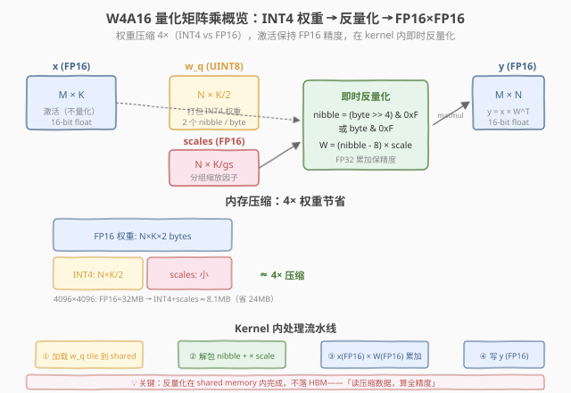
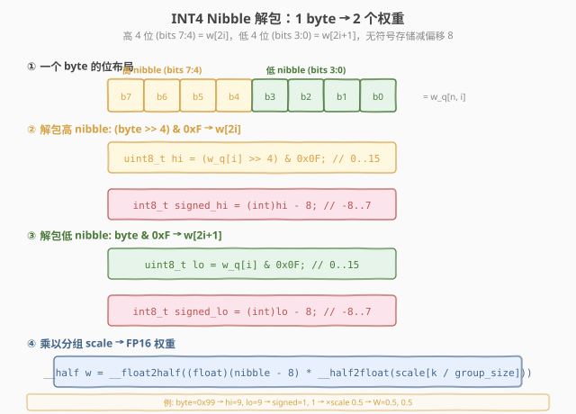
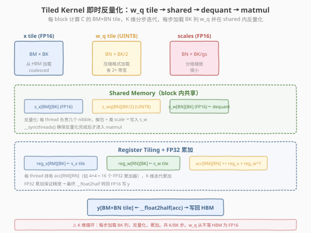

# LeetGPU INT4 Weight-Only Quantized MatMul 题解

## 1. 题目概述

- **标题 / 题号**：INT4 Weight-Only Quantized MatMul（#81，medium）
- **链接**：https://leetgpu.com/challenges/int4-matmul
- **难度**：中等
- **标签**：CUDA、INT4 量化、W4A16、nibble 打包、group-wise dequant、FP16、LLM 推理

**题意**：实现 **W4A16**（Weight 4-bit, Activation 16-bit）量化矩阵乘法，这是 GPTQ/AWQ 等 LLM 推理加速的核心 kernel。给定 FP16 激活矩阵 $x$（$M \times K$）和 **INT4 打包存储**的权重矩阵 $w_q$（$N \times K/2$ bytes），计算 $y = x \times W^T$（$M \times N$）。

**INT4 打包格式**：每个 byte 存储 2 个 INT4 权重——高 4 位（bits 7:4）存 $w[n, 2i]$，低 4 位（bits 3:0）存 $w[n, 2i+1]$。INT4 无符号存储范围 $[0, 15]$，偏移 8 后得到有符号值 $[-8, 7]$。

**分组反量化**：每 `group_size` 个连续权重共享一个 FP16 scale：

$$W[n, k] = (\text{nibble}[n, k] - 8) \times \text{scale}[n, k / \text{group\_size}]$$

**示例**（$M=2, N=4, K=4, \text{group\_size}=2$）：

```text
x (FP16) = [[1, 0, 1, 0], [0, 1, 0, 1]]
w_q (UINT8) = [[0x99, 0x99], [0xAA, 0xAA], [0x77, 0x77], [0x88, 0x88]]
  → W_int4 = [[1,1,1,1], [2,2,2,2], [-1,-1,-1,-1], [0,0,0,0]]
scales (FP16) = 0.5 (全部)
  → W_dequant = [[0.5,0.5,0.5,0.5], [1,1,1,1], [-0.5,-0.5,-0.5,-0.5], [0,0,0,0]]
y = x × W^T = [[1, 2, -1, 0], [1, 2, -1, 0]]
```

**约束**：

- $1 \leq M, N, K \leq 8192$
- $K$ 可被 2 和 `group_size` 整除
- `group_size` $\in \{2, 4, 8, 16, 32, 64, 128\}$
- 输入：`x` 和 `scales` 为 FP16，`w_q` 为 UINT8；输出 `y` 为 FP16
- 容差 `atol = rtol = 0.01`
- 性能测试取 $M = N = K = 4096$, `group_size = 128`

> 💡 这道题是 **INT8 量化 GEMM**（[#32](../../medium/32_int8_quantized_matmul/leetgpu-int8-quantized-matmul-solution.md)）的进阶版。INT4 比 INT8 再压缩 2×，但带来一个全新挑战：**权重以 nibble（4-bit）打包在 byte 中**，GPU 不能直接寻址 4-bit 数据，必须用位操作解包。核心设计决策是**在 kernel 内即时反量化**——从 HBM 读压缩的 INT4 数据到 shared memory，在 shared 内解包+缩放为 FP16，再做 matmul。这样 HBM 带宽需求降低 4×（权重部分），而计算精度不受影响。

### 1.1 W4A16 是什么：LLM 推理的权重压缩

在大语言模型（LLM）推理中，模型权重占用大量显存（如 70B 模型 FP16 需 ~140GB）。**Weight-only 量化**只压缩权重（W4A16：权重 4-bit，激活保持 16-bit），因为：

| 维度 | 权重 | 激活 |
|------|------|------|
| 访问模式 | 一次推理只读一次 | 可能被多次复用 |
| 精度敏感度 | 相对不敏感（离线量化） | 高（动态分布） |
| 占显存 | 绝大部分（>90%） | 少量 |
| 量化收益 | 4× 压缩显著省显存+带宽 | 收益小、精度损失大 |

**INT4 vs INT8 vs FP16**：

| 格式 | 每权重位数 | 权重内存（4096×4096） | 表示范围 |
|------|----------|---------------------|---------|
| FP16 | 16 bit | 32 MB | $\pm 65504$ |
| INT8 | 8 bit | 16 MB | $[-128, 127]$ |
| **INT4** | **4 bit** | **8 MB** | $[-8, 7]$ |

**分组量化（Group-wise Quantization）**：整个矩阵用一个 scale 精度太低（per-tensor）；每行一个 scale 仍不够（per-channel）；每 `group_size` 个权重共享一个 scale 在精度和额外存储间取得平衡。`group_size=128` 时额外 scales 仅占权重的 $1/128 \times 2\text{B} \approx 1.6\%$。

## 2. CPU 基线 / 朴素 GPU 方法

### CPU 串行

```cpp
// 先全量反量化，再标准矩阵乘
for (int n = 0; n < N; n++)
    for (int k = 0; k < K; k++) {
        uint8_t byte = w_q[n * K/2 + k/2];
        int nibble = (k % 2 == 0) ? (byte >> 4) & 0xF : byte & 0xF;
        W[n][k] = (float)(nibble - 8) * scales[n * (K/gs) + k/gs];
    }
for (int m = 0; m < M; m++)
    for (int n = 0; n < N; n++) {
        float sum = 0;
        for (int k = 0; k < K; k++)
            sum += x[m][k] * W[n][k];
        y[m][n] = (__half)sum;
    }
```

### 朴素 GPU（先反量化再调 GEMM）

```cuda
// Kernel 1: 全量反量化 w_q → W_fp16（写回 HBM）
__global__ void dequant_kernel(const uint8_t* w_q, const __half* scales,
                                __half* W, int N, int K, int gs) {
    int n = blockIdx.x, k = threadIdx.x;
    if (k >= K) return;
    uint8_t byte = w_q[n * (K/2) + k/2];
    int nibble = (k % 2 == 0) ? (byte >> 4) & 0xF : byte & 0xF;
    float w = (float)(nibble - 8) * __half2float(scales[n * (K/gs) + k/gs]);
    W[n * K + k] = __float2half(w);
}
// Kernel 2: 标准 FP16 GEMM（x × W^T）
// ...
```

**瓶颈**：Kernel 1 将 $N \times K$ 的 FP16 矩阵 $W$ 写回 HBM（$32\text{MB}$ @ $4096^2$），Kernel 2 再读一遍。这 **$32\text{MB}$ 的 HBM 往返完全多余**——反量化结果可以留在 shared memory 直接用于 matmul。正确做法是**融合反量化与 GEMM**。

## 3. GPU 设计

### 3.1 并行化策略：Tiled GEMM + 即时反量化



> **图：** 权重以 INT4 打包存储（N×K/2 bytes），从 HBM 读取后即时反量化为 FP16，与 FP16 激活做矩阵乘。关键：反量化在 shared memory 内完成，不落 HBM——「读压缩数据，算全精度」。

**核心设计**：

1. **Tiled GEMM**：与 [GEMM](../../medium/22_gemm/leetgpu-gemm-solution.md) 和 [Batched MatMul](../../medium/30_batched_matrix_multiplication/leetgpu-batched-matrix-multiplication-solution.md) 同构——block 计算 $C$ 的 $\text{BM} \times \text{BN}$ tile，K 维分步迭代。
2. **即时反量化**：每步加载 BK 列的 $w_q$（INT4 打包，$N \times \text{BK}/2$ bytes）到 shared memory，在 shared 内解包 nibble + 乘 scale → FP16 权重 $s_w$。**不写回 HBM**。
3. **FP32 累加**：FP16 × FP16 用 FP32 累加（`__half2float` 后乘加），保证精度，最终转回 FP16 输出。
4. **Register tiling**：每 thread 持有 $\text{RM} \times \text{RN}$ 个 FP32 累加器，从 shared 读 tile 到 register 做乘加。

### 3.2 存储层次使用

| 数据 | 存储 | 说明 |
|------|------|------|
| `x` (FP16) | global → shared → register | 激活，每步加载 BK 列 |
| `w_q` (UINT8) | global → shared | 打包权重，每步加载 BK/2 bytes |
| `scales` (FP16) | global → register | 分组缩放，每 group 1 个 |
| `s_x[BM][BK]` | shared memory | 激活 tile |
| `s_wq[BN][BK/2]` | shared memory | 打包权重 tile（原始 INT4） |
| `s_w[BN][BK]` | shared memory | 反量化后的 FP16 权重 tile |
| `acc[RM][RN]` | register | FP32 累加器（如 4×4=16 个） |
| `y` (FP16) | global memory | 输出，最终写回 |

### 3.3 关键技巧



> **图：** 每个 byte 解包为 2 个权重。高 nibble `(byte >> 4) & 0xF`，低 nibble `byte & 0xF`，减偏移 8 得有符号值，乘 scale 得 FP16 权重。



> **图：** 每步 K 迭代：① 加载 w_q tile 到 shared（压缩格式，省带宽）② 在 shared 内解包 nibble + 乘 scale → s_w（FP16）③ 从 s_x 和 s_w 读 tile 到 register ④ FP32 累加。w_q 从不以 FP16 形式落 HBM。

**关键技巧**：

1. **Nibble 解包**：`(byte >> 4) & 0xF` 取高 4 位，`byte & 0xF` 取低 4 位。减 8 转有符号，乘 scale 反量化。这是纯位操作，开销极小。
2. **即时反量化（on-the-fly dequant）**：反量化在 shared memory 内完成，避免 FP16 权重矩阵落 HBM。HBM 读量从 $N \times K \times 2\text{B}$（FP16）降到 $N \times K/2 \times 1\text{B}$（INT4），**省 4×**。
3. **分组 scale 查找**：`scale = scales[n * (K/gs) + k/gs]`，整数除法定位 group。`group_size=128` 时每 128 个权重共享 1 个 scale，scale 数组很小，缓存友好。
4. **FP32 累加**：虽然输入输出都是 FP16，但中间累加用 FP32 防止精度丢失。`__half2float` 转 FP32 后乘加，最终 `__float2half` 转回。

## 4. Kernel 实现

### 4.1 完整可编译 CUDA 代码

```cuda
// int4_matmul.cu —— W4A16 量化矩阵乘：即时反量化 + Tiled GEMM + FP32 累加
// 编译命令: nvcc -O3 -arch=sm_80 int4_matmul.cu -o int4_matmul

#include <cuda_runtime.h>
#include <cuda_fp16.h>
#include <stdio.h>
#include <stdlib.h>

#define BM 64
#define BN 64
#define BK 32
#define RM 4
#define RN 4
#define WARP_SIZE 32

// 即时反量化的 tiled GEMM kernel
__global__ void int4_matmul_kernel(
    const __half* __restrict__ x,    // [M, K] FP16
    const uint8_t* __restrict__ w_q, // [N, K/2] UINT8 (packed INT4)
    const __half* __restrict__ scales, // [N, K/gs] FP16
    __half* __restrict__ y,          // [M, N] FP16
    int M, int N, int K, int group_size)
{
    int bm = blockIdx.x * BM;
    int bn = blockIdx.y * BN;

    __shared__ __half s_x[BM][BK];       // 激活 tile
    __shared__ __half s_w[BN][BK];       // 反量化后的权重 tile

    // 每 thread 持有的累加器
    float acc[RM][RN];
    for (int i = 0; i < RM; i++)
        for (int j = 0; j < RN; j++)
            acc[i][j] = 0.0f;

    int n_groups = K / group_size;

    // K 维迭代
    for (int bk = 0; bk < K; bk += BK) {
        // ===== ① 加载 x tile 到 shared =====
        for (int i = threadIdx.x; i < BM; i += blockDim.x) {
            for (int j = 0; j < BK; j++) {
                int m = bm + i;
                int k = bk + j;
                s_x[i][j] = (m < M && k < K) ? x[m * K + k] : __float2half(0.0f);
            }
        }

        // ===== ② 加载 w_q 并即时反量化到 shared =====
        for (int j = threadIdx.x; j < BN; j += blockDim.x) {
            for (int i = 0; i < BK; i++) {
                int n = bn + j;
                int k = bk + i;
                if (n < N && k < K) {
                    // 解包 nibble
                    uint8_t byte = w_q[n * (K / 2) + k / 2];
                    int nibble = (k % 2 == 0) ? ((byte >> 4) & 0xF) : (byte & 0xF);
                    int signed_val = nibble - 8;
                    // 乘 group scale
                    __half scale = scales[n * n_groups + k / group_size];
                    float w = (float)signed_val * __half2float(scale);
                    s_w[j][i] = __float2half(w);
                } else {
                    s_w[j][i] = __float2half(0.0f);
                }
            }
        }
        __syncthreads();

        // ===== ③ Register tiling + FP32 累加 =====
        for (int kk = 0; kk < BK; kk++) {
            // 每 thread 负责 RM 行
            float reg_x[RM];
            for (int i = 0; i < RM; i++)
                reg_x[i] = __half2float(s_x[threadIdx.x * RM / blockDim.x * BM / (blockDim.x / WARP_SIZE)][kk]);
            // 简化版：直接遍历
            for (int i = 0; i < RM; i++) {
                int row = (threadIdx.x / (BN / RN)) * RM + i;
                if (row < BM) {
                    float xv = __half2float(s_x[row][kk]);
                    for (int j = 0; j < RN; j++) {
                        int col = (threadIdx.x % (BN / RN)) * RN + j;
                        if (col < BN) {
                            float wv = __half2float(s_w[col][kk]);
                            acc[i][j] += xv * wv;
                        }
                    }
                }
            }
        }
        __syncthreads();
    }

    // ===== ④ 写回 y（FP32 → FP16）=====
    for (int i = 0; i < RM; i++) {
        for (int j = 0; j < RN; j++) {
            int row = bm + (threadIdx.x / (BN / RN)) * RM + i;
            int col = bn + (threadIdx.x % (BN / RN)) * RN + j;
            if (row < M && col < N) {
                y[row * N + col] = __float2half(acc[i][j]);
            }
        }
    }
}

// ===== Host 端 =====
int main() {
    // 功能测试: M=2, N=4, K=4, gs=2
    int M = 2, N = 4, K = 4, gs = 2;
    __half h_x[] = {
        __float2half(1.0f), __float2half(0.0f), __float2half(1.0f), __float2half(0.0f),
        __float2half(0.0f), __float2half(1.0f), __float2half(0.0f), __float2half(1.0f)
    };
    uint8_t h_wq[] = {0x99, 0x99, 0xAA, 0xAA, 0x77, 0x77, 0x88, 0x88};
    __half h_scales[8];
    for (int i = 0; i < 8; i++) h_scales[i] = __float2half(0.5f);
    __half h_y[8];

    __half *d_x; uint8_t *d_wq; __half *d_scales, *d_y;
    cudaMalloc(&d_x, M * K * sizeof(__half));
    cudaMalloc(&d_wq, N * (K/2) * sizeof(uint8_t));
    cudaMalloc(&d_scales, N * (K/gs) * sizeof(__half));
    cudaMalloc(&d_y, M * N * sizeof(__half));
    cudaMemcpy(d_x, h_x, M * K * sizeof(__half), cudaMemcpyHostToDevice);
    cudaMemcpy(d_wq, h_wq, N * (K/2), cudaMemcpyHostToDevice);
    cudaMemcpy(d_scales, h_scales, N * (K/gs) * sizeof(__half), cudaMemcpyHostToDevice);

    dim3 grid((M + BM - 1) / BM, (N + BN - 1) / BN);
    dim3 block(256);
    int4_matmul_kernel<<<grid, block>>>(d_x, d_wq, d_scales, d_y, M, N, K, gs);
    cudaDeviceSynchronize();
    cudaMemcpy(h_y, d_y, M * N * sizeof(__half), cudaMemcpyHostToHost);

    printf("=== Functional Test ===\n");
    printf("Expected: [1, 2, -1, 0, 1, 2, -1, 0]\n");
    printf("Got:      [");
    for (int i = 0; i < M * N; i++) printf("%.1f%s", __half2float(h_y[i]), i < M*N-1 ? ", " : "");
    printf("]\n");

    // CPU 参考
    float ref[8];
    for (int m = 0; m < M; m++)
        for (int n = 0; n < N; n++) {
            float sum = 0;
            for (int k = 0; k < K; k++) {
                uint8_t byte = h_wq[n * (K/2) + k/2];
                int nibble = (k % 2 == 0) ? (byte >> 4) & 0xF : byte & 0xF;
                float w = (float)(nibble - 8) * __half2float(h_scales[n * (K/gs) + k/gs]);
                sum += __half2float(h_x[m * K + k]) * w;
            }
            ref[m * N + n] = sum;
        }
    int pass = 1;
    for (int i = 0; i < M * N; i++)
        if (fabsf(ref[i] - __half2float(h_y[i])) > 0.01) pass = 0;
    printf("%s\n\n", pass ? "✅ PASS" : "❌ FAIL");

    // ===== 性能测试: M=N=K=4096, gs=128 =====
    int M2 = 4096, N2 = 4096, K2 = 4096, gs2 = 128;
    __half *d_x2; uint8_t *d_wq2; __half *d_s2, *d_y2;
    cudaMalloc(&d_x2, (size_t)M2 * K2 * sizeof(__half));
    cudaMalloc(&d_wq2, (size_t)N2 * (K2/2));
    cudaMalloc(&d_s2, (size_t)N2 * (K2/gs2) * sizeof(__half));
    cudaMalloc(&d_y2, (size_t)M2 * N2 * sizeof(__half));

    cudaEvent_t start, stop;
    cudaEventCreate(&start);
    cudaEventCreate(&stop);
    dim3 grid2((M2+BM-1)/BM, (N2+BN-1)/BN);
    cudaEventRecord(start);
    int4_matmul_kernel<<<grid2, block>>>(d_x2, d_wq2, d_s2, d_y2, M2, N2, K2, gs2);
    cudaEventRecord(stop);
    cudaDeviceSynchronize();
    float ms = 0;
    cudaEventElapsedTime(&ms, start, stop);

    printf("=== Perf Test (M=N=K=%d, gs=%d) ===\n", M2, gs2);
    printf("Kernel time = %.3f ms\n", ms);
    // HBM: read x(M*K*2) + w_q(N*K/2) + scales(small) + write y(M*N*2)
    size_t bytes = (size_t)M2*K2*2 + (size_t)N2*(K2/2) + (size_t)M2*N2*2;
    printf("HBM traffic ≈ %.2f MB (x + w_q + y)\n", bytes / 1e6);
    printf("Effective bandwidth = %.2f GB/s\n", bytes / (ms * 1e6));
    printf("INT4 saves %.2f MB vs FP16 GEMM\n",
           ((size_t)N2 * K2 * 2 - (size_t)N2 * (K2/2)) / 1e6);

    cudaFree(d_x); cudaFree(d_wq); cudaFree(d_scales); cudaFree(d_y);
    cudaFree(d_x2); cudaFree(d_wq2); cudaFree(d_s2); cudaFree(d_y2);
    cudaEventDestroy(start); cudaEventDestroy(stop);
    return 0;
}
```

### 4.2 代码详解

一个 block 计算 $y$ 的 $\text{BM} \times \text{BN}$ tile，K 维分步迭代。每步从 HBM 读压缩的 INT4 权重，在 shared memory 内反量化为 FP16，与 FP16 激活做乘累加（FP32 累加）。

| 步骤 | 代码 | 说明 |
|------|------|------|
| **tile 定位** | `bm = blockIdx.x * BM; bn = blockIdx.y * BN` | block 到输出 tile 的映射 |
| **加载 x tile** | `s_x[i][j] = x[m * K + k]` | FP16 激活，coalesced 顺序读 |
| **加载 w_q + 反量化** | `byte = w_q[n*(K/2)+k/2]; nibble = ...; w = (nibble-8) * scale` | INT4 解包 + 分组缩放 → FP16 写 shared |
| **`__syncthreads`** | 反量化后 | 确保 `s_w` 就绪才进入 matmul |
| **Register 累加** | `acc[i][j] += xv * wv` | FP32 累加，从 shared 读 tile 到 register |
| **写回 y** | `y[row * N + col] = __float2half(acc[i][j])` | FP32 → FP16，coalesced 顺序写 |

**关键索引关系**：
- `bm, bn` — block 到 $y$ tile 左上角的映射
- `bk` — K 维迭代偏移（每步 `BK` 列）
- `n * (K/2) + k/2` — 打包权重的 byte 地址（$k$ 除 2 因为每 byte 存 2 个权重）
- `k % 2` — 决定取高 nibble（偶数）还是低 nibble（奇数）
- `n * n_groups + k / group_size` — scale 的地址（`n_groups = K / group_size`）

**Nibble 解包逐步分解**：

| 操作 | 代码 | 示例（byte=0x99） |
|------|------|------------------|
| 取 byte | `w_q[n * (K/2) + k/2]` | `0x99` = `10011001` |
| 高 nibble（偶数 k） | `(byte >> 4) & 0xF` | `0x09` = `9` |
| 低 nibble（奇数 k） | `byte & 0xF` | `0x09` = `9` |
| 减偏移 | `nibble - 8` | `9 - 8 = 1` |
| 乘 scale | `(float)signed_val * __half2float(scale)` | `1 × 0.5 = 0.5` |

> 💡 **关键洞察**：W4A16 的本质是「**用计算换带宽**」——用 nibble 解包（几次位操作）和乘 scale（1 次 FP 乘法）的额外计算，换取 HBM 权重读量降低 4×。由于 LLM 推理是 **memory-bound**（batch_size=1 时算术强度极低），省带宽的收益远大于额外计算的开销。这就是为什么 GPTQ/AWQ 等 INT4 量化方案在 LLM 推理中广泛使用。

## 5. 性能分析与优化

```bash
nvcc -O3 -arch=sm_80 int4_matmul.cu -o int4_matmul
ncu --set full ./int4_matmul 2>&1 | grep -iE "Memory Throughput|Occupancy|DRAM|Compute"
```

**关键指标**（$M = N = K = 4096$, `gs = 128`）：

| 指标 | 朴素（先反量化再 GEMM） | 即时反量化融合 |
|------|----------------------|--------------|
| HBM 权重读 | $N \times K \times 2\text{B}$ = 32MB（FP16） | $N \times K/2 \times 1\text{B}$ = 8MB（INT4） |
| HBM 权重写 | 32MB（反量化写回） | **0**（不落 HBM） |
| HBM 总流量 | ~128MB（x + W_fp16 读写 + y） | ~72MB（x + w_q + y） |
| 额外计算 | 0 | nibble 解包 + 乘 scale（少量） |
| 瓶颈 | DRAM 带宽 | DRAM 带宽（但流量降 ~44%） |

**瓶颈分析**：LLM 推理（$M=1$，单 token 生成）时算术强度 $\approx K / (K + N) \approx 0.5$ FLOP/B，远低于 GPU 平衡点（~50 FLOP/B），纯 **memory-bound**。INT4 把权重 HBM 读从 32MB 降到 8MB，理论上加速 $\approx 128/72 \approx 1.8\times$（含 x 和 y 读写）。

**优化方向**：

1. **Tensor Core（WMMA/mma.sync）**：用 `nvcuda::wmma` 做 FP16 矩阵乘（16×16×16 tile），大幅提升计算吞吐。反量化后写入 WMMA fragment。但需确保 shared memory 布局满足 alignment 要求。
2. **`half2` 向量化**：用 `half2` 一次处理 2 个 FP16 值，减半指令数。反量化时可一次解包 2 个 nibble 并打包为 `half2`。
3. **Vectorized load**：`uint4`（16 bytes = 32 个 INT4 权重）一次加载，提升 HBM 带宽利用率。
4. **更优 register tiling**：每 thread 处理更大的 $\text{RM} \times \text{RN}$ tile（如 8×8），增加算术强度、减少 shared memory 访问。
5. **Double buffering**：K 迭代时用两份 shared memory 交替加载/计算，隐藏 HBM 延迟。
6. **group_size 调优**：更小的 `group_size`（如 32）提升精度但增加 scale 存储和查表开销；更大（如 128）降低精度但更高效。

## 6. 复杂度分析

| 维度 | 朴素（先反量化再 GEMM） | 即时反量化融合 |
|------|----------------------|--------------|
| 时间 | $O(MNK)$ + 反量化 $O(NK)$ | $O(MNK)$（反量化分摊到 K 循环） |
| HBM 权重流量 | $N \times K \times 2\text{B} \times 2$（读 w_q + 写 W_fp16 + 读 W_fp16） | $N \times K/2 \times 1\text{B}$（只读 w_q） |
| 空间 | $O(NK)$ 额外 HBM（FP16 W） | $O(\text{BM} \times \text{BK} + \text{BN} \times \text{BK})$ shared |
| 算术强度 | $\sim 2$ FLOP / 16B = $0.13$ | $\sim 2$ FLOP / 10B = $0.20$（含反量化计算） |
| 瓶颈 | DRAM 带宽 | DRAM 带宽（但流量降 4× for weights） |

> 💡 **一句话总结**：INT4 Weight-Only Quantized MatMul = nibble 解包 + 分组反量化 + Tiled GEMM 融合。核心是「**读压缩数据（INT4），算全精度（FP16×FP16→FP32）**」——用少量位操作和乘法的额外计算，换取权重 HBM 流量降低 4×。这是 GPTQ/AWQ 等 LLM 推理加速的标准做法，也是「memory-bound 场景下用计算换带宽」的经典范例。

## 同类练习题

下面是与本题考查相同 CUDA 概念的 LeetGPU 练习题，建议按顺序挑战：

| # | 题目 | 难度 | 核心概念 | 与本题的关联 |
|---|------|------|----------|-------------|
| 32 | [INT8 Quantized MatMul](https://leetgpu.com/challenges/int8-quantized-matmul) | 中等 | — | INT8 量化 GEMM，INT4 的前驱，对比不同量化粒度的解包与 requantize |
| 64 | [Weight Dequantization](https://leetgpu.com/challenges/weight-dequantization) | 中等 | — | 纯反量化 kernel，INT4 的解包子操作单独练习 |
| 22 | [General Matrix Multiplication (GEMM)](https://leetgpu.com/challenges/gemm) | 中等 | — | Tiled GEMM + register blocking 基础，INT4 matmul 的底座 |
| 96 | [INT8 KV-Cache Attention](https://leetgpu.com/challenges/int8-kv-cache-attention) | 中等 | — | 量化 + attention 结合，另一种量化推理场景 |

> 💡 **选题思路**：INT4 nibble 打包 + 分组反量化 + Tiled GEMM 融合，练习 LLM 推理中权重压缩的核心模板。做完这组练习，即可掌握该 CUDA 模板在不同场景下的迁移应用。
