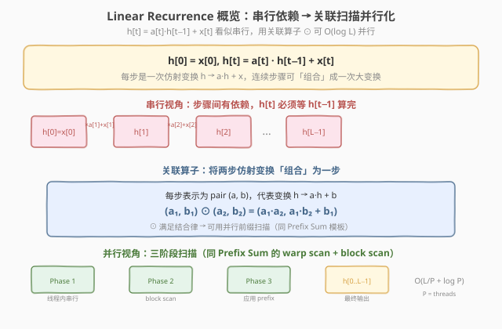
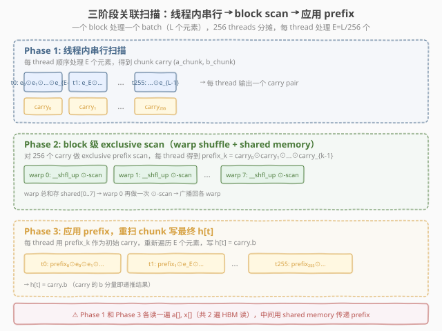
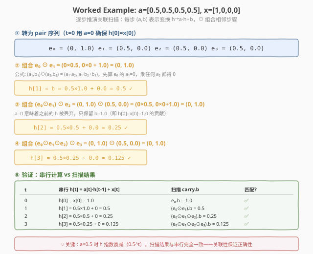

# LeetGPU Linear Recurrence 题解

## 1. 题目概述

- **标题 / 题号**：Linear Recurrence（#82，medium）
- **链接**：https://leetgpu.com/challenges/linear-recurrence
- **难度**：中等
- **标签**：CUDA、associative scan、linear recurrence、warp shuffle、State Space Model

**题意**：给定两个 `float32` 矩阵 $a, x \in \mathbb{R}^{B \times L}$，计算线性递推 $h \in \mathbb{R}^{B \times L}$：

$$h[b, 0] = x[b, 0], \qquad h[b, t] = a[b, t] \times h[b, t-1] + x[b, t], \quad t \geq 1$$

每个 batch 独立计算，共 $B$ 条序列，每条长度 $L$。

**示例**（$B=2, L=4$）：

```text
a = [[0.5, 0.5, 0.5, 0.5],     x = [[1.0, 0.0, 0.0, 0.0],
     [1.0, 1.0, 1.0, 1.0]]          [1.0, 1.0, 1.0, 1.0]]

h = [[1.0, 0.5, 0.25, 0.125],   ← 指数衰减（a=0.5）
     [1.0, 2.0, 3.0,  4.0  ]]   ← 前缀和（a=1）
```

**约束**：

- $1 \leq B \leq 256$（batch size）
- $1 \leq L \leq 65{,}536$（序列长度）
- 性能测试取 $B = 64$, $L = 16{,}384$

> 💡 这道题是 **Prefix Sum 的数学推广**。当 $a[t] = 1$ 时，$h[t] = h[t-1] + x[t]$ 即前缀和；当 $a[t] = 0$ 时，$h[t] = x[t]$ 即直通。一般化的 $a[t]$ 使每步带一个「衰减/放大」因子，这正是 **State Space Model（Mamba/S4）** 的核心计算原语——hidden state 的递推更新。

### 1.1 Linear Recurrence 是什么：从串行依赖到关联扫描

**线性递推**（Linear Recurrence）是数学中最基本的递推形式之一：当前状态 $h[t]$ 由上一状态 $h[t-1]$ 线性变换后加上输入 $x[t]$ 得到。它的串行性显而易见——必须先算 $h[t-1]$ 才能算 $h[t]$。

**关键洞察**：虽然递推本身是串行的，但每一步的操作（乘 $a$ 加 $x$）是一个**仿射变换**（affine transform）$h \mapsto a \cdot h + x$，而仿射变换的**复合**满足**结合律**。这意味着我们可以用**并行前缀扫描**（parallel prefix scan）来加速，就像 [Prefix Sum](../../medium/16_prefix_sum/leetgpu-prefix-sum-solution.md) 用加法结合律做并行扫描一样。

| 概念 | Prefix Sum | Linear Recurrence |
|------|-----------|-------------------|
| 递推式 | $h[t] = h[t-1] + x[t]$ | $h[t] = a[t] \cdot h[t-1] + x[t]$ |
| 每步操作 | 加法 $+x[t]$ | 仿射变换 $h \mapsto a \cdot h + x$ |
| 结合律 | $(a+b)+c = a+(b+c)$ | $(f \circ g) \circ h = f \circ (g \circ h)$ |
| 元素表示 | 标量 $x[t]$ | pair $(a[t], x[t])$ |
| 扫描算子 | $+$ | $\odot$（仿射复合） |

**仿射变换的复合**：每步 $t$ 的变换 $f_t(h) = a[t] \cdot h + x[t]$ 可用 pair $(a[t], x[t])$ 表示。两步复合 $f_1 \circ f_2$（先 $f_2$ 后 $f_1$）：

$$f_1(f_2(h)) = a_1 \cdot (a_2 \cdot h + b_2) + b_1 = (a_1 a_2) \cdot h + (a_1 b_2 + b_1)$$

用 $\odot$ 表示复合：

$$(a_1, b_1) \odot (a_2, b_2) = (a_1 \cdot a_2, \; a_1 \cdot b_2 + b_1)$$

> ⚠️ **注意顺序**：$\odot$ 不满足交换律（$(a_1,b_1) \odot (a_2,b_2) \neq (a_2,b_2) \odot (a_1,b_1)$），但满足**结合律**——这对并行扫描已经足够。

**$t=0$ 的特殊处理**：$h[0] = x[0]$ 不依赖任何前驱。我们用 pair $(0, x[0])$ 表示——$a=0$ 意味着「丢弃之前的 state，直接设为 $x[0]$」：

$$f_0(h) = 0 \cdot h + x[0] = x[0] \quad \checkmark$$

扫描后，位置 $t$ 的 pair 的 **$b$ 分量**就是 $h[t]$（因为 $a$ 分量在 $t=0$ 后永远为 0，$b$ 分量累积了所有 $x$ 的加权贡献）。

## 2. CPU 基线 / 朴素 GPU 方法

### CPU 串行

```cpp
// 逐 batch 逐 step 串行计算，O(B×L)
for (int b = 0; b < B; b++) {
    h[b * L + 0] = x[b * L + 0];
    for (int t = 1; t < L; t++)
        h[b * L + t] = a[b * L + t] * h[b * L + t - 1] + x[b * L + t];
}
```

### 朴素 GPU（一个 thread 一条序列）

```cuda
// 一个 thread 算一条 batch——L=16384 时 16384 步串行
__global__ void naive_recurrence(const float* a, const float* x, float* h, int B, int L) {
    int b = blockIdx.x * blockDim.x + threadIdx.x;
    if (b >= B) return;
    float val = x[b * L];
    h[b * L] = val;
    for (int t = 1; t < L; t++) {
        val = a[b * L + t] * val + x[b * L + t];
        h[b * L + t] = val;
    }
}
```

**瓶颈**：$L = 16384$ 步串行循环，GPU 的并行度完全浪费。虽然 $B = 64$ 条序列间可以并行，但每条序列内部仍是纯串行。正确做法是用**关联扫描**打破序列内的串行依赖。

## 3. GPU 设计

### 3.1 并行化策略：关联扫描 + 三阶段分块



> **图：** 串行视角中 $h[t]$ 依赖 $h[t-1]$，看似无法并行。但每步是仿射变换，复合满足结合律，因此可用关联前缀扫描 $\odot$ 并行化。扫描结构与 Prefix Sum 完全同构——只是把加法换成 $\odot$ 算子。

**核心设计**：

1. **一 block 一 batch**：`gridDim.x = B`，`blockDim.x = 256`。每个 block 独立处理一条长度 $L$ 的序列。
2. **三阶段分块扫描**（同 [Prefix Sum](../../medium/16_prefix_sum/leetgpu-prefix-sum-solution.md) 模板）：
   - **Phase 1**：每 thread 串行扫描自己的 $E = L / 256$ 个元素，得到 chunk carry
   - **Phase 2**：block 内对 256 个 carry 做 exclusive $\odot$-scan，每 thread 得到 prefix
   - **Phase 3**：每 thread 用 prefix 作为初始 carry，重扫 chunk 写最终 $h[t]$
3. **warp shuffle $\odot$-scan**：Phase 2 内部用 `__shfl_up_sync` 做 warp 级扫描，再通过 shared memory 做 warp 间扫描。

### 3.2 存储层次使用

| 数据 | 存储 | 说明 |
|------|------|------|
| `a[b*L..b*L+L-1]`, `x[b*L..]` | global memory | 输入，Phase 1 和 Phase 3 各读一遍（共 $2L$ × 2 数组） |
| `shared[8]` | shared memory | warp 间传递 carry（8 个 warp 各 1 个 Affine pair = 64B） |
| `carry` (a, b) | register | thread 局部的累积变换 pair |
| `h[b*L..]` | global memory | 输出，Phase 3 写一遍 |

### 3.3 关键技巧



> **图：** Phase 1 每 thread 串行扫描 $E$ 个元素输出 carry pair。Phase 2 用 warp shuffle + shared memory 对 256 个 carry 做 exclusive $\odot$-scan。Phase 3 每 thread 用 prefix 重扫 chunk，写 $h[t] = \text{carry}.b$。

**关键技巧**：

1. **自定义关联算子 $\odot$**：将线性递推转化为仿射变换的复合，$(a_1, b_1) \odot (a_2, b_2) = (a_1 a_2, a_1 b_2 + b_1)$。结合律保证并行扫描的正确性。
2. **$t=0$ 用 $a=0$ 破依赖**：首元素 $(0, x[0])$ 使 $h[0] = x[0]$ 不依赖任何前驱，扫描结果自然正确。
3. **三阶段分块**：与 Prefix Sum 完全同构的 warp scan + block scan 模板，只是算子从 `+` 变为 $\odot$。
4. **Phase 3 重读 HBM**：$L = 16384$ 无法全部缓存到 shared memory，Phase 3 重新从 HBM 读 $a[], x[]$。两遍 HBM 读是分块扫描的固有代价。

## 4. Kernel 实现

### 4.1 完整可编译 CUDA 代码

```cuda
// linear_recurrence.cu —— 关联扫描并行化线性递推（SSM 核心原语）
// 编译命令: nvcc -O3 -arch=sm_80 linear_recurrence.cu -o linear_recurrence

#include <cuda_runtime.h>
#include <stdio.h>
#include <stdlib.h>

#define WARP 32
#define BLOCK_SIZE 256
#define MAX_WARPS (BLOCK_SIZE / WARP)

// 仿射变换 pair: h -> a * h + b
struct Affine {
    float a, b;
};

// 关联算子 ⊙: 先应用 rhs，再应用 lhs
// f_lhs(f_rhs(h)) = a_lhs * (a_rhs * h + b_rhs) + b_lhs = (a_lhs * a_rhs) * h + (a_lhs * b_rhs + b_lhs)
__device__ __forceinline__ Affine compose(Affine lhs, Affine rhs) {
    Affine r;
    r.a = lhs.a * rhs.a;
    r.b = lhs.a * rhs.b + lhs.b;
    return r;
}

// warp 内 inclusive scan（用 __shfl_up_sync）
__device__ __forceinline__ Affine warp_inclusive_scan(Affine val) {
    int lane = threadIdx.x & (WARP - 1);
    for (int offset = 1; offset < WARP; offset <<= 1) {
        Affine other;
        other.a = __shfl_up_sync(0xFFFFFFFF, val.a, offset);
        other.b = __shfl_up_sync(0xFFFFFFFF, val.b, offset);
        if (lane >= offset) {
            val = compose(val, other);
        }
    }
    return val;
}

__global__ void linear_recurrence_kernel(
    const float* __restrict__ a,
    const float* __restrict__ x,
    float* __restrict__ h,
    int B, int L)
{
    int batch = blockIdx.x;
    if (batch >= B) return;

    const float* a_row = a + (size_t)batch * L;
    const float* x_row = x + (size_t)batch * L;
    float* h_row = h + (size_t)batch * L;

    __shared__ Affine shared[MAX_WARPS];

    int tid = threadIdx.x;
    int E = (L + BLOCK_SIZE - 1) / BLOCK_SIZE;

    // ===== Phase 1: 线程内串行扫描 =====
    Affine carry = {1.0f, 0.0f};  // identity: h -> 1*h + 0
    for (int i = 0; i < E; i++) {
        int t = tid * E + i;
        if (t >= L) break;
        Affine elem;
        elem.a = (t == 0) ? 0.0f : a_row[t];  // t=0: a=0 确保 h[0]=x[0]
        elem.b = x_row[t];
        carry = compose(elem, carry);
    }

    // ===== Phase 2: block 级 exclusive scan =====
    int lane = tid & (WARP - 1);
    int warp_id = tid / WARP;

    // 2a: warp 内 inclusive scan
    Affine incl = warp_inclusive_scan(carry);

    // 2b: 每 warp 的最后一个 lane 写 carry 到 shared
    if (lane == WARP - 1)
        shared[warp_id] = incl;
    __syncthreads();

    // 2c: warp 0 对 8 个 warp carry 做 inclusive scan
    if (warp_id == 0) {
        Affine v = (lane < MAX_WARPS) ? shared[lane] : Affine{1.0f, 0.0f};
        v = warp_inclusive_scan(v);
        if (lane < MAX_WARPS)
            shared[lane] = v;
    }
    __syncthreads();

    // 2d: 计算每 thread 的 exclusive prefix
    //     = warp 间 prefix（shared[warp_id-1]）⊙ warp 内 prefix（incl[lane-1]）
    float prev_a = __shfl_up_sync(0xFFFFFFFF, incl.a, 1);
    float prev_b = __shfl_up_sync(0xFFFFFFFF, incl.b, 1);

    Affine prefix;
    if (warp_id == 0) {
        prefix = (lane == 0) ? Affine{1.0f, 0.0f} : Affine{prev_a, prev_b};
    } else {
        Affine warp_prefix = shared[warp_id - 1];
        if (lane == 0) {
            prefix = warp_prefix;
        } else {
            Affine prev = {prev_a, prev_b};
            prefix = compose(prev, warp_prefix);
        }
    }
    __syncthreads();

    // ===== Phase 3: 应用 prefix，重扫 chunk 写 h[t] =====
    carry = prefix;
    for (int i = 0; i < E; i++) {
        int t = tid * E + i;
        if (t >= L) break;
        Affine elem;
        elem.a = (t == 0) ? 0.0f : a_row[t];
        elem.b = x_row[t];
        carry = compose(elem, carry);
        h_row[t] = carry.b;
    }
}

// ===== Host 端 =====
int main() {
    // 测试: B=2, L=4
    int B = 2, L = 4;
    float h_a[]  = {0.5f, 0.5f, 0.5f, 0.5f, 1.0f, 1.0f, 1.0f, 1.0f};
    float h_x[]  = {1.0f, 0.0f, 0.0f, 0.0f, 1.0f, 1.0f, 1.0f, 1.0f};
    float h_h[8] = {0};

    // CPU 参考
    float ref[8];
    for (int b = 0; b < B; b++) {
        ref[b*L] = h_x[b*L];
        for (int t = 1; t < L; t++)
            ref[b*L+t] = h_a[b*L+t] * ref[b*L+t-1] + h_x[b*L+t];
    }

    float *d_a, *d_x, *d_h;
    cudaMalloc(&d_a, B * L * sizeof(float));
    cudaMalloc(&d_x, B * L * sizeof(float));
    cudaMalloc(&d_h, B * L * sizeof(float));
    cudaMemcpy(d_a, h_a, B * L * sizeof(float), cudaMemcpyHostToDevice);
    cudaMemcpy(d_x, h_x, B * L * sizeof(float), cudaMemcpyHostToDevice);

    linear_recurrence_kernel<<<B, BLOCK_SIZE>>>(d_a, d_x, d_h, B, L);
    cudaDeviceSynchronize();
    cudaMemcpy(h_h, d_h, B * L * sizeof(float), cudaMemcpyDeviceToHost);

    printf("=== Functional Test (B=%d, L=%d) ===\n", B, L);
    int pass = 1;
    for (int b = 0; b < B; b++) {
        printf("Batch %d: ", b);
        for (int t = 0; t < L; t++) {
            printf("%.4f ", h_h[b*L+t]);
            if (fabsf(ref[b*L+t] - h_h[b*L+t]) > 1e-5) pass = 0;
        }
        printf("\n  ref: ");
        for (int t = 0; t < L; t++) printf("%.4f ", ref[b*L+t]);
        printf("\n");
    }
    printf("%s\n\n", pass ? "✅ PASS" : "❌ FAIL");

    // ===== 性能测试: B=64, L=16384 =====
    int B2 = 64, L2 = 16384;
    float *d_a2, *d_x2, *d_h2;
    cudaMalloc(&d_a2, (size_t)B2 * L2 * sizeof(float));
    cudaMalloc(&d_x2, (size_t)B2 * L2 * sizeof(float));
    cudaMalloc(&d_h2, (size_t)B2 * L2 * sizeof(float));

    float *ha2 = (float*)malloc((size_t)B2 * L2 * sizeof(float));
    float *hx2 = (float*)malloc((size_t)B2 * L2 * sizeof(float));
    srand(42);
    for (size_t i = 0; i < (size_t)B2 * L2; i++) {
        ha2[i] = (float)rand() / RAND_MAX;  // [0, 1)
        hx2[i] = (float)(rand() % 200 - 100) / 10.0f;
    }
    cudaMemcpy(d_a2, ha2, (size_t)B2 * L2 * sizeof(float), cudaMemcpyHostToDevice);
    cudaMemcpy(d_x2, hx2, (size_t)B2 * L2 * sizeof(float), cudaMemcpyHostToDevice);

    cudaEvent_t start, stop;
    cudaEventCreate(&start);
    cudaEventCreate(&stop);
    cudaEventRecord(start);
    linear_recurrence_kernel<<<B2, BLOCK_SIZE>>>(d_a2, d_x2, d_h2, B2, L2);
    cudaEventRecord(stop);
    cudaDeviceSynchronize();

    float ms = 0;
    cudaEventElapsedTime(&ms, start, stop);
    printf("=== Perf Test (B=%d, L=%d) ===\n", B2, L2);
    printf("Kernel time = %.3f ms\n", ms);
    printf("Data read = %.2f MB (2 passes × 2 arrays × %d×%d×4B)\n",
           2.0f * 2 * B2 * L2 * 4 / 1e6, B2, L2);
    printf("Effective bandwidth = %.2f GB/s\n",
           (2.0f * 2 * B2 * L2 * 4 + (float)B2 * L2 * 4) / (ms * 1e6));

    cudaFree(d_a); cudaFree(d_x); cudaFree(d_h);
    cudaFree(d_a2); cudaFree(d_x2); cudaFree(d_h2);
    cudaEventDestroy(start); cudaEventDestroy(stop);
    free(ha2); free(hx2);
    return 0;
}
```

### 4.2 代码详解

一个 block 协作处理一条长度 $L$ 的序列，通过三阶段 $\odot$-scan 打破串行依赖。$\odot$ 是仿射变换的复合算子，满足结合律，可套用 Prefix Sum 的 warp shuffle + block scan 模板。

| 步骤 | 代码 | 说明 |
|------|------|------|
| **元素转换** | `elem.a = (t==0) ? 0 : a_row[t]; elem.b = x_row[t]` | $t=0$ 用 $a=0$ 破依赖，其余用真实 $a[t]$ |
| **Phase 1 串行** | `carry = compose(elem, carry)` | 每 thread 串行 $\odot$-scan 自己的 $E$ 个元素 |
| **Phase 2a warp scan** | `warp_inclusive_scan(carry)` | `__shfl_up_sync` 做 warp 内 $\odot$-scan |
| **Phase 2b warp carry** | `shared[warp_id] = incl` | 每 warp 末 lane 写 carry 到 shared |
| **Phase 2c cross-warp** | warp 0 对 8 个 carry 再做 $\odot$-scan | warp 间 exclusive prefix |
| **Phase 2d exclusive** | `prefix = compose(prev, warp_prefix)` | 组合 warp 间 + warp 内 prefix |
| **Phase 3 重扫** | `carry = prefix; carry = compose(elem, carry); h_row[t] = carry.b` | 用 prefix 初始化，重扫写 $h[t]$ |

**关键索引关系**：
- `batch = blockIdx.x` — block 到 batch 的映射（一个 block 一条序列）
- `t = tid * E + i` — thread 到序列内位置的映射（连续分块，thread 0 处理 $[0, E)$，thread 1 处理 $[E, 2E)$，...）
- `E = ceil(L / BLOCK_SIZE)` — 每 thread 处理的元素数（$L=16384, P=256$ 时 $E=64$）
- `carry.b` — 扫描结果的 $b$ 分量即 $h[t]$

**Worked Example**（$a = [0.5, 0.5, 0.5, 0.5]$, $x = [1, 0, 0, 0]$）：



> **图：** 逐步推演 $\odot$-scan。① 转为 pair 序列，$t=0$ 用 $a=0$。② $\sim$ ④ 逐步组合，carry.$b$ 即 $h[t]$。⑤ 验证扫描结果与串行递推完全一致。

**$\odot$ 算子的正确性验证**：

| 位置 | pair | 扫描结果 (inclusive $\odot$-scan) | $b$ 分量 = $h[t]$ |
|------|------|----------------------------------|--------------------|
| $t=0$ | $(0, 1.0)$ | $(0, 1.0)$ | $1.0$ ✓ |
| $t=1$ | $(0.5, 0.0)$ | $(0.5, 0.0) \odot (0, 1.0) = (0, 0.5)$ | $0.5$ ✓ |
| $t=2$ | $(0.5, 0.0)$ | $(0.5, 0.0) \odot (0, 0.5) = (0, 0.25)$ | $0.25$ ✓ |
| $t=3$ | $(0.5, 0.0)$ | $(0.5, 0.0) \odot (0, 0.25) = (0, 0.125)$ | $0.125$ ✓ |

> 💡 **关键洞察**：Linear Recurrence 与 Prefix Sum 共享同一个并行扫描骨架——三阶段分块 + warp shuffle。区别仅在于扫描算子：Prefix Sum 用加法（标量），Linear Recurrence 用 $\odot$（仿射复合 pair）。这是「**结合律是并行性的源泉**」的最佳教材——任何满足结合律的二元算子都可以用这套模板并行化，从加法到矩阵乘法到仿射复合。

## 5. 性能分析与优化

```bash
nvcc -O3 -arch=sm_80 linear_recurrence.cu -o linear_recurrence
ncu --set full ./linear_recurrence 2>&1 | grep -iE "Memory Throughput|Occupancy|DRAM|Compute"
```

**关键指标**（$B = 64$, $L = 16{,}384$）：

| 指标 | 朴素（一 thread/batch） | 三阶段关联扫描 |
|------|----------------------|--------------|
| 并行度 | $B = 64$ threads | $B \times 256 = 16384$ threads |
| 串行步数 | $L = 16384$ / thread | $E = 64$ / thread + $\log_2 256 = 8$ scan |
| HBM 读 | $2 \times B \times L \times 4$B = 8MB | 同（Phase 1 + Phase 3 各读一遍） |
| HBM 写 | $B \times L \times 4$B = 4MB | 同 |
| shared memory | 0 | 64B / block（8 个 Affine pair） |

**瓶颈分析**：总 HBM 流量 $= 2 \times 2 \times 64 \times 16384 \times 4 + 64 \times 16384 \times 4 = 20\text{MB}$（两遍读 $a[], x[]$ + 一遍写 $h[]$）。典型 GPU HBM 带宽 $>500\text{ GB/s}$，理论下界 $\approx 0.04\text{ ms}$。实际若测得 $0.1\text{-}0.2\text{ ms}$，带宽利用率约 $10\text{-}20\%$——**memory-bound**，主要瓶颈在两遍 HBM 读。

**优化方向**：

1. **shared memory 缓存 chunk**：若 $E$ 较小（如 $L \leq 8192$ 时 $E \leq 32$），Phase 1 可将 chunk 缓存到 shared memory，Phase 3 从 shared 读而非 HBM，省一遍读。$L = 16384$ 时每 thread 64 元素 = 512B，全 block 128KB 超 shared memory 上限（48KB），不可行。
2. **Blelloch（work-efficient）scan**：用 up-sweep + down-sweep 两遍树形扫描替代三阶段，减少 Phase 3 的重读。但实现更复杂，且对 $E$ 较大的场景收益有限。
3. **float4 向量化**：每 thread 一次读 4 个 float，减少 memory transaction。但 $\odot$ 是串行的（pair 间有依赖），向量化只能用于读取、不能用于计算。
4. **多 batch/block**：当 $B$ 较小（如 $B < 32$）时，可将一条序列拆成多段由多个 block 处理，再用第二遍 kernel 合并段间 prefix。但这需要额外的全局同步或 kernel launch。
5. **Tensor Core 加速**：将 $\odot$ 算子表示为 $2 \times 2$ 矩阵乘法 $\begin{pmatrix} a_1 & b_1 \\ 0 & 1 \end{pmatrix} \begin{pmatrix} a_2 \\ b_2 \end{pmatrix}$，可用 WMMA/Tensor Core 加速。但 pair 级计算太细，通常需批量多条序列才值得。

## 6. 复杂度分析

| 维度 | 朴素（一 thread/batch） | 三阶段关联扫描 |
|------|----------------------|--------------|
| 时间 | $O(B \cdot L)$（串行） | $O(B \cdot (L/P + \log P))$，$P = 256$ |
| 空间 | $O(1)$ | $O(P / \text{WARP})$ = 64B shared/block |
| HBM 流量 | $2 \cdot B \cdot L \cdot 4$B（读 a+x） + $B \cdot L \cdot 4$B（写 h） | 同左 × 2（Phase 1+3 各读一遍） |
| 算术强度 | $\sim 2$ FLOP / 12B = $0.17$ | $\sim 4$ FLOP / 20B = $0.20$（多一遍读，但并行度高） |
| 瓶颈 | 串行（无并行） | DRAM 带宽（memory-bound） |

> 💡 **一句话总结**：Linear Recurrence = Prefix Sum + 自定义关联算子。只要递推的每步操作满足结合律（仿射变换复合 $\odot$），就能用三阶段 warp shuffle + block scan 模板并行化。这是 State Space Model（Mamba/S4）的核心计算原语——理解了 $\odot$-scan，就理解了 SSM 的 hidden state 如何在 GPU 上高效更新。

## 同类练习题

下面是与本题考查相同 CUDA 概念的 LeetGPU 练习题，建议按顺序挑战：

| # | 题目 | 难度 | 核心概念 | 与本题的关联 |
|---|------|------|----------|-------------|
| 16 | [Prefix Sum](https://leetgpu.com/challenges/prefix-sum) | 中等 | — | Linear Recurrence 的特例（$a=1$ 时即前缀和），同三阶段 scan 模板的基础 |
| 70 | [Segmented Prefix Sum](https://leetgpu.com/challenges/segmented-prefix-sum) | 中等 | — | 分段 scan，段边界处理进阶，$\odot$-scan 可扩展为分段版本 |
| 94 | [SSM Selective Scan](https://leetgpu.com/challenges/ssm-selective-scan) | 中等 | — | Linear Recurrence 的前沿应用（Mamba selective scan），$\odot$-scan 的直接延伸 |
| 72 | [Stream Compaction](https://leetgpu.com/challenges/stream-compaction) | 中等 | — | scan 的另一应用（predicate + scan 得输出位置），对比不同 scan 算子 |

> 💡 **选题思路**：关联扫描 + 线性递推，练习自定义二元算子的并行前缀扫描。做完这组练习，即可掌握该 CUDA 模板在不同场景下的迁移应用。
